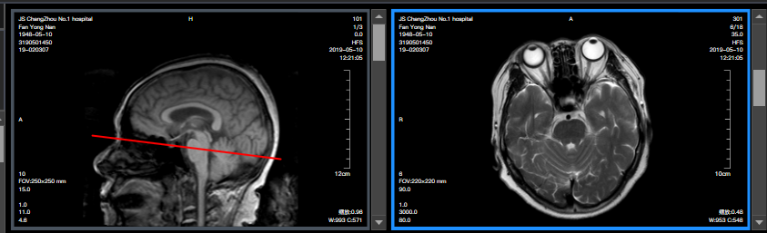
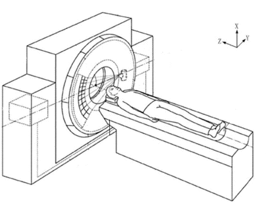
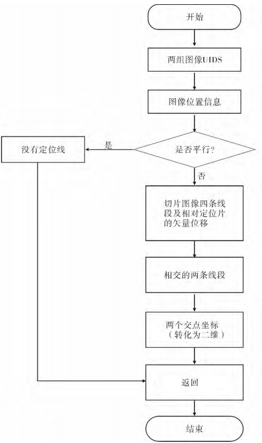

**1.定位线概念：某个方位的影像在另一个方向的影像上的投影相交线，例如横断面(从头到脚的方向)在矢状面(从左手到右手)上的影像投影面交线。**

举个例子：右边的是MR(核磁共振)的某一帧切片，这是从头开始扫描，扫描到眼睛这个位置，

而左边图像是从左手到右手的扫描切片，那么右边图像的位置就恰好在左边图像的眼睛的位置，用红线标出的位置则为定位线，一般用于医生参考病灶在矢状面、冠状面和横断面的具体方位。

**2.检查设备示意图**

在笛卡尔空间直角坐标系中，Y 右肩膀到左肩膀，X 后背到前胸，Z 足到头

 

**3.算法流程**

 **4.代码实现：**

创建图像结构

~~~
public FrameGeometry(DicomDataset image)
            : this(image.GetString(DicomTag.FrameOfReferenceUID),
                  image.GetValues<double>(DicomTag.ImagePositionPatient),
                  image.GetValues<double>(DicomTag.ImageOrientationPatient),
                  image.GetValues<double>(DicomTag.PixelSpacing),
                  image.GetSingleValue<int>(DicomTag.Columns),
                  image.GetSingleValue<int>(DicomTag.Rows))
{
    // TODO: 
　　　　　　　　　　FrameOfReferenceUID:图片UID
　　　　　　　　　　ImagePositionPatient：病人方向
　　　　　　　　　　ImageOrientationPatient：图片方向
　　　　　　　　　　PixelSpacing：像素间距
　　　　　　　　　　Columns：宽度
　　　　　　　　　　Rows：高度

}
~~~
判断是否符合定位条件：

~~~
/// 
/// 判断是否可以画定位线
/// 

/// <param name="sourceFrame">源图像结构</param>
/// <param name="destinationFrame">目标图像结构</param>
/// <returns></returns>
public static bool CanDrawLocalizer(FrameGeometry sourceFrame, FrameGeometry destinationFrame)
{
    // 检查图像结构
    if (sourceFrame == null) return false;
    if (destinationFrame == null) return false;

    // 如果两个帧中的任何一个不是空间坐标系，则无法定位
    if (sourceFrame.Orientation == FrameOrientation.None || destinationFrame.Orientation == FrameOrientation.None) return false;
    // 只有正交图像才能绘制，方向相同则退出
    if (sourceFrame.Orientation == destinationFrame.Orientation) return false;

    // 检查FrameOfReferenceUid
    if (string.IsNullOrEmpty(sourceFrame.FrameOfReferenceUid) || string.IsNullOrEmpty(destinationFrame.FrameOfReferenceUid)) return false;
    if (sourceFrame.FrameOfReferenceUid != destinationFrame.FrameOfReferenceUid) return false;

    return true;
}
~~~
计算交线点：

~~~
/// 

///回两个图像相交处公共像素线
/// 

/// <param name="sourceFrame">源图像结构</param>
/// <param name="destinationFrame">目标图像结构</param>
/// <param name="startPoint">起点输出</param>
/// <param name="endPoint">重点输出</param>
/// <returns></returns>
public static bool CalcualteIntersectionLocalizer(FrameGeometry sourceFrame, FrameGeometry destinationFrame, out Point2 startPoint, out Point2 endPoint)
{
    double t; // 平面方程系数
    double nA, nB, nC, nD, nP;
    var lstProj = new List<Point3D>();

    // 初始化
    startPoint = Point2.Origin;
    endPoint = Point2.Origin;

    // 验证
    if (destinationFrame.DirectionNormal.IsZero)
        return false;

    nP = destinationFrame.DirectionNormal * destinationFrame.PointTopLeft;
    nA = destinationFrame.DirectionNormal * sourceFrame.PointTopLeft;
    nB = destinationFrame.DirectionNormal * sourceFrame.PointTopRight;
    nC = destinationFrame.DirectionNormal * sourceFrame.PointBottomRight;
    nD = destinationFrame.DirectionNormal * sourceFrame.PointBottomLeft;

    //  AB
    if (Math.Abs(nB - nA) > Constants.Epsilon)
    {
        t = (nP - nA) / (nB - nA);
        if (t > 0 && t <= 1)
            lstProj.Add(sourceFrame.PointTopLeft + t * (sourceFrame.PointTopRight - sourceFrame.PointTopLeft));
    }

    // BC
    if (Math.Abs(nC - nB) > Constants.Epsilon)
    {
        t = (nP - nB) / (nC - nB);
        if (t > 0 && t <= 1)
            lstProj.Add(sourceFrame.PointTopRight + t * (sourceFrame.PointBottomRight - sourceFrame.PointTopRight));
    }

    // CD
    if (Math.Abs(nD - nC) > Constants.Epsilon)
    {
        t = (nP - nC) / (nD - nC);
        if (t > 0 && t <= 1)
            lstProj.Add(sourceFrame.PointBottomRight + t * (sourceFrame.PointBottomLeft - sourceFrame.PointBottomRight));
    }

    // DA
    if (Math.Abs(nA - nD) > Constants.Epsilon)
    {
        t = (nP - nD) / (nA - nD);
        if (t > 0 && t <= 1)
            lstProj.Add(sourceFrame.PointBottomLeft + t * (sourceFrame.PointTopLeft - sourceFrame.PointBottomLeft));
    }

    if (lstProj.Count != 2)
        return false;

    // 从空间坐标系返回平面坐标系
    startPoint = destinationFrame.TransformPatientPointToImage(lstProj[0]);
    endPoint = destinationFrame.TransformPatientPointToImage(lstProj[1]);
    return true;
}
~~~

得到坐标之后就可以利用绘图操作类(参考本系列教程之图形标记)来自己绘制定位线。

看效果：

**对于较复杂的身体部位，也可以同时绘制定位线范围，来确定当前序列的定位范围，思路是先计算第一帧和最后一帧，用黄色虚线标出，再计算当前帧。**

**看效果：**

****