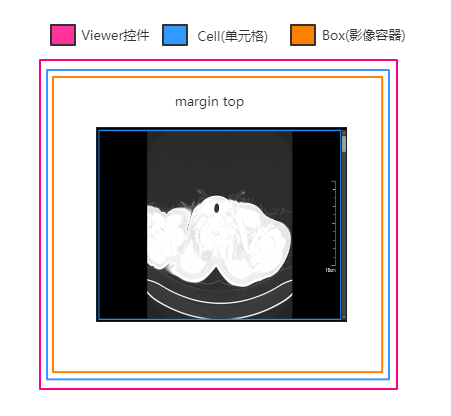
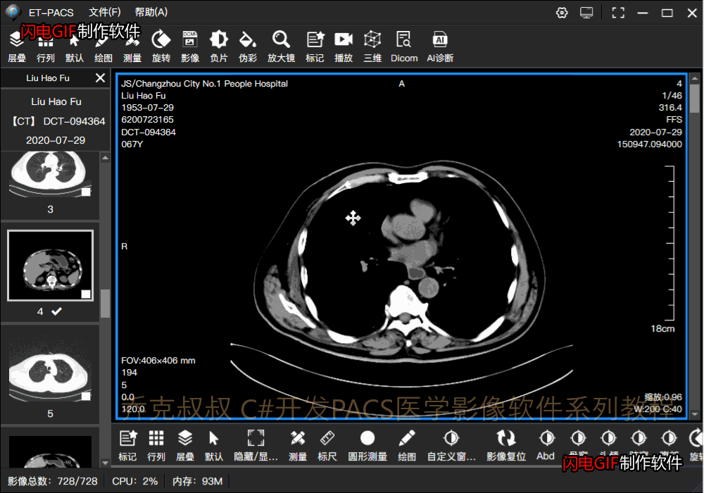

# [C#开发PACS医学影像处理系统(十六)：2D处理之影像平移和缩放](https://www.cnblogs.com/Uncle-Joker/p/13690213.html)

**1.平移，利用WPF中控件边距来控制位移：**

~~~
/// 

/// 平移图像
/// 

/// <param name="X">平移X轴距离</param>
/// <param name="startX">X轴起始位置</param>
/// <param name="Y">平移Y轴距离</param>
/// <param name="startY">Y轴起始位置</param>
/// <param name="isAction">是主动发起还是关联操作时被动调用</param>
internal void MoveImage(double X, double startX, double Y, double startY, bool isAction = true)
{
    GridLine.Margin = new Thickness(
        GridLine.Margin.Left + X - startX,
        GridLine.Margin.Top + Y - startY,
        GridLine.Margin.Right - X + startX,
        GridLine.Margin.Bottom - Y + startY);

    if (isAction)
    {
        for (int i = 0; i < Cell.MedicalView.SelectedBoxList.Count; i++)
        {
            var box = Cell.MedicalView.SelectedBoxList[i];
            if (box != this)
            {
                box.MoveImage(X, startX, Y, startY, false);
            }
        }
    }

    //平移所有box
    for (int i = 0; i < Cell.BoxList.Count; i++)
    {
        if (Cell.BoxList[i] != this && (Cell.BoxList[i].ImageAlign == ImageAlignment.Center || Cell.BoxList[i].ImageAlign == ImageAlignment.Parent))
        {
            Cell.BoxList[i].GridLine.Margin = GridLine.Margin;
        }
    }
}
~~~

看效果：

 **2.影像放大或缩小：**
~~~
#region -----图像缩放-----

//缩放系数
double scaleFactor = 200;

//图像按下鼠标时的缩放x值
double mouseDownScaleX = 1;

//图像按下鼠标时的缩放y值
double mouseDownScaleY = 1;

/// 

/// 缩放图片
/// 

/// <param name="mouseVal">差值</param>
/// <param name="type">鼠标类型</param>
/// <param name="isAction">是主动发起还是关联操作时被动调用</param>
private void ScaleImage(double mouseVal, string type, bool isAction = true)
{
    double stVal = mouseVal / scaleFactor;
    if (type == "wheel")
    {
        mouseVal = mouseVal > 10 ? 10 : mouseVal;
        mouseVal = mouseVal < -10 ? -10 : mouseVal;
        stVal = mouseVal / scaleFactor;
        var st = GetScaleTrans(ToolInkCanvas, 1);
        if (Math.Abs(st.ScaleX + stVal) > 0.2 && Math.Abs(st.ScaleX + stVal) < 5 &&
            Math.Abs(st.ScaleY + stVal) > 0.2 && Math.Abs(st.ScaleY + stVal) < 5)
        {
            SetScaleTrans(ToolInkCanvas,
                st.ScaleX < 0 ? (st.ScaleX - stVal) : (st.ScaleX + stVal),
                st.ScaleX < 0 ? (st.ScaleX - stVal) : (st.ScaleX + stVal),
                false, 1);
        }
    }
    else
    {
        stVal = mouseVal / scaleFactor;
        if (Math.Abs(mouseDownScaleX + stVal) > 0.2 && Math.Abs(mouseDownScaleX + stVal) < 5 &&
            Math.Abs(mouseDownScaleY + stVal) > 0.2 && Math.Abs(mouseDownScaleY + stVal) < 5)
        {
            SetScaleTrans(ToolInkCanvas,
                mouseDownScaleX < 0 ? (mouseDownScaleX - stVal) : (mouseDownScaleX + stVal),
                mouseDownScaleY < 0 ? (mouseDownScaleY - stVal) : (mouseDownScaleY + stVal),
                false, 1);
        }
        else
        {
            isMouseDown = false;
        }
    }
    GetRulerValue();

    if (isAction)
    {
        for (int i = 0; i < Cell.MedicalView.SelectedBoxList.Count; i++)
        {
            var box = Cell.MedicalView.SelectedBoxList[i];
            if (box != this)
            {
                box.ScaleImage(mouseVal, type, false);
            }
        }
    }

    //缩放所有box和重新设置比例尺
    for (int i = 0; i < Cell.BoxList.Count; i++)
    {
        if (Cell.BoxList[i] != this && (Cell.BoxList[i].ImageAlign == ImageAlignment.Center || Cell.BoxList[i].ImageAlign == ImageAlignment.Parent))
        {
            Cell.BoxList[i].SetScaleTrans(Cell.BoxList[i].ToolInkCanvas,
                mouseDownScaleX < 0 ? (mouseDownScaleX - stVal) : (mouseDownScaleX + stVal),
                mouseDownScaleY < 0 ? (mouseDownScaleY - stVal) : (mouseDownScaleY + stVal),
                false, 1);
            Cell.BoxList[i].GetRulerValue();
        }
    }

}

~~~
利用XAML设计器中的变换属性ScaleTransform设置元素缩放比例：

~~~
<InkCanvas x:Name="ToolInkCanvas" UseCustomCursor="True" ClipToBounds="False"  MinHeight="50" MinWidth="50" EditingMode="None" Background="{x:Null}"  Margin="1" >
                <InkCanvas.RenderTransform>
                    <TransformGroup>
                        <RotateTransform/>
                        <ScaleTransform/>
                    </TransformGroup>
                </InkCanvas.RenderTransform>
            </InkCanvas>
~~~
~~~
　　　　/// 

/// 设置元素比例
/// 

/// <param name="ui">元素</param>
/// <param name="scaleX">x比例</param>
/// <param name="scaleY">y比例</param>
/// <param name="isAppend">是否为追加比例</param>
/// <param name="index">变换属性的下标</param>
public ScaleTransform SetScaleTrans(UIElement ui, double scaleX, double scaleY, bool isAppend, int index = 0)
{
TransformGroup tg = ui.RenderTransform as TransformGroup;
var tgnew = tg.CloneCurrentValue();
if (tgnew != null)
{
    ui.RenderTransformOrigin = new Point(0.5, 0.5);
    ScaleTransform st = tgnew.Children[index] as ScaleTransform;
    if (isAppend)
    {
        st.ScaleX *= scaleX;
        st.ScaleY *= scaleY;
    }
    else
    {
        st.ScaleX = scaleX;
        st.ScaleY = scaleY;
    }
    ui.RenderTransform = tgnew;
    return st;
}
return null;
}
~~~

看效果：

