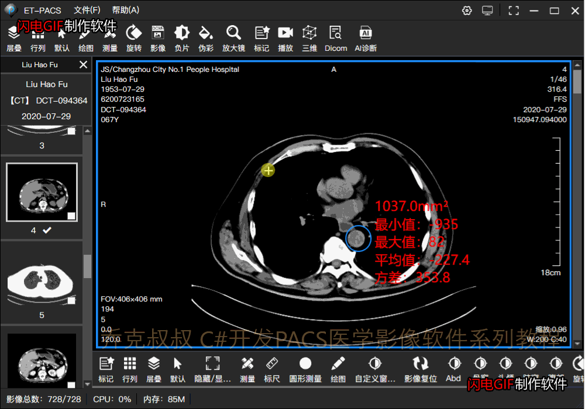

**1.任意角度旋转**

在XAML设计器中，设置RotateTransform属性

~~~
<InkCanvas x:Name="ToolInkCanvas" UseCustomCursor="True" ClipToBounds="False"  MinHeight="50" MinWidth="50" EditingMode="None" Background="{x:Null}"  Margin="1" >
                            <InkCanvas.RenderTransform>
                                <TransformGroup>
                                    <RotateTransform/>
                                    <ScaleTransform/>
                                </TransformGroup>
                            </InkCanvas.RenderTransform>
                        </InkCanvas>
~~~
根据鼠标按下时的位置和图片中心位置，利用WPF中Vector类计算向量夹角，得到角度，再设置元素的RotateTransform旋转属性变换。

~~~
        /// 

        /// 图像旋转
        /// 

        /// <param name="mouseVal">差值</param>
        /// <param name="type">鼠标类型</param>
        /// <param name="X">平移X轴距离</param>
        /// <param name="startX">X轴起始位置</param>
        /// <param name="Y">平移Y轴距离</param>
        /// <param name="startY">Y轴起始位置</param>
        /// <param name="isAction">是主动发起还是关联操作时被动调用</param>
        private void RotateImage(double mouseVal, string type, double X, double startX, double Y, double startY, bool isAction = true)
        {
            double angle = 0;
            if (type != "wheel")
            {
                Vector curVector = new Vector(X - ToolInkCanvas.ActualWidth / 2, Y - ToolInkCanvas.ActualHeight / 2);
                double ang = Vector.AngleBetween(downVector, curVector);

                angle = SetRotateTrans(ToolInkCanvas, ang, true);
                ImgAngle = angle;
                downVector = curVector;
            }
            else
            {
                if (mouseVal > 0)
                {
                    angle = SetRotateTrans(ToolInkCanvas, 2, true);
                }
                else
                {
                    angle = SetRotateTrans(ToolInkCanvas, -2, true);
                }
                ImgAngle = angle;
            }

            if (isAction && PubVal.IsStack)
            {
                for (int i = 0; i < Cell.MedicalView.SelectedBoxList.Count; i++)
                {
                    var box = Cell.MedicalView.SelectedBoxList[i];
                    if (box != this)
                    {
                        box.RotateImage(mouseVal, type, X, startX, Y, startY, false);
                    }
                }
            }

            //旋转所有box
            for (int i = 0; i < Cell.BoxList.Count; i++)
            {
                if (Cell.BoxList[i] != this && (Cell.BoxList[i].ImageAlign == ImageAlignment.Center || Cell.BoxList[i].ImageAlign == ImageAlignment.Parent))
                {
                    Cell.BoxList[i].RotateImage(angle);
                }
            }

            Main.ToolBar.CheckAllText(this);
        }
~~~
看效果：

**2.镜像翻转**

在上一篇（[影像的平移和缩放](https://www.cnblogs.com/Uncle-Joker/p/13690213.html "C#开发PACS医学影像处理系统(十六)：2D处理之影像平移和缩放")）文中提到的ScaleTransform属性中，

同样还是先获取变换对象

ScaleTransform st = tgnew.Children\[index\] as ScaleTransform; 

当 st.ScaleX的值为-1时则水平翻转，

当 st.ScaleY的值为-1时则垂直翻转
~~~
/// 

/// 设置元素比例
/// 

/// <param name="ui">元素</param>
/// <param name="scaleX">x比例</param>
/// <param name="scaleY">y比例</param>
/// <param name="isAppend">是否为追加比例</param>
/// <param name="index">变换属性的下标</param>
public ScaleTransform SetScaleTrans(UIElement ui, double scaleX, double scaleY, bool isAppend, int index = 0)
{
    TransformGroup tg = ui.RenderTransform as TransformGroup;
    var tgnew = tg.CloneCurrentValue();
    if (tgnew != null)
    {
        ui.RenderTransformOrigin = new Point(0.5, 0.5);
        ScaleTransform st = tgnew.Children[index] as ScaleTransform;
        if (isAppend)
        {
            st.ScaleX *= scaleX;
            st.ScaleY *= scaleY;
        }
        else
        {
            st.ScaleX = scaleX;
            st.ScaleY = scaleY;
        }
        ui.RenderTransform = tgnew;
        return st;
    }
    return null;
}
~~~
调用翻转：

~~~
 　　　　/// 

/// 图像翻转
/// 

/// <param name="type">翻转类型</param>
public void FlipImage(FlipType type)
{
    if (type == FlipType.Horizontal)
    {
        var st = SetScaleTrans(ToolInkCanvas, -1, 1, true, 1);
    }
    else
    {
        var st = SetScaleTrans(ToolInkCanvas, 1, -1, true, 1);
    }
    UpDateTag();
}
~~~

看效果：

**3.复合操作与标记文字角度自适应**

**在2D操作过程中，除了会同时做平移、缩放和旋转之外，图像上通常有测量标记，当影像发生2D变化时，需要将测量文字自适应角度回正，与旋转方向相反。**

~~~
/// 

/// 重新设置文本大小和旋转角度  
/// <param name="txt">文本控件</param>
/// 

public void ReSetMeasureSize(TextBlock txt)
{
    if (cvsWidth < cvsHeight)
    {
        txt.FontSize = (cvsWidth / w_num);
    }
    else
    {
        txt.FontSize = (cvsHeight / h_num);
    }

    if (txt.RenderTransform.Dispatcher == null)
    {
        TransformGroup tf = new TransformGroup();
        tf.Children.Add(new RotateTransform());
        tf.Children.Add(new ScaleTransform());
        txt.RenderTransform = tf;
    }

    TransformGroup cvsTf = inkCanvas.RenderTransform as TransformGroup;
    var cvsTg = cvsTf.CloneCurrentValue();
    RotateTransform rtf = cvsTg.Children[0] as RotateTransform;

    //设置翻转
    ScaleTransform stf = cvsTg.Children[1] as ScaleTransform;
    TransformGroup tfg = txt.RenderTransform as TransformGroup;
    var tfgnew = tfg.CloneCurrentValue();
    if (tfgnew != null)
    {
        ScaleTransform st = tfgnew.Children[1] as ScaleTransform;

        if (stf.ScaleX * st.ScaleX < 0)
        {
            st.ScaleX *= -1;
        }
        if (stf.ScaleY * st.ScaleY < 0)
        {
            st.ScaleY *= -1;
        }
        txt.RenderTransform = tfgnew;
    }

    //设置旋转
    TransformGroup tg = txt.RenderTransform as TransformGroup;
    var tgnew = tg.CloneCurrentValue();
    if (tgnew != null)
    {
        txt.RenderTransformOrigin = new Point(0, 0);
        RotateTransform rt = tgnew.Children[0] as RotateTransform;
        if (rtf.Angle != rt.Angle)
        {
            rt.Angle = -1 * rtf.Angle;
        }
        ScaleTransform st = tfgnew.Children[1] as ScaleTransform;
        if (((st.ScaleX < 0 && st.ScaleY > 0) || (st.ScaleY < 0 && st.ScaleX > 0)) && ((rt.Angle > 0 && rtf.Angle <= 0) || (rt.Angle < 0 && rtf.Angle >= 0)))
        {
            rt.Angle *= -1;
        }
        else if (st.ScaleY > 0 && st.ScaleX > 0 && ((rt.Angle < 0 && rtf.Angle < 0)||(rt.Angle >= 0 && rtf.Angle >= 0)))
        {
            rt.Angle *= -1;
        }
        else if (st.ScaleY < 0 && st.ScaleX < 0 && ((rt.Angle < 0 && rtf.Angle < 0) || (rt.Angle >= 0 && rtf.Angle >= 0)))
        {
            rt.Angle *= -1;
        }
        txt.RenderTransform = tgnew;
    }
}

~~~

看效果：

