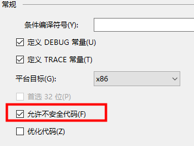
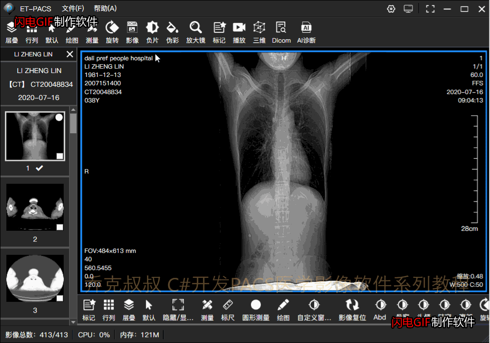

# [C#开发PACS医学影像处理系统(十八)：Dicom使用LUT色彩增强和反色](https://www.cnblogs.com/Uncle-Joker/p/13690710.html)

在医生阅片确诊的过程中，当发线疑似病灶时在灰度显示下有时并不清晰，这时候就需要色彩增强效果来使灰度图像变为彩色图像。

LUT可以简单的理解为0-255的颜色映射值，例如：彩虹编码，将其打包成LUT格式文件，在读取图像后载入LUT：
~~~
//实例化文件处理对象并打开文件
DicomFile dicomFile = DicomFile.Open(@"C:\101\1.dcm"); //获取dicom图像对象
DicomImage dicomImage = new DicomImage(dicomFile.Dataset); 
dicomImage.GrayscaleColorMap = ColorTable.LoadLUT(@"lut\1.lut");//载入Lut
~~~
看效果：

**反色处理：**

在有些类型的影像中，例如牙片(PX),胸片等，需要黑白反色的情况下观察病灶

在C#中需要用到指针，先将项目设置为允许不安全代码：

 其中sourceImg是WriteableBitmap类型：
~~~
#region -----反色-----

if (box.ConvertColor == "BlackWhite")
{
    unsafe
    {
        var bytes = (byte*)sourceImg.BackBuffer.ToPointer();
        sourceImg.Lock();
        for (int i = 0; i < sourceImg.BackBufferStride * sourceImg.PixelHeight; i++)
        {
            bytes[i] = (byte)(255 - bytes[i]);
        }
        sourceImg.AddDirtyRect(new Int32Rect(0, 0, sourceImg.PixelWidth, sourceImg.PixelHeight));
        sourceImg.Unlock();
    }
}

#endregion
~~~

看效果：

 或者使用LUT逆灰度编码也能达到同样的效果。

附彩虹编码结构参考：

 {   0,  0,  0,0 }, {   0,  0,  7,0 }, {   0,  0, 15,0 }, {   0,  0, 23,0 }, //4

 {   0,  0, 31,0 }, {   0,  0, 39,0 }, {   0,  0, 47,0 }, {   0,  0, 55,0 }, //8

 {   0,  0, 63,0 }, {   0,  0, 71,0 }, {   0,  0, 79,0 }, {   0,  0, 87,0 }, //12

 {   0,  0, 85,0 }, {   0,  0,103,0 }, {   0,  0,111,0 }, {   0,  0,119,0 }, //16

 {   0,  0,127,0 }, {   0,  0,135,0 }, {   0,  0,143,0 }, {   0,  0,151,0 }, //20

 {   0,  0,159,0 }, {   0,  0,167,0 }, {   0,  0,175,0 }, {   0,  0,183,0 }, //24

 {   0,  0,191,0 }, {   0,  0,199,0 }, {   0,  0,207,0 }, {   0,  0,215,0 }, //28

 {   0,  0,223,0 }, {   0,  0,231,0 }, {   0,  0,239,0 }, {   0,  0,247,0 }, //32

 {   0,  0,255,0 }, {   0,  8,255,0 }, {   0, 16,255,0 }, {   0, 24,255,0 }, //36

 {   0, 32,255,0 }, {   0, 40,255,0 }, {   0, 48,255,0 }, {   0, 56,255,0 }, //40

 {   0, 64,255,0 }, {   0, 72,255,0 }, {   0, 80,255,0 }, {   0, 88,255,0 }, //44

 {   0, 96,255,0 }, {   0,104,255,0 }, {   0,112,255,0 }, {   0,120,255,0 }, //48

 {   0,128,255,0 }, {   0,136,255,0 }, {   0,144,255,0 }, {   0,152,255,0 }, //52

 {   0,160,255,0 }, {   0,168,255,0 }, {   0,176,255,0 }, {   0,184,255,0 }, //56

 {   0,192,255,0 }, {   0,200,255,0 }, {   0,208,255,0 }, {   0,216,255,0 }, //60

 {   0,224,255,0 }, {   6,232,255,0 }, {   0,240,255,0 }, {   0,248,255,0 }, //64

 {   0,255,255,0 }, {   0,255,247,0 }, {   0,255,239,0 }, {   0,255,231,0 }, //68

 {   0,255,223,0 }, {   0,255,215,0 }, {   0,255,207,0 }, {   0,255,199,0 }, //72

 {   0,255,191,0 }, {   0,255,183,0 }, {   0,255,175,0 }, {   0,255,167,0 }, //76

 {   0,255,159,0 }, {   0,255,151,0 }, {   0,255,143,0 }, {   0,255,135,0 }, //80

 {   0,255,127,0 }, {   0,255,119,0 }, {   0,255,111,0 }, {   0,255,103,0 }, //84

 {   0,255, 95,0 }, {   0,255, 87,0 }, {   0,255, 79,0 }, {   0,255, 71,0 }, //88

 {   0,255, 63,0 }, {   0,255, 55,0 }, {   0,255, 47,0 }, {   0,255, 39,0 }, //92

 {   0,255, 31,0 }, {   0,255, 23,0 }, {   0,255, 15,0 }, {   0,255,  7,0 }, //96

 {   0,255,  0,0 }, {   8,255,  0,0 }, {  16,255,  0,0 }, {  24,255,  0,0 }, //100

 {  32,255,  0,0 }, {  40,255,  0,0 }, {  48,255,  0,0 }, {  56,255,  0,0 }, //104

 {  64,255,  0,0 }, {  72,255,  0,0 }, {  80,255,  0,0 }, {  88,255,  0,0 }, //108

 {  96,255,  0,0 }, { 104,255,  0,0 }, { 112,255,  0,0 }, { 120,255,  0,0 }, //112

 { 128,255,  0,0 }, { 136,255,  0,0 }, { 144,255,  0,0 }, { 152,255,  0,0 }, //116

 { 160,255,  0,0 }, { 168,255,  0,0 }, { 176,255,  0,0 }, { 184,255,  0,0 }, //120

 { 192,255,  0,0 }, { 200,255,  0,0 }, { 208,255,  0,0 }, { 216,255,  0,0 }, //124

 { 224,255,  0,0 }, { 232,255,  0,0 }, { 240,255,  0,0 }, { 248,255,  0,0 }, //128

 { 255,255,  0,0 }, { 255,251,  0,0 }, { 255,247,  0,0 }, { 255,243,  0,0 }, //132

 { 255,239,  0,0 }, { 255,235,  0,0 }, { 255,231,  0,0 }, { 255,227,  0,0 }, //136

 { 255,223,  0,0 }, { 255,219,  0,0 }, { 255,215,  0,0 }, { 255,211,  0,0 }, //140

 { 255,207,  0,0 }, { 255,203,  0,0 }, { 255,199,  0,0 }, { 255,195,  0,0 }, //144

 { 255,191,  0,0 }, { 255,187,  0,0 }, { 255,183,  0,0 }, { 255,179,  0,0 }, //148

 { 255,175,  0,0 }, { 255,171,  0,0 }, { 255,167,  0,0 }, { 255,163,  0,0 }, //152

 { 255,159,  0,0 }, { 255,155,  0,0 }, { 255,151,  0,0 }, { 255,147,  0,0 }, //156

 { 255,143,  0,0 }, { 255,139,  0,0 }, { 255,135,  0,0 }, { 255,131,  0,0 }, //160

 { 255,127,  0,0 }, { 255,123,  0,0 }, { 255,119,  0,0 }, { 255,115,  0,0 }, //164

 { 255,111,  0,0 }, { 255,107,  0,0 }, { 255,103,  0,0 }, { 255, 99,  0,0 }, //168

 { 255, 95,  0,0 }, { 255, 91,  0,0 }, { 255, 87,  0,0 }, { 255, 83,  0,0 }, //172

 { 255, 79,  0,0 }, { 255, 75,  0,0 }, { 255, 71,  0,0 }, { 255, 67,  0,0 }, //176

 { 255, 63,  0,0 }, { 255, 59,  0,0 }, { 255, 55,  0,0 }, { 255, 51,  0,0 }, //180

 { 255, 47,  0,0 }, { 255, 43,  0,0 }, { 255, 39,  0,0 }, { 255, 35,  0,0 }, //184

 { 255, 31,  0,0 }, { 255, 27,  0,0 }, { 255, 23,  0,0 }, { 255, 19,  0,0 }, //188

 { 255, 15,  0,0 }, { 255, 11,  0,0 }, { 255,  7,  0,0 }, { 255,  3,  0,0 }, //192

 { 255,  0,  0,0 }, { 255,  4,  4,0 }, { 255,  8,  8,0 }, { 255, 12, 12,0 }, //196

 { 255, 16, 16,0 }, { 255, 20, 20,0 }, { 255, 24, 24,0 }, { 255, 28, 28,0 }, //200

 { 255, 32, 32,0 }, { 255, 36, 36,0 }, { 255, 40, 40,0 }, { 255, 44, 44,0 }, //204

 { 255, 48, 48,0 }, { 255, 52, 52,0 }, { 255, 56, 56,0 }, { 255, 60, 60,0 }, //208

 { 255, 64, 64,0 }, { 255, 68, 68,0 }, { 255, 72, 72,0 }, { 255, 76, 76,0 }, //212

 { 255, 80, 80,0 }, { 255, 84, 84,0 }, { 255, 88, 88,0 }, { 255, 92, 92,0 }, //216

 { 255, 96, 96,0 }, { 255,100,100,0 }, { 255,104,104,0 }, { 255,108,108,0 }, //220

 { 255,112,112,0 }, { 255,116,116,0 }, { 255,120,120,0 }, { 255,124,124,0 }, //224

 { 255,128,128,0 }, { 255,132,132,0 }, { 255,136,136,0 }, { 255,140,140,0 }, //228

 { 255,144,144,0 }, { 255,148,148,0 }, { 255,152,152,0 }, { 255,156,156,0 }, //232

 { 255,160,160,0 }, { 255,164,164,0 }, { 255,168,168,0 }, { 255,172,172,0 }, //236

 { 255,176,176,0 }, { 255,180,180,0 }, { 255,184,184,0 }, { 255,188,188,0 }, //240

 { 255,192,192,0 }, { 255,196,196,0 }, { 255,200,200,0 }, { 255,204,204,0 }, //244

 { 255,208,208,0 }, { 255,212,212,0 }, { 255,216,216,0 }, { 255,220,220,0 }, //248

 { 255,224,224,0 }, { 255,228,228,0 }, { 255,232,232,0 }, { 255,236,236,0 }, //252

 { 255,240,240,0 }, { 255,244,244,0 }, { 255,248,248,0 }, { 255,252,252,0 }, //256