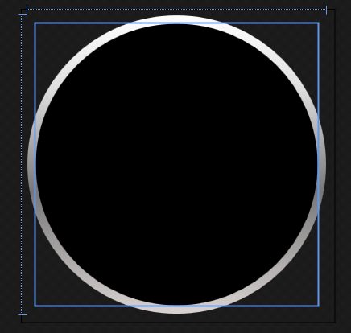
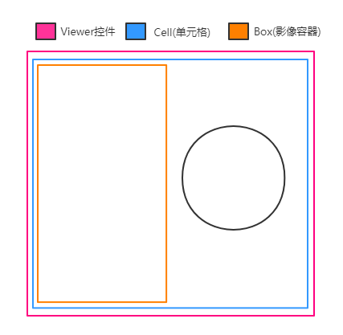

# [C#开发PACS医学影像处理系统(十九)：Dicom影像放大镜](https://www.cnblogs.com/Uncle-Joker/p/13690862.html)

在XAML代码设计器中，添加canvas画布与圆形几何对象，利用VisualBrush笔刷来复制画面内容到指定容器：
~~~
<Canvas x:Name="CvsGlass" Width="106" Height="106"  HorizontalAlignment="Left" VerticalAlignment="Top"  MouseWheel="CvsGlass_MouseWheel" MouseDown="CvsGlass_MouseDown" MouseUp="CvsGlass_MouseUp" MouseMove="CvsGlass_MouseMove" MouseLeave="CvsGlass_MouseLeave">
    <Canvas.RenderTransform>
        <TransformGroup>
            <ScaleTransform/>
        </TransformGroup>
    </Canvas.RenderTransform>
    <Canvas Name="magnifierCanvas">
        <Ellipse Width="106" Height="106" >
            <Ellipse.Fill>
                <LinearGradientBrush EndPoint="0.5,1" MappingMode="RelativeToBoundingBox" StartPoint="0.5,0">
                    <GradientStop Color="#FFD9D2D2" Offset="1"/>
                    <GradientStop Color="White"/>
                    <GradientStop Color="#FFDFDFDF" Offset="0.244"/>
                    <GradientStop Color="#FF777777" Offset="0.592"/>
                </LinearGradientBrush>
            </Ellipse.Fill>
        </Ellipse>
        <Ellipse Width="100" Height="100" Canvas.Left="3" Canvas.Top="3" Fill="Black"/>
        <Ellipse Width="100" Height="100" Name="magnifierEllipse" Canvas.Left="3" Canvas.Top="3">
            <Ellipse.Fill>
                <VisualBrush ViewboxUnits="Absolute" Viewbox="0,0,100,100" ViewportUnits="RelativeToBoundingBox" Viewport="0,0,1,1"/>
            </Ellipse.Fill>
        </Ellipse>
        <TextBlock x:Name="TxtGlassScale" Foreground="Yellow" Visibility="Hidden" FontSize="14" Margin="110,40,0,55" FontFamily="Microsoft YaHei">
            <TextBlock.Effect>
                <DropShadowEffect/>
            </TextBlock.Effect>
        </TextBlock>
    </Canvas>
</Canvas>
~~~

得到一个类似放大镜的界面效果：

其中，TxtGlassScale是显示放大镜倍数的文字控件；

VisualBrush是内容笔刷，看效果：

其中需要注意的是，放大镜应该是和Box平级，属于Cell的子控件，这样在图像平铺模式下则能兼容所有图像范围：

看效果：

 参考代码：
~~~
#region -----放大镜-----
/// 

/// 当前大小与vs设计器中的大小的比例 
/// 

public double ActualScaleVal = 0;

/// 

/// 放大比例
/// 

double glassScale = 2.0;

/// 

/// 放大镜视图范围宽度
/// 

double glassWidth = 0;

/// 

/// 放大镜视图范围高度
/// 

double glassHeight = 0;

/// 

/// 显示放大镜
/// 

public void UseGlass()
{
    if (CvsGlass.IsShow())
    {
        CvsGlass.Hide();
        return;
    }

    if (glassWidth == 0 || glassHeight == 0)
    {
        //计算放大镜比例 100是放大镜的viewbox的大小
        glassWidth = 100 / glassScale;
        glassHeight = 100 / glassScale;

    }
    TxtGlassScale.Foreground = shapeManager.shapeMeasureColor;
    TxtGlassScale.FontSize = shapeManager.shapeMeasureFontSize;
    SetGlassViewBox(ActualWidth, ActualHeight, new Point(), true);
    CvsGlass.Show();
}

/// 

/// 关闭放大镜
/// 

public void CloseGlass()
{
    CvsGlass.Hide();
}

//滚轮控制放比例
private void CvsGlass_MouseWheel(object sender, MouseWheelEventArgs e)
{
    if (e.Delta > 0)
    {
        glassScale -= 0.05;
    }
    else
    {
        glassScale += 0.05;
    }

    glassScale = glassScale < 0.1 ? 0.1 : glassScale;
    glassScale = glassScale > 5 ? 5 : glassScale;

    glassWidth = 100 / glassScale;
    glassHeight = 100 / glassScale;

    Point pos = e.MouseDevice.GetPosition(GridMain);
    SetGlassViewBox(pos.X, pos.Y, new Point(), false, false);
    TxtGlassScale.Text = ((glassScale * ActualScaleVal * 2) * 100).ToString("f1") + "%";
    TxtGlassScale.Show();

}

//是否按下放大镜鼠标
bool isGlassDown = false;

//记录按下鼠标的位置
Point glassPoint = new Point(0, 0);

//按下放大镜
private void CvsGlass_MouseDown(object sender, MouseButtonEventArgs e)
{
    glassPoint.X = e.GetPosition(CvsGlass).X;
    glassPoint.Y = e.GetPosition(CvsGlass).Y;
    isGlassDown = true;
}

//移动放大镜
private void CvsGlass_MouseMove(object sender, MouseEventArgs e)
{
    if (isGlassDown)
    {
        //相对于 GridLine 获取鼠标的坐标
        Point svMainPos = e.MouseDevice.GetPosition(ScrollCell);

        Point glassPos = e.MouseDevice.GetPosition(CvsGlass);

        SetGlassViewBox(glassPos.X, glassPos.Y, svMainPos, false);

        Mouse.Capture(CvsGlass);
    }
}

/// 

/// 设置放大内容
/// 

/// <param name="vbX">宽度参数</param>
/// <param name="vbY">高度参数</param>
/// <param name="svMainPos">相对于GridLine的坐标</param>
/// <param name="isInit">是否是初始化</param>
/// <param name="reLocation">是否重新定位坐标</param>
private void SetGlassViewBox(double vbX, double vbY, Point svMainPos, bool isInit = false, bool reLocation = true)
{
    Rect viewBox = GlassVB.Viewbox;
    double xoffset = viewBox.Width / 2.0;
    double yoffset = viewBox.Height / 2.0;
    if (isInit)
    {
        viewBox.X = (vbX - xoffset) / 2;
        viewBox.Y = (vbY - yoffset) / 2;
        CvsGlass.Margin = new Thickness((vbX - 106) / 2, (vbY - 106) / 2, (vbX - 106) / 2, (vbY - 106) / 2);
    }
    else
    {
        if (reLocation)
        {
            viewBox.X = svMainPos.X - xoffset - (vbX - 106 / 2);
            viewBox.Y = svMainPos.Y - yoffset - (vbY - 106 / 2);

            CvsGlass.Margin = new Thickness(
                    CvsGlass.Margin.Left + vbX - glassPoint.X,
                    CvsGlass.Margin.Top + vbY - glassPoint.Y,
                    CvsGlass.Margin.Right - vbX + glassPoint.X,
                    CvsGlass.Margin.Bottom - vbY + glassPoint.Y);
        }
    }
    viewBox.Width = glassWidth;
    viewBox.Height = glassHeight;
    GlassVB.Viewbox = viewBox;
    TxtGlassScale.Hide();
}

private void CvsGlass_MouseLeave(object sender, MouseEventArgs e)
{
    isGlassDown = false;
}

private void CvsGlass_MouseUp(object sender, MouseButtonEventArgs e)
{
    isGlassDown = false;
    Mouse.Capture(null);
}

/// 

/// 重新设置放大镜大小和位置
/// 

public void ReSetGlass()
{
    if (BoxList.Count == 0)
    {
        return;
    }

    //*2是因为放大镜在vs设计器中显小 放大两倍
    BoxList[0].SetScaleTrans(CvsGlass, ActualScaleVal * 2, ActualScaleVal * 2, false);
    if (CvsGlass.Margin.Left >= ActualWidth || CvsGlass.Margin.Top >= ActualHeight)
    {
        CvsGlass.Margin = new Thickness((ActualWidth - 106) / 2, (ActualHeight - 106) / 2, (ActualWidth - 106) / 2, (ActualHeight - 106) / 2);
    }
}

#endregion

~~~