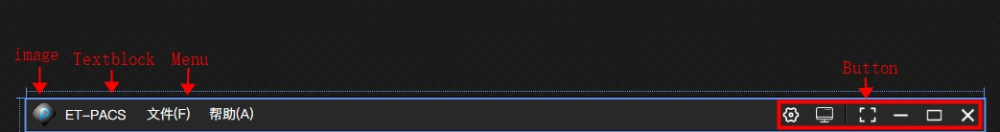
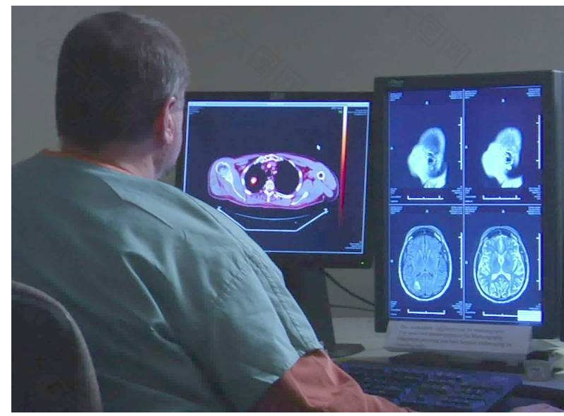

# [C#开发PACS医学影像处理系统(二)：界面布局之菜单栏](https://www.cnblogs.com/Uncle-Joker/p/13650213.html)

在菜单栏布局上，为了使用自定义窗体样式和按钮，我们需要先将窗体设置为无边框，然后添加一个Grid作为菜单栏并置顶，`VerticalAlignment="Top"`

logo图片和标题是Image和TextBlock控件，菜单是Menu控件，系统按钮是Button控件。

其中需要注意的是，一般医院影像科或放射科阅片采用的是双屏，横屏+竖屏，而PACS一般是在竖屏上显示，

当最大化窗体时，如果不进行特殊处理，则会在横屏上最大化，而我们的要求是在竖屏上最大化，

所以需要监听最大化按钮的点击事件，并指定在竖屏上最大化，

关键代码：

~~~
/// 

/// 重新计算工作屏幕对象 /// 

/// <returns></returns>
public static System.Windows.Forms.Screen ReSetScreen()
{
　　System.Windows.Interop.WindowInteropHelper windowInteropHelper = new System.Windows.Interop.WindowInteropHelper(this);
　　System.Windows.Forms.Screen screen = System.Windows.Forms.Screen.FromHandle(windowInteropHelper.Handle); return screen;
}

//在指定屏幕重新设置窗体大小和位置
var screen =ReSetScreen();
Height = screen.WorkingArea.Height;
Width = screen.WorkingArea.Width;
Top = screen.Bounds.Top;
Left = screen.Bounds.Left;
~~~

