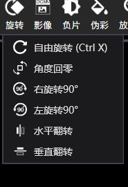
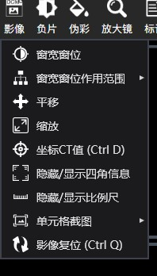
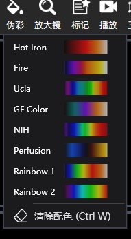

转自：[https://www.cnblogs.com/Uncle-Joker/p/13650330.html](https://www.cnblogs.com/Uncle-Joker/p/13650330.html "https://www.cnblogs.com/Uncle-Joker/p/13650330.html")

工具栏布局采用WPF中Grid作为容器，按钮采用自定义样式和图标，并采用Separator分割线：







XAML设计器代码：

其中  Style="{StaticResource ButtonStyle}"  按钮样式可以根据自身UI风格来使用自定义样式

~~~xml
<Button x:Name="BtnRotate"  Margin="5,0,0,0" Style="{StaticResource ButtonStyle}" HorizontalAlignment="Left" VerticalAlignment="Top"  Height="59"  Click="BtnRotate\_Click"  >
    <Button.Content>
        <Grid>
            <Image  Source="/PACS;component/Resources/旋转.png" Margin="-5,-1,-5,21" />
            <TextBlock  Text="旋转" Foreground="White" Margin="0,32,0,0" />
        </Grid>
    </Button.Content>
    <Button.ContextMenu>
        <ContextMenu >
            <MenuItem Header="自由旋转 (Ctrl X)" Click="MyRotate\_Click" >
                <MenuItem.Icon>
                    <ImageBrush ImageSource="/PACS;component/Resources/自由旋转.png"/>
                </MenuItem.Icon>
            </MenuItem>
            <MenuItem Header="角度回零"  Click="RotateClear\_Click">
                <MenuItem.Icon>
                    <ImageBrush ImageSource="/PACS;component/Resources/角度归零.png"/>
                </MenuItem.Icon>
            </MenuItem>
            <MenuItem Header="右旋转90°"  Click="RotateRight90\_Click">
                <MenuItem.Icon>
                    <ImageBrush ImageSource="/PACS;component/Resources/右旋转90.png"/>
                </MenuItem.Icon>
            </MenuItem>
            <MenuItem Header="左旋转90°" Click="RotateLeft90\_Click">
                <MenuItem.Icon>
                    <ImageBrush ImageSource="/PACS;component/Resources/左旋转90.png"/>
                </MenuItem.Icon>
            </MenuItem>
            <MenuItem Header="水平翻转"  Click="RotateHor\_Click">
                <MenuItem.Icon>
                    <ImageBrush ImageSource="/PACS;component/Resources/水平翻转.png"/>
                </MenuItem.Icon>
            </MenuItem>
            <MenuItem Header="垂直翻转" Click="RotateVer\_Click">
                <MenuItem.Icon>
                    <ImageBrush ImageSource="/PACS;component/Resources/垂直翻转.png"/>
                </MenuItem.Icon>
            </MenuItem>
        </ContextMenu>
    </Button.ContextMenu>
</Button>
~~~
需要注意的是，当我们点击按钮时弹出的菜单实际上是右键菜单ContextMenu，

所以要在按钮的点击事件中显示右键菜单并定位：

复制代码
```
//设置关联按钮
BtnRotate.ContextMenu.PlacementTarget = BtnRotate;
//弹出时的位置在底部
BtnRotate.ContextMenu.Placement = PlacementMode.Bottom;
//显示菜单
BtnRotate.ContextMenu.IsOpen = true;
```