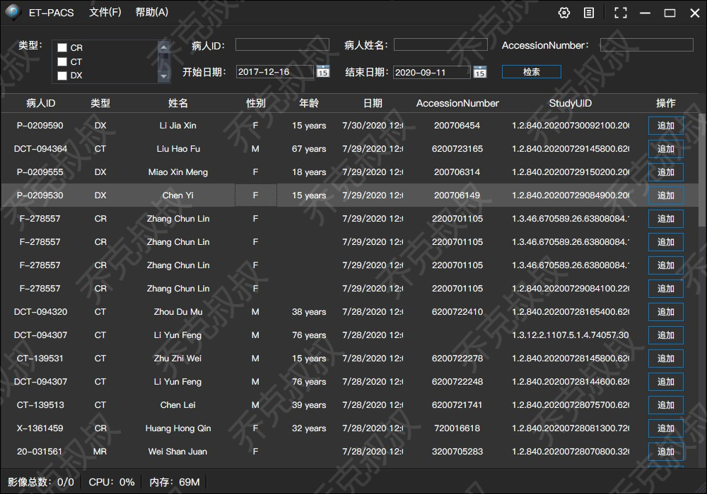
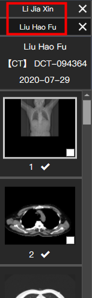

# [C#开发PACS医学影像处理系统(五)：查询病人信息列表](https://www.cnblogs.com/Uncle-Joker/p/13651660.html)

一般情况下，PACS的影像加载是由外部命令发起的，如RIS客户端或网页参数等，

但为保证系统完整性和健壮性，也需要在PACS客户端给用户一个查询界面来加载Dicom影像。

界面分为两部分，上半部是各种查询条件，使用常见控件即可，不赘述。

下半部分是一个WPF中的DataGrid表格控件，通过服务端返回的JSON或XML数据生成列表，双击某一行时进行下载和装载影像操作，

后续操作请参考本系列文章关于下载策略和Dicom影像加载。

需要注意的是，在DataGird中需要添加自定义列来生成【追加】按钮，目的是有的医生需要对比同一个病人前后两次检查来判断病情，

所以需要在追加之后将多个检查同时在主界面显示

XAML代码如下：

~~~
<DataGrid Background="#333333" x:Name="DgvStudyList" BorderBrush="{x:Null}" AutoGenerateColumns="False" Margin="0,95,0,0" >
<DataGrid.Columns>
    <DataGridTextColumn Binding="{Binding PatientID}" ClipboardContentBinding="{x:Null}" Header="病人ID" Width="110"/>
    <DataGridTextColumn Binding="{Binding Modality}" ClipboardContentBinding="{x:Null}" Header="类型" Width="60"/>
    <DataGridTextColumn Binding="{Binding PatientName}" ClipboardContentBinding="{x:Null}" Header="姓名" Width="160"/>
    <DataGridTextColumn Binding="{Binding PatientSex}" ClipboardContentBinding="{x:Null}" Header="性别" Width="60"/>
    <DataGridTextColumn Binding="{Binding PatientAge}" ClipboardContentBinding="{x:Null}" Header="年龄" Width="90"/>
    <DataGridTextColumn Binding="{Binding StudyDate}" ClipboardContentBinding="{x:Null}" Header="日期" Width="90"/>
    <DataGridTextColumn Binding="{Binding AccessionNumber}" ClipboardContentBinding="{x:Null}" Header="AccessionNumber" Width="150"/>
    <DataGridTextColumn Binding="{Binding StudyInstanceUID}" ClipboardContentBinding="{x:Null}" Header="StudyUID" Width="170"/>
    <DataGridTemplateColumn Width="100" Header="操作">
        <DataGridTemplateColumn.CellTemplate>
            <DataTemplate>
                <Grid>
                    <Border Style="{StaticResource BorderBtn}"  Tag="{Binding CommonStudyID}" BorderBrush="#FF007ACC" BorderThickness="1" HorizontalAlignment="Left" Height="26" Margin="0,0,0,0" VerticalAlignment="Top" Width="50" MouseDown="AddStudy" >
                        <TextBlock  Margin="0,1,0,1" TextWrapping="Wrap" Text="追加" VerticalAlignment="Center" Foreground="White" TextAlignment="Center" HorizontalAlignment="Center" Width="24"/>
                    </Border>
                </Grid>
            </DataTemplate>
        </DataGridTemplateColumn.CellTemplate>
    </DataGridTemplateColumn>
</DataGrid.Columns>
</DataGrid>
~~~