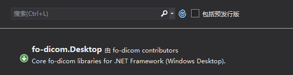
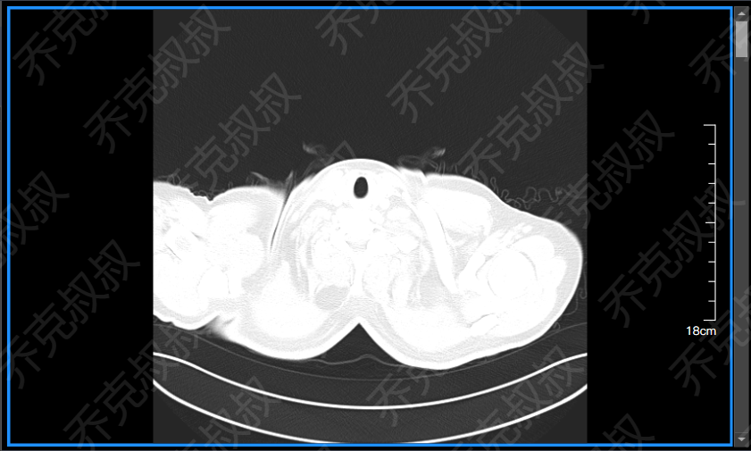
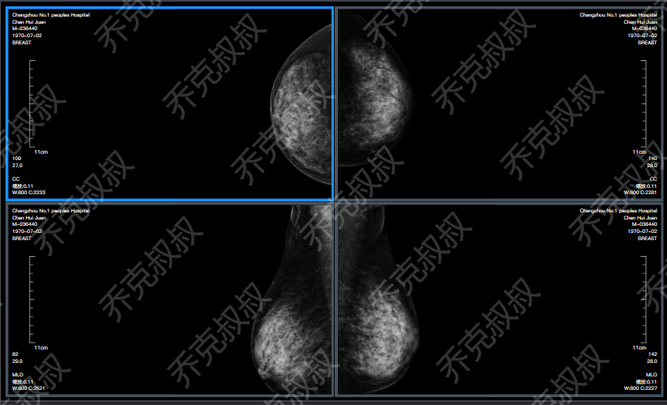

# [C#开发PACS医学影像处理系统(六)：加载Dicom影像](https://www.cnblogs.com/Uncle-Joker/p/13665748.html)

对于一款软件的扩展性和维护性来说，上层业务逻辑和UI表现一定要自己开发才有控制权，否则项目上线之后容易被掣肘，

而底层图像处理，我们不需要重复造轮子，这里推荐使用fo-dicom，同样基于Dicom3.0协议。

根据以上原则，后台影像处理完成之后，即可使用自己开发的控件来呈现。

1.先准备好自己的dcm文件，可以是单个文件或序列文件或DicomDir文件。

2.在VS编辑器里打开NUGET搜索fo-dicoman安装即可。

3.使用fo-dicom读取影像。
~~~
//将图像处理模式设置为全局WPF模式
Dicom.Imaging.ImageManager.SetImplementation(Dicom.Imaging.WPFImageManager.Instance); //实例化文件处理对象并打开文件
DicomFile dicomFile = DicomFile.Open(@"C:\101\1.dcm"); //获取dicom图像对象
DicomImage dicomImage = new DicomImage(dicomFile.Dataset); //不使用LUT
dicomImage.UseVOILUT = false; //转换成一般图像格式，bmp，png等， //在WPF中我们转换成WriteableBitmap
dicomImage.RenderImage().AsWriteableBitmap() :
~~~

4.设置缩放比例，通常dcm影像的大小是不固定的，由设备和技师拍摄手法决定，所以我们要将图像大小缩小或放大到最佳尺寸。

dicomImage对象中的Scale属性决定了缩放比例，方法参数中Border是边框容器，也可以使用Grid或其他可以呈现图像的容器。
~~~
/// 

/// 在图片容器中显示一张图片
/// 

/// <param name="sourceImg">图片源</param>
/// <param name="imgBox">图片控件</param>
/// <param name="imgBoxDock">图片容器</param>
/// <param name="align">对齐方式</param> 
/// <param name="width">实际长度</param>
/// <param name="height">实际高度</param>
public static void ShowImage(WriteableBitmap sourceImg, InkCanvas imgBox, Border imgBoxDock, ImageAlignment align,  double width = 0, double height = 0)
{
    try
    {
        if (sourceImg != null)
        {
            ImageBrush ib = new ImageBrush(sourceImg);
            imgBox.Background = ib;
        }

        double w = 0;
        double h = 0;
        if (double.IsNaN(imgBoxDock.Width) || double.IsNaN(imgBoxDock.Height))
        {
            w = width;
            h = height;
        }
        else
        {
            if (sourceImg != null)
            {
                w = imgBoxDock.Width - sourceImg.Width;
                h = imgBoxDock.Height - sourceImg.Height;
            }           else return;
        }

        if (align == ImageAlignment.Center)
        {
            imgBox.Margin = new Thickness(
                w / 2,
                h / 2,
                w / 2,
                h / 2);
        }
        else if (align == ImageAlignment.Left)
        {
            imgBox.Margin = new Thickness(
                0,
                h / 2,
                w,
                h / 2);
        }
        else if (align == ImageAlignment.Right)
        {
            imgBox.Margin = new Thickness(
                w,
                h / 2,
                0,
                h / 2);
        }
        else if (align == ImageAlignment.Top)
        {
            imgBox.Margin = new Thickness(
                w / 2,
                0,
                w / 2,
                h);
        }
        else if (align == ImageAlignment.Bottom)
        {
            imgBox.Margin = new Thickness(
                w / 2,
                h,
                w / 2,
                0);
        }
    }
    catch (Exception e)
    {
        LogApi.WriteErrLog(e);
    }
}

/// 

/// 图像对齐方式
/// 

public enum ImageAlignment
{
    /// 

    /// 居左
    /// 

    Left = 0,

    /// 

    /// 置顶
    /// 

    Top = 1,

    /// 

    /// 居右
    /// 

    Right = 2,

    /// 

    /// 置底
    /// 

    Bottom = 3,

    /// 

    /// 居中
    /// 

    Center = 4,

    /// 

    /// 跟随父级(仅用于Cell中dicom容器)
    /// 

    Parent = 5,

}
~~~

最终呈现效果：
 

注：一些特殊的类型对齐方式是不一样的，需要对应的挂片协议来控制，详情请参考本系列文章的挂片协议章节。

例如：钼靶（modality：MG）类型，是按照居左居右对齐。

