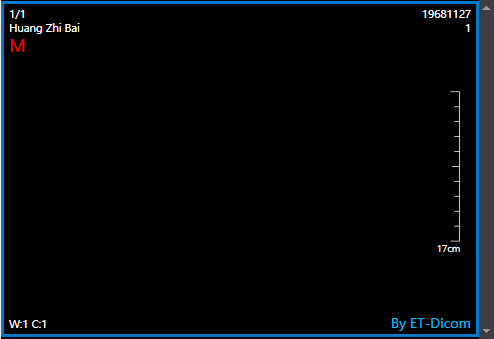
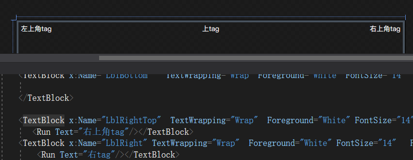
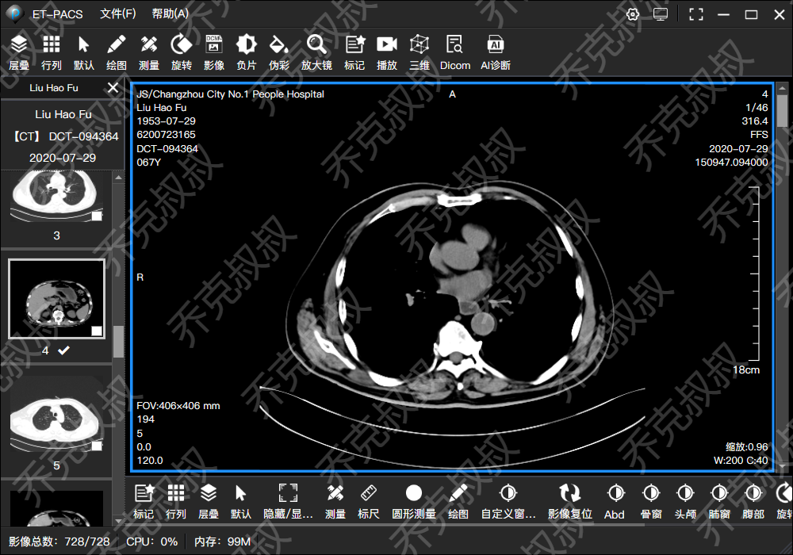

# [C#开发PACS医学影像处理系统(七)：读取影像Dicom信息](https://www.cnblogs.com/Uncle-Joker/p/13666034.html)

Dicom的文件信息一般是由设备信息、图像信息、病人信息等Tag标记组成的，用字节长度和偏移量来区分，

具体数据结构可以自行去参考Dicom文件解析，内容比较多，这里不赘述。

对于常用的Tag，可以简单的理解为两层结构，第一层是组，第二层是组包含的元素，每个组号和元素号用2个字节表示(Uint16),

例如常用的组有 0002组描述设备通讯，0008组描述特征参数，0010组描述患者信息，0028组描述图像信息参数，

例如 0010组里面又包含病人姓名、年龄、性别等。

同样的，按照上一篇文章，还是用fo-dicom来解析Dicom信息，可以直接通过DicomTag的类型感知来获取你想要的Tag值。
~~~
//实例化文件处理对象并打开文件
DicomFile dicomFile = DicomFile.Open(@"C:\101\1.dcm"); //获取dicom图像对象
DicomImage dicomImage = new DicomImage(dicomFile.Dataset); //接收变量
string [] name; //读取病人姓名
dicomFile.Dataset.TryGetValues<string>(DicomTag.PatientName, out name); if (name != null)
{
    Console.WriteLine(name[0]);
}
~~~

有时候我们并不知道某个Tag值对应的名称叫什么，例如 0x0010 0x0020, 所以去DicomTag 类型里面搜索将是一件很痛苦的事情，

这时候需要自己封装一个Tag值操作类，重载创建标签函数，不仅支持uint16，还支持string字符串的组号和元素带入并查询

~~~
/// 

/// 标签管理器
/// 

public static class TagManager
{
    /// 

    /// 设置一个标签
    /// 

    /// <param name="alignment">标签方位</param>
    /// <param name="tagRow">标签所在行数(四个角1到10,上下左右只支持一行)</param>
    /// <param name="dicomTag">标签值</param>
    /// <param name="tagFont">标签样式</param>
    public static TagHandler CreateTag(TagAlignment alignment, int tagRow, DicomTag dicomTag, ImageTagFont tagFont = null)
    {
        TagHandler tag = new TagHandler
        {
            Alignment = alignment,
            DicomTag = dicomTag,
            TagRow = tagRow,
            TagType = TagType.TagValue,
            TagFont = tagFont
        };
        return tag;
    }

    /// 

    /// 设置一个标签
    /// 

    /// <param name="alignment">标签方位</param>
    /// <param name="tagRow">标签所在行数(四个角1到10,上下左右只支持一行)</param>
    /// <param name="group">标签组</param>
    /// <param name="element">标签元素</param>
    /// <param name="tagFont">标签样式</param>
    public static TagHandler CreateTag(TagAlignment alignment, int tagRow, ushort group, ushort element, ImageTagFont tagFont = null)
    {
        TagHandler tag = new TagHandler
        {
            Alignment = alignment,
            Group = group,
            Element = element,
            TagRow = tagRow,
            TagType = TagType.TagValue,
            TagFont = tagFont
        };
        return tag;
    }

    /// 

    /// 设置一个标签
    /// 

    /// <param name="alignment">标签方位</param>
    /// <param name="tagRow">标签所在行数(四个角1到10,上下左右只支持一行)</param>
    /// <param name="groupHexStr">标签组(16进制字符串)</param>
    /// <param name="elementHexStr">标签元素(16进制字符串)</param>
    /// <param name="tagFont">标签样式</param>
    public static TagHandler CreateTag(TagAlignment alignment, int tagRow, string groupHexStr, string elementHexStr, ImageTagFont tagFont = null)
    {
        TagHandler tag = new TagHandler
        {
            Alignment = alignment,
            GroupHexStr = groupHexStr,
            ElementHexStr = elementHexStr,
            TagRow = tagRow,
            TagType = TagType.TagValue,
            TagFont = tagFont
        };
        return tag;
    }

    /// 

    /// 设置一个标签
    /// 

    /// <param name="alignment">标签方位</param>
    /// <param name="tagRow">标签所在行数(四个角1到10,上下左右只支持一行)</param>
    /// <param name="tagText">标签内容</param>
    /// <param name="tagFont">标签样式</param>
    public static TagHandler CreateTag(TagAlignment alignment, int tagRow, string tagText, ImageTagFont tagFont = null)
    {
        TagHandler tag = new TagHandler
        {
            Alignment = alignment,
            TagText = tagText,
            TagRow = tagRow,
            TagType = TagType.UserData,
            TagFont = tagFont
        };
        return tag;
    }

    /// 

    /// 设置一个标签
    /// 

    /// <param name="alignment">标签方位</param>
    /// <param name="tagRow">标签所在行数(四个角1到10,上下左右只支持一行)</param>
    /// <param name="tagType">标签类型</param>
    /// <param name="tagFont">标签样式</param>
    public static TagHandler CreateTag(TagAlignment alignment, int tagRow, TagType tagType, ImageTagFont tagFont = null)
    {
        TagHandler tag = new TagHandler
        {
            Alignment = alignment,
            TagRow = tagRow,
            TagType = tagType,
            TagFont = tagFont
        };
        return tag;
    }
}

~~~

同样，我们也可以设置自定义样式，例如颜色、字体、字号、透明度、自定义文本内容等等，

对于不同的挂片类型，配合对应的挂片协议即可自动显示医院阅片或胶片打印所需要的Tag。

`TagManager.CreateTag(TagAlignment.RightBottom, 1, "By ET-Dicom", new ImageTagFont { TagColor = Color.Blue, TagSize = 18 })`

这样单元格的边角标记就完成了，在设计器中，Tag控件用Textblock就可以了。

 

配合挂片协议后最终呈现效果：

