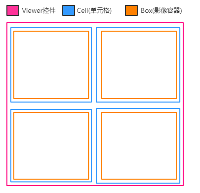
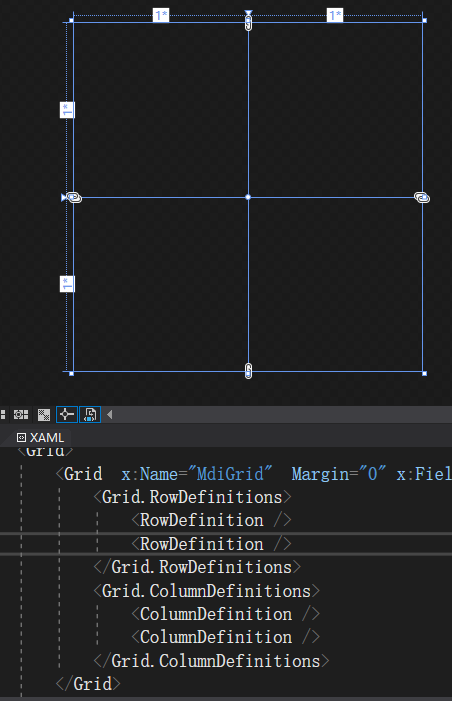
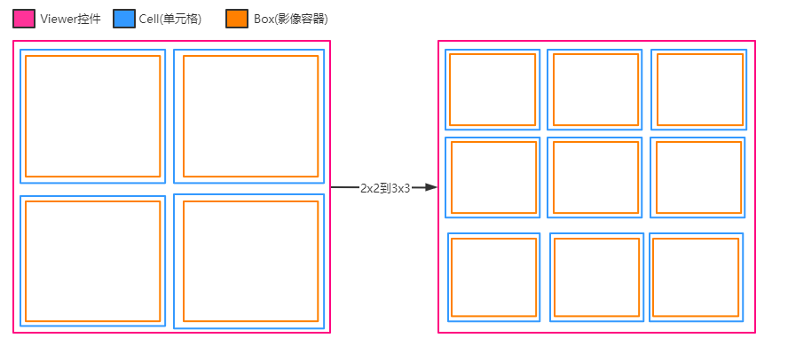
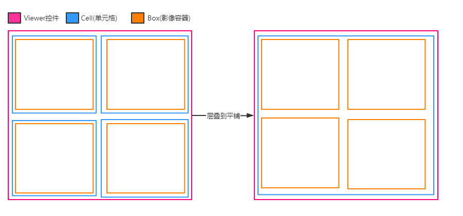
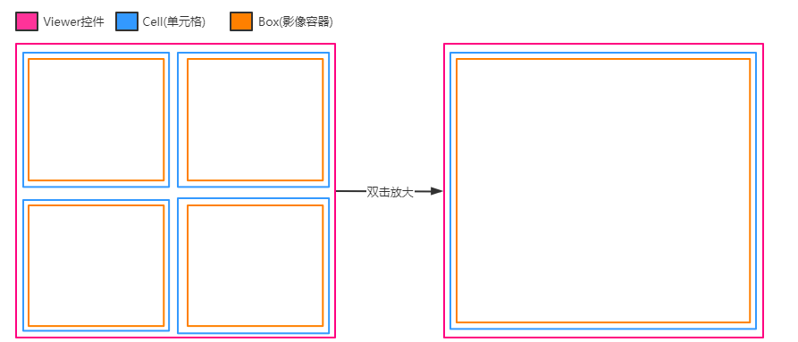

# [C#开发PACS医学影像处理系统(八)：单元格变换](https://www.cnblogs.com/Uncle-Joker/p/13666817.html)

**先看效果：**


**再看结构**，Viewer(影像控件)分为N个Cell(单元格)，每个单元格分为N个Box(影像容器)，

当默认情况为2x2的行列时，结构如下图：



其中，我们在WPF设计器中创建一个用户控件叫Viewer，使用Grid容器，默认2x2，再根据自己的业务需要创建用户控件Cell和用户控件Box，

在Viewer中声明变量集合来记录Cell，同理，在Cell中声明变量集合来记录Box：
```
/// <summary>
/// 图像单元格集合 /// </summary>
public List<ET_MedicalCell> Cells = new List<ET_MedicalCell>();
```


**情况1：变换行列，例如从2x2 变换到3x3：**

 

思路：在集合中添加子控件，为行列属性设置触发器，

~~~
private int rowsCount = 2;
/// <summary>
/// 单元格的行数
/// </summary>
public int RowsCount
{
    get { return rowsCount; }
    set
    {
        if (value < -1)
        {
            rowsCount = 0;
        }
        else if (value > 10)
        {
            rowsCount = 10;
        }
        else
        {
            rowsCount = value;
        }
        SetLayout();
        SetCellCount();
    }
}
~~~
添加Cell：
~~~
ET_MedicalCell cell = new ET_MedicalCell(1, 1, this); 
MdiGrid.Children.Add(cell);
Cells.Add(cell);
~~~

 

**情况2：变换行列，平铺与层叠切换：**

思路：Cell数量始终为1，Box数量变为行列数量

 


**情况3：单元格双击放大：**

思路：Cell数量始终为1，Box数量始终为1




**情况4：医生实际使用中的复合操作：**

**思路：控制Cell和Box的数量，记录好变换之前的位置，因为有可能会变回去，直接引用变换前的对象和位置即可，无需重新加载Dicom影像而浪费效率和资源。**

