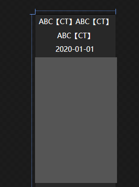
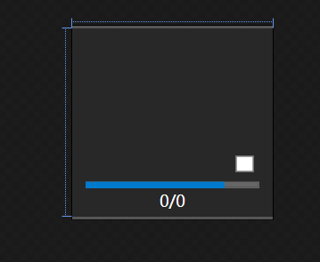
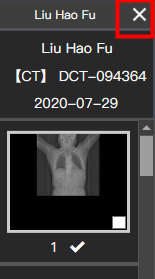
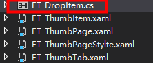
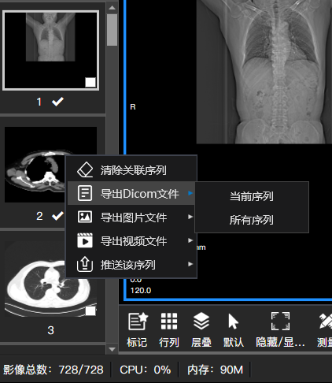

# [C#开发PACS医学影像处理系统(九)：序列控件与拖拽](https://www.cnblogs.com/Uncle-Joker/p/13672042.html)

**1.先看结构：**

创建WPF用户控件：YourTab

创建WPF用户控件：YourItem

 创建选项卡时循环添加item，并设置序列缩略图到控件和异步下载的进度条，

**1个病人1个或多个Study检查，****1个Study检查1个选项卡，****并为每个选项卡添加自定义关闭按钮**

 Tab自定义关闭按钮的XAML样式如下：
~~~
 

~~~
**2.为Item创建模仿2D建筑游戏的拖拽效果**

先创建一个WinForm窗体：

设置窗体属性：窗体位置跟随鼠标，透明度75%，无边框，ShowInTaskBar属性设为False，当在Item上按下鼠标并拖动时则创建一个窗体并设置背景图片和缩略图一致。

**看效果：**

****

**3.创建右键菜单导出DCM或JPG或视频**
~~~

<ContextMenu x:Name="menu">
    <MenuItem Header="清除关联序列" Click="RelationClear_Click">
        <MenuItem.Icon>
            <ImageBrush ImageSource="/PACS;component/Resources/清除.png"/>
        </MenuItem.Icon>
    </MenuItem>
    <MenuItem Header="导出Dicom文件">
        <MenuItem.Icon>
            <ImageBrush ImageSource="/PACS;component/Resources/文件.png"/>
        </MenuItem.Icon>
        <MenuItem Header="当前序列" Click="ExportDicom_Click" Width="140"></MenuItem>
        <MenuItem Header="所有序列" Click="ExportAllDicom_Click"></MenuItem>
    </MenuItem>
    <MenuItem Header="导出图片文件">
        <MenuItem.Icon>
            <ImageBrush ImageSource="/PACS;component/Resources/图片.png"/>
        </MenuItem.Icon>
        <MenuItem Header="当前序列" Width="140" Click="ExportImage_Click"></MenuItem>
        <MenuItem Header="所有序列" Click="ExportAllImage_Click"></MenuItem>
    </MenuItem>
    <MenuItem Header="导出视频文件">
        <MenuItem.Icon>
            <ImageBrush ImageSource="/PACS;component/Resources/视频.png"/>
        </MenuItem.Icon>
        <MenuItem Header="当前序列" Width="140" Click="ExportMedia_Click"></MenuItem>
        <MenuItem Header="所有序列" Click="ExportAllMedia_Click"></MenuItem>
    </MenuItem>
    <MenuItem Header="推送该序列">
        <MenuItem.Icon>
            <ImageBrush ImageSource="/PACS;component/Resources/推送.png"/>
        </MenuItem.Icon>
        <MenuItem Header="当前序列" Width="140" Click="Send_Click"></MenuItem>
        <MenuItem Header="所有序列" Click="SendAll_Click"></MenuItem>
    </MenuItem>
</ContextMenu>

~~~

导出Dicom文件：你打开影像时下载的DCM文件在本地硬盘的路径，复制文件就行了。 

导出图片文件：可以参考本系列文章的加载Dicom影像等章节。

导出视频文件：用第三方的图片转视频文件导出序列视频，推荐使用AForge。

推送：将当前序列推送到其他电脑或设备。