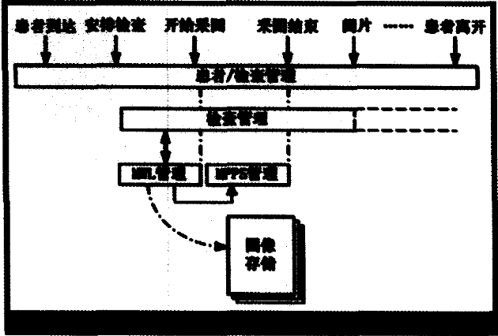
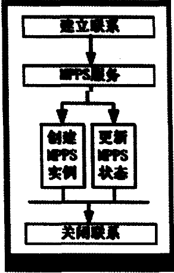

# ###DICOM MPPS的原理及应用 
# 引言

医学影像存档与通信系统(PACS，Picture Archiving and Communication System)是近年来迅速发展起来的。旨在全面解决医学图像的获取、显示、存储、传送和管理的综台系统。PACS是一个实现医学图像数字化管理的计算机网络．数据交换标准协议是信息传输的先决条件，而医学数字影像传输(DICOM)标准是第一个广为接受的全球性医学数字成像和通信标准。为了解决不问影像设备和PACS厂商在图像数据格式和传输方式上的差异，美国放射学会{ACR)和美国全国电子厂商联合会(NEMA)于1985年联合建立了医学数字成像和通讯标准 (D1gital Imaging and Communication in Medicine，DICOM)以利于规范图像及其相关信息的交换。目前DICOM 议已经得到非常广泛的支持， 但其主要应用是用来完成医学图像的存储(即C—Store服务)、传输、查询、相关的图像处理以胺片打印，而在设备业务信息管理系统及工作流管理服务中的应用却相当的缓慢。最近DICOM MWL(Modality Worklist)已开始逐渐得到应用，借助它可以实现病人信息的自动录入，减少了技师在设备控制台上再次输入病人信息的环节，从而大大降低了信息重复录入的工作量和输人错误的几率。然而，成像设备何时开始进行检查、何时完成检查．及检查操作过程中发生的一些事件，如何将这些与日常业务流程管理密切相关的信息通知相应的工作流管理者，通常是PACS和RIS(放射信息系统)，使得PACS／RIS系统能够及时 准确地知道当前正在做什幺检查、哪些检查在什么时间已经完成、哪些图像已经采集可以去查询和获取了，这是PACS／RIS系统业务管理流程的一个素要环节.

DICOM协议中定义了MPPS服务(设备操作过程步骤Modality Performing Procedure Step)。通过MPPS服务，成像设备就可以向PACS／RIS系统传递检查执行过程中的各种状态信息．从而改善和加强工作流程的管理。

# 1 MPPS的原理

在一个完整的常规检查流程中，病人进入医院后先进行登记预约．然后到相应的科室进行检查．完成到诊、检查采集图像 检查完成等业务，随后图像

传输到PACS系统里，据此进行阅片、诊断，接着出一份报告，有时还打印胶片．检查完成后病人离开。

按时间关系，一个检查过程的示意图如图I(从左到右)：

PACS／RIS系统与设备进行的信息交互主要包括：设备检查前，使用DICOM Modality Worklist功能从RIS中获取已登记的病人信息；设备检查过程中，通过

DICOM MPPS功能将检查状态发送给PACS／RIS系统；在检查完成后，设备通过DICOM Storage功能将图像发往PACS系统进行存储管理。如图1所示。

 

## 1．1 MPPS与MWL

MWL和MPPS是DICOM 定义的设备与信息系统之间进行业务管理信息交互的主要手段，在实际应用中，常将MWL与MPPS融合起来，也有称MPPS为对MWL的扩展。MWL是将信息从信息系统传递到设备上去，而MPPS是将设备检查的状态信息传递到信息系统中。在医生选中worklist 项获得将要进行检查的病人信息后进行图像采集(它包含Scheduled Procedure Step，SPS)，以及到采图结束这一段时间， 可以用MPPS服务来传递设备执行任务的各种当前状态，如图1所示。

MPPS是真正执行的一个操作过程(Performed)，跟预约(Scheduled)的操作步骤并不完全相同，并且常常是不同的，在实际情况中，则可能关系到若干实际执行的操作。

对于任务管理者来说，如RIS，处于管理和监控的需要，它们需要知道当前的任务的状态，这就需要执行设备能够有效地提供任务的状态值。应用MPPS，就是在图像开始采集时，成像设备向任务管理者发送一个消息，表明某个任务开始，即对某个病人采集图像，如果操作过程中出现了意外而终止时，也要通过消息通知流程管理者。如果没有异常的完成了正常采集流程，就通知流程管理者此项任务完成。此时，有关系统可以向设备查询、请求图像了。

## 1．2 MPPS服务过程

在DICOM标准中，用两个原语来完成此项服务：一是N—Create，二是N—Set。其服务过程如下：

● 设备从worklist中选中安排的任务，开始图像采集，用N—Create原语通知工作流管理者创建

MPPS实例，并且进入开始状态。

● 工作流管理者收到请求后，创建该实例，并设置相应的状态，成功后返回正确的响应；如果失败

则返回失败原因，设备将关联此服务。

● 设备收到工作流管理者的确认信息。当图像采集结束用N—Set原语通知工作流管理者此MPPS结束。

● 工作流管理者收到更改通知，进行相应的操作，返回响应。

● 关闭设备与工作流间的联系。

这样RIS可以及时得到执行的状态， 提供了工作流管理的必要条件，有效地加强了管理力度。例如，当通过MPPS通知图像已采集完成时，RIS就可进行相关的查询操作。同时管理者(或技师)也可以利用这些状态信息来进行检查完整性验证，例如确认检查完成后PACS系统能得到有关的图像。

# 2 MPPS的实现

MPPS分为SCP与SCU两种角色，前者用到工作流管理端，通常是PACS/RIS。本文用RIS作为工作流管理者；后者用在执行的设备上。

MPPS与其他的存储，查询等网络通讯服务一样也是在TCP基础上建立连接来完成消息的交互的；其服务框架如下：

其中，MPPS实例的创建，以及其状态的更新，可以在两个不同的联系中进行。

 

## 2．1创建实例

当设备在获取任务后，开始采集图像时， 它通知RIS此事件，而在通知时，需要确定一个MPPS实

例。在DICOM协议中，用N—Create原语来提供此服务。

&nbsp;&nbsp;&nbsp;&nbsp;在此请求中，既有新创建的MPPS实例UID，又包含MPPS实例的状态，即IN PROGRESS。

RIS在收到此请求后，将创建一个实例，并将其状态设置为IN PROGRE SS。成功后返回一个确认的响应

## 2．2传递状态

在图像采集开始后，要么采集过程出现异常，要么正常的完成。分别用DISCONTINUED，COMPLETE

两个状态来表示。

设备用N-Set服务原语来通知RIS端。此请求所设置的对象用创建的MPPS实例UID来标记。作为MPPS SCP的RIS端收到请求后，更新指定的实例的状态值。正常则返回成功的响应以确认此服务完成。

MPPS管理状态信息在MPPS IOD中用属性(0040，0252)来描述。所有的状态均由设备初始化。有3个状态：

IN PROGRE SS：设备开始执行任务。

DISCONTINUED：说明取消或者非成功的终止：在MPPS开始后，却不能被设备完成。设备通知Is以重新安排或取消有关过程。

COMPLETE，说明对复合SOP实例的获取已经成功地完成，SCU已提供MPPS所需的所有的值。

# 3结论

MPPS是工作流和业务管理的一个重要功能。IHE定义了完整的医疗信息系统的工作流框架，根据这一框架可以设计和实现整合HIS、PACS、RIS的真正意义上的数字化医院。DICOM标准针对工作流管理定义了MWL，MPPS，SPS等服务，这些服务是连接HIS、PACS、RIS和设备之间的纽带。当前这方面的应用在国内还在起步，随着PACS系统的不断发展，工作流(Workflow)管理已经成为未来PACS发展的趋势。如何将PACS、RIS和成像设备更好地融合到一起，实现符合医院业务功能的工作流，从而能够更好地满足日常业务工作的需要，是实现全功能的数字化放射科的重要内容，也是未来几年PACS系统发展的重点。