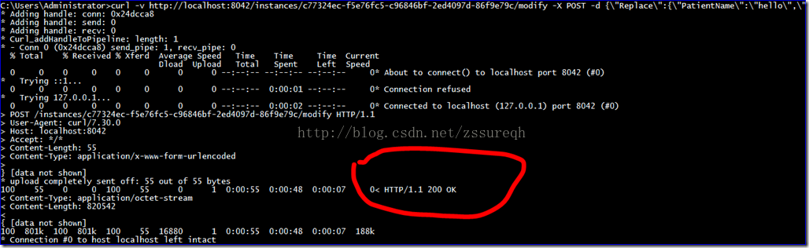
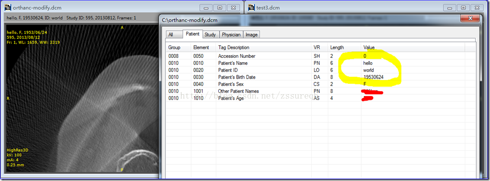

# DICOM医学图像处理：DIMSE消息发送与接收“大同小异”之DCMTK fo-dicom mDCM
# 背景：
  
  从DICOM网络传输一文开始，相继介绍了C-ECHO、C-FIND、C-STORE、C-MOVE等DIMSE-C服务的简单实现，博文中的代码给出的实例都是基于fo-dicom库来实现的，原因只有一个：基于C#的fo-dicom库具有高封装性。对于初学者来说实现大多数的DIMSE-C、DIMSE-N服务几乎都是“傻瓜式”操作——构造C-XXX-RQ、N-XXX-RQ然后绑定相应的OnResponseReceived处理函数即可。本博文希望在前几篇预热的基础上，对比DCMTK、fo-dicom、mDCM三种库构建DIMSE消息的具体操作，来分析一下三者对于DIMSE消息的发送和接收的实现，为后续搭建简易版的Dicom Server服务器做准备。
  
# DIMSE：
  
  DIMSE，是DICOM Message Service Element的简称。DICOM3.0第7部分指出：DIMSE为对等DICOM应用实体进行医学影像及相关信息交换提供了一种应用服务元素定义（Application Service Element），包括服务和协议（DIMSE Service 和DIMSE Protocol）。
  
## DIMSE Protocol：
  
  DIMSE基于DIMSE协议来提供服务，DIMSE协议规定了构造消息必需的编码规则。一条DICOM MESSAGE由固定的指令集合（Command Set），外加可选择的数据集合（Data Set）构成，如下截图所示：
  

  
   可以简单的理解：Command Set就是本博文即将要介绍的各种服务的请求和应答消息；而Data Set可以认为类似于DCM后缀的文件，是我们希望在对等DICOM实体间进行传输的信息。但是从本质上来说**Command Set和Data Set两者都遵循DICOM3.0协议中IOD的定义**，**都是“以(Group Number,Element Number)对”来进行标记的Data Element元素的集合**，更形象一点的说明可参考早期的博文（[http://blog.csdn.net/zssureqh/article/details/9275271](http://blog.csdn.net/zssureqh/article/details/9275271)）。
  
  DIMSE Protocol指出Message可能会分片（fragmented，这与传统的TCP/IP中的概念类似），消息的具体传输是基于ASSOCIATE（DICOM3.0第8部分）中的P-DATA Service（博文[http://blog.csdn.net/zssureqh/article/details/41016091](http://blog.csdn.net/zssureqh/article/details/41016091)中有介绍）。
  
## DIMSE Services：
  
  DIMSE服务因操作SOP类型的不同分为**DIMSE-C Services**和**DIMSE-N Services**，DIMSE-C服务支持在对等DICOM实体间进行Composite SOP Instance操作，主要包括C-ECHO、C-FIND、C-STORE、C-MOVE、C-GET等；而DIMSE-N服务支持Normalized SOP Instance操作，主要包括N-EVENT-REPORT、N-GET、N-SET、N-CREATE、N-ACTION、N-DELETE。
  
   
  
  从上图可以看出DIMSE-C服务只提供操作服务，即对等DICOM实体一方请求另一方对Composite SOP Instance进行操作（operation）；而DIMSE-N服务除了提供操作以外，还提供通知（notification）服务。DIMSE中的所有操作和通知都是确认服务（confirmed services），即一方发出的请求都需要得到对方的应答（**原文：*All DIMSE operations and notifications are confirmed services. The performing DIMSE-service-user shall report the response of each operation or notificationover the same Association on which the operation or notification was invoked.***）。每种服务具体方式不同，例如某些操作可能会触发后续的子操作、某些操作可能需要多个响应等等，如下图：
  
  
  
# DCMTK、fo-dicom、mDCM构建DIMSE-C消息：
  
  DIMSE-C服务在医学领域应用最广泛，常见的PACS、HIS、RIS、LIS等系统都会用到，而DIMSE-N服务主要应用在MPPS和DICOM打印中，日常学习中可能没有实际应用和测试的机会，因此这里就暂时不介绍，主要以DIMSE-C消息的构造为主，来分别介绍三种库的具体操作。
  
## DCMTK：
  
  博文[http://blog.csdn.net/zssureqh/article/details/41016091](http://blog.csdn.net/zssureqh/article/details/41016091)之前简单介绍了一下DCMTK对于网络传输方面的封装，更多的是偏重于协议的各层（Layer），例如对最底层的基于TCP/IP的Dicom Upper Layer的封装以**DUL\_**为前缀；对实体连接层的封装以**ASC\_**为前缀；最顶层的是DIMSE层，以**DIMSE\_**为前缀。本博文会从DIMSE Services中的DIMSE-C各种消息入手，介绍DCMTK对于消息的封装和操作：
  
### DCMTK之C-ECHO：
  
  DCMTK开源库相较于其他两者来说最大的优势是有完整的说明文档、稳定的维护团队，同时也有成功的商业产品。在源码中也给出了各种服务工具包，前面的好多博文都已经介绍过DCMTK的工具包，例如针对于C-ECHO的echoscu.exe***（博文后续的工程实例是用dcmqrscp.exe作为mini DICOM服务端进行测试的）***。
  
  DCMTK对DIMSE-C中的各种消息的定义在dimse.h头文件中，其中C-ECHO-RQ消息定义如下：
  
~~~ cpp
 /* C-ECHO */
struct T_DIMSE_C_EchoRQ {
DIC_US MessageID; /* M */
DIC_UI AffectedSOPClassUID; /* M */
T_DIMSE_DataSetType DataSetType; /* M */
} ;
struct T_DIMSE_C_EchoRSP {
DIC_US MessageIDBeingRespondedTo; /* M */
DIC_UI AffectedSOPClassUID; /* U(=) */
T_DIMSE_DataSetType DataSetType; /* M */
DIC_US DimseStatus; /* M */
unsigned int opts; /* which optional items are set */
#define O_ECHO_AFFECTEDSOPCLASSUID 0x0001
} ;
~~~
  
    
  
  dimse.h中对于每一种DIMSE-C服务的请求消息（request）和响应消息（response）都给出了定义，并以union方式来统一了DICOM Message结构，如下所示：
  
~~~ cpp
/*
* Composite DIMSE Message
*/
struct T_DIMSE_Message {
T_DIMSE_Command CommandField; /* M */
union {
/* requests */
T_DIMSE_C_StoreRQ CStoreRQ;
T_DIMSE_C_EchoRQ CEchoRQ;
T_DIMSE_C_FindRQ CFindRQ;
T_DIMSE_C_GetRQ CGetRQ;
T_DIMSE_C_MoveRQ CMoveRQ;
T_DIMSE_C_CancelRQ CCancelRQ;
T_DIMSE_N_EventReportRQ NEventReportRQ;
T_DIMSE_N_GetRQ NGetRQ;
T_DIMSE_N_SetRQ NSetRQ;
T_DIMSE_N_ActionRQ NActionRQ;
T_DIMSE_N_CreateRQ NCreateRQ;
T_DIMSE_N_DeleteRQ NDeleteRQ;
/* responses */
T_DIMSE_C_StoreRSP CStoreRSP;
T_DIMSE_C_EchoRSP CEchoRSP;
T_DIMSE_C_FindRSP CFindRSP;
T_DIMSE_C_GetRSP CGetRSP;
T_DIMSE_C_MoveRSP CMoveRSP;
T_DIMSE_N_EventReportRSP NEventReportRSP;
T_DIMSE_N_GetRSP NGetRSP;
T_DIMSE_N_SetRSP NSetRSP;
T_DIMSE_N_ActionRSP NActionRSP;
T_DIMSE_N_CreateRSP NCreateRSP;
T_DIMSE_N_DeleteRSP NDeleteRSP;
} msg;
};
~~~  
    
  
  DICOM3.0第7部分中有关于C-ECHO消息的参数说明以及具体指令编码，正如前文所述**Command同样也是以(Group Number,Element Number)标记的Data Element元素的集合**，因此按照DICOM3.0标准中的要求只要向C-ECHO-RQ或者C-ECHO-RSP指令中插入规定的Data Element元素即可。
  
 
  
  如上图所示，构造T\_DIMSE\_CEchoRQ需要填充MessageID/Affected SOP Class UID等，具体构造代码如下：（代码封装在DIMSE\_echoUser函数中）
  
~~~ cpp
T_DIMSE_Message req, rsp;
T_ASC_PresentationContextID presID;
const char *sopClass = UID_VerificationSOPClass;
bzero((char*)&req, sizeof(req));
bzero((char*)&rsp, sizeof(rsp));
req.CommandField = DIMSE_C_ECHO_RQ;
req.msg.CEchoRQ.MessageID = msgId;
strcpy(req.msg.CEchoRQ.AffectedSOPClassUID,
sopClass);
req.msg.CEchoRQ.DataSetType = DIMSE_DATASET_NULL;
~~~  
    
  
  上面代码中的rsp与我们自己构建的req类似，唯一不同的是req是在C-ECHO SCU端构造，而rsp是在C-ECHO SCP端构造并通过网络传送过来的。
  
   ***（具体的测试代码可参见博文后文给出的连接）***
  
### DCMTK之C-FIND：
  
  下面我们看一下比较复杂的消息C-FIND，相较于C-ECHO消息，C-FIND中需要给出我们希望查询的目标属性列表（**记住：**同样也是一个DcmDataset类型，即Dicom Element集合）。
  

  
  C-FIND-RQ消息的构造代码如下：
  
~~~ cpp
//定义临时变量
T_ASC_PresentationContextID presId;
T_DIMSE_C_FindRQ req;
T_DIMSE_C_FindRSP rsp;
DcmFileFormat dcmff;
OFString temp_str;
presId=ASC_findAcceptedPresentationContextID(assoc,abstractSyntax);
//构造C-FIND-RQ消息
bzero(OFreinterpret_cast(char*, &req), sizeof(req));
strcpy(req.AffectedSOPClassUID,abstractSyntax);
req.DataSetType=DIMSE_DATASET_PRESENT;
req.Priority=DIMSE_PRIORITY_LOW;
req.MessageID=assoc->nextMsgID++;
//构造数据体，即我们具体希望在C-FIND SCP端获得的信息
DcmDataset* dcmdataset=new DcmDataset();
dcmdataset->putAndInsertString(DCM_StudyInstanceUID,"");
dcmdataset->putAndInsertString(DCM_StudyDate,"");
dcmdataset->putAndInsertString(DCM_QueryRetrieveLevel,"STUDY");
DcmDataset *statusDetail = NULL;
//在DIMSE_findUser内部会将dcmdataset数据合并到req中，统一构成T_DIMSE_Message
OFCondition cond=DIMSE_findUser(assoc,presId,&req,dcmdataset,NULL,NULL,blockMode,dimse_timeout,&rsp,&statusDetail);

~~~  
    
  
  上述代码比较复杂的是需要构造参数列表中的Identifier元素，该元素包含了我们希望从C-FIND SCP服务端提供查询获得的属性，上面选择了STUDY级别的查询，因此需要添加DCM\_QueryRetrieveLevel元素、StudyInstanceUID等（***DCM\_QueryRetrieveLevel元素必须添加，有时候会误认为添加了AffectedSOPClassUID后就不需要了，这是错误的。否则服务端会返回如下错误，如下图***）。
  
  
   **注：关于Patient、Study、Series等不同级别的查询的详细介绍可参考DICOM3.0标准第4部分的附录C。**
  
### DCMTK之C-STORE：
  
  C-STORE与C-FIND类似，同样需要添加额外的数据，不同于C-FIND添加查询属性列表的是，C-STORE添加的是准备发送的DCM文件的数据体，即下图中的Data Set。
  
~~~ cpp
OFCondition cond = EC_Normal;
T_DIMSE_Message req, rsp;
DcmDataset 
bzero((char*)&req, sizeof(req));
bzero((char*)&rsp, sizeof(rsp));
/* set corresponding values in the request message variable */
req.CommandField = DIMSE_C_STORE_RQ;
request->DataSetType = DIMSE_DATASET_PRESENT;
request->req.msg.CStoreRQ = *request;
~~~  
    
  
  暂时我们就只介绍C-ECHO、C-FIND和C-STORE三种服务的请求消息构造方法，其他的类似。
  
## fo-dicom：
  
  fo-dicom是基于C#开发的，封装性更强，封装思路更倾向于按DICOM消息流来进行，即fo-dicom库开发者在实现了整个DIMSE消息流框架的基础上，通过给用户预留各阶段的接口来方便用户定制自己的实现。对于DIMSE消息流框架的封装在DicomService.cs文件中（同时也有类似于DCMTK中的ASC\_方面的封装，主要指的是A-ASSOCIATE服务及协议，在DICOM3.0第8部分有详细介绍），对于网络底层的封装放在DicomServer.cs文件中（等同于DCMTK中的DUL\_层）。
  
  DICOM Message消息的基类在DicomMessage.cs文件中，然后根据请求和应答派生了两个基类DicomRequest和DicomResponse。从fo-dicom库的封装以及fo-dicom对于Dataset的设计可以看出Command和Dataset都是数据集合，不同的是两者存储的元素类型不同。
  
  在fo-dicom库中构造各类消息很方便，可谓是“傻瓜式”操作，详情如下：
  
### fo-dicom之C-ECHO：
~~~ cpp
DicomCEchoRequest cechoRQ=new DicomCEchoRequest();
~~~
    
  
  一行代码就顺利的构建了一个C-ECHO-RQ请求指令。分析源码可知DicomCEchoRequest继承自DicomRequest，DicomReqeust继承自DicomMessage。逐级查看各类的构造函数可以发现。虽然我们调用的是DicomCEchoRequest的默认构造函数，但是在相继调用了基类DicomRequest(DicomCommandField.CEchoRequest, DicomUID.Verification, priority)和DicomMessage()后，顺利的完成了对C-ECHO-RQ指令中各个参数构造，其中DicomMessage中构造了空的Command Set和DataSet，DicomRequest中对MessageID、Priority、SOPClassUID以及CommandFieldType进行了赋值，这简直是太容易啦，不过也正因为此，刚入手的时候可能不知道如何来定制化自己的请求，以为fo-dicom库留给我们的可操作性太少，其实不然，继续往下看。
  
### fo-dicom之C-FIND：
~~~ cpp
DicomCFindRequest cfind=DicomCFindRequest.CreateStudyQuery(patientId:”12345”);
cfind.OnResponseReceived=(rq,rsp)=>
{
//接收到C-FIND-RSP响应消息后，本机C-FIND SCU进行的操作
//例如可以输出到屏幕或其他窗口
Console.WriteLine("PatientAge:{0} PatientName:{1}", rsp.Dataset.Get<string>(DicomTag.PatientAge), rsp.Dataset.Get<string>(DicomTag.PatientName));
}

~~~ 
  
    
  
  通过对比fo-dicom与DCMTK中C-FIND的构造，是不是觉得很容易。但是越容易学习和上手的东西，倘若不掌握其本质越容易忘。查看DicomCFindRequest.cs源码，可以发现CreateStudyQuery函数已经帮助我们添加了Study查询级别所需的所有字段，也就是上文中提到的Identifier参数部分。代码如下：
  
  那么如果我们想像DCMTK那样自由添加字段怎么办？例如在已知服务端是自己定制实现的基础上来查询我们的私有字段，其实很简单直接Override一下CreateStudyQuery函数即可。另外fo-dicom还有一个比较便利的地方是将每种消息的回调函数直接绑定到消息中，程序写起来比较方便，逻辑上更清晰。
  
### fo-dicom之C-STORE：
  
~~~ cpp
DicomCStoreRequest cstore=new DicomCStoreRequest(@”c:\\test4.dcm”);

~~~ 
    
  
  在DicomCStoreRequest一级只需要提供待发送的dcm文件的文件名（全路径名）即可，其他的同样通过逐级来完成CommandSet和Dataset的赋值。基本流程如下：
  
~~~ cpp

/// 

/// Initializes DICOM C-Store request to be sent to SCP.
/// 

/// <param name="file">DICOM file to be sent</param>
/// <param name="priority">Priority of request</param>
public DicomCStoreRequest(DicomFile file, DicomPriority priority = DicomPriority.Medium) : base(DicomCommandField.CStoreRequest, file.Dataset.Get<DicomUID>(DicomTag.SOPClassUID), priority) {
    File = file;
    Dataset = file.Dataset;
    SOPInstanceUID = File.Dataset.Get<DicomUID>(DicomTag.SOPInstanceUID);
}
//DicomRequest.cs文件
protected DicomRequest(DicomCommandField type, DicomUID affectedClassUid, DicomPriority priority) : base() {
    Type = type;
    SOPClassUID = affectedClassUid;
    MessageID = GetNextMessageID();
    Priority = priority;
    Dataset = null;
}
//DicomMessage.cs文件
public DicomMessage() {
    Command = new DicomDataset();
    Dataset = null;
}
~~~ 
  
## mDCM：
  
  mDCM库与fo-dicom库其实是相同的，只不过fo-dicom利用了最新的C#技术来重构mDCM。如博文[http://blog.csdn.net/zssureqh/article/details/39621533](http://blog.csdn.net/zssureqh/article/details/39621533)中给出的mDCM库的继承图所示，在顶层基类DcmNetworkBase中实现了DIMSE消息流的基本框架，然后按照Client和Server进行了两路派生。mDCM的封装有点处于DCMTK和fo-dicom之间的状况，**既未做到像DCMTK那样完全提供各个层面底层操作函数，也没有像fo-dicom那样更抽象的封装**。
  

  
  下面来看一下mDCM对各种消息的构造：
  
### mDCM之C-ECHO：
  
~~~ cpp

~~~ 
  mDCM比较特殊，对于DIMSE-C服务请求的参数赋值流程与fo-dicom类似，大多参数赋值都在基类中完成，例如DcmClientBase中完成了MaxPDU、Priority，DicomClient完成CallingAE和CalledAE等；而对于整体请求消息的拼接却又类似DCMTK，在SendCEchoRequest函数内部调用CreateRequest来完成。
  
### mDCM之C-FIND：
  
~~~ cpp

//DcmAssociation assoction;//已经顺利建立的DICOM对等实体间的连接
byte pcid=associate.FindAbstractSyntax(DicomUID.VerificationSOPClass);
SenCEchoRequest(pcid,NextMessageID(),Priority);
~~~ 
  在query.ToDataset函数内部完成了查询级别QueryRetrieveLevel的赋值，另外需要注意的是此时在ToDataset函数内部调用了一个虚函数AdditonalMembers用于方便派生添加自已要查询的Identifier元素。最终还是在SendCFindRequest函数内部利用CreateRequest创建C-FIND-RQ消息（在mDCM中的类型是DcmCommand）。
  
### mDCM之C-STORE：
  
~~~ cpp
byte pcid = Associate.FindAbstractSyntax(FindSopClassUID);
if (Associate.GetPresentationContextResult(pcid) == DcmPresContextResult.Accept) {
DcmDataset dataset = query.ToDataset(Associate.GetAcceptedTransferSyntax(pcid));
SendCFindRequest(pcid, NextMessageID(), Priority, dataset);

~~~ 

  在CStoreClient类内部通过Load来载入dcm文件，提取DcmDataset数据体，然后调用SendCStoreRequest来发送C-STORE-RQ请求（DicomCStoreClient中有两种类型的SendCStoreRequest，一种是发送DcmDataset类型数据，一种是发送Stream类型数据）。
  
# 总结：
  
  通过对比分析三种开源库对DIMSE-C服务消息的构造方式，可以更清晰的了解DCMTK、fo-dicom、mDCM三者各自的优势。如果想了解DICOM协议的细节及底部代码的具体实现，自然DCMTK是首选，其按照Dicom Upper Layer、A-ASSOCIATE、DIMSE三层来划分的结构更方便我们研究DICOM网络传输的机制。并且DCMTK最新的3.6.1版本也逐渐开始按服务来对DUL\_、ASC\_、DIMSE\_三类函数进行封装，已经实现了C-ECHO、C-STORE服务，即DcmSCU/DcmSCP和DcmStorageSCU/DcmStorageSCP。如果想快速入手，实现DICOM的相关服务，fo-dicom自然是首选，想必这对于C#程序员来说轻而易举（mDCM可以看做是DCMTK与fo-dicom的中间地带）。
  
# DCMTK工程实例：
  
  百度网盘：[http://pan.baidu.com/s/1jGvaSr8](http://pan.baidu.com/s/1jGvaSr8)
  
# 后续博文介绍：
  
  **fo-dicom搭建简单的DICOM Server**
  
  > > > > > > > > > > > **作者：[zssure@163.com](mailto:zssure@163.com)**
  > 
  > > > > > > > > > > > **时间：2014-12-06**
  
  发布于 1年前， 阅读(43) | 评论(0) | 投票(0) | 收藏(0) [阅读全文...](http://my.oschina.net/zssure/blog/354816)
  
# 原 [DICOM医学图像处理：DCMTK的wiki资料学习之PACS调试](http://my.oschina.net/zssure/blog/354814)
  
  分类: [DICOM](http://my.oschina.net/zssure/blog?catalog=586524)
  
  112014-12
  
# **背景：**
  
  前段时间着重从dcmtk和fo-dicom（mDCM）源码角度进行剖析，期望加深对DICOM协议的理解。知其然，知其所以然。如果“所以然”很不好懂，那我们还是先多多“知其然”吧。搞清楚原理的目的不也是为了更好的运用于实践么？所以理论和实践应该彼此交错进行，理论搞不动了就搞搞应用，应用久了就钻研钻研理论。
  
  以前上DCMTK官网仅仅是浏览关于开源库中各个类的设计模式、依赖关系。最近在打开DCMTK官网的wiki时，才发现OFFIS对DCMTK的介绍是如此的详细。正值国庆假日，就不深挖DCMTK源码了，那就按照DCMTK wiki中给出的介绍来实际体验分析一下DCMTK，从实践角度来学习一下。
  
# **PACSDebugging with DCMTK**
  
  前几篇博文分别介绍了worklist查询服务（[DICOM医学图像处理：基于](http://blog.csdn.net/zssureqh/article/details/38775315)DCMTK工具包学习和分析worklist、[DICOM医学图像处理：利用](http://blog.csdn.net/zssureqh/article/details/38986721)fo-dicom发送C-Find查询Worklist）、C-STORE服务（[DICOM医学图像处理：](http://blog.csdn.net/zssureqh/article/details/39213817)storescp.exe与storescu.exe源码剖析，学习C-STORE请求、[DICOM医学图形处理：](http://blog.csdn.net/zssureqh/article/details/39237649)storescp.exe与storescu.exe源码剖析，学习C-STORE请求（续））和C-MOVE服务（[DICOM医学图像处理：](http://blog.csdn.net/zssureqh/article/details/39621533)AETitle在C-FIND和C-MOVE请求中的设置问题）。此次参考wiki中的说明利用DCMTK中的工具来讲解一下如何调试PACS系统。
  
  下文中会用到的工具有以下两类
  
  |   |   |
  | --- | --- |
  | 服务端 | dcmqrscp |
  | 客户端 | echoscu、storescu、findscu、movescu |
  
  PACS是什么？在DICOM标准中并没有明确的定义，DICOM协议大多是通过定义SOP来描述相关网络服务。但是几乎每一个PACS系统会包含以下几种SOP类，
  
  |   |   |
  | --- | --- |
  | Verification SOP Class | 又称为DICOM ECHO服务，用于查明网络对端系统（即PACS）是否符合DICOM标准（即talks DICOM），以便双方按照DICOM标准进行对话。 |
  | Storage SOP Classes | 将一个或多个DICOM对象存储到PACS服务器。一个PACS系统往往需要支持多种Storage SOP Classes，用以存储不同设备的图像数据（如CT、US、MR等）。 |
  | Query SOP Classes | 根据指定的关键字查询PACS数据库。但是并不下载图像，仅仅是查询图像有关的信息。 |
  | Retrieve SOP Classes | 根据Query SOP Classes的结果找到目标图像后，利用Retrieve SOP Classes服务从PACS服务器下载图像到本地。 |
  | Storage Commitment SOP Classes | 客户通过该服务确认PACS服务端已经成功完成了图像的归档。 |
  
  因此可以简单的理解为PACS就是提供了上述多种服务的服务端。在DCMTK工具包中给我们提供了一个PACS模拟工具——dcmqrscp，该工具提供了上表中的所有服务（Storage Commitment SOP Classes除外，该部分并未包含在DCMTK开源包中，而需要购买商用版本）。
  
  下面就利用dcmqrscp与其他的dcmtk工具来模拟调试一下客户端与PACS服务端的交互过程，从实际应用的角度熟悉DICOM3.0标准。
  
## **1）安装PACS服务器：**
  
  利用DCMTK给出的dcmqrscp工具包结合自己定制的配置文件来搭建我们的PACS服务器（为了更好的学习DCMTK工具包，不建议直接使用wiki中给出的公用版PACS，即[www.dicomserver.co.uk/](http://www.dicomserver.co.uk/)）
  
  dcmqrscp跟其他dcmtk工具包一样，可以通过添加-h或--help命令行参数来查看工具包的使用说明。唯一不同的是要想启动PACS服务器还需要指定一个配置文件。DCMTK提供的默认的配置文件为dmqrscp.cfg。打开dcmtk工具包中的dcmqrscp.cfg文件，其中的注释已经很清楚。简单概括为三部分：
  
  第一部分，网络配置，即传统网络编程中用到参数。如NetworkTCPPort——监听端口，用于监听来自客户端的各种连接请求（需要注意的是要配置自己的防火墙，开放指定的端口）；MaxAssociations——允许的最大连接数；MaxPDUSize——定义PDU传输时刻的最大长度等等。
  
  第二部分，关于连接到dcmqrscp服务器的客户机定义。该部分包含在dcmqrscp.cfg配置文件HostTable BEGIN和Host Table END内。默认的定义如下：
  

  
  简而言之，该部分就是定义可能连接到PACS服务器的客户机信息，通常包含AETitle、HostName、PortNamer三部分。**需要指出的是目前HostName（主机名称）还不支持直接IP地址的方式，因此在本地配置的时候要格外注意。**
  
  本地机的配置如下：
  
  > acme1 = (ACME1,localhost,11110)
  > 
  > acme2 = (ACME2,localhost,11110)
  > 
  > acmeCTcompany =acme1 , acme2
  
  第三部分，客户机的详细信息。该部分目的多是为了方便用户的阅读，方便配置时使用。在下文中的调试过程中并未用到，因此就不做介绍了。
  
  第四部分，PACS服务端存储位置信息定义。通过该部分设置，可以实现将不同客户端传统过来的数据归档到不同的PACS服务器目录。同时针对不同的AE指定不同的读写权限、存储的研究（study）数量等。默认的配置文件如下，
  

  
  该部分配置的时候要注意路径必须在本地已经存在，否则会引发错误。例如我在本地的配置如下，
  
     ACME\_STORED:\\DcmScuScp\\DcmScp RW (9, 1024mb) acmeCTcompany
  
  下面给出我在本地机的dcmqrscp.cfg配置文件，
  

  
  在命令行启动dcmqrscp工具，输出状态如下：
  

  
## **2）PACS的功能调试**
  
  PACS可以简单的理解为提供了多种DICOM标准中SOP服务的软件。我们已经利用dcmqrscp工具启动了一个PACS系统，接下来就按照上一节中PACS提供的SOP服务类表格来依次进行测试
  
### **Verification SOPClass服务测试**
  
  VerificationSOPClass服务是每一个PACS系统必须提供的一项服务，用于指出该PACS服务符合DICOM协议。DCMTK工具包中的echoscu工具可发起该请求，具体指令如下：echoscu.exe –dlocalhost 11110
  
  11110对应于dcmqrscp.cfg配置文件第一部分给出的NetworkTCPPort，-d是调试选项，方便我们观察工具包的运行状态。运行后的输出结果如下：
  

  
  **喔？竟然出现了几个致命错误**。幸好我们开启了-d调试开关，从调试结果中看出错误的原因是无法识别Called AE Title，因为我们在echoscu命令行中并未指定dcmqrscp的名称。修改后指令如下，echoscu.exe –d localhost 11110 –aec ACME\_STORE
  

  
  **竟然又出现了同样的错误？**想必很多第一次接触dcmtk的同学看到这个结果就已经心凉了一半，无心继续下去了。DMCTK的wiki中指出这个错误提示并未指出真正的错误原因，这个是dcmqrscp.exe工具包的问题。这里应该是要求我们同时指定我们自己的AE名称，再次修改后的代码如下：echoscu.exe –dlocalhost 11110 –aec ACME\_STORE –aet ACME1
  
 
  
  **好吧，又出现了同样的错误，我是服了**。看来想好好学习应用也不是很容易的啊。为了能够继续后续的其他测试，查看一下dcmqrscp工具包的源码文件dcmqrscp.cc，找出产生上述问题的原因。
  
  **问题排查：**
  
  在dcmqrscp.cc文件main函数中的waitForAssociation一行插入断点，进行单步调试。如上在命令行开启echoscu，发送C-ECHO请求。逐行运行代码，具体流程如下，
  

  
  最后代码停留在\_stricmp(HostName,CNF\_Config.AEEntries\[i\].Peers\[j\].HostName)一行，如下：
  

  
  该行中的HostName函数指的是我们主机的名称，例如我本机的名称是：PC-201408122158，而CNF\_Config.AEEntries\[i\].Peers\[j\].HostName指的是我们配置文件dcmqrscp.cfg中的HostTable部分，其中HostName对应的就是上面配置文件中的localhost。
  
  至此，经过简单的源码分析，已经顺利找到了问题的原因。**之所以**一直提示“Called AE Title Not Recognized”就是因为我们将HostTable中的Hostname误认为是本机IP地址的字符名称，所以错误的将主机名称设置成了localhost。其实在dcmqrscp工具包的配置文件dcmqrscp.cfg中曾有过提示“Note:in the current implementation you cannot substitutean IP address for a hostname”。
  

  
  重新修改配置文件中的hostname为PC-201408122158，再次进行尝试。此次连接测试顺利通过，测试结果如下：
  

  
### Storage SOP Classes服务测试
  
  连接测试顺利通过后，利用storescu.exe工具包对Storage SOPClass服务进行测试。具体指令如下：storescu.exe –dlocalhost 11110 00.dcm –aec ACME\_STORE –aet ACME1，测试结果显示为Success（如下图）
  

  
  经过此次storescu测试，成功的将D盘根目录下的00.dcm文件上传到了dcmqrscp.cfg中指定的存储目录下，即D:\\DcmScuScp\\DcmScp，在存储的过程中dcmqrscp将00.dcm文件进行了重命名（关于重命名的规则可参见DCMTK对dcmqrscp的wiki介绍，也可以通过命令行参数来设定重命名的方式），同时在归档目录下生成了一个名称为index.dat的记录文件，如下图：
  

  
### **Query SOP Classes服务测试**
  
  继续我们的调试，通过使用storescu.exe已经能够顺利的将我们的图像上传到指定的PACS服务目录下。接下来对我们上传的数据进行查询测试，使用的工具是findscu.exe，测试的具体指令为：findscu.exe -v -S -aec ACME\_STORE -aet ACME1 localhost11110 -k QueryRetrieveLevel=STUDY -k StudyDate -k StudyDescription -kStudyInstanceUID，查询的结果如下：
  

  
  查询反馈的结果与我们在利用dcmdump工具显示的信息完全一致，这说明Query SOPClasses测试顺利通过。
  

  
### **Retrieve SOP Classes服务测试**
  
  进行我们最后一项测试，就是将上传到PACS服务器的图像数据重新下载到本地。测试的工具是movescu.exe，具体指令如下：movescu.exe -v -S-aec ACME\_STORE -aet ACME1 -aem ACME1 --port 11110 -od D:\\DcmScuScp\\DcmSculocalhost 11110 -k QueryRetrieveLevel=STUDY -k StudyInstanceUID = 2.16.840.114421.81295.9407241257
  
  原本以为会顺利将图像保存到本地D:\\DcmScuScp\\DcmScu目录下，结果PACS服务端和客户端同时停在了如下状态，
  
  
  
  由上图可以看出网络连接部分的交互已经完成了，而且对于dcmqrscp.exe模拟的PACS服务端的各项服务（VerificationSOPClass、StorageSOPClass、QuerySOPClass、RetrieveSOPClass）我们都已经测试过了，为何信息交互停留在了ConstructionAssociation RQ PDU部分呢？仔细检查一下命令行参数以及dcmqrscp.cfg配置文件，发现在本地测试的时候我们将dcmqrscp.exe模拟的PACS服务器监听端口和可能连入的客户端端口都设置成了11110，因此在进行图像传输的过程中会发生冲突，为了验证我们的猜测，将ACME1客户端的端口修改为12345，再一次进行movescu的测试，指令如下：movescu.exe -v -S-aec ACME\_STORE -aet ACME1 -aem ACME1 **--port 12345** -od D:\\DcmScuScp\\DcmScu localhost**11110** -k QueryRetrieveLevel=STUDY -kStudyInstanceUID=2.16.840.114421.81295.9407241257，测试结果如下：
  

  
  打开本地的D:\\DcmScuScp\\DcmScu目录，可以看到由storescu.exe上传到PACS服务器的文件。
  

  
  至此利用DCMTK工具对PACS的调试工作全部结束了，上述的调试完全参照DCMTK中wiki的相关内容，原文链接为[http://support.dcmtk.org/redmine/projects/dcmtk/wiki/Howto\_PACSDebuggingWithDCMTK](http://support.dcmtk.org/redmine/projects/dcmtk/wiki/Howto_PACSDebuggingWithDCMTK)，这里我的操作仅供大家参考，如果有精力还希望仔细阅读一下英文原文，原文的讲解更详细更全面。
  
  **后续专栏博文介绍**
  
  **Dicom中的MPPS服务介绍**
  
  **C#的异步编程模式在fo-dicom中的应用**
  
  **VMWare三种网络连接模式的实际测试**
  
  > > > > > > **作者：[zssure@163.com](mailto:zssure@163.com)**
  > 
  > > > > > > **时间：2014-10-03**
  
  发布于 1年前， 阅读(39) | 评论(0) | 投票(0) | 收藏(0) [阅读全文...](http://my.oschina.net/zssure/blog/354814)
  
# 原 [DICOM医学图像处理：Deconstructed PACS之Orthanc，Modification & Anonymization](http://my.oschina.net/zssure/blog/354808)
  
  分类: [DICOM](http://my.oschina.net/zssure/blog?catalog=586524)
  
  112014-12
  
# 背景：
  
  上篇博文为引子，介绍了一款神奇的开源PACS系统——Orthanc。本篇开始解读官方Cookbook中的相关内容，对于简单的浏览、访问和上传请阅读前篇博文。在常规的PACS系统中还未出现对于DCM图像的修改和匿名化操作，因此此次重点介绍Orthanc利用REST API实现对DCM医学图像的修改（modification）和匿名化（anonymization）。对于官方Cookbook中的实例进行示范和调试，通过Orthanc源码分析确保示例在本机良好运行。**注意**：官方Cookbook中的示例在Windows下会有错误，详情见博文。
  
# Orthanc介绍：
  
  取名为Orthanc源自于J.R.R. Tolkien’s（托尔金）的小说。Orthanc是艾辛格（Isengard）要塞中的黑塔，初建于第二世纪，用于储存收纳南方王国的真知晶石——palantíri，一种圆形且能够看见远方的石头，透过palantíri可以跟远方使用palantíri的人进行交流。Orthanc Server正是取palantíri的此层含义，设计出一种可在整个医院DICOM拓扑网络中便捷、透明以及可编程访问医学图像的系统（可参照wiki百科的介绍：[http://en.wikipedia.org/wiki/Isengard](http://en.wikipedia.org/wiki/Isengard)）。
  
  另外，Orthanc中同时包含了“RTH“，即Radiotherapy。其实Orthanc本身源自于法国de Liège大学中心医院（Centre Hospitalier Universitaire）对于放射治疗服务的研究。
  
# Orthanc之Modification & Anonymization
  
## Anonymization：
  
  Orthanc从0.5.0版本之后引入了对DICOM资源的匿名化操作，可对患者（patients）、检查（studies）、序列（series）和图像（instances）多个级别进行匿名化处理。为了方便示范，此处以instances级别为例进行介绍：
  
  1）按照上篇博文上传两幅测试图像到Orthanc Server，如下图所示：
  
  
  
  2）利用curl命令行查看一下上述两个instances，获取ID号，结果如下：
  
  > curl [http://localhost:8042/instances](http://localhost:8042/instances)
  
  > > > > > 
  
  此处获取的instance ID号为：**c77324ec-f5e76fc5-c96846bf-2ed4097d-86f9e79c**
  
  3）按照Orthanc官方Cookbook的说明，进行匿名化操作
  
  输入指令：curl [http://localhost:8042/instances/c77324ec-f5e76fc5-c96846bf-2ed4097d-86f9e79c/anonymize](http://localhost:8042/instances/c77324ec-f5e76fc5-c96846bf-2ed4097d-86f9e79c/anonymize) -X POST -d '{}' > c:\\orthanc-anonymize.dcm
  
  但是并未获得如期结果，打开c盘发现orthanc-anonymization.dcm文件大小为0KB。开启curl的verbose模式，
  
  curl –v [http://localhost:8042/instances/c77324ec-f5e76fc5-c96846bf-2ed4097d-86f9e79c/anonymize](http://localhost:8042/instances/c77324ec-f5e76fc5-c96846bf-2ed4097d-86f9e79c/anonymize) -X POST -d '{}' > c:\\orthanc-anonymize.dcm
  
  查看输出信息如下：
  
  
  
  发现Orthanc Server中HTTP 服务**返回值为404**。
  
  通过自己查看官方Cookbook给出的指令，除了对应instance的UID不同外，并未找到问题，暂且跳过，尝试一下Modification。
  
  
  
## Modification：
  
  1）上传DCM文件到Orthanc Server，同Anonymization中相同；
  
  2）利用curl [http://localhost:8042/instances](http://localhost:8042/instances)获取指定instance的ID号；
  
  3）参照官方Cookbook进行Modification处理
  
  
  
  输入如下指令，此次为了方便，直接使用curl的verbose模式：
  
  curl –[v http://localhost:8042/instances/c77324ec-f5e76fc5-c96846bf-2ed4097d-86f9e79c/modify](http://localhost:8042/instances/c77324ec-f5e76fc5-c96846bf-2ed4097d-86f9e79c/modify) –X POST –d ‘{"Replace”:{"PatientName”:"hello”,"PatientID”:"world”}}' >c:\\orthanc-modify.dcm
  
  输出结果如下：
  
  
  
  目前为止，参照Orthanc官方的Cookbook说明，给出的两个示例都在本机无法顺利完成。因此猜测官网中给出的代码有可能是Linux系统的，在Windows系统下应该做出适当的调整，但是该怎样调整呢？该调整哪一部分呢？请继续往下看……
  
# 调试Orthanc官方Cookbook示例：
  
## 0）Orthanc REST API资料查询：
  
  在调试之前，我们先要搞清楚出现问题的大致原因，排除一些常见的错误，比如软件版本错误、指令拼写错误等等。上面介绍的Anonymization和Modification都是利用了Orthanc的REST API功能，那么Orthanc各版本对于REST API的支持程度如何呢？我们查看一下官方的说明，如下图所示:
  
  
  
  从上图可以看出，Orthanc从0.5.0版本之后就支持多级别的修改和匿名化操作，如上一篇博文所述，我本机安装的是最新的0.8.5版本。因此可以确保软件版本无误，另外在上述示例仿真过程中我们也对比排查了指令拼写错误。
  
  接下来使出我们的杀手锏吧：**“启动C:\\Orthanc-0.8.5\\Orthanc.sln工程，进入调试模式，查看Orthanc的源码”。**打开Orthanc.sln解决方案，右键Orthanc工程开启调试模式，在关于REST API的几个核心类中插入断点，初次尝试插入的断点如下：
  
  > > > > 
  
## 1）Anonymization源码调试：
  
  重新按照上一节中的步骤，首先利用Orthanc Explorer向调试模式下的Orthanc Server添加DICOM文件，此时直接按F5跳过调试，因为图像加载过程中我们并未遇到问题。（**注**：**此步操作必须重新添加，因为调试模式下数据的存储目录是C:\\Orthanc-0.8.5\\OrthancStorage，与二进制安装包默认的C:\\OrthancStorage不同，上一节中我们添加的图像在调试状态下是看不到的**）
  
  
  
  输入指令查看ID：
  
  curl [http://localhost:8042/instances](http://localhost:8042/instances)
  
  > 
  
  开始输入上一节的Anonymization指令：
  
  curl -v [http://localhost:8042/instances/c77324ec-f5e76fc5-c96846bf-2ed4097d-86f9e79c/anonymize](http://localhost:8042/instances/c77324ec-f5e76fc5-c96846bf-2ed4097d-86f9e79c/anonymize) -X POST -d '{}' > c:\\orthanc-anonymize.dcm
  
  Orthanc工程首次停在了断点RestApi.cpp中的Visit函数内，如下图所示：
  
  > 
  
  利用F11单步调试，随后进入到解析Anonymization请求操作的函数**ParseAnonymizationRequest**内部，可以看到在该函数内给出了一个示例与我们输入的格式相同
  
  
  
  继续单步调试，最后发现在解析Json格式的AnonymizationRequest指令，即我们输入的'{}’，**json\_reader.cpp**中的**readToken**返回值为**tokenError**。
  
  > > 
  
  至此想必我们找到了Anonymization指令出错的原因的：输入的Json格式不正确，虽然我们是按照Orthanc官方的Cookbook来进行的。为了确定Json格式是否有误，在在线Json格式检查网站（[http://www.bejson.com/](http://www.bejson.com/)）测试一下，结果为：
  
  
  
  按照提示，去掉指令中Json部分的单引号，输入：
  
  curl -v [http://localhost:8042/instances/c77324ec-f5e76fc5-c96846bf-2ed4097d-86f9e79c/anonymize](http://localhost:8042/instances/c77324ec-f5e76fc5-c96846bf-2ed4097d-86f9e79c/anonymize) -X POST -d {} > c:\\orthanc-anonymize.dcm
  
  curl调试输出的结果为：
  
  
  
  利用DICOM看图软件，打开可以发现orthanc-anonymize.dcm文件中的患者姓名已经被隐藏掉了。
  
  
  
  **【总结】：正确的指令应该是外边不添加单引号，如下所示：**
  
  curl -v [http://localhost:8042/instances/c77324ec-f5e76fc5-c96846bf-2ed4097d-86f9e79c/anonymize](http://localhost:8042/instances/c77324ec-f5e76fc5-c96846bf-2ed4097d-86f9e79c/anonymize) -X POST -d {} > c:\\orthanc-anonymize.dcm
  
## 2）Modification源码调试：
  
  既然已经找到了Anonymization中代码出错的问题，让我们去掉Modification中的单引号，尝试一下输入如下指令：
  
  curl -v [http://localhost:8042/instances/c77324ec-f5e76fc5-c96846bf-2ed4097d-86f9e79c/modify](http://localhost:8042/instances/c77324ec-f5e76fc5-c96846bf-2ed4097d-86f9e79c/modify) -X POST -d {"Replace":{"PatientName":"hello","PatientID":"world"}} >c:\\orthanc-modify.dcm
  
  令我们失望的是依然看到了HTTP Server返回的**404错误**。
  
  
  
  由于Modification指令中单引号内部还存在着更多的双引号。根据上次的经验，有可能还是Json格式输入输入错误。让我们只保留json\_reader.cpp中的**readToken**断点，直接查看一下解析结果是否是**tokenError？**重新输入指令，进入到readToken内部，发现函数依然返回**tokenError**，结果如下图所示：
  
  > 
  
  利用VS自带的查看工具，我们可以看到readToken函数解析的字符串current\_，其真实内容是：{Replace:{PatientName:hello,PatientID:world}}，其中并未看到我们输入的双引号，将{Replace:{PatientName:hello,PatientID:world}}输入到[http://www.bejson.com/](http://www.bejson.com/)中，也得到了错误的结果提示：
  
  
  
  这说明我们在命令行中输入的Json指令中的双引号，在被VS读入过程中被忽略了。那么我们利用转义字符将双引号传递进入，输入指令：
  
  curl -v [http://localhost:8042/instances/c77324ec-f5e76fc5-c96846bf-2ed4097d-86f9e79c/modify](http://localhost:8042/instances/c77324ec-f5e76fc5-c96846bf-2ed4097d-86f9e79c/modify) -X POST -d {\\"Replace\\":{\\"PatientName\\":\\"hello\\",\\"PatientID\\":\\"world\\"}} >c:\\orthanc-modify.dcm
  
  查看结果：
  
  > 
  
  最终运行输出为，
  
  
  
  在DCM看图软件中打开orthanc-modify.dcm，可以看到PatientID和PatientName已经修改。
  
  
  
  至此，关于Orthanc Modification和Anonymization的调试已经顺利完成，可以松一口气啦，还是**调试源代码给力啊**^\_^。
  
# 知识点补充：
  
  Orthanc作为开源项目，获取其源码自然是轻而易举。虽然号称轻型Server系统，但是代码量还是足以吓退大多数人的。初次面对海量的代码无从下手进行调试，下面以上述调试Orthanc官方Cookbook中的Anonymization和Modification示例过程为例，讲解一下如何开始调试Orthanc。
  
## 1）如何调试Orthanc中的Http Server
  
  之所以上一节最开始将断点设置在了RestXXX.cpp文件中，是因为本博文中的介绍的Modification和Anonymization使用的是Orthanc提供的REST API服务，因此首先推测错误应该出现在REST API的相关实现函数中。这种方法可以顺利的解决我们上面遇到的问题，并且如你所见我们已经实现了问题的排查。
  
  但是既然调试进入了Orthanc的源码内，就顺道儿搞清楚Orthanc中Http Server的整体流程，也顺便找找究竟是在哪一个地方将curl指令中的双引号忽略的。 再一次输入指令，进入调试状态。断点第一次停在RestApi.cpp中的Visit函数处，在前一节中我们利用**“单步调试”**顺利的逐步进入到了JSON的解析函数readToken内，**“单步调试”是向前追溯的最佳手段，也是VS提供给我们的最直观最有利的错误排查工具**。但是为了要了解整个流程，我们此处需要**“回溯”**，那么VS提供给我们逆流而上的工具是什么呢？那就是“查找所有引用”，如下图所示：
  
  > > 
  
  我们可以由RestApi.cpp 转到上一级，即RestApiHierarchy.cpp中的LookupResource函数，如此迭代下去相信可以回溯到整个流程的最顶端。这种方法虽然笨拙了一些，但是比较实用。想必在Windows编程环境下大家还是更喜欢“可视化”的直观操作，即所见即所得。那么单击菜单栏中的“调试”，选择“窗口”中的**“调用堆栈”**，可以直观的看到在RestApi.cpp中的Visit函数之前的各种函数调用顺序，如下图所示：
  
  > > > 
  
  至此我们可以看到整个Http Server服务的起始端是mongoose.cpp中的worker\_thread函数（在**“调用堆栈”**中相关函数右键选择“转到源码”可以查看函数的具体位置）。由上图中**“调用堆栈”**的顺序我们已经可以清晰的看到Orthanc Http Server的整个调用流程。那么我们在worker\_thread函数中插入断点，重新输入curl指令，查看一下在整个流程的起始状态下，Orthanc Http Server接收到的数据体是什么格式？如下图所示：
  
  > > > 
  
  在process\_new\_connection函数内部读取curl发出的POST请求指令时，连接缓存buf的内容中已经不存在双引号了，因此可以确定**curl的-d参数**在发送JSON格式数据到Orthanc的Http Server时忽略了双引号。**后续可以研究一下curl在windows环境下的使用，尤其是-d参数的设置**。
  
## 2）如何调试Orthanc中的DICOM Server
  
  由于DICOM Server比较熟悉，先验知识比较多，因此调试起来比HTTP Server容易。在Orthanc的main函数中我们可以看到httpServer.Start()和dicomServer.Start()，dicomServer.Start()就是DICOM Server的入口点，由于Orthanc是基于DCMTK开发的，因此后续的流程应该是交由DCMTK来完成的，更详细的细节可参考本专栏前面的DCMTK网络系列文章。预告一下下篇博文会详细介绍利用fo-dicom开源库打造一个简单的DICOM Server服务端，那时再详细的对比分析Orthanc中的DICOM Server，本篇暂且到此为止。
  
# 参考资料：
  
  [https://code.google.com/p/orthanc/wiki/OrthancCookbook，](https://code.google.com/p/orthanc/wiki/OrthancCookbook)Cookbook官网链接
  
  [https://code.google.com/p/orthanc/wiki/Anonymization](https://code.google.com/p/orthanc/wiki/Anonymization)，Orthanc的Modification和Anonymization介绍
  
  [https://docs.google.com/spreadsheet/pub?key=0Ao5aRMxCX2hldEJadzVUaWFmNW5QTWhrYTI3UHMzdXc&single=true&gid=8&output=html，](https://docs.google.com/spreadsheet/pub?key=0Ao5aRMxCX2hldEJadzVUaWFmNW5QTWhrYTI3UHMzdXc&single=true&gid=8&output=html)REST API支持图谱
  
  [https://docs.google.com/spreadsheet/pub?key=0Ao5aRMxCX2hldEJadzVUaWFmNW5QTWhrYTI3UHMzdXc&single=true&gid=0&output=html，](https://docs.google.com/spreadsheet/pub?key=0Ao5aRMxCX2hldEJadzVUaWFmNW5QTWhrYTI3UHMzdXc&single=true&gid=0&output=html)REST API支持图谱
  
  [http://curl.haxx.se/docs/manpage.html](http://curl.haxx.se/docs/manpage.html)，curl中参数介绍
  
# 后续专栏博文预告：
  
  **fo-dicom搭建简单的DICOM Server**
  
  > > > > > > > > > **作者：**[**zssure@163.com**](mailto:zssure@163.com)
  > 
  > > > > > > > > > **时间：2014-11-29**
  
  发布于 1年前， 阅读(15) | 评论(0) | 投票(0) | 收藏(0) [阅读全文...](http://my.oschina.net/zssure/blog/354808)
  
*   ## 原 [DICOM医学图像处理：开源库mDCM与DCMTK的比较分析（一），JPEG无损压缩DCM图像（续）](http://my.oschina.net/zssure/blog/354805)
  
  分类: [DICOM](http://my.oschina.net/zssure/blog?catalog=586524)
  
  112014-12
  
# 背景：
  
  上周通过单步调试，找出了开源库mDCM与DCMTK在对DICOM图像进行JPEG无损压缩时的细小区别，并顺利实现了在C++和C#环境下对DICOM图像的压缩。但是问题接踵而至啊，随着项目的深入，发现在单独的测试工程中可以实现的mDCM版本，在嵌入到项目整体中后，却意外地出现了错误，并未顺利实现DICOM图像的JPEG无损压缩。因此需要继续详细对比分析mDCM与DCMTK两者，期望寻找原因。
  
# 问题分析：
  
  开启项目的日志功能后，得到的信息反馈为：
  
  **No registered codec for transfer syntax**! 在 Dicom.Data.DcmDataset.ChangeTransferSyntax(DicomTransferSyntax newTransferSyntax, DcmCodecParameters parameters)，在…………………………处。
  
  从日志得到的反馈来看，应该是JPEG的编码器注册失败。而编码器部分包含在mDCM开源库的**Dicom.Codec64.dll程序集**中。因此单步调试进入，查看工程是否顺利加载了**Dicom.Codec64.dll模块**。
  
  首先单步进入的是上周测试用的独立工程JpegLossLess，通过在Program.cs中调用Dicom.Codec.DicomCodec.RegisterCodecs();使得程序进入到DicomCodec.cs文件，程序运行到静态类DicomCodec的静态方法RegisterCodecs内。
  
  
  
  如上图所示，方法RegisterCodecs内部通过C#的程序集的动态加载和反射技术，顺利识别了工程引用中添加的**Dicom.dl程序集**和**Dicom.Codec64.dll程序集**。
  
  接下来单步调试到整体工程中，程序从主框架转移到我们手动添加的调用Dicom.Codec.DicomCodec.RegisterCodecs();函数处，如下图所示：
  
  
  
  经过几次的调试发现，使用RegisterCodecs函数并未顺利的注册JPEG编码器，识别出的17个程序集中只有Dicom.dll模块。通过浏览DicomCodec.cs文件源码发现，RegisterCodecs函数是静态类DicomCodec的静态函数，该函数实现的是自动注册JPEG所有编码器。继续浏览发现，静态类DicomCodec还有类似的其它函数，如public static void RegisterCodec(DicomTransferSyntax ts, Type type);和public static void RegisterExternalCodecs(string path, string pattern);两个函数，分别是注册指定传输语义的解码器和注册指定路径下的程序集中的解码器。由于我们利用RegisterCodecs函数并未实现自动加载JPEG解码器的功能，而且工程中已经添加引用了DicomCodec64.dll程序集，并且在调试时刻VS2012的模块窗口已经显示顺利加载了DicomCodec64.dll程序集。所以此时决定尝试手动加载DicomCodec64.dll程序集，即用下面的代码替换原本的Dicom.Codec.DicomCodec.RegisterCodecs();语句，
  
  string path = System.IO.Directory.GetCurrentDirectory();  
         string pattern = "Dicom.Codec64.dll";   
         DicomCodec.RegisterExternalCodecs(path, pattern);
  
  此刻单步调试可以看到，已经成功的实现了DicomCodec64.dll程序集中JPEG解码器的注册，完成了将DICOM图像JPEG压缩的功能与整体工程的整合。
  
# 学习总结：
  
## 1）GetReferencedAssemblies函数能否返回工程中的所有引用程序集？
  
  通过对比上述的**自动**和**手动**的注册代码，发现两者的最终都是利用的GetExportedTypes函数来完成注册，具体代码都是Type\[\] types = asm.GetExportedTypes();来提取相应的解码器，唯一不同的是自动注册中是利用AssemblyName\[\] referenced = main.GetReferencedAssemblies();提取该模块的引用程序集，而手动注册是利用的Assembly.LoadFile函数加载手动指定的程序集文件，难道是GetReferencedAssemblies函数出现了问题？GetReferencedAssemblies函数到底能不能返回我们工程中所有的引用程序集呢？
  
  在MSDN搜索一下GetReferencedAssemblies函数的功能，描述为：**Gets the** [**AssemblyName**](http://www.cs.columbia.edu/~lok/csharp/refdocs/System.Reflection/types/AssemblyName.html) **objects for all the assemblies referenced by this assembly**.
  
  乍一看，好像该函数是可以返回我们工程中所有加载的程序集的名称。但是仔细分析一下，描述中提到的是"**this assembly**”，此处this 应该指的是调用RetReferencedAssemblies函数的程序集，因此该函数应该获得的是当前模块所引用的所有程序集，而并不是我们起初认为的整个工程的引用程序集。经过漫长的搜索，终于在一篇stackoverflow的博文（[http://stackoverflow.com/questions/3971793/what-when-assembly-getreferencedassemblies-returns-exe-dependency](http://stackoverflow.com/questions/3971793/what-when-assembly-getreferencedassemblies-returns-exe-dependency)）中找到了对“提取工程所有依赖程序集”的相关说明，文中作者不仅给出了实现的方法，而且给出了为什么GetReferencedAssemblies函数没有返回工程所有引用程序集的原因（[http://msdn.microsoft.com/en-us/magazine/cc163641.aspx](http://msdn.microsoft.com/en-us/magazine/cc163641.aspx)）。此处简单的对其归纳一下，并借用一下原作者的图：
  
  如下图所示，假设我们在模块A中调用了GetReferencedAssemblies函数，那么按照MSDN中对应的解释，函数应该返回**this——即A**所引用（更确切的说是直接应用）的程序集B、C、D。然而如下图左所示，程序集C和D又分别引用了其他的程序集，所以此处我们并未直接获取到整个工程中所有的程序集。因此自动加载的时候并未顺利的返回我们需要的Dicom.Codec64程序集。
  
  
  
  说到这里，我想**提取工程所有引用程序集**的方法已经呼之欲出了，最简单的就是我们可以对GetReferencedAssemblies的首次返回值进行递归调用，那么自然而然就可以得到所有的引用程序集A-J。但是博文中作者是按照上图右中的方式来提取所有引用程序集的，因为递归会影响程序的性能，尤其是程序模块众多的时候。简言之，就是利用算法导论中的“**前序遍历**”来提取所有的引用程序集，具体代码可以从给出的参考博文下载。
  
## 2）C#的静态类与Singleton设计模式
  
  在对比mDCM与DCMTK两个开源库对于JPEG解码器注册的源代码后，发现在用C++完成的DCMTK开源库中，使用的是Singleton设计模式的DcmCodecList类来完成JPEG各种解码器注册的，而用C#编写的mDCM开源库使用的是C#的静态类public static DicomCodec。这两种方式可以实现相同的功能，由于刚开始从C++转向C#，对于这两者的区别不是很清楚，因此搜索了一下，仅摘取部分重要片段贴在博文中，便于以后查阅。
  
  > **【摘要1】：**[http://bbs.csdn.net/topics/370008452](http://bbs.csdn.net/topics/370008452)
  > 
  > 除了跨程序集的边界问题，static 类和模仿 GoF C++ 版的单件没有本质的区别。我感兴趣的讨论在于这两者在满足同样的动机的情况下，是否达成了同样的效果，我个人的看法是，静态类有简单和优雅的一面。事实上，在Java和C#方面，GoF的设计模式本身有问题，这就是经典的Double Lock Check问题（看 CLR via C#）。
  > 
  > 粗略地说，在C# 4中，这些模式消失了：单件（静态类）、策略（委托和Lambda）、观察者（事件）、装饰（扩展方法）、工厂（部分靠反射实现）、代理（表达式树和动态类）、迭代器（yield return语法），等等，如果你按照GoF的实现来做这些，你反而舍近求远了。
  > 
  > 最后，不光是 singleton，我对设计模式一个普遍的看法是，随着编程语言的进步，所有设计模式的实现都将消亡，而思想保存了下来。设计模式的本质也可以说是为了修饰语言的缺陷，一种优雅的语言，不需要设计模式（这个观点是我一个大学同学提出的，他也是一位 Ruby 社区的专家）。
  
  > **【摘要2】：**[http://www.cnblogs.com/utopia/archive/2010/03/02/1676390.html](http://www.cnblogs.com/utopia/archive/2010/03/02/1676390.html)
  > 
  > 静态类的语义是全局唯一代码段，而单件的语义是全局唯一对象实例；
  > 
  > 语义上是完全不同地，不能说起修饰都是“全局唯一”就放一块比较；
  > 
  > 如果是这样那么所有public修饰的东西我们不是都得比较一翻了；
  > 
  > 另外：如果要研究对象设计，那么请先抛开代码。对象设计是本身哲学性和世界观的表达。
  > 
  > 如何把现实的东西用概念还原表达出来，才是对象设计的实质。而代码则是体现你头脑里那个概念模型的工具。
  > 
  > **【摘要3】：**[http://blog.csdn.net/lyrebing/article/details/1902235](http://blog.csdn.net/lyrebing/article/details/1902235)
  > 
  > 单例模式的目的是为了在程序中提供类的唯一实例，而且仅提供唯一的访问点。静态不需要实例，仅提供一个全局功能。使用单例可以继承，实现接口，而静态类不能。静态方法不能访问类中的实例字段，因为静态方法不是通过实例来访问的。而单例中的方法却可以访问那个唯一实例中的实例字段。静态方法在执行后，会释放掉它所创建的所有对象。而单例中的方法却可以保留。静态字段仅是提供全局的功能，大家共享同一内存位置。访问单例中的字段是类的唯一实例中的字段，大家只能访问这个实例的字段。
  
  > > > > **作者：[zssure@163.com](mailto:zssure@163.com)**
  > 
  > > > > **时间：2014-08-17**
  
  发布于 1年前， 阅读(23) | 评论(0) | 投票(0) | 收藏(0) [阅读全文...](http://my.oschina.net/zssure/blog/354805)
  
*   ## 原 [DCMTK开源库的学习笔记4：利用ini配置文件对dcm影像进行归档](http://my.oschina.net/zssure/blog/354799)
  
  分类: [DICOM](http://my.oschina.net/zssure/blog?catalog=586524)
  
  112014-12
  
  **背景介绍：**
  
  医学影像PACS工作站的服务端需要对大量的dcm文件进行归档，写入数据库处理。由于医学图像的特殊性，每一个患者（即所谓的Patient）每做一次检查（即Study）都至少会产生一组图像序列（即Series），而每一组图像序列下会包含大量的dcm文件（例如做一次心脏CTA的诊断，完整的一个心脏断层扫描序列大约有200幅图像）。DICOM3.0协议中对每一幅影像是按照特定的三个UID（唯一标示符）来进行标记的，分别是StudyInstanceUID、SeriesInstanceUID、SOPInstanceUID。其中StudyInstanceUID代表了唯一的一次检查（Study），SeriesInstanceUID代表了相应检查下的唯一序列（Series）、SOPInstanceUID代表了唯一检查下的唯一序列下的唯一图像。通常PACS工作站都是利用这三个UID来对dcm文件进行归档处理。
  
  **归档的设计：**
  
  **1、基本的归档结构是：**
  
  |   |   |
  | --- | --- |
  | **第一级：StudyInstanceUID** | 存储同一患者的影像数据 |
  | **第二级：SeriesInstanceUID** | 存储同一次检查下的影像数据 |
  | **第三级：SOPInstanceUID** | 存储同一个序列下的影像数据 |
  
  了解了大致的归档结构后，现在应该考虑怎样将dcm记录写入到数据库中？最直观的想法就是将每一个dcm文件都记录在数据库中，这样当需要读取指定的dcm文件时通过给定的三个UID直接在数据库中查询就能够得到。但是如此一来，数据库的容量会急剧增加，同一患者在数据库中存在着大量的冗余记录。因为患者的影像数据是按照上述的三级目录来归档的，大量的相关的影像数据存储在服务器的同一个目录下，对于同一个序列的图像可以直接在第二级目录中利用SOPInstanceUID来进行检索，而不需要进行数据库的查询。但是当二级目录下的文件数量较大时，检索文件件中的文件同样需要耗费大量的时间，那么怎样可以提高检索效率呢？答案就是：配置文件。由于在归档的时候我们已经读取过每个dcm文件的三个UID，那么可以将归档时候读取的UID信息写入到相应的INI配置文件中，并存储到相应的图像序列目录下。那么在检索图像时，通过前两级UID可以快速在数据库中查询到影像数据的归档目录，当进入到指定的归档目录后，利用归档时生成的INI文件，可以快速的检索到指定的dcm文件，另外如果归档时将一些常用的dcm文件信息一同写入到INI配置文件中（如图像的宽度、高度、患者姓名、出生年月、窗宽/窗位等），在后续的一些图像处理中同样能够节约时间，提高效率。
  
  **2、INI配置文件的生成**
  
  INI配置文件的格式就不细讲了，CSDN中已有很多详细讲解的博文，请大家自行参阅。这次详细讲解一下利用dcmtk开源库来提取相应的dcm文件信息并写入到ini配置文件中的方法。
  
  DCMTK开源库是一个很好的医学影像开发基础库，其很好的实现了DICOM3.0标准，且类的继承体系简单明了，与DICOM3.0标准一一对应（随后会写关于“dcmtk开源库的继承体系与DICOM3.0标准的对应关系”的博文）。这里我们只用到了dcmtk中的DcmItem类，该类派生自DcmObject基础类，其含有ElementList成员变量，存储了DICOM3.0标准中规定的一系列的数据元（Data Element）基本结构如下图所示：
  
  
  
  
  
  注：DcmItem类就是Dataset（数据集）的子类。其内部包含了数据元序列（即ElementList数据成员）。
  
  通过阅读关于DcmItem类的源码，总结归纳了以下几种dcmtk开源库给出的操作dcm文件相应数据元的函数：findAndGet 函数、findOrCreate函数、findAndXXX函数、putAndInsert函数，以及insertXXX函数，如下图：
  
  
  
  至此我们可以利用findAndGet函数类来提取dcm文件中的相关信息，结合WindowsAPI函数来进行INI配置文件的归档。由于INI配置文件就是文本文件，因此我们选用了DcmItem中的findAndGetString函数来提取dcm文件中的数据元，利用findAndGetString函数能够直接得到字符串格式（const char\*）的数据元，另外，结合WritePrivateProfileString函数来生成INI配置文件。（注：此处findAndGetString函数正好与WritePrivateProfileString函数的格式匹配，如果采用findAndGet的其他函数，如findAndGetSin32，就需要利用itoa等函数将整型转换成const char\*类型，增加了编程的复杂性）
  
  下面给出部分代码：
  
  |   |   |
  | --- | --- |
  | 12345678910111213141516171819202122232425262728293031323334353637383940 | `DcmTagKey THU_DCM_ELEMENTS[]=` `{DCM_InstanceNubmber, DCM_Rows,DCM_Columns,DCM_PatientName};``//定义需要写入到ini文件中的dcm数据元标签数组` `int` `num=``sizeof``(THU_DCM_ELEMNTS)/``sizeof``(DcmTagKey);` `OFString mImageValue;` `OFString mGap(``"|"``);``//INI配置文件中各个数据元之间的间隔符` `OFString mImageModule(``"ImageModule\\"``);``//配置文件的节名称` `OFString mSOPInstanceUID;` `OFString mSeriesInstanceUID;` `DcmDataset *pDataset=mDcmFile->getDataset();` `DcmMetaInfo *pMetaInfo=mDcmFile->getMetaInfo();` `pDataset->findAndGetOFString(DCM_SeriesInstanceUID,mSeriesInstanceUID);` `pDataset->findAndGetOFString(DCM_SOPInstanceUID,mSOPInstanceUID);` `mImageModule+=mSeriesInstanceUID;` `for``(``int` `i=0;i<num;++i)` `{` `OFString mValueRecord;` `DcmElement *element;` `if``(THU_DCM_ELEMNTS[i].getGroup()>0x0002)``// to determine if the THU_DCM_ELEMENTS[i] is MetaInfo` `{` `//the element belongs to Dataset` `pDataset->findAndGetOFStringArray(THU_DCM_ELEMNTS[i],mValueRecord);` `mValueRecord+=mGap;` `}` `else` `{` `//the element belongs to MetaInfo` `if``(THU_DCM_ELEMNTS[i].getGroup()==0x0000 && THU_DCM_ELEMNTS[i].getElement()==0x0000)` `{` `mValueRecord=mGap;` `}` `else` `{` `pMetaInfo->findAndGetOFStringArray(THU_DCM_ELEMNTS[i],mValueRecord);` `mValueRecord+=mGap;` `}` `}` `mImageValue+=mValueRecord;` `}` `::WritePrivateProfileString(mImageModule.c_str(),mSOPInstanceUID.c_str(),mImageValue.c_str(),iniFileName);` |
  
    
  
  **3、数据库的写入：**
  
  数据库写入的方式与INI配置文件生成基本相似，只要稍微了解C++数据库编程的人员，就很容易仿照上述INI配置文件的生成过程来完成数据库写入的部分，此处就不细讲了，只给出简单的部分代码：
  
  |   |   |
  | --- | --- |
  | 123456789101112131415161718192021222324252627282930313233343536373839404142434445464748495051525354555657 | `DcmFileFormat fileformat;` `TCHAR` `FilePath[MAX_PATH];` `OFCondition oc = fileformat.loadFile(FilePath);` `DcmDataset *pDataset=fileformat.getDataset();` `char` `query[1000];` `memset``(query,0,``sizeof``(``char``)*1000);` `lstrcat(query,_T(``"insert into patient values ("``));` `const` `char` `*tString;` `pDataset->findAndGetString(DCM_InstanceNumber,tString);` `lstrcat(query,tString);` `lstrcat(query,_T(``","``));` `pDataset->findAndGetString(DCM_PatientName,tString);` `lstrcat(query,_T(``"\""``));` `lstrcat(query,tString);` `lstrcat(query,_T(``"\""``));` `lstrcat(query,_T(``","``));` `pDataset->findAndGetString(DCM_PatientID,tString);` `lstrcat(query,tString);` `lstrcat(query,_T(``","``));` `pDataset->findAndGetString(DCM_PatientBirthDate,tString);` `lstrcat(query,tString);` `lstrcat(query,_T(``","``));` `pDataset->findAndGetString(DCM_PatientSex,tString);` `lstrcat(query,``"\""``);` `lstrcat(query,tString);` `lstrcat(query,``"\""``);` `lstrcat(query,``","``);` `pDataset->findAndGetString(DCM_PatientAge,tString);` `char` `temp[100];` `memcpy``(temp,tString,lstrlen(tString));` `temp[lstrlen(tString)]=_T(``'\0'``);` `for``(``int` `i=0;i<``strlen``(temp);++i)` `if``(temp[i]==_T(``'Y'``))` `temp[i]=_T(``'\0'``);` `lstrcat(query,temp);` `lstrcat(query,``","``);` `lstrcat(query,_T(``"2013)"``));`  `//mysql数据库的写入` `MYSQL* con;` `con=mysql_init((MYSQL*)0);` `if``(con!=NULL && mysql_real_connect(con,host,user,passwd,db,port,unix_socket,client_flag))` `{` `if``(!mysql_select_db(con,db))` `{` `::``printf``(``"Selcet successfully the database!\n"``);` `con->reconnect=1;` `int` `rt=mysql_real_query(mysql,query,``strlen``(query));` `if``(rt)` `{` `::``printf``(``"Error making insert!!!\n"``);` `}` `}` `}` |
  
  对于MYSQL的C++操作，可以参见博文： [http://www.cnblogs.com/justinzhang/archive/2011/09/23/2185963.html](http://www.cnblogs.com/justinzhang/archive/2011/09/23/2185963.html)   
    
  
  发布于 1年前， 阅读(15) | 评论(0) | 投票(0) | 收藏(0) [阅读全文...](http://my.oschina.net/zssure/blog/354799)
  
*   ## 原 [DICOM医学图像处理：WEB PACS初谈四，PHP DICOM Class](http://my.oschina.net/zssure/blog/354797)
  
  分类: [DICOM](http://my.oschina.net/zssure/blog?catalog=586524)
  
  112014-12
  
# 背景：
  
  预告了好久的几篇专栏博文一直没有整理好，主要原因是早前希望搭建的WML服务器计划遇到了问题。起初以为参照DCMTK的官方文档wwwapp.txt结合前两天搭建的WAMP服务器可以顺利的实现WML服务，借此就可以同时完成WEB PACS系列以及搭建Dicom WML服务器的两篇博文。可是在实际部署过程中发现了几个严重的问题，一时无法解决。但是在搜索解决方案的时候，偶然间找到了在DCMTK论坛上贴出来的用PHP对DCMTK工具包封装的文章。因此此篇博文在记录搭建WML遇到的问题的同时，主要想向大家介绍一下这个简单的封装DCMTK工具包的PHP类，并在前期搭建的WAMP服务器上给出示范实例。（PS：也希望知道如何解决该问题的大神赶紧现身）
  
# 问题：
  
  按照DCMTK官方文档wwwapp.txt文件（[http://support.dcmtk.org/docs/file\_wwwapp.html](http://support.dcmtk.org/docs/file_wwwapp.html)）的说明，搭建DICOM Basic Worklist Management服务的前期准备工作已经基本完成，前述的WEB PACS平台已经能够顺利提供HTTPD、CGI以及Perl解析的功能（具体可参见博文中给出的Perl示例：[http://blog.csdn.net/zssureqh/article/details/40516745](http://blog.csdn.net/zssureqh/article/details/40516745)）。但是按照wwwapp.txt文档指示拷贝wwwapps目录下的可执行文件（例如preplock、readoviw、readwlst、writwlst）时，并未在编译后的工程中找到，只看到了相应的.cc源码文件。
  
  > > > > 
  
# wwwapp安装的相关资料：
  
  搜索相关资料后，发现柳北风儿前辈此前也遇到过该问题，并向OFFIS的相关维护人员进行过咨询。前辈的说明博文地址是：[http://qimo601.iteye.com/blog/1701026](http://qimo601.iteye.com/blog/1701026)，OFFIS论坛的讨论地址是：[http://forum.dcmtk.org/viewtopic.php?f=1&t=723&hilit=wwwapp.txt](http://forum.dcmtk.org/viewtopic.php?f=1&t=723&hilit=wwwapp.txt)。
  
# 尝试解决：
  
  按照上述的说明，确信应该是在编译DCMTK源码中间的某个环节出现了问题，导致本应该顺利生成的几个exe文件丢失。官方论坛中的讨论是针对Linux环境下利用make工具来编译的情况，该环境下在利用make安装的时候由make distclean指令来控制preplock、readoviw、readwlst、writwlst等可执行文件的清除。但是在Windows环境下用的是CMake来生成与VS对应的sln文件，打开DCMTK.sln解决方案后并未找到如何设置才能编译生成上述可执行文件，而且按照柳前辈的说法，即使编译成功，在Win7环境下同样缺少一个preplock.exe文件。至此该问题的解决就终止了，到发文时刻还未找到很好的解决方法。
  
# PHP DICOM Class
  
  在浏览OFFIS论坛，寻找上述问题的解决方案时，无意点开了论坛中的“**Third-Party DCMTK Applications**”分支，如下图所示，该分论坛中介绍了众多DCMTK相关的应用开发，其中有一项叫做“PHP DICOM Class“。
  
  
  
  其中作者**Vedicveko**给出了PHP Dicom Class类的设计初衷以及详细的使用说明，说明文档网址为：[http://deanvaughan.org/wordpress/dicom-php-class/](http://deanvaughan.org/wordpress/dicom-php-class/)。
  
  下载源码（[https://github.com/vedicveko/class\_dicom.php/zipball/master](https://github.com/vedicveko/class_dicom.php/zipball/master)）后，打开class\_dicom.php核心类文件，可以看出作者通过使用PHP中的exec命令来对DCMTK对应的工具包进行了封装，借助于PHP语言的优势使得DCMTK更易于网络化应用。Apache网络服务器与PHP之间的调用可以直接利用我们前面搭建的简易WEB PACS平台（该平台对于PHP的调用通过FastCGI来实现），然后通过结合PHP DICOM Class可以实现对dcm文件的大多数操作，具体的实现如下。
  
## PHP DICOM Class的安装：
  
  第一，将DCMTK编译后的工具包统一放到指定位置，例如我的本机地址为：c:\\dcmtk\\bin，修改class\_dicom.php文件中的如下代码，将TOOLKIT\_DIR指向本机工具包目录c:\\dcmtk\\bin。
  
  define('TOOLKIT\_DIR', 'C:/dcmtk/bin'); // CHANGE THIS IF YOU HAVE DCMTK INSTALLED SOMEWHERE ELSE
  
  第二，借助前面搭建的WAMP服务，在网站服务根目录（我本机为c:\\wamp\\www\\）下新建class\_dicom\_php目录，将下载的PHP DICOM Class源码文件直接拷贝到class\_dicom\_php目录下，如下图所示：
  
  > > 
  
  第三，开启wamp server服务，在浏览器中输入[http://localhost/class\_dicom\_php/examples/get\_tags.php](http://localhost/class_dicom_php/examples/get_tags.php)，进行测试，正常的话会输出dean.dcm文件的Tags标签信息，如下图所示：
  
  > > > 
  
  > > > 
  
  如上所示浏览器中看到的结果与利用dcmdump.exe工具查看的结果一致，说明PHP DICOM Class已经顺利的安装到了WEB PACS平台中。
  
  **【注】：**在实际运行过程中可能会出现错误，原因是get\_tags.php中使用的是$argv命令行变量来获得具体的dcm文件路径的，但是在WEB PACS中我们只能通过GET或者POST方式传递参数到php脚本，因此可修改get\_tags.php中的参数获取方式，或者直接将测试文件dean.dcm写入到文件路径变量中，如下所示：
  
  > $file = (isset($argv\[1\]) ? $argv\[1\] : 'dean.dcm');
  > 
  > #原来代码为：$file = (isset($argv\[1\]) ? $argv\[1\] : ' ');
  
  修改后再次在浏览器中输入[http://localhost/class\_dicom\_php/examples/get\_tags.php](http://localhost/class_dicom_php/examples/get_tags.php)，就会顺利得到上述结果。
  
## 示例：向浏览器输出DCM图像数据
  
### 1）添加dcm\_to\_bmp()函数：
  
  虽然PHP DICOM Class只是简单的调用了DCMTK工具包来实现PHP对DICOM文件的操作，但是由于DCMTK工具包的强大，在目前我们简易的WEB PACS平台的并发数不大的情况下，可以尝试直接利用PHP DICOM Class来实现前篇博文中将DCM文件的图像信息输出到浏览器的功能。
  
  查看class\_dicom.php，看到其中dicom\_convert类中有关于JPEG到DCM的自由双向变换，其源码中用到的是DCMTK工具包中的dcmj2pnm，查看dcmj2pnm的帮助文档可知，该工具也可实现DCM到bmp文件的转换，因此决定对class\_dicom.php中的dicom\_convert类进行扩展，添加dcm\_to\_bmp()函数，具体代码如下：
  
  |   |   |
  | --- | --- |
  | 1234567891011 | `### zssure 20141104``function` `dcm_to_bmp() {``$filesize` `= 0;``$this``->jpg_file =` `$this``->file .` `'.bmp'``;``$convert_cmd` `= BIN_DCMJ2PNM .` `" +ob "` `.` `"\""` `.` `$this``->file .` `"\" \""` `.` `$this``->jpg_file .` `"\""``;``$out` `= Execute(``$convert_cmd``);``if``(``file_exists``(``$this``->jpg_file)) {``$filesize` `=` `filesize``(``$this``->jpg_file);``}``return``(``$this``->jpg_file);``}` |
  
    
          dcm\_to\_bmp()不同于dcm\_to\_jpg()的主要地方是dcmj2pnm的指令参数不同，bmp文件用到的是 +ob参数，dcmj2pnm本身可以生成多种格式的bmp图像，如下图所示：
  
  > > > 
  
  当然也可以通过识别dcm具体的图像标签来自动设定保存的bmp格式，在自适应时刻用到的主要标签如下图所示：
  
  > > 
  
### 2）实例测试：
  
  编写dcm\_to\_bmp的测试php，代码如下：
  
  |   |   |
  | --- | --- |
  | 123456789101112131415161718192021222324252627282930 | `#!/usr/bin/php``<?PHP``#``# Creates a jpeg` `and` `jpeg thumbnail of a DICOM file``#``require_once``(``'../class_dicom.php'``);``$file` `= (isset(``$argv``[1]) ?` `$argv``[1] :` `'dean.dcm'``);``if``(!``$file``) {``print` `"USAGE: ./dcm_to_jpg.php <FILE>\n"``;``exit``;``}``if``(!``file_exists``(``$file``)) {``print` `"$file: does not exist\n"``;``exit``;``}``$job_start` `= time();``$d` `=` `new` `dicom_convert;``$d``->file =` `$file``;``$d``->dcm_to_bmp();``#``$d``->dcm_to_tn();``#system(``"ls -lsh $file*"``);``$job_end` `= time();``$job_time` `=` `$job_end` `-` `$job_start``;``#``print` `"Created BMP and thumbnail in $job_time seconds.\n"``;``header(``"Content-type:image/bmp\n\n"``);``$jpgName``=``$d``->jpg_file;``$fp``=``fopen``(``$jpgName``,``"r"``);``fpassthru``(``$fp``);``exit``;``?>` |
  
    
          在利用dcmj2pnm将dcm转换成bmp文件后，就可以直接利用前面博文中PHP输出图像到浏览器的代码来输出结果，在浏览器中输入：[http://localhost/class\_dicom\_php/examples/dcm\_to\_bmp.php](http://localhost/class_dicom_php/examples/dcm_to_bmp.php)，顺利得到dean.dcm测试文件的图像信息，如下图所示：
  
  > > > 
  
  至此，利用PHP DICOM Class快速便捷地实现了将dcm文件的图像信息输出到浏览器的功能。
  
  **【注】：**在上述dcm\_to\_bmp.php测试文件中需要将#system("ls -lsh $file\*");语句注释掉，否则在windows的WAMP环境下会出现问题。
  
# 学习DCMTK的资料：
  
  原来只是利用OFFIS的论坛（[http://forum.dcmtk.org/index.php](http://forum.dcmtk.org/index.php)）来搜索使用DCMTK过程中遇到的各种错误，从来没有仔细全面的浏览过OFFIS论坛的各个部分，通过今天的亲身经历，发现在OFFIS论坛的DCMTK项目下的【[Third-Party DCMTK Applications](http://forum.dcmtk.org/viewforum.php?f=19)】部分也是一个知识宝藏，里面包含了各种牛人利用DCMTK开发的工具，大多都是开源的，相关文档也很详细，以后可以作为重点学习的资料。
  
  下面给出几个我觉得很值得学习的链接，供大家参考：
  
  *   [http://forum.dcmtk.org/viewtopic.php?f=19&t=1225](http://forum.dcmtk.org/viewtopic.php?f=19&t=1225)，一个开源的DICOM文件浏览器，功能丰富；
  *   [http://forum.dcmtk.org/viewtopic.php?f=19&t=2919](http://forum.dcmtk.org/viewtopic.php?f=19&t=2919)，我们上文提到的PHP DICOM Class作者发的帖子，感谢大神的无私；
  *   [http://medicalanonymization.olympe.in/index.html](http://medicalanonymization.olympe.in/index.html)，一位优秀的DCMTK程序员实习期间项目的开源站：有对DCMTK使用的详细介绍（后续有时间就逐个翻译）；
  *   [http://forum.dcmtk.org/viewtopic.php?f=19&t=2373](http://forum.dcmtk.org/viewtopic.php?f=19&t=2373)，一个在Windows系统下的DICOM文件浏览器；
  
# 后续博文介绍：
  
  > **利用PHP Skel结合DCMTK开发WEB PACS应用**
  > 
  > **利用DCMTK搭建WML服务器**
  > 
  > **利用oracle直接操作DICOM数据**
  > 
  > **C#的异步编程模式在fo-dicom中的应用**
  > 
  > **VMWare三种网络连接模式的实际测试**
  
  > > > > > > > **作者：[zssure@163.com](mailto:zssure@163.com)**
  > 
  > > > > > > > **时间：2014-11-04**
  
  发布于 1年前， 阅读(11) | 评论(0) | 投票(0) | 收藏(0) [阅读全文...](http://my.oschina.net/zssure/blog/354797)
  
*   ## 原 [DICOM医学图像处理：WEB PACS初谈三，PHP扩展骨架](http://my.oschina.net/zssure/blog/354796)
  
  分类: [DICOM](http://my.oschina.net/zssure/blog?catalog=586524)
  
  112014-12
  
# 背景：
  
  最近两篇专栏博文讲解的都是有关WEB PACS环境的搭建，如果搭建的平台后端不进行DICOM的相关操作，其实跟PACS压根就一点关系也没有，所以最近几篇看似有些跑题，不过大家不要着急，开发环境的搭建本身就是一项巨大而且艰难的工程，等调试好环境后续的PACS相关开发就会如单机版一样得心应手，再忍耐一会，近期马上会开始介绍在平台上进行WEB PACS的研发。
  
# C/C++编写PHP扩展的环境搭建：
  
  上两篇博文只是对该环境的一个取巧的尝试，第一篇博文直接利用APACHE服务自带的CGI，直接调用C编译后的exe文件，由于CGI技术已经逐渐被FastCGI取代，所以第一篇博文仅作为示范来用，不是运用到后期实际开发中；第二篇博文延续第一篇，试图进行图像的传输，最终也未能找到C语言实现图像数据传输的正确方法，只能偷懒的用PHP和Perl等解释型语言来实现，但是PHP和Perl不能很好与我们前面介绍的DCMTK融合，所以第二篇博文也没有太大的作用。鉴于上述原因，遂决定在已经搭建的FastCGI平台的基础上，添加C/C++语言编写PHP扩展的框架，来实现最终WEB PACS的完整开发环境。  
  
## 前期准备：
  
  1）PHP源码：下载PHP源码的目的是为了生成最新的、最符合本机的php运行程序，即php.exe（当然也可以直接百度/谷歌最新的PHP安装包，双击安装即可）；
  
  2）PHP源码编译：PHP源码是开源的，要求在linux下编译，所以需要在windows下安装一个mini的Linux编译环境，即下载Cygwin或者msys+MinGWin（两者详细的区别可参照此博文[http://zengrong.net/post/1723.htm](http://zengrong.net/post/1723.htm)中的介绍）；——记得安装完成Cygwin（即Linux编译器）后，修改ext\_skel\_win32.php中的$cygwin\_path = 'c:\\cygwin64\\bin';语句，改为自己的路径，目的是为了指明sh.exe的位置。
  
  3）PHP SDK：SDK，全称为Software Development Kit，顾名思义就是软件开发过程中常用的小工具（可理解为API）的集合。此处我们只需要使用php-binary-sdk包中的bison.exe和flex.exe，将其拷贝到当前windows目录下——目的是为了我们能够找到（也可将两者的路径添加到环境变量Path中）。
  
## 编译生成：
  
### PHP源码编译：
  
  本机电脑安装的是VS2012和VS2010，此处选择VS2012来编译PHP源码。首先进入VS的命令行状态，如下图：
  
  > > > > > > 
  
  输入：cd c:\\PHPDev\\php-5.6.2
  
  转换到php源码目录，该目录下有buildconf.bat文件。（此处PHPDev是我自己建立的上一级目录，在实际编译过程中请更换为自己本地的目录）
  
  输入：buildconfig.bat，该批处理命令中启动脚本程序buildconfig.js，搜索目录下所有的.w32文件为windows环境下的编译做准备。如果运行成功会提示“Now run 'configure --help'”，否则提示“Error generating configure script, configure script was not copied”。成功编译后，按照提示可先输入configure --help查看编译选项，随后参照博文中[http://demon.tw/software/compile-php-on-windows.html](http://demon.tw/software/compile-php-on-windows.html)的说明输入：
  
  configure –without-xml –without-wddx --without-simplexml --without-dom --without-libxml --disable-zlib --without-pdo-sqlite –-disable-odbc –-disable-cgi --enable-debug --without-iconv --disable-ipv6
  
   **注意**此处略不同于博文中的介绍，without前是两个“-”，具体参照configure --help的提示，如下图：
  
  > > > 
  
  配置完成后就是编译过程了，输入nmake，开始实际编译。
  
  【注】：编译过程中可能会出现错误，例如下图所示，这种情况下利用EditPlus或者NotePad++等编辑工具将文件转存为utf-8编码，重新启动nmake即可。
  
  > > > > 
  
  编译完成后会出现Debug\_TS文件夹，该文件夹下就是我们编译源码后生成的php可执行文件，其中会看到php.exe文件，下图是nmake编译成功的结果图。
  
  > > > > 
  
  进入到Debug\_TS目录下，输入php.exe “echo ‘Hello World’;"测试可以看到正确的输出，说明在windows平台下编译php源码的工作顺利完成了。
  
### PHP骨架生成：
  
  php.exe ext\_skel\_win32.php --extname=zsgetdcmimage
  
  获得了PHP可执行程序后，就是骨架生成了。进入到php源码中的ext文件夹，可以看到用于骨架生成的两个文件，ext\_skel和ext\_skel\_win32.php。打开ext\_skel\_win32.php，大致上可以看出如何来构建骨架程序的，其实就是通过Cgywin中提供的sh.exe工具，启动sh.exe ext\_skel，随后将原本已经写好的一个基于C/C++动态库的工程通过php脚本的方式自动修改为我们自己命名的工程。可以打开源码ext\\skeleton目录，发现其中存在着一个名称为skeleton.dsp的工程，与最终我们获得的骨架工程仅仅是名称不同而已。
  
## C编写PHP扩展测试：
  
  基本环境搭建完成了，让我们来进行一次实际测试。
  
  骨架工程中给我们提供了一个与我们工程名称相同的测试函数，例如我的zsgetdcmimage工程中的函数为：
  
  |   |   |
  | --- | --- |
  | 12345678910111213141516 | `/* Remove the following function when you have successfully modified config.m4` `so that your module can be compiled into PHP, it exists only for testing` `purposes. */``/* Every user-visible function in PHP should document itself in the source */``/* {{{ proto string confirm_zsgetdcmimage_compiled(string arg)` `Return a string to confirm that the module is compiled in */``PHP_FUNCTION(confirm_zsgetdcmimage_compiled)``{` `char` `*arg = NULL;` `int` `arg_len, len;` `char` `*strg;` `len = spprintf(&strg, 0,` `"Congratulations! You have successfully modified ext/%.78s/config.m4. Module %.78s is now compiled into PHP."``,` `"zsgetdcmimage"``, arg);` `RETURN_STRINGL(strg, len, 0);``}` |
  
  因为上面我们编译的php源码开启的是调试状态，即参数为--enable-debug，所以在编写骨架程序时刻要对应的用Debug\_TS模式编译，同时在添加链接库为php5ts\_debug.lib，该文件在php编译后的源码文件夹Debug\_TS中。
  
  
  
  编译成功后，将生成的zsgetdcmimage.dll拷贝到我们编译出来的php可执行程序的目录Debug\_TS中的ext子目录下，然后修改Debug\_TS中的php.ini，添加extension=ext/zsgetdcmimage.dll语句。
  
  最后创建一个测试php文档test.php，代码如下：
  
  |   |   |
  | --- | --- |
  | 123 | `<?php``echo` `confirm_zsgetdcmimage_compiled(``"zssure"``);``?>` |
  
  在命令行状态下，转到Debug\_TS目录下，输入php.exe test.php，如果配置成功，会得到如下输出：
  
  
  
  至此骨架扩展及实例测试已经完成了。
  
# 后记：更换WampServer中的PHP
  
  前两篇博文中已经利用wamp搭建了一个基于Apache+PHP+MySQL的Web服务框架，将上述编译完成的zsgetdcmimage.dll扩展放入到c:\\wamp\\bin\\php5.5.12\\ext中，启动wampServer后，竟然无法调用出现如下错误提示：
  
  > > > > 
  
  该错误说明利用php5.6.2扩展骨架生成的扩展放在php5.5.12下不匹配。既然如此，要想将PHP扩展骨架添加到前面搭建的WEB PACS平台中只有两种选择：1）重新下载对应版本的php5.5.12的源码，按照上述记录重新生成骨架程序；2）更换wamp安装包中的php。
  
  原本对WampServer的配置就不是很了解，所以想借助此次机会来顺便学习一下。遂决定尝试更换WampServer安装包中的PHP，有原来的php5.5.12替换成php5.6.2。网上搜索了一下，相关的资料不少。基本的操作思路主要参考了这两篇博文的介绍[http://www.cnblogs.com/heiing/archive/2011/11/15/2249948.html](http://www.cnblogs.com/heiing/archive/2011/11/15/2249948.html)和[http://pcwanli.blog.163.com/blog/static/45315611201441811572810/](http://pcwanli.blog.163.com/blog/static/45315611201441811572810/)，上两篇博文的介绍略显简单，且逻辑性不是很好。现在给出我在Win7 32bit+WampServer-64-bits-php-5-5环境下的具体实施步骤。首先将进入到c:\\wamp\\bin\\php目录，将php官网下载的最新的windows下的二进制安装包解压到该目录下，例如php5.6.2的完整路径为c:\\wamp\\bin\\php\\php5.6.2，随后修改方法及顺序如下：
  
  |   |   |   |
  | --- | --- | --- |
  | WampServer修改1 | wampmanager.conf | \[php\]标签下替换为新版的版本号5.6.2\[phpCli\]标签中的版本号替换为5.6.2 |
  | WampServer修改2 | wampmanager.ini | 利用NotePad++或者EditPlus等文本编辑器搜索文件中的phpX.X.X统一替换为php5.6.2；【注意】：X.X.X部分也需要替换为5.6.2，例如\[switchPhp5.6.2\]、\[phpVersion\]下的Caption等等。 |
  | PHP修改1 | php.ini | 1)将extension\_dir设置为新版的php.exe的路径，extension\_dir = "c:\\wamp\\bin\\php\\php5.6.2\\ext\\"  2)然后有选择性的取消extension=XXX.dll的注释，添加php的扩展 |
  | PHP修改2 | phpForApache.ini | 复制php.ini文件，更名为phpForApache.ini |
  | APACEH修改 | httpd.conf | FastCGI配置模块中php的**版本号**相应修改，如下：LoadModule php5\_module "c:/wamp/bin/php/php5.6.2/php5apache2\_4.dll"PHPIniDir c:/wamp/bin/php/php5.6.2LoadModule fcgid\_module modules/mod\_fcgid.so<IfModule mod\_fcgid.c>AddHandler fcgid-script .fcgi .php#php.ini的存放目录FcgidInitialEnv PHPRC "c:/wamp/bin/php/php5.6.2"\# 设置PHP\_FCGI\_MAX\_REQUESTS大于或等于FcgidMaxRequestsPerProcess，防止php-cgi进程在处理完所有请求前退出FcgidInitialEnv PHP\_FCGI\_MAX\_REQUESTS 1000#php-cgi每个进程的最大请求数FcgidMaxRequestsPerProcess 1000#php-cgi最大的进程数FcgidMaxProcesses 5#最大执行时间FcgidIOTimeout 120FcgidIdleTimeout 120#php-cgi的路径FcgidWrapper "c:/wamp/bin/php/php5.6.2/php-cgi.exe" .phpAddType application/x-httpd-php .php</IfModule> |
  | 实际测试 | 1）将利用PHP骨架编译的zsgetdcmimage.dll扩展放到php5.6.2\\ext目录下2）在wamp\\www目录下建立测试php文件，test.php | 浏览器中输入localhost\\test.php得到如下输出： |
  
  至此更换WampServer安装包中的PHP版本的工作顺利完成，经过多次努力，用三篇博文的篇幅我们已经顺利的搭建了WEB PACS开发的基础环境。后续会开始介绍利用PHP的扩展骨架结合DCMTK来实现WEB PACS的各项功能。
  
# 后续专栏博文介绍：
  
  > **利用PHP Skel结合DCMTK开发WEB PACS应用**
  > 
  > **利用DCMTK搭建WML服务器**
  > 
  > **利用oracle直接操作DICOM数据**
  > 
  > **C#的异步编程模式在fo-dicom中的应用**
  > 
  > **VMWare三种网络连接模式的实际测试**
  
  > > > > > > > **作者：**[**zssure@163.com**](mailto:zssure@163.com)
  > 
  > > > > > > > **时间：2014-10-31**
  
  发布于 1年前， 阅读(11) | 评论(0) | 投票(0) | 收藏(0) [阅读全文...](http://my.oschina.net/zssure/blog/354796)
  
*   ## 原 [DICOM医学图像处理：深入剖析Orthanc的SQLite，了解WADO & RESTful API](http://my.oschina.net/zssure/blog/354794)
  
  分类: [DICOM](http://my.oschina.net/zssure/blog?catalog=586524)
  
  112014-12
  
# 背景：
  
  上一篇博文简单翻译了Orthanc官网给出的CodeProject上“利用Orthanc Plugin SDK开发WADO插件”的博文，其中提到了Orthanc从0.8.0版本之后支持快速查询，而原本的WADO请求需要是直接借助于Orthanc内部的REST API逐级定位。那么为什么之前的Orthanc必须要逐级来定位WADO请求的Instance呢？新版本中又是如何进行改进的呢？此篇博文通过分析Orthanc内嵌的SQLite数据库，来剖析Orthanc的RESTful API机制，以及WADO服务的实现。
  
# Orthanc UUID与DICOM UID：
  
## 1）Orthanc Plugin SDK模拟实现WADO Server
  
  上一篇博文中提到的LocateStudy、LocateSeries、LocateInstanc函数都不是直接查询WADO请求传入的各级UID（StudyUID、SeriesUID、InstanceUID），而是通过内部构建出等同的RESTful API来实现。举个例子，测试DCM文件名为test1.dcm，其对应的三级UID分别是：
  
  > StudyUID=1.3.6.1.4.1.30071.6.176694098609799.4240639413125000，
  > 
  > SeriesUID=1.3.6.1.4.1.30071.6.176694098609799.4240639413125000.1，
  > 
  > InstanceUID（即SOP Instance UID）=2.16.840.114421.81623.9430067258.9493139258，正常的WADO协议规定的请求连接为：
  
  > [http://localhost:8042/wado?requestType=WADO&studyUID=1.3.6.1.4.1.30071.6.176694098609799.4240639413125000&](http://localhost:8042/wado?requestType=WADO&studyUID=1.3.6.1.4.1.30071.6.176694098609799.4240639413125000&)
  > 
  > seriesUID=1.3.6.1.4.1.30071.6.176694098609799.4240639413125000.1&
  > 
  > objectUID=2.16.840.114421.81623.9430067258.9493139258
  
  按照常规方式来实现的话，应该是直接利用SQL语句在指定的数据库中直接搜索WADO Request中的三级UID，而在Orthanc Plugin SDK实现的WADO插件中，却是分级进行，详细流程如下：
  
  **Study级别**：第一，LocateStudy函数中构建[http://localhost:8042/studies](http://localhost:8042/studies)请求，利用内置的REST API服务获得当前数据中所有的studies的UUID（后面会讲到该UUID与DICOM UID之间的转换关系）；第二，LocateStudy中的每一个studyUUID，构造[http://localhost:8042/studies/XXXX-XXXX-XXXX-XXXX](http://localhost:8042/studies/XXXX-XXXX-XXXX-XXXX)，通过对比返回JSON数据中study\["MainDicomTags"\]\["StudyInstanceUID"\]标签值与WADO中的studyUID，实现定位Study的功能；
  
  **Series级别**：与Study相同，先构造[http://localhost:8042/series](http://localhost:8042/series)获取全部seriesUUID，然后针对每个seriesUUID构造[http://localhost:8042/series/XXXX-XXXX-XXXX-XXXX](http://localhost:8042/series/XXXX-XXXX-XXXX-XXXX),对比返回值中的series\["MainDicomTags"\]\["SeriesInstanceUID"\]与seriesUID，实现定位Series的功能；
  
  **Instance级别**：先构造[http://localhost:8042/instances](http://localhost:8042/instances)获取全部instanceUUID，然后对每个instanceUUID构造[http://localhost:8042/instances/XXXX-XXXX-XXXX-XXXX](http://localhost:8042/instances/XXXX-XXXX-XXXX-XXXX)对比返回值中的instance\["MainDicomTags"\]\["SOPInstanceUID"\]与WADO请求中的objectUID，实现最终定位图像的目的。
  
## 2）Orthanc UUID与DICOM UID
  
  上面的实现是不是很繁琐啊，哈哈。好在官方Plugin SDK说明博文中给出了最新版的定位方式，具体的实现可参见我上一篇博文（[http://blog.csdn.net/zssureqh/article/details/41836885](http://blog.csdn.net/zssureqh/article/details/41836885)）。那么为何Orthanc起初需要如此繁琐的定位图像呢？这里我们先简单的分析一下Orthanc内部是如何来标记文件的唯一性的，后续章节再详细分析之前Orthanc模拟WADO服务为何如此繁琐。
  
  在Orthanc源码中有这样一个类DicomInstanceHasher（定义在DicomInstanceHasher.h，实现在DicomInstanceHasher.cpp），其注释中如此描述：
  
  |   |   |
  | --- | --- |
  | 123456789 | `/**``* This class implements the hashing mechanism that is used to``* convert DICOM unique identifiers to Orthanc identifiers. Any``* Orthanc identifier for a DICOM resource corresponds to the SHA-1``* hash of the DICOM identifiers.``* \note SHA-1 hash is used because it is less sensitive to``* collision attacks than MD5. <a``* href="http://en.wikipedia.org/wiki/SHA-256#Comparison_of_SHA_functions">[Reference]</a>``**/` |
  
  从描述中我们可以知道Orthanc内部时利用SHA1（百度百科：维基百科：）算法来计算出DCM文件的唯一标识的，具体计算过程为：
  
  **PatientID对应的UUID：即向SHA1计算函数中直接输入【PatientID】，获得SHA1值**
  
  **StudyUID对应的UUID：向SHA1计算函数中输入【PatientID+”|"+StudyUID】，获得SHA1值**
  
  **SeriesUID对应的UUID：向SHA1计算函数中输入【PatientID+”|"+StudyUID+”|"+SeriesUID】，获得SHA1值**
  
  **InstanceUID对应的UUID：向SHA1计算函数中输入【PatientID+”|"+StudyUID+”|"+SeriesUID+”|"+InstanceUID】，获得SHA1值**
  
  这就是OrthancUUID与DICOM UID之间的转换关系，下一节讲解数据库时再给出真实的示例。
  
# Orthanc SQLite介绍：
  
## 1）Orthanc SQLite数据库列表介绍：
  
  Orthanc采用了SQLite嵌入式数据库，对数据库的操作在工程代码中集成，因此在使用过程中并未能感觉到数据库的管理，这也支撑了Orthanc主打的轻型、便捷、网络化优点。下面简单介绍一下Orthanc SQLite数据表的逻辑：
  
  SQLite的数据库文件默认存储位置为：C:\\Orthanc\\OrthancStoragef\\index（其真实后缀为db3）。用SQLite可视化工具打开index文件，可以看到如下几张表：
  
  
  
  从表名称中可以推断出各表大致的用途：例如AttachedFiles是添加文件的记录、Changes可能为修改操作（删除、匿名化等）、DicomIdentifiers为DICOM文件标示符（各级UID）、ExportedResources可能为导出或上传操作、GlobalProperties应该是全局属性、MainDicomTags应该是Orthanc返回给REST API操作的JSON格式数据、Metadata是数据体、Resources应该是文件体标记（PatientRecyclingOrder暂时不清楚，请看下文分析）。
  
## 2）Orthanc主要数据操作类介绍：
  
  Orthanc源码中有DatabaseWrapper类，其中有如下注释：
  
  |   |   |
  | --- | --- |
  | 12345 | `/**``* This class manages an instance of the Orthanc SQLite database. It``* translates low-level requests into SQL statements. Mutual``* exclusion MUST be implemented at a higher level.``**/` |
  
    
  
  说明该类是Orthanc操作SQLite数据库的封装类，具体的涉及到SQLite数据库底层的操作都由DatabaseWrapper来完成。与上节看到的index中的表对比，将DatabaseWrapper类主要函数分类：
  
  |   |   |
  | --- | --- |
  | 数据表 | DatabaseWrapper操作函数 |
  | AttachedFiles | AddAttachment   DeleteAttachment   LookupAttachment   ListAvailableAttachments |
  | Resources | CreateResource   DeleteResource   GetResourceType   GetResourceCount   LookupResource |
  | Metadata | DeleteMetadata   GetAllMetadata   GetMetadata   GetMetadataAsInteger   LookupMetadata   SetMetadata |
  
  另外还会看到众多获取各表字段的函数，例如GetPublicId、GetChildrenPublicId等等。
  
# Orthanc中SQLite实例测试：
  
  在大致了解了Orthanc中SQLite数据库的基本结构后，进行一下实例测试。如博文（[http://blog.csdn.net/zssureqh/article/details/41836885](http://blog.csdn.net/zssureqh/article/details/41836885)）所述，向Orthanc中添加数据有多种方式，命令行工具，REST API，以及网页。下面我们对Orthanc自带的Explorer和DCMTK工具包storescu.exe进行真实数据上传测试。
  
## SQLite数据写入逻辑实例测试
  
### 1）Explorer中Drag & Drop测试：
  
  先打开Orthanc的浏览界面：[http://localhost:8042/app/explorer.html#upload](http://localhost:8042/app/explorer.html#upload)
  
  
  
  拖拽任意图像到浏览器内，单击【Start the upload】，直到出现绿色'【Done】，表明上传成功。
  
  
  
  
  
  数据库变化如下：
  
  
  
### 2）storescu.exe测试：
  
  上述利用Orthanc内嵌的Explorer成功上传并写入数据库。此次使用storescu.exe，把Orthanc当做Dicom Server查看数据写入情况，写入指令如下：
  
  storescu.exe -d localhost 4242 -aet ZSSURE -aec ORTHANC c:\\test2.dcm
  
  完成后数据库变化如下：
  
  
  
## SQLite查询逻辑测试：
  
  上面利用两种方式来完成了添加数据到Orthanc内嵌SQLite数据库（还有REST API第三种方式，参见之前博文：，由于原理与Explorer中类同就不单独介绍了），并且观察到了数据库的真实变化，但是具体的字段含义此刻可能还不是很清楚，让我们利用REST API来读取数据库并尝试分析下其中的含义。
  
### 1）Patients：
  
  curl [http://localhost:8042/patients](http://localhost:8042/patients)
  
  
  
  返回结果如上图所示，通过对比上一节中观察到的数据库变化发现：返回的两个Patient UUID分别记录在Resources表中PublicId列的第4与8行，其对应的internalId分别为44和48。因此我们可以推断出Resources中应该是我们上传文件的记录，下面来验证一下我们的猜想。
  
  根据上一节分析指导此处的publicId应该是DICOM UID对应的UUID，即SHA1计算值。打开在线计算SHA1网站：[http://www.seacha.com/tools/sha1.html](http://www.seacha.com/tools/sha1.html)。按照上一节分析输入test1.dcm的各级UID，计算结果如下所示：
  
  
  
  从图中我们可以看出在Resources表中的前四条记录按照级别深度分别存储的是InstanceUUID、SeriesUUID、StudyUUID、PatientUUID，这些UUID是由DICOM 各级UID进行SHA1计算所得。有兴趣的话可以验证一下后四条记录，自然也是相同的含义。至此我们搞清楚了Resources表的意义，是用于存储DICOM图像的UUID
  
### 2）Studies：
  
  curl [http://localhost:8042/studies](http://localhost:8042/studies)
  
  返回结果为，
  
  
  
  即上述分析的Resources表中的每组的第三条记录，也就是表中的43和47行。
  
### 3）Series：
  
  curl [http://localhost:8042/series](http://localhost:8042/series)
  
  返回结果为，
  
  
  
  Resources表中每组记录的第二条，表中的42和46行。
  
### 4）Instances：
  
  curl [http://localhost:8042/instances](http://localhost:8042/instances)
  
  返回结果为，
  
  
  
  Resources表中每组记录的第一条，表中的41和45行。
  
### 5）查看每个Patient内容：
  
  curl [http://localhost:8042/patients/64d6f8a0-ea0ffdb2-a14d1488-4fa7879c-2d9758d8](http://localhost:8042/patients/64d6f8a0-ea0ffdb2-a14d1488-4fa7879c-2d9758d8)
  
  
  
  对比前面数据库的分析，发现大多数字段都可以直接在数据库中看到对应的值，如下图所示：
  
  
  
### 6）查看具体Instance内容
  
  因为查看Study和Series级别的内容与查看Patient级别类似，就不啰嗦了，直接看一下具体Instance（即DICOM文件）的查询结果，输入指令：
  
  curl [http://localhost:8042/instances/064123d1-803dde30-f81071dc-cb2aad3b-bd246b7b](http://localhost:8042/instances/064123d1-803dde30-f81071dc-cb2aad3b-bd246b7b)
  
  
  
  上述结果在数据库中都可以直接找到，如下图所示：
  
  
  
  至此我们看到了熟悉的【SOP Instance UID】,原来存储在DicomIdentifiers表中。
  
  从上述的多次实例测试我们也大致猜出来Orthanc SQLite数据库中各表的作用，Resources表中是利用SHA1来计算出UUID唯一标识我们的DCM文件；DicomIdentifiers表记录的是对应DCM文件的各级DICOM UID，想必这也是WADO协议中需要定位文件的必要参数；MainDicomTags表存储的是对应DCM文件的主要几种Tag，包括Group号、Element号，以及值域数据。各个表之间的关联是通过Resources表中的internalId来完成的，internalId是大多数表的主键（PK）。
  
  到这里本文就可以结束了，已经达到了剖析Orthanc SQLite的目的，但是还并未清晰的看出REST API与WADO的区别。为此，也为了更好的了解Orthanc的操作流程，再补充一节，通过单步调试来深入分析一下Orthanc的实现机制，达到深入剖析的境界。
  
# Orthanc SQLite总结：
  
  
  
  前一篇博文中对Orthanc官方给出的Plugin SDK开发文档进行了简短的翻译，文档中指出在0.8.0版本之前，Orthanc是利用内建的RESTful API来模拟是实现WADO服务的，并非是直接响应浏览器发送过来的WADO请求。前文中已经介绍了如何具体编译和安装官方WadoPlugin.dll，这里在剖析SQLite的基础上采用单步调试的方式查看一下早期Orthanc是如何利用RESTful API来模拟实现WADO服务的。
  
## RESTful API模拟WADO
  
  官网给出的利用内建RESTful API仿真WADO的代码在WadoPlugin.cpp中的Wado函数内，其中最主要的是LocateStudy、LocateSeries和LocateInstance三个定位函数。下图是LocateStudy级别的单步调试结果：
  
  
  
  从上图可以看出在LocateStudy函数内部，首先是利用DatabaseWrapper.cpp中的GetAllPublicId函数从SQLite数据库的Resources表中提取出全部的publicId，如我们上面分析，每一个上传的文件都有唯一对应的UUID格式的publicId。
  
  随后，在LocateStudy函数内部，对前面返回的所有publicId进行循环遍历，针对每一个/studies/{publicId}进行资源定位，用到的函数是LookupResource（同样在DatabaseWrapper.cpp中）。通过下图中可以看出该函数从Resources表中根据publicId查询出internalId和resourceType两个字段。查看LookupResource函数参数type的类型ResourceType定义可知：Resources表中第二列字段存储的是publicId对应的资源级别，该级别按照DICOM3.0标准划分为Patient（=1）、Study（=2）、Series（=3）、Instance（=4）四级，如Enumeration.h中定义所示：
  
  |   |   |
  | --- | --- |
  | 1234567 | `enum` `ResourceType``{``ResourceType_Patient = 1,``ResourceType_Study = 2,``ResourceType_Series = 3,``ResourceType_Instance = 4``};` |
  
    
  
  下面直接贴出调试的截图：
  
  
  
  
  
  
  
  
  
  
  
  
  
  从截图中可以看出Orthanc中响应WADO请求的大致数据库检索流程，首先是在Resources表中查询所有的publicId（因为初次查询无法利用WADO请求中的studyID/seriesID/objectID计算出任何有效UUID）；然后构造/studies/{id}形式的uri，利用RESTful API机制查询组合出各个级别的publicId，其各级之间的关系由表Resources中的parentId字段标明，而唯一性由主键internalId来决定。这也就是上述多次发起RESTful API查询数据库的主要原因；待获得了各级publicId和internalId后，就是从DicomIdentifiers表、MainDicomTags表和Metadata表中提取DICOM文件关键信息操作；最后自然就是将查询到的结果图像返回到浏览器端（可以DICOM格式或JPEG缩略图形式返回）。
  
  **【注】：**在表Metadata中记录的type由Enumerations.h文件给出定义，如下：
  
  |   |   |
  | --- | --- |
  | 12345678910111213 | `enum` `MetadataType``{``MetadataType_Instance_IndexInSeries = 1,``MetadataType_Instance_ReceptionDate = 2,``MetadataType_Instance_RemoteAet = 3,``MetadataType_Series_ExpectedNumberOfInstances = 4,``MetadataType_ModifiedFrom = 5,``MetadataType_AnonymizedFrom = 6,``MetadataType_LastUpdate = 7,``// Make sure that the value "65535" can be stored into this enumeration``MetadataType_StartUser = 1024,``MetadataType_EndUser = 65535``};` |
  
    
  
  可以发现其中有RemoteAet类型，因此猜测可能跟DICOM 协议有关，用于记录上传端的AE Title，通过输入指令验证如下：
  
  指令：storescu.exe -d localhost 4242 -aet ZSSURE -aec ORTHANC c:\\Slice\_0010.dcm
  
  测试结果：
  
  
  
## 直接实现WADO
  
  在分析了原有的效率较低的WadoPlugin查询方式后，我们按照同样的方式单步调试，查看新的Orthanc PluginSDK的查询过程。具体截图如下：
  
  
  
  
  
  
  
  上述系列截图可以看出新的Orthanc Plugin SDK通过三步可以轻松从SQLite数据库中读取指定Instance的publicId（即上文说的UUID）；获得了InstanceUUID后构造/instances/{id}类型的RESTful API uri来直接获取Orthanc数据库中的文件信息。如是减少了循环查询数据库的次数，提升了效率。仔细分析下来可以发现之所以原本的PluginSDK需要查询多次数据库是因为Orthanc中将DICOM文件及相关信息按照不同级别将信息分类存储，因此提取时需要分别定位然后将查询结果组合。另外打开Orthanc的Storage目录可以发现对于每个DCM文件Orthanc采用了publicId的两级目录方式来存储：第一级目录是文件的MD5值中的第一部分的前2个字节；第二级是后两个字节。如下图所示：
  
  
  
  至此可以清楚地了解了Orthanc底层SQLite数据库的结构及相关操作，为了兼容RESTful API和DICOM3.0标准，数据库的逻辑设计是很精妙的，后续可深入研究一下。
  
# 后续专栏博文介绍
  
  **fo-dicom搭建简单的DICOM Server服务器**
  
  > > > > > > > > > > > > **作者：**[**zssure@163.com**](mailto:zssure@163.com)
  > 
  > > > > > > > > > > > > **时间：2014-12-10**
  
  发布于 1年前， 阅读(12) | 评论(0) | 投票(0) | 收藏(0) [阅读全文...](http://my.oschina.net/zssure/blog/354794)
  
*   ## 原 [DICOM医学图像处理：WEB PACS初谈四，PHP DICOM Class](http://my.oschina.net/zssure/blog/354791)
  
  分类: [DICOM](http://my.oschina.net/zssure/blog?catalog=586524)
  
  112014-12
  
# 背景：
  
  预告了好久的几篇专栏博文一直没有整理好，主要原因是早前希望搭建的WML服务器计划遇到了问题。起初以为参照DCMTK的官方文档wwwapp.txt结合前两天搭建的WAMP服务器可以顺利的实现WML服务，借此就可以同时完成WEB PACS系列以及搭建Dicom WML服务器的两篇博文。可是在实际部署过程中发现了几个严重的问题，一时无法解决。但是在搜索解决方案的时候，偶然间找到了在DCMTK论坛上贴出来的用PHP对DCMTK工具包封装的文章。因此此篇博文在记录搭建WML遇到的问题的同时，主要想向大家介绍一下这个简单的封装DCMTK工具包的PHP类，并在前期搭建的WAMP服务器上给出示范实例。（PS：也希望知道如何解决该问题的大神赶紧现身）
  
# 问题：
  
  按照DCMTK官方文档wwwapp.txt文件（[http://support.dcmtk.org/docs/file\_wwwapp.html](http://support.dcmtk.org/docs/file_wwwapp.html)）的说明，搭建DICOM Basic Worklist Management服务的前期准备工作已经基本完成，前述的WEB PACS平台已经能够顺利提供HTTPD、CGI以及Perl解析的功能（具体可参见博文中给出的Perl示例：[http://blog.csdn.net/zssureqh/article/details/40516745](http://blog.csdn.net/zssureqh/article/details/40516745)）。但是按照wwwapp.txt文档指示拷贝wwwapps目录下的可执行文件（例如preplock、readoviw、readwlst、writwlst）时，并未在编译后的工程中找到，只看到了相应的.cc源码文件。
  
  > > > > 
  
# wwwapp安装的相关资料：
  
  搜索相关资料后，发现柳北风儿前辈此前也遇到过该问题，并向OFFIS的相关维护人员进行过咨询。前辈的说明博文地址是：[http://qimo601.iteye.com/blog/1701026](http://qimo601.iteye.com/blog/1701026)，OFFIS论坛的讨论地址是：[http://forum.dcmtk.org/viewtopic.php?f=1&t=723&hilit=wwwapp.txt](http://forum.dcmtk.org/viewtopic.php?f=1&t=723&hilit=wwwapp.txt)。
  
# 尝试解决：
  
  按照上述的说明，确信应该是在编译DCMTK源码中间的某个环节出现了问题，导致本应该顺利生成的几个exe文件丢失。官方论坛中的讨论是针对Linux环境下利用make工具来编译的情况，该环境下在利用make安装的时候由make distclean指令来控制preplock、readoviw、readwlst、writwlst等可执行文件的清除。但是在Windows环境下用的是CMake来生成与VS对应的sln文件，打开DCMTK.sln解决方案后并未找到如何设置才能编译生成上述可执行文件，而且按照柳前辈的说法，即使编译成功，在Win7环境下同样缺少一个preplock.exe文件。至此该问题的解决就终止了，到发文时刻还未找到很好的解决方法。
  
# PHP DICOM Class
  
  在浏览OFFIS论坛，寻找上述问题的解决方案时，无意点开了论坛中的“**Third-Party DCMTK Applications**”分支，如下图所示，该分论坛中介绍了众多DCMTK相关的应用开发，其中有一项叫做“PHP DICOM Class“。
  
  
  
  其中作者**Vedicveko**给出了PHP Dicom Class类的设计初衷以及详细的使用说明，说明文档网址为：[http://deanvaughan.org/wordpress/dicom-php-class/](http://deanvaughan.org/wordpress/dicom-php-class/)。
  
  下载源码（[https://github.com/vedicveko/class\_dicom.php/zipball/master](https://github.com/vedicveko/class_dicom.php/zipball/master)）后，打开class\_dicom.php核心类文件，可以看出作者通过使用PHP中的exec命令来对DCMTK对应的工具包进行了封装，借助于PHP语言的优势使得DCMTK更易于网络化应用。Apache网络服务器与PHP之间的调用可以直接利用我们前面搭建的简易WEB PACS平台（该平台对于PHP的调用通过FastCGI来实现），然后通过结合PHP DICOM Class可以实现对dcm文件的大多数操作，具体的实现如下。
  
## PHP DICOM Class的安装：
  
  第一，将DCMTK编译后的工具包统一放到指定位置，例如我的本机地址为：c:\\dcmtk\\bin，修改class\_dicom.php文件中的如下代码，将TOOLKIT\_DIR指向本机工具包目录c:\\dcmtk\\bin。
  
  define('TOOLKIT\_DIR', 'C:/dcmtk/bin'); // CHANGE THIS IF YOU HAVE DCMTK INSTALLED SOMEWHERE ELSE
  
  第二，借助前面搭建的WAMP服务，在网站服务根目录（我本机为c:\\wamp\\www\\）下新建class\_dicom\_php目录，将下载的PHP DICOM Class源码文件直接拷贝到class\_dicom\_php目录下，如下图所示：
  
  > > 
  
  第三，开启wamp server服务，在浏览器中输入[http://localhost/class\_dicom\_php/examples/get\_tags.php](http://localhost/class_dicom_php/examples/get_tags.php)，进行测试，正常的话会输出dean.dcm文件的Tags标签信息，如下图所示：
  
  > > > 
  
  > > > 
  
  如上所示浏览器中看到的结果与利用dcmdump.exe工具查看的结果一致，说明PHP DICOM Class已经顺利的安装到了WEB PACS平台中。
  
  **【注】：**在实际运行过程中可能会出现错误，原因是get\_tags.php中使用的是$argv命令行变量来获得具体的dcm文件路径的，但是在WEB PACS中我们只能通过GET或者POST方式传递参数到php脚本，因此可修改get\_tags.php中的参数获取方式，或者直接将测试文件dean.dcm写入到文件路径变量中，如下所示：
  
  > $file = (isset($argv\[1\]) ? $argv\[1\] : 'dean.dcm');
  > 
  > #原来代码为：$file = (isset($argv\[1\]) ? $argv\[1\] : ' ');
  
  修改后再次在浏览器中输入[http://localhost/class\_dicom\_php/examples/get\_tags.php](http://localhost/class_dicom_php/examples/get_tags.php)，就会顺利得到上述结果。
  
## 示例：向浏览器输出DCM图像数据
  
### 1）添加dcm\_to\_bmp()函数：
  
  虽然PHP DICOM Class只是简单的调用了DCMTK工具包来实现PHP对DICOM文件的操作，但是由于DCMTK工具包的强大，在目前我们简易的WEB PACS平台的并发数不大的情况下，可以尝试直接利用PHP DICOM Class来实现前篇博文中将DCM文件的图像信息输出到浏览器的功能。
  
  查看class\_dicom.php，看到其中dicom\_convert类中有关于JPEG到DCM的自由双向变换，其源码中用到的是DCMTK工具包中的dcmj2pnm，查看dcmj2pnm的帮助文档可知，该工具也可实现DCM到bmp文件的转换，因此决定对class\_dicom.php中的dicom\_convert类进行扩展，添加dcm\_to\_bmp()函数，具体代码如下：
  
  |   |   |
  | --- | --- |
  | 1234567891011 | `### zssure 20141104``function` `dcm_to_bmp() {``$filesize` `= 0;``$this``->jpg_file =` `$this``->file .` `'.bmp'``;``$convert_cmd` `= BIN_DCMJ2PNM .` `" +ob "` `.` `"\""` `.` `$this``->file .` `"\" \""` `.` `$this``->jpg_file .` `"\""``;``$out` `= Execute(``$convert_cmd``);``if``(``file_exists``(``$this``->jpg_file)) {``$filesize` `=` `filesize``(``$this``->jpg_file);``}``return``(``$this``->jpg_file);``}` |
  
    
          dcm\_to\_bmp()不同于dcm\_to\_jpg()的主要地方是dcmj2pnm的指令参数不同，bmp文件用到的是 +ob参数，dcmj2pnm本身可以生成多种格式的bmp图像，如下图所示：
  
  > > > 
  
  当然也可以通过识别dcm具体的图像标签来自动设定保存的bmp格式，在自适应时刻用到的主要标签如下图所示：
  
  > > 
  
### 2）实例测试：
  
  编写dcm\_to\_bmp的测试php，代码如下：
  
  |   |   |
  | --- | --- |
  | 123456789101112131415161718192021222324252627282930 | `#!/usr/bin/php``<?PHP``#``# Creates a jpeg` `and` `jpeg thumbnail of a DICOM file``#``require_once``(``'../class_dicom.php'``);``$file` `= (isset(``$argv``[1]) ?` `$argv``[1] :` `'dean.dcm'``);``if``(!``$file``) {``print` `"USAGE: ./dcm_to_jpg.php <FILE>\n"``;``exit``;``}``if``(!``file_exists``(``$file``)) {``print` `"$file: does not exist\n"``;``exit``;``}``$job_start` `= time();``$d` `=` `new` `dicom_convert;``$d``->file =` `$file``;``$d``->dcm_to_bmp();``#``$d``->dcm_to_tn();``#system(``"ls -lsh $file*"``);``$job_end` `= time();``$job_time` `=` `$job_end` `-` `$job_start``;``#``print` `"Created BMP and thumbnail in $job_time seconds.\n"``;``header(``"Content-type:image/bmp\n\n"``);``$jpgName``=``$d``->jpg_file;``$fp``=``fopen``(``$jpgName``,``"r"``);``fpassthru``(``$fp``);``exit``;``?>` |
  
    
          在利用dcmj2pnm将dcm转换成bmp文件后，就可以直接利用前面博文中PHP输出图像到浏览器的代码来输出结果，在浏览器中输入：[http://localhost/class\_dicom\_php/examples/dcm\_to\_bmp.php](http://localhost/class_dicom_php/examples/dcm_to_bmp.php)，顺利得到dean.dcm测试文件的图像信息，如下图所示：
  
  > > > 
  
  至此，利用PHP DICOM Class快速便捷地实现了将dcm文件的图像信息输出到浏览器的功能。
  
  **【注】：**在上述dcm\_to\_bmp.php测试文件中需要将#system("ls -lsh $file\*");语句注释掉，否则在windows的WAMP环境下会出现问题。
  
# 学习DCMTK的资料：
  
  原来只是利用OFFIS的论坛（[http://forum.dcmtk.org/index.php](http://forum.dcmtk.org/index.php)）来搜索使用DCMTK过程中遇到的各种错误，从来没有仔细全面的浏览过OFFIS论坛的各个部分，通过今天的亲身经历，发现在OFFIS论坛的DCMTK项目下的【[Third-Party DCMTK Applications](http://forum.dcmtk.org/viewforum.php?f=19)】部分也是一个知识宝藏，里面包含了各种牛人利用DCMTK开发的工具，大多都是开源的，相关文档也很详细，以后可以作为重点学习的资料。
  
  下面给出几个我觉得很值得学习的链接，供大家参考：
  
  *   [http://forum.dcmtk.org/viewtopic.php?f=19&t=1225](http://forum.dcmtk.org/viewtopic.php?f=19&t=1225)，一个开源的DICOM文件浏览器，功能丰富；
  *   [http://forum.dcmtk.org/viewtopic.php?f=19&t=2919](http://forum.dcmtk.org/viewtopic.php?f=19&t=2919)，我们上文提到的PHP DICOM Class作者发的帖子，感谢大神的无私；
  *   [http://medicalanonymization.olympe.in/index.html](http://medicalanonymization.olympe.in/index.html)，一位优秀的DCMTK程序员实习期间项目的开源站：有对DCMTK使用的详细介绍（后续有时间就逐个翻译）；
  *   [http://forum.dcmtk.org/viewtopic.php?f=19&t=2373](http://forum.dcmtk.org/viewtopic.php?f=19&t=2373)，一个在Windows系统下的DICOM文件浏览器；
  
# 后续博文介绍：
  
  > **利用PHP Skel结合DCMTK开发WEB PACS应用**
  > 
  > **利用DCMTK搭建WML服务器**
  > 
  > **利用oracle直接操作DICOM数据**
  > 
  > **C#的异步编程模式在fo-dicom中的应用**
  > 
  > **VMWare三种网络连接模式的实际测试**
  
  > > > > > > > **作者：[zssure@163.com](mailto:zssure@163.com)**
  > 
  > > > > > > > **时间：2014-11-04**
  
  发布于 1年前， 阅读(20) | 评论(0) | 投票(0) | 收藏(0) [阅读全文...](http://my.oschina.net/zssure/blog/354791)
  
*   ## 原 [DICOM医学图像处理：深入剖析Orthanc的SQLite，了解WADO & RESTful API](http://my.oschina.net/zssure/blog/354788)
  
  分类: [DICOM](http://my.oschina.net/zssure/blog?catalog=586524)
  
  112014-12
  
# 背景：
  
  上一篇博文简单翻译了Orthanc官网给出的CodeProject上“利用Orthanc Plugin SDK开发WADO插件”的博文，其中提到了Orthanc从0.8.0版本之后支持快速查询，而原本的WADO请求需要是直接借助于Orthanc内部的REST API逐级定位。那么为什么之前的Orthanc必须要逐级来定位WADO请求的Instance呢？新版本中又是如何进行改进的呢？此篇博文通过分析Orthanc内嵌的SQLite数据库，来剖析Orthanc的RESTful API机制，以及WADO服务的实现。
  
# Orthanc UUID与DICOM UID：
  
## 1）Orthanc Plugin SDK模拟实现WADO Server
  
  上一篇博文中提到的LocateStudy、LocateSeries、LocateInstanc函数都不是直接查询WADO请求传入的各级UID（StudyUID、SeriesUID、InstanceUID），而是通过内部构建出等同的RESTful API来实现。举个例子，测试DCM文件名为test1.dcm，其对应的三级UID分别是：
  
  > StudyUID=1.3.6.1.4.1.30071.6.176694098609799.4240639413125000，
  > 
  > SeriesUID=1.3.6.1.4.1.30071.6.176694098609799.4240639413125000.1，
  > 
  > InstanceUID（即SOP Instance UID）=2.16.840.114421.81623.9430067258.9493139258，正常的WADO协议规定的请求连接为：
  
  > [http://localhost:8042/wado?requestType=WADO&studyUID=1.3.6.1.4.1.30071.6.176694098609799.4240639413125000&](http://localhost:8042/wado?requestType=WADO&studyUID=1.3.6.1.4.1.30071.6.176694098609799.4240639413125000&)
  > 
  > seriesUID=1.3.6.1.4.1.30071.6.176694098609799.4240639413125000.1&
  > 
  > objectUID=2.16.840.114421.81623.9430067258.9493139258
  
  按照常规方式来实现的话，应该是直接利用SQL语句在指定的数据库中直接搜索WADO Request中的三级UID，而在Orthanc Plugin SDK实现的WADO插件中，却是分级进行，详细流程如下：
  
  **Study级别**：第一，LocateStudy函数中构建[http://localhost:8042/studies](http://localhost:8042/studies)请求，利用内置的REST API服务获得当前数据中所有的studies的UUID（后面会讲到该UUID与DICOM UID之间的转换关系）；第二，LocateStudy中的每一个studyUUID，构造[http://localhost:8042/studies/XXXX-XXXX-XXXX-XXXX](http://localhost:8042/studies/XXXX-XXXX-XXXX-XXXX)，通过对比返回JSON数据中study\["MainDicomTags"\]\["StudyInstanceUID"\]标签值与WADO中的studyUID，实现定位Study的功能；
  
  **Series级别**：与Study相同，先构造[http://localhost:8042/series](http://localhost:8042/series)获取全部seriesUUID，然后针对每个seriesUUID构造[http://localhost:8042/series/XXXX-XXXX-XXXX-XXXX](http://localhost:8042/series/XXXX-XXXX-XXXX-XXXX),对比返回值中的series\["MainDicomTags"\]\["SeriesInstanceUID"\]与seriesUID，实现定位Series的功能；
  
  **Instance级别**：先构造[http://localhost:8042/instances](http://localhost:8042/instances)获取全部instanceUUID，然后对每个instanceUUID构造[http://localhost:8042/instances/XXXX-XXXX-XXXX-XXXX](http://localhost:8042/instances/XXXX-XXXX-XXXX-XXXX)对比返回值中的instance\["MainDicomTags"\]\["SOPInstanceUID"\]与WADO请求中的objectUID，实现最终定位图像的目的。
  
## 2）Orthanc UUID与DICOM UID
  
  上面的实现是不是很繁琐啊，哈哈。好在官方Plugin SDK说明博文中给出了最新版的定位方式，具体的实现可参见我上一篇博文（[http://blog.csdn.net/zssureqh/article/details/41836885](http://blog.csdn.net/zssureqh/article/details/41836885)）。那么为何Orthanc起初需要如此繁琐的定位图像呢？这里我们先简单的分析一下Orthanc内部是如何来标记文件的唯一性的，后续章节再详细分析之前Orthanc模拟WADO服务为何如此繁琐。
  
  在Orthanc源码中有这样一个类DicomInstanceHasher（定义在DicomInstanceHasher.h，实现在DicomInstanceHasher.cpp），其注释中如此描述：
  
  |   |   |
  | --- | --- |
  | 123456789 | `/**``* This class implements the hashing mechanism that is used to``* convert DICOM unique identifiers to Orthanc identifiers. Any``* Orthanc identifier for a DICOM resource corresponds to the SHA-1``* hash of the DICOM identifiers.``* \note SHA-1 hash is used because it is less sensitive to``* collision attacks than MD5. <a``* href="http://en.wikipedia.org/wiki/SHA-256#Comparison_of_SHA_functions">[Reference]</a>``**/` |
  
  从描述中我们可以知道Orthanc内部时利用SHA1（百度百科：维基百科：）算法来计算出DCM文件的唯一标识的，具体计算过程为：
  
  **PatientID对应的UUID：即向SHA1计算函数中直接输入【PatientID】，获得SHA1值**
  
  **StudyUID对应的UUID：向SHA1计算函数中输入【PatientID+”|"+StudyUID】，获得SHA1值**
  
  **SeriesUID对应的UUID：向SHA1计算函数中输入【PatientID+”|"+StudyUID+”|"+SeriesUID】，获得SHA1值**
  
  **InstanceUID对应的UUID：向SHA1计算函数中输入【PatientID+”|"+StudyUID+”|"+SeriesUID+”|"+InstanceUID】，获得SHA1值**
  
  这就是OrthancUUID与DICOM UID之间的转换关系，下一节讲解数据库时再给出真实的示例。
  
# Orthanc SQLite介绍：
  
## 1）Orthanc SQLite数据库列表介绍：
  
  Orthanc采用了SQLite嵌入式数据库，对数据库的操作在工程代码中集成，因此在使用过程中并未能感觉到数据库的管理，这也支撑了Orthanc主打的轻型、便捷、网络化优点。下面简单介绍一下Orthanc SQLite数据表的逻辑：
  
  SQLite的数据库文件默认存储位置为：C:\\Orthanc\\OrthancStoragef\\index（其真实后缀为db3）。用SQLite可视化工具打开index文件，可以看到如下几张表：
  
  
  
  从表名称中可以推断出各表大致的用途：例如AttachedFiles是添加文件的记录、Changes可能为修改操作（删除、匿名化等）、DicomIdentifiers为DICOM文件标示符（各级UID）、ExportedResources可能为导出或上传操作、GlobalProperties应该是全局属性、MainDicomTags应该是Orthanc返回给REST API操作的JSON格式数据、Metadata是数据体、Resources应该是文件体标记（PatientRecyclingOrder暂时不清楚，请看下文分析）。
  
## 2）Orthanc主要数据操作类介绍：
  
  Orthanc源码中有DatabaseWrapper类，其中有如下注释：
  
  |   |   |
  | --- | --- |
  | 12345 | `/**``* This class manages an instance of the Orthanc SQLite database. It``* translates low-level requests into SQL statements. Mutual``* exclusion MUST be implemented at a higher level.``**/` |
  
    
  
  说明该类是Orthanc操作SQLite数据库的封装类，具体的涉及到SQLite数据库底层的操作都由DatabaseWrapper来完成。与上节看到的index中的表对比，将DatabaseWrapper类主要函数分类：
  
  |   |   |
  | --- | --- |
  | 数据表 | DatabaseWrapper操作函数 |
  | AttachedFiles | AddAttachment   DeleteAttachment   LookupAttachment   ListAvailableAttachments |
  | Resources | CreateResource   DeleteResource   GetResourceType   GetResourceCount   LookupResource |
  | Metadata | DeleteMetadata   GetAllMetadata   GetMetadata   GetMetadataAsInteger   LookupMetadata   SetMetadata |
  
  另外还会看到众多获取各表字段的函数，例如GetPublicId、GetChildrenPublicId等等。
  
# Orthanc中SQLite实例测试：
  
  在大致了解了Orthanc中SQLite数据库的基本结构后，进行一下实例测试。如博文（[http://blog.csdn.net/zssureqh/article/details/41836885](http://blog.csdn.net/zssureqh/article/details/41836885)）所述，向Orthanc中添加数据有多种方式，命令行工具，REST API，以及网页。下面我们对Orthanc自带的Explorer和DCMTK工具包storescu.exe进行真实数据上传测试。
  
## SQLite数据写入逻辑实例测试
  
### 1）Explorer中Drag & Drop测试：
  
  先打开Orthanc的浏览界面：[http://localhost:8042/app/explorer.html#upload](http://localhost:8042/app/explorer.html#upload)
  
  
  
  拖拽任意图像到浏览器内，单击【Start the upload】，直到出现绿色'【Done】，表明上传成功。
  
  
  
  
  
  数据库变化如下：
  
  
  
### 2）storescu.exe测试：
  
  上述利用Orthanc内嵌的Explorer成功上传并写入数据库。此次使用storescu.exe，把Orthanc当做Dicom Server查看数据写入情况，写入指令如下：
  
  storescu.exe -d localhost 4242 -aet ZSSURE -aec ORTHANC c:\\test2.dcm
  
  完成后数据库变化如下：
  
  
  
## SQLite查询逻辑测试：
  
  上面利用两种方式来完成了添加数据到Orthanc内嵌SQLite数据库（还有REST API第三种方式，参见之前博文：，由于原理与Explorer中类同就不单独介绍了），并且观察到了数据库的真实变化，但是具体的字段含义此刻可能还不是很清楚，让我们利用REST API来读取数据库并尝试分析下其中的含义。
  
### 1）Patients：
  
  curl [http://localhost:8042/patients](http://localhost:8042/patients)
  
  
  
  返回结果如上图所示，通过对比上一节中观察到的数据库变化发现：返回的两个Patient UUID分别记录在Resources表中PublicId列的第4与8行，其对应的internalId分别为44和48。因此我们可以推断出Resources中应该是我们上传文件的记录，下面来验证一下我们的猜想。
  
  根据上一节分析指导此处的publicId应该是DICOM UID对应的UUID，即SHA1计算值。打开在线计算SHA1网站：[http://www.seacha.com/tools/sha1.html](http://www.seacha.com/tools/sha1.html)。按照上一节分析输入test1.dcm的各级UID，计算结果如下所示：
  
  
  
  从图中我们可以看出在Resources表中的前四条记录按照级别深度分别存储的是InstanceUUID、SeriesUUID、StudyUUID、PatientUUID，这些UUID是由DICOM 各级UID进行SHA1计算所得。有兴趣的话可以验证一下后四条记录，自然也是相同的含义。至此我们搞清楚了Resources表的意义，是用于存储DICOM图像的UUID
  
### 2）Studies：
  
  curl [http://localhost:8042/studies](http://localhost:8042/studies)
  
  返回结果为，
  
  
  
  即上述分析的Resources表中的每组的第三条记录，也就是表中的43和47行。
  
### 3）Series：
  
  curl [http://localhost:8042/series](http://localhost:8042/series)
  
  返回结果为，
  
  
  
  Resources表中每组记录的第二条，表中的42和46行。
  
### 4）Instances：
  
  curl [http://localhost:8042/instances](http://localhost:8042/instances)
  
  返回结果为，
  
  
  
  Resources表中每组记录的第一条，表中的41和45行。
  
### 5）查看每个Patient内容：
  
  curl [http://localhost:8042/patients/64d6f8a0-ea0ffdb2-a14d1488-4fa7879c-2d9758d8](http://localhost:8042/patients/64d6f8a0-ea0ffdb2-a14d1488-4fa7879c-2d9758d8)
  
  
  
  对比前面数据库的分析，发现大多数字段都可以直接在数据库中看到对应的值，如下图所示：
  
  
  
### 6）查看具体Instance内容
  
  因为查看Study和Series级别的内容与查看Patient级别类似，就不啰嗦了，直接看一下具体Instance（即DICOM文件）的查询结果，输入指令：
  
  curl [http://localhost:8042/instances/064123d1-803dde30-f81071dc-cb2aad3b-bd246b7b](http://localhost:8042/instances/064123d1-803dde30-f81071dc-cb2aad3b-bd246b7b)
  
  
  
  上述结果在数据库中都可以直接找到，如下图所示：
  
  
  
  至此我们看到了熟悉的【SOP Instance UID】,原来存储在DicomIdentifiers表中。
  
  从上述的多次实例测试我们也大致猜出来Orthanc SQLite数据库中各表的作用，Resources表中是利用SHA1来计算出UUID唯一标识我们的DCM文件；DicomIdentifiers表记录的是对应DCM文件的各级DICOM UID，想必这也是WADO协议中需要定位文件的必要参数；MainDicomTags表存储的是对应DCM文件的主要几种Tag，包括Group号、Element号，以及值域数据。各个表之间的关联是通过Resources表中的internalId来完成的，internalId是大多数表的主键（PK）。
  
  到这里本文就可以结束了，已经达到了剖析Orthanc SQLite的目的，但是还并未清晰的看出REST API与WADO的区别。为此，也为了更好的了解Orthanc的操作流程，再补充一节，通过单步调试来深入分析一下Orthanc的实现机制，达到深入剖析的境界。
  
# Orthanc SQLite总结：
  
  
  
  前一篇博文中对Orthanc官方给出的Plugin SDK开发文档进行了简短的翻译，文档中指出在0.8.0版本之前，Orthanc是利用内建的RESTful API来模拟是实现WADO服务的，并非是直接响应浏览器发送过来的WADO请求。前文中已经介绍了如何具体编译和安装官方WadoPlugin.dll，这里在剖析SQLite的基础上采用单步调试的方式查看一下早期Orthanc是如何利用RESTful API来模拟实现WADO服务的。
  
## RESTful API模拟WADO
  
  官网给出的利用内建RESTful API仿真WADO的代码在WadoPlugin.cpp中的Wado函数内，其中最主要的是LocateStudy、LocateSeries和LocateInstance三个定位函数。下图是LocateStudy级别的单步调试结果：
  
  
  
  从上图可以看出在LocateStudy函数内部，首先是利用DatabaseWrapper.cpp中的GetAllPublicId函数从SQLite数据库的Resources表中提取出全部的publicId，如我们上面分析，每一个上传的文件都有唯一对应的UUID格式的publicId。
  
  随后，在LocateStudy函数内部，对前面返回的所有publicId进行循环遍历，针对每一个/studies/{publicId}进行资源定位，用到的函数是LookupResource（同样在DatabaseWrapper.cpp中）。通过下图中可以看出该函数从Resources表中根据publicId查询出internalId和resourceType两个字段。查看LookupResource函数参数type的类型ResourceType定义可知：Resources表中第二列字段存储的是publicId对应的资源级别，该级别按照DICOM3.0标准划分为Patient（=1）、Study（=2）、Series（=3）、Instance（=4）四级，如Enumeration.h中定义所示：
  
  |   |   |
  | --- | --- |
  | 1234567 | `enum` `ResourceType``{``ResourceType_Patient = 1,``ResourceType_Study = 2,``ResourceType_Series = 3,``ResourceType_Instance = 4``};` |
  
    
  
  下面直接贴出调试的截图：
  
  
  
  
  
  
  
  
  
  
  
  
  
  从截图中可以看出Orthanc中响应WADO请求的大致数据库检索流程，首先是在Resources表中查询所有的publicId（因为初次查询无法利用WADO请求中的studyID/seriesID/objectID计算出任何有效UUID）；然后构造/studies/{id}形式的uri，利用RESTful API机制查询组合出各个级别的publicId，其各级之间的关系由表Resources中的parentId字段标明，而唯一性由主键internalId来决定。这也就是上述多次发起RESTful API查询数据库的主要原因；待获得了各级publicId和internalId后，就是从DicomIdentifiers表、MainDicomTags表和Metadata表中提取DICOM文件关键信息操作；最后自然就是将查询到的结果图像返回到浏览器端（可以DICOM格式或JPEG缩略图形式返回）。
  
  **【注】：**在表Metadata中记录的type由Enumerations.h文件给出定义，如下：
  
  |   |   |
  | --- | --- |
  | 12345678910111213 | `enum` `MetadataType``{``MetadataType_Instance_IndexInSeries = 1,``MetadataType_Instance_ReceptionDate = 2,``MetadataType_Instance_RemoteAet = 3,``MetadataType_Series_ExpectedNumberOfInstances = 4,``MetadataType_ModifiedFrom = 5,``MetadataType_AnonymizedFrom = 6,``MetadataType_LastUpdate = 7,``// Make sure that the value "65535" can be stored into this enumeration``MetadataType_StartUser = 1024,``MetadataType_EndUser = 65535``};` |
  
    
  
  可以发现其中有RemoteAet类型，因此猜测可能跟DICOM 协议有关，用于记录上传端的AE Title，通过输入指令验证如下：
  
  指令：storescu.exe -d localhost 4242 -aet ZSSURE -aec ORTHANC c:\\Slice\_0010.dcm
  
  测试结果：
  
  
  
## 直接实现WADO
  
  在分析了原有的效率较低的WadoPlugin查询方式后，我们按照同样的方式单步调试，查看新的Orthanc PluginSDK的查询过程。具体截图如下：
  
  
  
  
  
  
  
  上述系列截图可以看出新的Orthanc Plugin SDK通过三步可以轻松从SQLite数据库中读取指定Instance的publicId（即上文说的UUID）；获得了InstanceUUID后构造/instances/{id}类型的RESTful API uri来直接获取Orthanc数据库中的文件信息。如是减少了循环查询数据库的次数，提升了效率。仔细分析下来可以发现之所以原本的PluginSDK需要查询多次数据库是因为Orthanc中将DICOM文件及相关信息按照不同级别将信息分类存储，因此提取时需要分别定位然后将查询结果组合。另外打开Orthanc的Storage目录可以发现对于每个DCM文件Orthanc采用了publicId的两级目录方式来存储：第一级目录是文件的MD5值中的第一部分的前2个字节；第二级是后两个字节。如下图所示：
  
  
  
  至此可以清楚地了解了Orthanc底层SQLite数据库的结构及相关操作，为了兼容RESTful API和DICOM3.0标准，数据库的逻辑设计是很精妙的，后续可深入研究一下。