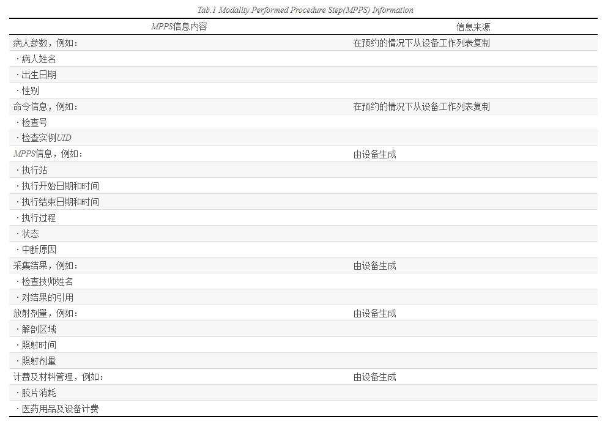
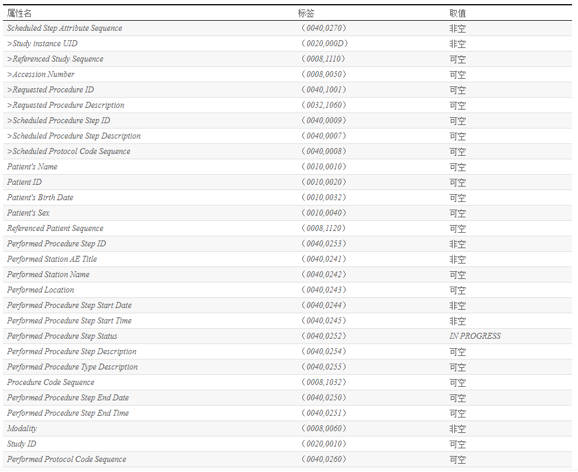
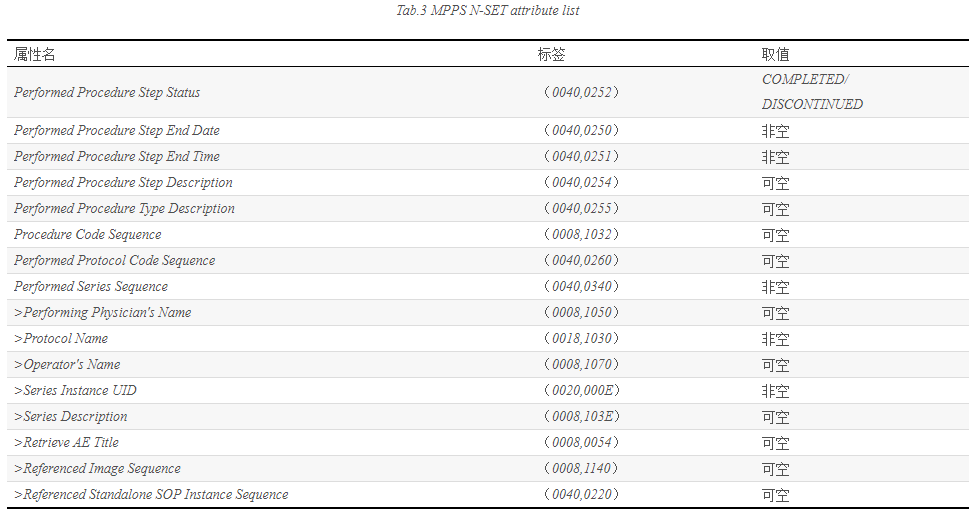

# DCMTK之MPPS服务实现
前 言

放射科信息管理系统（Radiology InformationSystem, RIS）与图像传输与归档系统[1]（Picture Archivingand Communication System, PACS）的设计中，检查流程管理是影响系统性能的重要因素，好的流程管理可有效提高临床工作效率。目前国内临床普遍采用的放射检查工作流程[2]如图1：① 检查申请：临床医生通过医院信息系统（Hospital InformationSystem, HIS）开出检查申请，患者凭检查申请单通过HIS系统交费;②检查登记：患者在放射科前台在RIS系统中登记，RIS从HIS系统获取患者的信息，生成唯一的检查号，保存到RIS、PACS数据库；③ 实施检查：患者到指定的检查室做检查，影像设备通过工作列表服务[3]（Worklist）从RIS获得患者检查信息，设定检查参数后开始检查；④ 图像归档：检查完毕后图像上传至PACS服务器;⑤报告书写: 医生诊断图像，书写报告并发放给患者。通常，信息系统（如RIS和PACS）需要对临床工作流程中的每一步医疗活动进行完整的跟踪与记录。但上述流程中，在实施检查阶段(图1中红色虚线框标注)，RIS和PACS无法获取检查设备的状态信息，如影像设备是否开始检查、完成检查时间和非正常停止检查原因等。这会带来两方面的问题，① 不利于对患者在就医过程中的各个过程进行流程控制，如患者从登记过后，到图像归档以前，RIS和PACS系统并不知道患者的就医状态，只能大致确定患者可能是在实施检查。如果图像数据迟迟不能归档，系统无法知道到底是因为尚未实施检查还是图像归档出现问题。②造成一些重要检查信息的缺失。病人做检查期间影像设备的检查状态、执行的检查方法、扫描过程中产生的图像信息、放射剂量和所需的计费材料等信息，逐渐成为临床关注的内容，但是当前多数RIS和PACS系统并没有方法从检查设备获取此部分信息。

为解决上述问题，医学数字成像和通信标准(Digital Imaging and Communicationin Medicine，DICOM)已制定了设备操作过程步骤（Modality PerformedProcedure Step, MPPS）服务标准,用于外部系统在检查期间获取检查设备状态信息[4]。目前多数检查设备中已提供MPPS服务，国外的PACS、RIS系统都已经普遍部署了MPPS服务。但国内MPPS服务还没有被充分应用到医院系统之中。

根据DICOM协议的MPPS服务标准，结合国内放射科检查工作的流程，本文深入分析了设备操作过程步骤与时序，对MPPS各阶段的状态和服务过程进行了具体的描述，并以开源软件包DCMTK[5]为基础，设计并实现了MPPS服务类使用者（Service Class User, SCU）和服务类提供者（Service Class Provider, SCP）。

1.设备操作过程步骤信息

MPPS服务SCU可以位于影像设备或任何客户端，一条MPPS信息的发起是由影像设备采集图像开始的，设备从开始采集数据到结束采集（包括非正常结束）期间，SCU都会和SCP进行通讯，来不断更新MPPS实例的信息。MPPS的SCU向SCP提供的信息非常丰富，表1列出一些比较重要的信息，可以分为六部分内容：病人信息、命令信息、MPPS信息、采集结果信息、放射剂量信息和计费及材料管理信息。其中病人信息一般是设备从工作列表中提取，但在创伤情况下（紧急抢救），病人没有经过预约，信息由技师手工输入；命令信息由程序自动生成；MPPS信息、采集结果、放射剂量和计费及材料管理信息由SCU根据设备当前的工作状态进行设定。

Tab.1 Modality Performed Procedure Step(MPPS) Information

 

 

但影像设备发送的采集信息也会出现和预约采集信息不一致的情况。例如，检查技师可能会根据具体的情况来选择图像采集方式，采集过程中一般会采集额外的定位图像，或由于突发情况影像设备可能会执行与预约不同的采集操作。因此，MPPS记录了影像设备端生成的准确采集数据，并构成设备反馈发送到放射工作流所涉及的其他系统，以更好地调度其它的放射科子进程。

2.设备操作过程步骤时序与状态

MPPS是由影像设备端发起的网络消息，MPPS消息会在影像设备采集期间自动生成并发送。影像设备发起的MPPS状态信息由DICOM协议中标签(0040,0252)指定，状态为“IN PROGRESS”时，表示MPPS实例已经创建并且设备开始执行任务。影像设备在采集过程中也会不断向SCP发送MPPS消息，请求更新MPPS实例的信息。影像设备采集结束状态分为两种，包括了影像设备的正常和非正常结束。正常结束指影像设备完成了所有的图像采集，此时影像设备会发送MPPS消息，请求SCP把MPPS实例状态设置为“COMPLETED”，表示对复合SOP实例的获取已经成功完成，并且SCU（影像设备）已经提供了所有必需的MPPS实例属性值。非正常结束指影像设备在采集图像期间出现问题而终止，影像设备同样会发送MPPS信息，请求SCP把MPPS实例状态设置为“DISCONTINUED”，表示取消或非成功终止。此时，影像设备应该把这个状态变化反馈给MPPSSCP，MPPSSCP将该信息反馈给PACS/RIS系统，从而允许信息系统去重新预约或取消相关的MPPS实例。MPPS服务通常不需要检查技师任何额外的操作，因为影像设备知道图像采集的开始和结束时间，从而自动触发MPPS消息。本文忽略了采集过程中发送的MPPS消息，在保持现有放射科工作流程不变的情况下，引入MPPS服务，图2是引入MPPS服务后放射科的工作流程。

MPPS服务端接收来自MPPS客户端（即影像设备端）的消息。MPPS服务端可以整合到RIS或PACS系统中，也可以单独出来。MPPS服务端的接收方可以是任何对获取影像设备反馈，跟踪采集状态和时间感兴趣的系统。在一个普通的放射科部门，除了RIS外，许多系统可能对跟踪采集过程感兴趣是为了管理不同的放射科子进程，例如图像后处理或图像辅助诊断；或是为了通知放射科外部其它的系统该检查的状态,这些系统包括PACS系统或报告管理系统。影像设备通常会发送一个MPPS消息到MPPS服务端，MPPS服务端将消息转发到一个或多个系统。为了不失一般性，本文假定该MPPS消息将到达放射工作流程中涉及的所有系统。

3.MPPS的设计与实现

3.1MPPS的服务过程

DICOM标准定义了三个SOP类来实现MPPS服务。它们分别是设备操作过程步骤SOP类(ModalityPerformedProcedureStepSOPClass)，设备操作过程步骤检索SOP类(ModalityPerformedProcedureStepRetrieveSOPClass)和设备操作过程步骤通知SOP类(ModalityPerformedProcedureStepNotificationSOPClass)[6]。其中设备操作过程步骤检索SOP类为其它客户端提供MPPS信息查询；设备操作过程步骤通知SOP类可以向注册的客户端发送更新消息；设备操作过程步骤SOP类是其它两个服务实现的基础，只有在实现了设备操作过程步骤SOP类的前提下，设备操作过程步骤检索SOP类和设备操作过程步骤通知SOP类才能对外提供查询和通知。本文主要讨论设备操作过程步骤SOP类，它有两个服务原语，分别是N-CREATE和N-SET。其服务过程[7]如下：

n 影像设备(SCU)选中一个检查任务开始图像采集时，通过发送N-CREATE服务请求原语通知信息系统(SCP)创建MPPS实例，MPPS服务进入开始执行状态。SCU可以在请求原语指定将要创建的MPPS实例的类UID和实例UID。如果SCU不提供实例UID,那么将由SCP负责生成实例UID。N-CREATE服务请求原语会将该MPPS实例的属性“PerformedProcedureStepStatus”(0040,0252)设置为“INPROGRESS”。

n SCP接收到SCU发送的服务请求后，首先解析属性“PerformedProcedureStepStatus”(0040,0252)的值。如果是“INPROGRESS”，则创建该MPPS实例并把MPPS实例的状态设置为“INPROGRESS”，通过N-CREATE响应原语把N-CREATE响应状态码返回给SCU。如果是其它值，SCP就会设置失败状态码“Invalidattributevalue”并返回N-CREATE响应原语。

n SCU收到SCP反馈的响应消息后，如果该MPPS实例创建成功，在影像设备采集图像结束后SCU会在N-SET请求原语里设置或更新对应的MPPS实例的属性值。SCU可以发送多个N-SET请求原语修改MPPS实例的属性值。一旦MPPS实例的属性“PerformedProcedureStepStatus”(0040,0252)设置为“COMPLETED”或“DISCONTINUED”，SCU就不能再修改该MPPS实例的属性值。

n SCP收到N-SET服务请求后根据SCU提供的属性值更新指定的MPPS实例，并把该MPPS实例的属性“PerformedProcedureStepStatus”(0040,0252)设置为“COMPLETED”或“DISCONTINUED”，返回N-SET响应消息。

关闭影像设备和信息系统之间的通信联接

3.2MPPS的实现

同DICOM标准中定义的其它服务一样，MPPS服务也分SCU和SCP两种角色。SCU和SCP的一次通讯一般包括建立连接，交换数据，断开连接三个步骤。现在大多数的影像设备制造商都已经在它们的设备上集成了MPPSSCU的功能,但是MPPS作为MWL的扩展,只有部分的PACS/RIS系统厂商的产品提供了MPPSSCP的功能。下文将结合放射科工作流程Worklist服务的实现[8]，利用DCMTK 3.6.0开源软件包自主设计实现符合国内医院放射科检查流程的MPPS服务。

3.2.1 MPPS实例的创建

当影像设备(SCU)要进行一次图像采集时,影像设备会向MPPS的服务端(SCP)发送N-CREATE服务原语请求创建一个MPPS实例。发送N-CREATE服务请求原语之前，SCU需要先构造一个N-CREATE-RQ消息。主要代码如下：
~~~ cpp
T_DIMSE_Message request;

Request.CommandField =DIMSE_N_CREATE_RQ;

//< assoc->nextMsgID >---建立连接后生成的消息ID

Request.msg.NCreateRQ.MessageID =assoc->nextMsgID++;

//< sopclassUID >---服务类UID常量

Strcpy(request.msg. NCreateRQ.AffectedSOPClassUID,sopclassUID);

if (sopinstanceUID.size() > 0)

{

// <sopinstanceUID>---SCU创建的MPPS实例UID

Strcpy(request.msg. NCreateRQ.AffectedSOPInstanceUID,sopinstanceUID, c_str());

request.msg. NCreateRQ.opts =O_NCREATE_AFFECTEDSOPINSTANCEUID;

}

else

{

request.msg. NCreateRQ. AffectedSOPInstanceUID[0]= 0;

request.msg. NCreateRQ.opts = 0;

}
~~~
当构造N-CREATE-RQ消息的时候，可以由SCU提供实例UID，也可以由SCP提供实例UID，本文是由SCU端生成UID。此外，还需要封装一个DcmDataset对象，以向SCP提供MPPS实例数据。需要注意的是,表2只包含了创建MPPS实例最基本的属性[5]（见表2）,更多情况下,一个特定的影像设备将提供更详细的信息,这些信息可以在设备的DICOM符合性声明中反映出来。

表2MPPS N-CREATE属性列表

Tab.2 MPPS N-CREATE attribute list

 

属性(0040,0252)的值只能是“INPROGRESS”，否则创建MPPS实例失败。当DcmDataset对象构造成功后，SCU就可以调用DCMTK提供的函数DIMSE_sendMessageUsingMemoryData把N-CREATE-RQ消息发送给SCP。

SCP接收到N-CREATE-RQ消息后，会构造一个N-CREATE-RSP消息。如果SCU不提供MPPS的实例UID，SCP就会生成一个唯一的实例UID。该实例UID将用于后续的N-SET,N-GET等服务。主要代码如下：
~~~ cpp
T_DIMSE_Message rsp;

rsp.CommandField= DIMSE_N_CREATE_RSP;

//<rq.msg.NCreateRQ.MessageID>---SCU生成的消息ID

rsp.msg.NCreateRSP.MessageIDBeingRespondedTo= rq.msg. NCreateRQ. MessageID;

rsp.msg.NCreateRSP.AffectedSOPClassUID[0]= 0;

rsp.msg.NCreateRSP.DimseStatus= STATUS_Success;

//判断SCU是否提供MPPS实例UID

if (rq.msg. NCreateRQ.opts& O_NCREATE_AFFECTEDSOPINSTANCEUID)

{    //如果提供就拷贝到rsp

      strcpy(rsp.msg. NCreateRSP.AffectedSOPInstanceUID,

rq.msg. NCreateRQ.AffectedSOPInstanceUID, sizeof(DIC_UI));

}

else

{    //否则，SCP自动生成该UID

      dcmGenerateUniqueIdentifier(rsp.msg.NCreateRSP.AffectedSOPInstanceUID);

}

rsp.msg. NCreateRSP.DataSetType= DIMSE_DATASET_NULL;

//拷贝SCU的MPPS SOP类UID

strncpy(rsp.msg.NCreateRSP.AffectedSOPClassUID,

      rq.msg. NCreateRQ. AffectedSOPClassUID, sizeof(DIC_UI));

rsp.msg.NCreateRSP.opts= O_NCREATE_AFFECTEDSOPINSTANCEUID;
~~~
接着调用DCMTK提供的函数DIMSE_receiveDataSetInMemory接收SCU端的实例数据以创建MPPS实例。MPPS实例以记录的形式保存到PACS/RIS数据库或以文件的形式保存到本地磁盘。本文为了方便测试MPPS服务，采取了以实例UID作为文件名保存MPPS实例到本地磁盘的策略。代码片段如下：
~~~ cpp
//将SCU的MPPS实例UID作为保存文件名称

strncpy(fileName,rsp.msg.NCreateRSP.AffectedSOPInstanceUID, sizeof(DIC_UI));

//<DcmFileFormat>---保存MPPS实例的数据

DcmFileFormat* dcmff = newDcmFileFormat(rqDataset);

cond = dcmff->saveFile(fileName);
~~~
MPPS实例创建成功后，SCP会调用函数DIMSE_sendMessageUsingMemoryData给SCU发送响应消息告诉SCU可以开始执行任务了。同样的，SCU会调用函数DIMSE_receiveCommand和函数DIMSE_receiveDataSetInMemory作出相应的反应。

3.2.2 MPPS实例的状态更新

MPPS消息虽然也可以在图像采集过程中发送，但是关注的不是中间过程的状态信息，所以忽略它们。一旦图像采集结束后影像设备会利用N-SET原语通知PACS/RIS系统，该N-SET原语必须包含指定的MPPS实例UID。同样的，在发送N-SET原语之前SCU需要构造一个N-SET-RQ消息，主要代码如下：
~~~ cpp
T_DIMSE_Message request;

request.CommandField =DIMSE_N_SET_RQ;

//<assoc->nextMsgID>---建立连接后生成的消息ID

request.msg.NSetRQ.MessageID =assoc->nextMsgID++;

//<sopclassUID>---拷贝SCU的MPPSSOP类UID

strcpy(request.msg. NSetRQ.RequestedSOPClassUID,sopclassUID);

//<sopinstanceUID>---SCU创建的MPPS实例UID       

strcpy(request.msg. NSetRQ.RequestedSOPInstanceUID,sopinstanceUID);
~~~
SCU还必须提供一个DcmDataset对象，该对象携带了N-SET请求原语希望更新的MPPS实例的属性信息(见表3)。

表3MPPS N-SET属性列表

Tab.3 MPPS N-SET attribute list

 

需要注意的是属性(0040,0252)的值是“COMPLETED”或“DISCONTINUED”。SCU调用DCMTK提供的函数DIMSE_sendMessageUsingMemoryData把N-SET-RQ消息发送给SCP。

SCP接收到N-SET-RQ消息后构造一个N-SET-RSP消息。主要代码如下：
~~~ cpp
T_DIMSE_Message rsp;

rsp.CommandField =DIMSE_N_SET_RSP;

//<rq.msg.NSetRQ.MessageID>---SCU生成的消息ID

rsp.msg. NSetRSP.MessageIDBeingRespondedTo= rq.msg.NSetRQ.MessageID;

rsp.msg. NSetRSP.AffectedSOPClassUID[0]= 0;

rsp.msg. NSetRSP.DimseStatus= STATUS_Success;

rsp.msg. NSetRSP.AffectedSOPInstanceUID[0]= 0;

rsp.msg. NSetRSP.DataSetType= DIMSE_DATASET_NULL;

rsp.msg. NSetRSP.opts =0;
~~~
N-SET-RSP消息构造完成后，SCP调用函数DIMSE_receiveDataSetInMemory接收SCU发送过来的MPPS实例的数据，从接收到的N-SET-RQ消息提取MPPS实例的UID，找到对应的文件把MPPS实例加载到内存，并用接收到的实例数据更新该MPPS实例的属性值。主要代码如下：
~~~ cpp
   DcmDataset *dset;

      DcmFileFormat *dcmff = new DcmFileFormat;

      //将之前保存的文件加载到内存，以更新其信息

      cond = dcmff->loadFile(fileName);

      dset = dcmff->getDataset();

      //<updateInstanceInfo-自定义>---函数用来更新DcmDataset中的信息

      updateInstanceInfo(dset, rqDataset);

      dcmff = new DcmFileFormat(dset);

      cond = dcmff->saveFile(fileName);
~~~
其中函数updateInstanceInfo是额外实现的方法，主要是为了更新MPPS实例。如果该MPPS实例包含SCU提供的属性标签则更新该属性的值，不包含的话则把该属性添加到MPPS实例里。处理完后把该MPPS实例保存到本地磁盘，其它感兴趣的SCU就可以查询该MPPS实例的信息。成功后SCP会返回一个响应以确认服务已经完成。

4.结果与讨论

根据上文实现的MPPS服务SCU和SCP，在两台电脑之间进行测试，一台用来模拟影像设备，一台用作MPPSSCP。首先设置SCP端的AE-Title，并在接收的客户端列表中添加模拟影像设备电脑的IP和AE-Title。启动SCP，开启MPPS服务；启动SCU，向SCP发送N-Create服务原语；SCP端将接收的信息以DICOM文件格式保存到本地。利用DCMTK 3.6.0开源软件包提供的dcm2xml实用工具把该DICOM文件转换成XML格式后显示的主要信息见图3。

从图3我们可以看到MPPSSCP响应N-Create原语后会解析影像设备发送过来的相关检查信息并记录下来，这些相关的检查信息包括设备类型，病人姓名，病人ID，检查ID，检查起始日期，检查起始时间以及当前影像设备的检查状态（检查状态为“INPROGRESS”）等。

由于我们进行的是模拟测试，不关注影像设备在图像采集过程中往外发送的检查信息，所以当MPPSSCP响应N-Create原语并解析接收到的信息后，SCU发送N-Set服务原语，SCP响应该服务请求，更新指定的MPPS实例信息并以DICOM文件格式保存到本地。使用dcm2xml实用工具把该DICOM文件转换成XML格式后得到的主要信息见图4。

从图4我们可以看到该MPPS实例信息基本保持不变，新增记录了检查结束日期和检查结束时间，并且检查状态变成了“COMPLETED”，表明检查已经正常结束。此时医生工作站就可以查询该MPPS实例获取本次图像采集数量，下载病人的检查图像进行阅片作出诊断，避免了图像数量不完整所造成的误判

5.结束语

本文在深入研究了 DICOM 3.0 标准 MPPS 服务的基础上，借助 DCMTK 开源工具包实现了 MPPS 服务，并取得了预期的效果。借助该服务， PACS / RIS 系统可以记录影像设备从开始执行到结束执行各个阶段的详细信息，有效地对影像资料进行质量控制，防止数据丢失。 DICOM MWL 服务仅仅实现了病人信息的自动化录入， DICOM MPPS 服务实现了 影像设备检查信息的管理，只有把两者紧密结合起来才能真正实现无缝的放射科工作流程[9]。目前国内针对 MPPS 的基础研究很少，相信随着医院数字化建设的不断深入，临床信息的不断丰富， MPPS 会愈加受到人们的关注。
————————————————
原文链接：https://blog.csdn.net/yunzhaoqiang/article/details/27337885