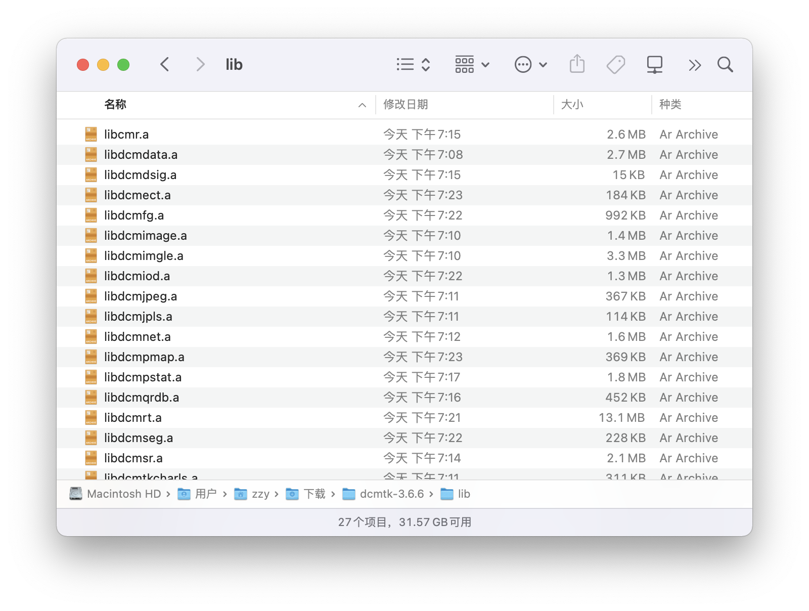
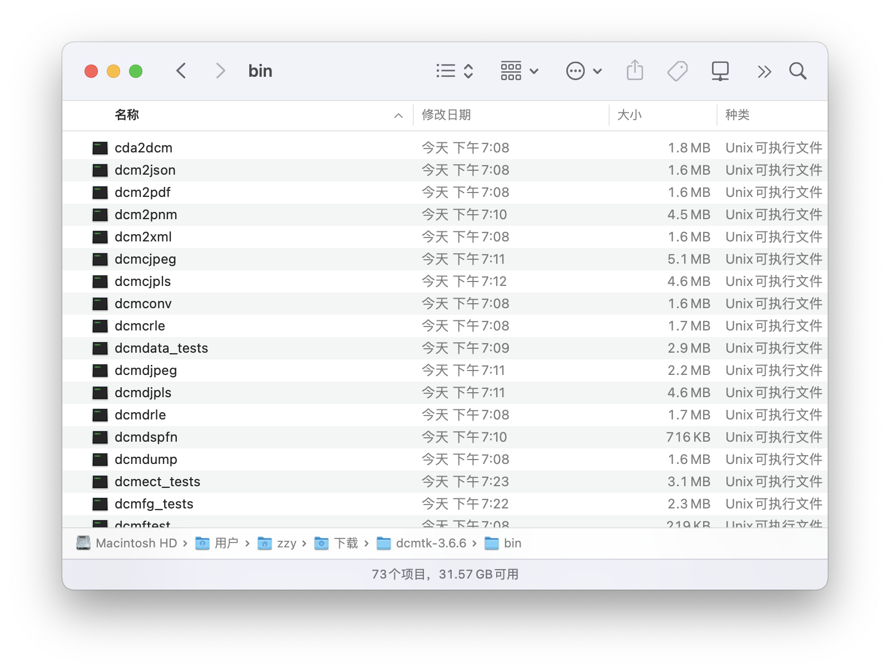
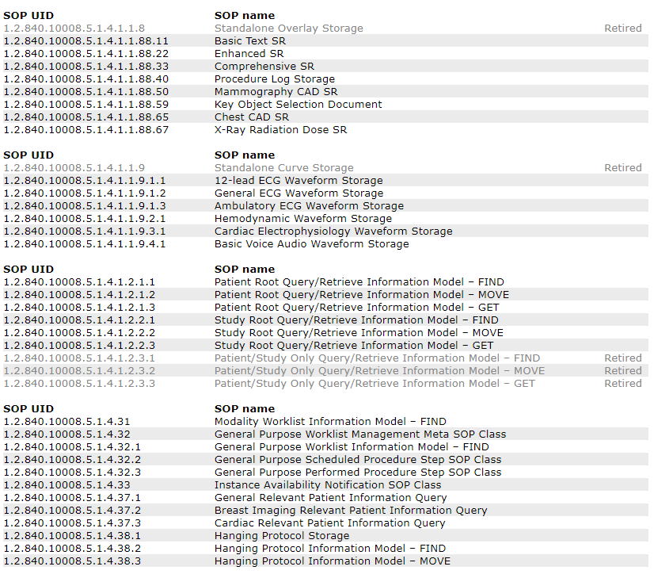
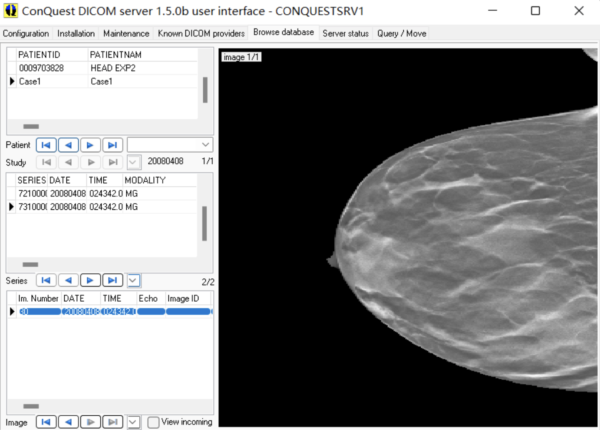
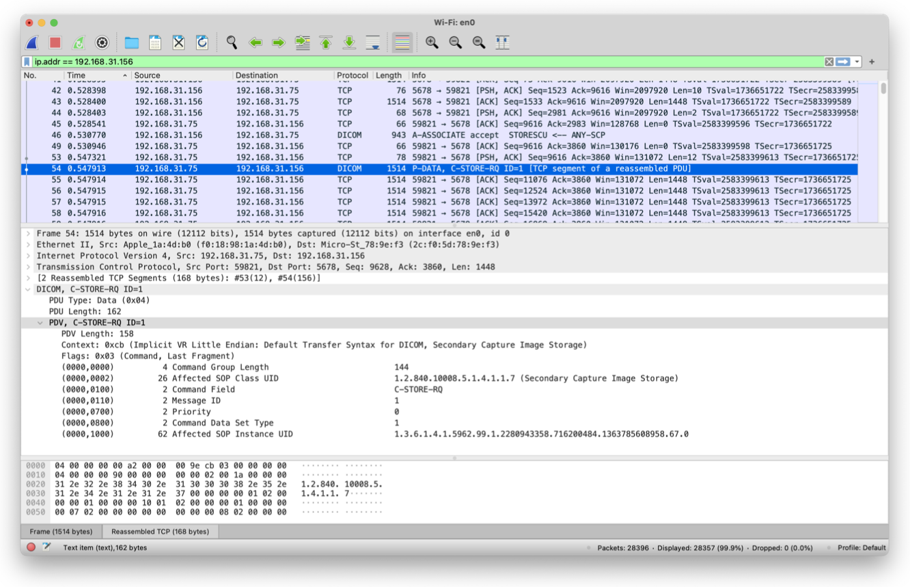
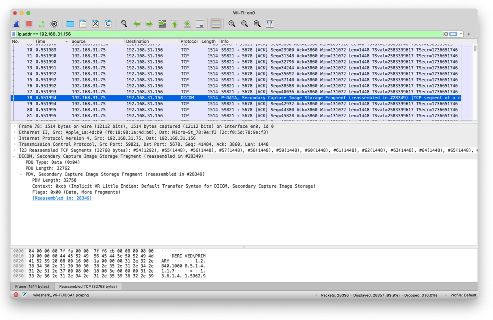
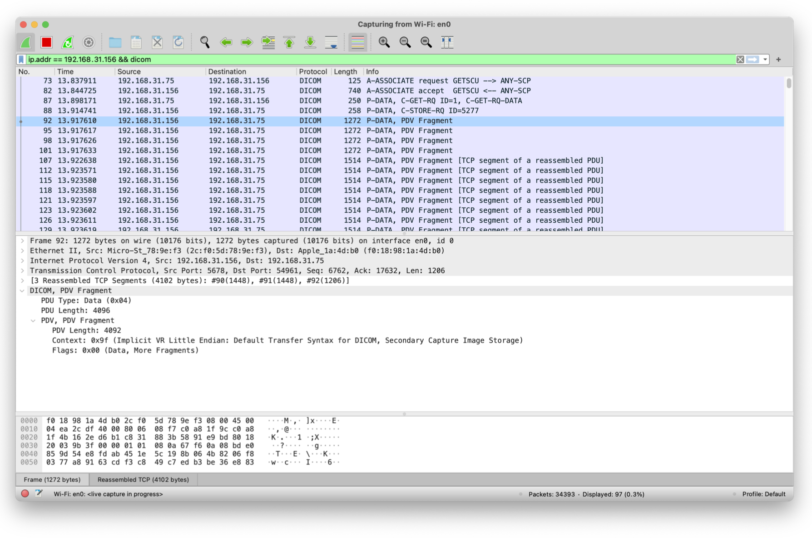

# DICOM网络传输协议解析
## 一、概览
### PACS简介

图像存档与通信系统（PACS）是一种医学成像技术，提供对多个模态图像的存储、访问、查找等功能。 PACS 图像存储和传输的通用格式是DICOM，而PACS本身就是DICOM标准的一部分。PACS系统由模态（Modality：成像设备）、服务器（Server）和查看器（View Station）组成，可以认为是客户/服务模型的一种实现。其中模态和查看器都属于用户（Service Class User, SCU），而服务器被称作Service Class Provider，简写为SCP。

在实现上，**模态**通常**是**计算机断层扫描 (CT)、超声、核医学、正电子发射断层扫描 (PET) 和磁共振成像 (MRI)等数字**成像设备**。模态可以先发送到质量保证 (QA) 工作站，如果信息正确，则图像将被传递到服务器中进行存储。这一步骤依赖DICOM标准中的C-STORE协议。View Station是放射科医生审查患者研究并制定诊断的地方，其基本功能是对服务器中的数据执行增删改查操作，在DICOM标准中由C-FIND、C-MOVE 和 C-GET等实现。在View Station中，也可以继承报告系统等外围设施，并与医院内的其他信息系统如电子病历系统EMR相整合，形成端到端的工作流。

#### DCMTK

这里我们采用了DCMTK工具包充当Modality和View Station。DCMTK是一套实现了DCM标准的开源程序包和库，使用C++开发，实现了跨平台。DCMTK中实现了大部分DICOM标准，包括图像的打开、转换和校验功能，以及在互联网上传输DICOM文件。

本次在macOS系统上构建DCMTK，在其它的类UNIX系统下构建步骤应该一样。DCMTK源码中已经写好了对应各种系统的`CMakelist`, 只需要执行`cmake`即可完成配置。然后在源文件路径下`make`即可构建整个项目，构建成功后会输出对应的静态库文件和二进制可执行文件：




image-20210930193320612



image-20210930193338568


输出有一组命令行工具和对应的静态链接库，满足了使用者通过系统命令调用和直接链接调用的需求，非常方便二次开发。同时，我们也可以直接使用生成的命令行工具执行各种DICOM操作，例如，我们可以用其中的`storescu`充当modality，向服务端发送DICOM文件。发送的格式为

| <br> | <br> |
| --- | --- |
| 1   | ```storescu [options] peer port dcmfile-in...``` |

#### CONQEST SERVER

CONQUEST是一个轻量级的DICOM SERVER，实现了DIMSE消息机制，以及对多种数据库的支持。

## 二、图像通信及其参数分析

### 概述

DICOM是一种建构在TCP/IP之上的高层协议。DICOM协议的底层是ULP（Upper Layer Protocol）（再之下是TCP协议，不属于DICOM协议的东西了）。它主要负责与TCP相对接，当 DICOM 应用实体通过 DIMSE 完成消息交换后，需要 DICOM 上层协议层 ULP 来提供传输支持。
（其他：与传统TCP连接建立相似，当DICOM上层实体欲建立一个链接时，会发出TRANSPORT CONNECT请求原语到TCP传输层。一旦接收到TCP传输层的连接确认语义，此时会在建立起的TCP连接上发送A-ASSOCIATE-RQ PDU。连接建立后，在TCP连接之上传输PDUs（PDU的结构详细介绍参照DICOM3.0标准第8部分第9.3节）遵循DICOM上层协议状态机 ，即DICOM Upper Layer State Machine ）
ULP 提供 5 种连接控制服务：A-ASSOCIATE、A-RELEASE、A-ABORT、P-DATA、A-P-ABORT。

*   A-ASSOCIATE： 用来在通信实体双方间协商并建立关联，交换一些初始化信息，因此它是一个证实性服务；
*   A-RELEASE： 用于在完成传输后释放关联，它是一个正常的中止方式，不会造成应用数据的丢失，也是一种证实性服务；
*   A-ABORT： 是当通信出现异常时用来终止关联，有可能造成一些暂存数据的丢失，它是一个非证实性服务；
*   P-DATA： 用来传输 DIMSE 命令流和数据流，通信实体中的一方一旦把 DIMSE 消息流传送出去就认定另一方能够准确无误地收到，因此它是一个非证实性服务；
*   A-P-ABORT： 也是用来终止关联，主要是用于当网络连接失败时，使得上层能够及时获得操作响应信息。

ULP 提供了 7 个协议数据单元（Protocol Data Unit， PDU）来实现上述的 5 种服务 。

*   A-ASSOCIATE-RQ： 建立ASSOCIATE请求
*   A-ASSOCIATE-AC： 接受ASSOCIATE建立
*   A-ASSOCIATE-RJ： 拒绝ASSOCIATE建立
*   P-DATA-TF： 进行数据传输
*   A-RELEASE-RQ： ASSOCIATE释放请求
*   A-RELEASE-RP： ASSOCIATE释放响应
*   A-ABORT： ASSOCIATE终止

从前文也可以推测出DICOM图像传输的过程：通过Association PDU建立连接，通过P-DATA-TF PDU进行实际传输，传输完成后通过Release PDU进行连接释放，或在传输途中使用A-ABORT中止连接。

通信的细节将在下面进行讲述。

### C-STORE

这里使用`-v -d`参数使DCMTK的命令行工具输出Debug模式下的详尽日志，同时也可以使用网络抓包工具进行辅助分析。


image-20210930194603984


日志中包括双方建立连接，传输，传输完成的详细过程，其中包括建立连接时的请求和响应信息`A-ASSOCIATE-RQ`、`A-ASSOCIATE-AC`、发送store请求的DIMSE信息和收到store响应的DIMSE信息。

#### 连接建立

在DICOM标准中，连接请求A-ASSOCIATE-RQ描述如下：

| **PDU bytes** | **Field name** | 描述 |
| :-: | :-: | :-: |
| 1 | PDU-type | 01H |
| 02 | Reserved | 保留字段，应为00H，但接收方不做校验。 |
| 3-6 | PDU-length | 报文的长度。应该被编码为二进制数字。 |
| 7-8 | Protocol-version | 用每一位代表一个DICOM UL协议。比如发送端支持协议版本1，就应该把第0位设置为1。 |
| 9-10 | Reserved | 保留字段，应为0000H，但接收方不做校验。 |
| 11-26 | Called-AE-title | 接收端DICOM应用名称。应该被编码为16个字符，空字符用20H补齐。 |
| 27-42 | Calling-AE-title | 发送端DICOM应用名称。应该被编码为16个字符，空字符用20H补齐。 |
| 43-74 | Reserved | 保留字段，应全为0，但接收方不做校验。 |
| 75-xxx | Variable items | 一个Application Context项目，多个Prensentation Context项目和用户信息。 |

比如在例子中的传输中，就有一个PDU Length为 3853 + 6 bytes的请求报文，其发送端应用名为`STORESCU`，接收端AE title为`ANY-SCP`, Application Context Name为`1.2.840.10008.3.1.1.1`（代表Dicom3.0，下图）。


在服务端收到请求后，服务器就会开始解析请求中携带的信息，主要是检查携带的Presentation Context，条件满足后就会做出响应，然后返回ASSOCIATE-AC报文，该报文结构定义如下：

| **PDU bytes** | **Field name** | **Description of field** |
| :-: | :-: | :-: |
| 1 | PDU-type | 02H |
| 2 | Reserved | 保留字段，应为00H，但接收方不做校验。 |
| 3-6 | PDU-length | 报文的长度。应该被编码为二进制数字。 |
| 7-8 | Protocol-version | 用每一位代表一个DICOM UL协议。比如发送端支持协议版本1，就应该把第0位设置为1。 |
| 9-10 | Reserved | 保留字段，应为0000H，但接收方不做校验。 |
| 11-26 | Reserved | 保留字段，应与 A-ASSOCIATE-RQ PDU一致, 但不做校验。 |
| 27-42 | Reserved | 保留字段，应与 A-ASSOCIATE-RQ PDU一致, 但不做校验。 |
| 43-74 | Reserved | 保留字段，应与 A-ASSOCIATE-RQ PDU一致, 但不做校验。 |
| 75-xxx | Variable items | 一个Application Context项目，多个Prensentation Context项目和用户信息。 |

#### Presentation Context
Presentation Context是DICOM协议中规定客户端支持传输形式的一种表示。它详细描述了该类型片段内容的结构和编码格式。它由3部分构成：一个Context ID, 一个Abstract Syntax和多个Transfer Syntax。

1.  **Context ID**是一个1 - 255之间的正奇数
2.  **Abstract Syntax**是数据代表的含义，通常用DICOM SOP Class UID表示，如下面两种ID；同时也可以用私有ID表示来实现自定义图像类型的传输。
    *   `1.2.840.10008.1.1` *Verification SOP Class*
    *   `1.2.840.10008.5.1.4.1.1` *CT Image Storage*
3.  **Transfer Syntax**是数据编码格式。通常用DICOM Transfer Syntax Class UID表示，如下面两种ID；同时也可以用私有ID表示来实现自定义图像类型的传输。
    *   `1.2.840.10008.1.2` *Implicit VR Little Endian*
    *   `1.2.840.10008.1.2.4.50` *JPEG Baseline*

dcmtk的日志可以帮助我们解析Presentation Context，如下所示：

| <br> | <br> |
| --- | --- |
| 1  2  3  4  5   | ```D:		 Context ID:        45 (Proposed)D:     Abstract Syntax: =DigitalIntraOralXRayImageStorageForPresentationD:     Proposed SCP/SCU Role: DefaultD:     Proposed Transfer Syntax(es):D:       =LittleEndianExplicit``` |

在Server中，打开Debug模式日志，也会在对ASSOCIATE-RQ中携带的Presentation Context进行列印：

| <br> | <br> |
| --- | --- |
| 1  2  3  4  5  6  7  8  9  10  11  12  13  14  15  16   | ```[CONQUESTSRV1] UPACS THREAD 45: STARTED AT: Wed Oct 13 18:25:41 2021[CONQUESTSRV1] A-ASSOCIATE-RQ Packet Dump[CONQUESTSRV1]  Calling Application Title : "STORESCU        "[CONQUESTSRV1]  Called Application Title : "ANY-SCP         "[CONQUESTSRV1]  Application Context : "1.2.840.10008.3.1.1.1", PDU length: 16384[CONQUESTSRV1]  Number of Proposed Presentation Contexts: 128[CONQUESTSRV1]  Presentation Context 0 "1.2.840.10008.5.1.4.1.1.9.1.3" 1[CONQUESTSRV1]  Presentation Context 1 "1.2.840.10008.5.1.4.1.1.9.1.3" 1...[CONQUESTSRV1]  Presentation Context 127 "1.2.840.10008.5.1.4.1.1.12.2" 1[CONQUESTSRV1] Server Command   := 0001[CONQUESTSRV1] Message ID       := 0001[CONQUESTSRV1] FreeStore Left 17269 on c:\[CONQUESTSRV1] Written file: c:\users\admi\desktop\dicomserver150b\data\MF-0000012\1.3.6.1.4.1.5962.1.3.5012.1.1166546115.14677_0001_000001_16341207560000.dcm[CONQUESTSRV1] UPACS THREAD 45: ENDED AT: Wed Oct 13 18:25:56 2021[CONQUESTSRV1] UPACS THREAD 45: TOTAL RUNNING TIME: 15 SECONDS``` |

#### DIMSE

DIMSE（DICOM Message Service Element）是在P-DATA PDU下传输的一种消息格式。DICOM3.0协议中共有11种DIMSE服务：

| **Name** | **Group** | **Type** |
| --- | --- | --- |
| C-STORE | DIMSE-C | operation |
| C-GET | DIMSE-C | operation |
| C-MOVE | DIMSE-C | operation |
| C-FIND | DIMSE-C | operation |
| C-ECHO | DIMSE-C | operation |
| N-EVENT-REPORT | DIMSE-N | notification |
| N-GET | DIMSE-N | operation |
| N-SET | DIMSE-N | operation |
| N-ACTION | DIMSE-N | operation |
| N-CREATE | DIMSE-N | operation |
| N-DELETE | DIMSE-N | operation |

这里还是以C-STORE为例进行分析。在收到服务端返回的ASSOCIATE-AC报文后，就正式发起store请求，进行传输。日志种会输出本次传输的DIMSE信息。

| <br> | <br> |
| --- | --- |
| 1  2  3  4  5  6  7  8  9  10  11  12  13  14  15  16  17  18  19   | ```D: ===================== OUTGOING DIMSE MESSAGE ====================D: Message Type                  : C-STORE RQD: Message ID                    : 1D: Affected SOP Class UID        : SecondaryCaptureImageStorageD: Affected SOP Instance UID     : 1.3.6.1.4.1.5962.99.1.2280943358.716200484.1363785608958.60.0D: Data Set                      : presentD: Priority                      : mediumD: ======================= END DIMSE MESSAGE =======================D: DcmDataset::read() TransferSyntax="Little Endian Implicit"I: Received Store ResponseD: ===================== INCOMING DIMSE MESSAGE ====================D: Message Type                  : C-STORE RSPD: Presentation Context ID       : 203D: Message ID Being Responded To : 1D: Affected SOP Class UID        : SecondaryCaptureImageStorageD: Affected SOP Instance UID     : 1.3.6.1.4.1.5962.99.1.2280943358.716200484.1363785608958.60.0D: Data Set                      : noneD: DIMSE Status                  : 0x0000: SuccessD: ======================= END DIMSE MESSAGE =======================``` |

在传输完成后，即可在服务端数据库看到这个图像，说明传输已经成功。



image-20211013183425277

#### 传输

DIMSE传输与DICOM图像传输都是用P-DATA-TF PDU，这里通过抓包软件对它们进行分析。

在A-ASSOCIATE AC消息之后，两者开始通过P-DATA-TF PDU进行传输。首先我们可以看到C-STORE RQ这一DIMSE消息的报文。其信息内容与之前日志输出的完全一致。



image-20211013183453881


然后我们可以看到DCM文件被实际传输。PDV长度为32768B（32KB），实际上由24个长度为1514字节的TCP帧构成。传输的内容是小端序，未压缩，无加密。



image-20211013183507932


### C-FIND

#### Information Model

在DICOM标准中，查询/取回的信息模型有以下三种：

*   Patient Root
*   Study Root
*   Patient/Study Only

例如，在患者根模型中，有四种层级的分类：

*   Patient：对应Patient Information Entity (IE)
*   Study：对应一个患者和Study IE
*   Series：Series依赖具体的modality，在一个study中。它对应着Series, Frame of Reference 和Equipment IE。
*   Composite Object Instance：对应Composite Object IE。

#### 查询

C-FIND查询使用Key- Value进行，查询在SCP中会被转换为对应的SQL语句，向数据库发起查询。

| **描述/模块** | **标签** | **匹配密钥类型** | **返回密钥类型** | **备注/匹配类型** |
| :-: | :-: | :-: | :-: | :-: |
| 病人姓名 | （0010,0010） | — | 1 |  |
| 患者ID | （0010,0020） | R | 1 | 请求标识符中应显示。应使用单值匹配检索。注意由于预计只有一个响应，这是一个唯一的密钥。 |
| 患者ID的发行人 | （0010,0021） | R | 2 | 应使用单值匹配检索。在有多个发行商的情况下，此密钥限制将患者ID（0010,0020）与患者ID（0010,0020）唯一域匹配。 |
| 患者的出生日期 | （0010,0030） | — | 2 |  |
| 患者的性别 | （0010,0040） | — | 2 |  |
| 患者识别模块的所有其他属性 |  | — | 3 |  |
| 患者人口统计模块的所有其他属性 |  | — | 3 |  |
| 观察日期时间 | （0040，A032） | — | 1 |  |
| 值类型 | （0040，A040） | — | 1 | 应与（0040，A043）的第一行相同 |
| 概念名称代码序列 | （0040，A043） | — | 1 | 请求中不应存在，响应中用应与标识符中内容模板序列（0040，A504）中标识的模板相同。 |
| \>代码值 | （0008,0100） | — | 1 |  |
| \>编码方案指示 | （0008,0102） | — | 1 |  |
| \>编码方案版本 | （0008,0103） | — | 1C | 如果编码方案指示（0008,0102）的值不足以明确识别代码值（0008,0100），则为必填项。 |
| \>代码含义 | （0008,0104） | — | 1 |  |
| \>概念名称代码序列的所有其他属性 |  |  |  |  |
| 内容序列 | （0040，A730） | — | 2 | 内容序列（0040，A730）是一个潜在的递归嵌套项目序列。内容序列应始终在请求标识符中发送零长度。响应数据集中的内容序列应包含所请求模板的内容项。 |
| \>内容序列的所有属性 |  | — | — | SCP提供的内容项目。对内容项属性类型的要求应符合SR文档内容模块中的定义。 |
| HL7结构化文档参考序列 | （0040，A390） | — | 1C |  |
| \>参考的SOP类UID | （0008,1150） | — | 1 |  |
| \>引用的SOP实例UID | （0008,1155） | — | 1 |  |
| \>HL7实例标识符 | （0040，E001） | — | 1 |  |
| \>检索URI | （0040，E010） | — | 3 |  |
| 包含其他参考实例序列的研究 | （0008,1200） | — | 1C | 如果内容序列（0040，A390）包含引用使用患者/研究/系列/实例信息模型的SOP实例的内容项，则为必填项。 |
| \>引用系列序列 | （0008,1115） | — | 1 |  |
| \>>系列实例UID | （0020,000E） | — | 1 |  |
| \>>引用实例序列 | （0008,114A） | — | 1 |  |
| \>>>参考SOP类UID | （0008,1150） | — | 1 |  |
| \>>>引用的SOP实例UID | （0008,1155） | — | 1 |  |

#### 日志分析

C-FIND也同样遵循上述的流程，即先通过Association PDU建立连接，通过P-DATA-TF PDU进行实际传输，传输完成后通过Release PDU进行连接释放。我们试验查询上一次写入的DCM文件：

| <br> | <br> |
| --- | --- |
| 1  2  3  4  5  6  7  8  9  10  11  12  13  14  15  16  17  18  19  20  21  22  23  24  25  26  27  28  29   | ```➜  ~ findscu -v -d -S -k "(0008, 0052)=STUDY" -k "(0010,0020)=Case1" 59.78.44.209 5678D: $dcmtk: findscu v3.6.6 2021-01-14 $D: D: DcmDataDictionary: Loading file: /usr/local/Cellar/dcmtk/3.6.6/share/dcmtk/dicom.dicD: Request Parameters:D: ====================== BEGIN A-ASSOCIATE-RQ =====================D: Our Implementation Class UID:      1.2.276.0.7230010.3.0.3.6.6D: Our Implementation Version Name:   OFFIS_DCMTK_366D: Their Implementation Class UID:    D: Their Implementation Version Name: D: Application Context Name:    1.2.840.10008.3.1.1.1D: Calling Application Name:    FINDSCUD: Called Application Name:     ANY-SCPD: Responding Application Name: ANY-SCPD: Our Max PDU Receive Size:    16384D: Their Max PDU Receive Size:  0D: Presentation Contexts:D:   Context ID:        1 (Proposed)D:     Abstract Syntax: =FINDStudyRootQueryRetrieveInformationModelD:     Proposed SCP/SCU Role: DefaultD:     Proposed Transfer Syntax(es):D:       =LittleEndianExplicitD:       =BigEndianExplicitD:       =LittleEndianImplicitD: Requested Extended Negotiation: noneD: Accepted Extended Negotiation:  noneD: Requested User Identity Negotiation: noneD: User Identity Negotiation Response:  noneD: ======================= END A-ASSOCIATE-RQ ======================``` |

在ASSOCIATE-RQ中，我们可以看到它携带了一个Presentation Context，表示这个是一个StudyRoot的Information Model。对方只要支持这一种Information Model即可完成连接。

在DICOM 3.0中，C-FIND-RQ协议规定如下：

| **Message Field** | **Description of Field** |
| :-: | :-: |
| Command Group Length | 最后一个数值组到下一组的间隔 |
| Affected SOP Class UID | 本次操作的SOP Class UID |
| Command Field | 0020H表示为C-FIND-RQ消息 |
| Message ID | 用来唯一表示本次操作并与其他正在进行的作业相区隔。 |
| Priority | LOW = 0002H；MEDIUM = 0000H；HIGH = 0001H |
| Command Data Set Type | 除0101H (Null)外均可. |
| Identifier | Service Class Specification数据集合，可以用来存储查询的Query。 |

| <br> | <br> |
| --- | --- |
| 1  2  3  4  5  6  7  8  9  10  11  12  13  14  15  16  17  18  19  20  21  22  23  24  25  26  27  28  29  30  31  32  33  34  35  36  37  38  39  40  41  42   | ```I: Requesting AssociationD: setting network send timeout to 60 secondsD: setting network receive timeout to 60 secondsD: Constructing Associate RQ PDUD: PDU Type: Associate Accept, PDU Length: 187 + 6 bytes PDU headerD:   02  00  00  00  00  bb  00  01  00  00  41  4e  59  2d  53  43D:   50  20  20  20  20  20  20  20  20  20  46  49  4e  44  53  43D:   55  20  20  20  20  20  20  20  20  20  00  00  00  00  00  00D:   00  00  00  00  00  00  00  00  00  00  00  00  00  00  00  00D:   00  00  00  00  00  00  00  00  00  00  10  00  00  15  31  2eD:   32  2e  38  34  30  2e  31  30  30  30  38  2e  33  2e  31  2eD:   31  2e  31  21  00  00  19  01  00  00  00  40  00  00  11  31D:   2e  32  2e  38  34  30  2e  31  30  30  30  38  2e  31  2e  32D:   50  00  00  3d  51  00  00  04  00  00  80  00  52  00  00  22D:   31  2e  32  2e  38  32  36  2e  30  2e  31  2e  33  36  38  30D:   30  34  33  2e  32  2e  31  33  35  2e  31  30  36  36  2e  31D:   30  31  55  00  00  0b  31  2e  35  2e  30  2f  57  49  4e  33D:   32D: Parsing an A-ASSOCIATE PDUD: Association Parameters Negotiated:D: ====================== BEGIN A-ASSOCIATE-AC =====================D: Our Implementation Class UID:      1.2.276.0.7230010.3.0.3.6.6D: Our Implementation Version Name:   OFFIS_DCMTK_366D: Their Implementation Class UID:    1.2.826.0.1.3680043.2.135.1066.101D: Their Implementation Version Name: 1.5.0/WIN32D: Application Context Name:    1.2.840.10008.3.1.1.1D: Calling Application Name:    FINDSCUD: Called Application Name:     ANY-SCPD: Responding Application Name: ANY-SCPD: Our Max PDU Receive Size:    16384D: Their Max PDU Receive Size:  32768D: Presentation Contexts:D:   Context ID:        1 (Accepted)D:     Abstract Syntax: =FINDStudyRootQueryRetrieveInformationModelD:     Proposed SCP/SCU Role: DefaultD:     Accepted SCP/SCU Role: DefaultD:     Accepted Transfer Syntax: =LittleEndianImplicitD: Requested Extended Negotiation: noneD: Accepted Extended Negotiation:  noneD: Requested User Identity Negotiation: noneD: User Identity Negotiation Response:  noneD: ======================= END A-ASSOCIATE-AC ======================``` |

对方发会响应，连接建立。

然后就是在P-DATA层发送DIMSE消息。可以看到DIMSE消息中主要含有这次的SOP，也就是StudyRoot查询的Information Model，同时也携带着两个Query。

| <br> | <br> |
| --- | --- |
| 1  2  3  4  5  6  7  8  9  10  11  12  13  14  15  16  17  18  19   | ```I: Association Accepted (Max Send PDV: 32756)I: Sending Find RequestD: ===================== OUTGOING DIMSE MESSAGE ====================D: Message Type                  : C-FIND RQD: Presentation Context ID       : 1D: Message ID                    : 1D: Affected SOP Class UID        : FINDStudyRootQueryRetrieveInformationModelD: Data Set                      : presentD: Priority                      : mediumD: ======================= END DIMSE MESSAGE =======================I: Request Identifiers:I: I: # Dicom-Data-SetI: # Used TransferSyntax: Little Endian ExplicitI: (0008,0052) CS [STUDY]                                  #   6, 1 QueryRetrieveLevelI: (0010,0020) LO [Case1]                                  #   6, 1 PatientIDI: D: DcmDataset::read() TransferSyntax="Little Endian Implicit"D: DcmDataset::read() TransferSyntax="Little Endian Implicit"``` |

在服务端，我们可以通过查看日志，确定查询的操作方式：

| <br> | <br> |
| --- | --- |
| 1  2  3  4  5  6  7  8  9  10  11  12  13  14  15  16  17  18  19   | ```[CONQUESTSRV1] UPACS THREAD 46: STARTED AT: Wed Oct 13 19:36:59 2021[CONQUESTSRV1] A-ASSOCIATE-RQ Packet Dump[CONQUESTSRV1]  Calling Application Title : "FINDSCU         "[CONQUESTSRV1]  Called Application Title : "ANY-SCP         "[CONQUESTSRV1]  Application Context : "1.2.840.10008.3.1.1.1", PDU length: 16384[CONQUESTSRV1]  Number of Proposed Presentation Contexts: 1[CONQUESTSRV1]  Presentation Context 0 "1.2.840.10008.5.1.4.1.2.2.1" 1[CONQUESTSRV1] Server Command   := 0020[CONQUESTSRV1] Message ID       := 0001[CONQUESTSRV1] (StudyRootQuery) search level: STUDY [CONQUESTSRV1] Query On Study[CONQUESTSRV1] Issue Query on Columns: DICOMStudies.PatientID[CONQUESTSRV1] Values: DICOMStudies.PatientID = 'Case1'[CONQUESTSRV1] Tables: DICOMStudies[CONQUESTSRV1] Sorting ((null)) DoSort := 0[CONQUESTSRV1] Records = 1[CONQUESTSRV1] C-Find (StudyRoot) located 1 records[CONQUESTSRV1] UPACS THREAD 46: ENDED AT: Wed Oct 13 19:36:59 2021[CONQUESTSRV1] UPACS THREAD 46: TOTAL RUNNING TIME: 0 SECONDS``` |

可以看到，服务端先是确定从Study为根结点开始查询，然后在刚才指定的PatientID列开始查询，找到了一条记录，然后发送响应，下面是SCU解析的响应内容：

| <br> | <br> |
| --- | --- |
| 1  2  3  4  5  6  7  8  9  10  11  12  13  14  15  16  17  18  19  20  21  22  23  24  25   | ```I: Received Find Response 1D: ===================== INCOMING DIMSE MESSAGE ====================D: Message Type                  : C-FIND RSPD: Message ID Being Responded To : 1D: Affected SOP Class UID        : FINDStudyRootQueryRetrieveInformationModelD: Data Set                      : presentD: DIMSE Status                  : 0xff00: Pending: Matches are continuingD: ======================= END DIMSE MESSAGE =======================D: Response Identifiers:D: D: # Dicom-Data-SetD: # Used TransferSyntax: Little Endian ImplicitD: (0008,0052) CS [STUDY ]                                 #   6, 1 QueryRetrieveLevelD: (0010,0020) LO [Case1 ]                                 #   6, 1 PatientIDD: D: DcmDataset::read() TransferSyntax="Little Endian Implicit"I: Received Final Find ResponseD: ===================== INCOMING DIMSE MESSAGE ====================D: Message Type                  : C-FIND RSPD: Message ID Being Responded To : 1D: Affected SOP Class UID        : FINDStudyRootQueryRetrieveInformationModelD: Data Set                      : noneD: DIMSE Status                  : 0x0000: Success: Matching is completeD: ======================= END DIMSE MESSAGE =======================I: Releasing Association``` |

### C-MOVE

C-MOVE可以理解为在C-FIND查询之后，由C-MOVE的SCP向SCU发起C-STORE请求，最终将图像传输到C-MOVE的SCU上。

从抓包软件分析可以看出，SCU先是向SCP传输C-MOVE DIMSE， 对方收到之后又会反过来发送连接请求，连接成功后就会发送C-STORE DIMSE，进行C-STORE传输。


image-20211013231631533

在C-STORE传输完成（PDU方发送C-STORE RSP）后，对方又会发来C-MOVE的响应，在所有子C-STORE操作完成后，会发送一个总的C-STORE响应，双方开始断开连接。


image-20211013231904790


#### 日志分析

首先是SCU向SCP请求建立连接：

| <br> | <br> |
| --- | --- |
| 1  2  3  4  5  6  7  8  9  10  11  12  13  14  15  16  17  18  19  20  21  22  23  24  25  26  27  28  29  30  31  32  33  34  35  36  37  38  39  40  41  42  43  44  45  46  47  48  49  50  51  52  53  54  55  56  57  58  59  60  61  62  63  64  65  66  67  68  69  70  71  72  73  74  75  76  77  78  79  80  81  82  83  84  85   | ```➜  ~ movescu -v -d -aem "DCMTK" --port 7777 -k 0008,0052=STUDY -k 0010,0020="Case1" 59.78.44.209 5678D: DcmDataDictionary: Loading file: /usr/local/Cellar/dcmtk/3.6.6/share/dcmtk/dicom.dicD: $dcmtk: movescu v3.6.6 2021-01-14 $D: D: Request Parameters:D: ====================== BEGIN A-ASSOCIATE-RQ =====================D: Our Implementation Class UID:      1.2.276.0.7230010.3.0.3.6.6D: Our Implementation Version Name:   OFFIS_DCMTK_366D: Their Implementation Class UID:    D: Their Implementation Version Name: D: Application Context Name:    1.2.840.10008.3.1.1.1D: Calling Application Name:    MOVESCUD: Called Application Name:     ANY-SCPD: Responding Application Name: ANY-SCPD: Our Max PDU Receive Size:    16384D: Their Max PDU Receive Size:  0D: Presentation Contexts:D:   Context ID:        1 (Proposed)D:     Abstract Syntax: =FINDPatientRootQueryRetrieveInformationModelD:     Proposed SCP/SCU Role: DefaultD:     Proposed Transfer Syntax(es):D:       =LittleEndianExplicitD:       =BigEndianExplicitD:       =LittleEndianImplicitD:   Context ID:        3 (Proposed)D:     Abstract Syntax: =MOVEPatientRootQueryRetrieveInformationModelD:     Proposed SCP/SCU Role: DefaultD:     Proposed Transfer Syntax(es):D:       =LittleEndianExplicitD:       =BigEndianExplicitD:       =LittleEndianImplicitD: Requested Extended Negotiation: noneD: Accepted Extended Negotiation:  noneD: Requested User Identity Negotiation: noneD: User Identity Negotiation Response:  noneD: ======================= END A-ASSOCIATE-RQ ======================I: Requesting AssociationD: setting network send timeout to 60 secondsD: setting network receive timeout to 60 secondsD: Constructing Associate RQ PDUD: PDU Type: Associate Accept, PDU Length: 216 + 6 bytes PDU headerD:   02  00  00  00  00  d8  00  01  00  00  41  4e  59  2d  53  43D:   50  20  20  20  20  20  20  20  20  20  4d  4f  56  45  53  43D:   55  20  20  20  20  20  20  20  20  20  00  00  00  00  00  00D:   00  00  00  00  00  00  00  00  00  00  00  00  00  00  00  00D:   00  00  00  00  00  00  00  00  00  00  10  00  00  15  31  2eD:   32  2e  38  34  30  2e  31  30  30  30  38  2e  33  2e  31  2eD:   31  2e  31  21  00  00  19  01  00  00  00  40  00  00  11  31D:   2e  32  2e  38  34  30  2e  31  30  30  30  38  2e  31  2e  32D:   21  00  00  19  03  00  00  00  40  00  00  11  31  2e  32  2eD:   38  34  30  2e  31  30  30  30  38  2e  31  2e  32  50  00  00D:   3d  51  00  00  04  00  00  80  00  52  00  00  22  31  2e  32D:   2e  38  32  36  2e  30  2e  31  2e  33  36  38  30  30  34  33D:   2e  32  2e  31  33  35  2e  31  30  36  36  2e  31  30  31  55D:   00  00  0b  31  2e  35  2e  30  2f  57  49  4e  33  32D: Parsing an A-ASSOCIATE PDUD: Association Parameters Negotiated:D: ====================== BEGIN A-ASSOCIATE-AC =====================D: Our Implementation Class UID:      1.2.276.0.7230010.3.0.3.6.6D: Our Implementation Version Name:   OFFIS_DCMTK_366D: Their Implementation Class UID:    1.2.826.0.1.3680043.2.135.1066.101D: Their Implementation Version Name: 1.5.0/WIN32D: Application Context Name:    1.2.840.10008.3.1.1.1D: Calling Application Name:    MOVESCUD: Called Application Name:     ANY-SCPD: Responding Application Name: ANY-SCPD: Our Max PDU Receive Size:    16384D: Their Max PDU Receive Size:  32768D: Presentation Contexts:D:   Context ID:        1 (Accepted)D:     Abstract Syntax: =FINDPatientRootQueryRetrieveInformationModelD:     Proposed SCP/SCU Role: DefaultD:     Accepted SCP/SCU Role: DefaultD:     Accepted Transfer Syntax: =LittleEndianImplicitD:   Context ID:        3 (Accepted)D:     Abstract Syntax: =MOVEPatientRootQueryRetrieveInformationModelD:     Proposed SCP/SCU Role: DefaultD:     Accepted SCP/SCU Role: DefaultD:     Accepted Transfer Syntax: =LittleEndianImplicitD: Requested Extended Negotiation: noneD: Accepted Extended Negotiation:  noneD: Requested User Identity Negotiation: noneD: User Identity Negotiation Response:  noneD: ======================= END A-ASSOCIATE-AC ======================I: Association Accepted (Max Send PDV: 32756)``` |

之后是利用P-DATA PDU发送C-MOVE请求。可以看到C-MOVE消息格式与C-FIND相似。

| <br> | <br> |
| --- | --- |
| 1  2  3  4  5  6  7  8  9  10  11  12  13  14  15  16   | ```I: Sending Move RequestD: ===================== OUTGOING DIMSE MESSAGE ====================D: Message Type                  : C-MOVE RQD: Presentation Context ID       : 3D: Message ID                    : 1D: Affected SOP Class UID        : MOVEPatientRootQueryRetrieveInformationModelD: Data Set                      : presentD: Priority                      : mediumD: Move Destination              : DCMTKD: ======================= END DIMSE MESSAGE =======================I: Request Identifiers:I: I: # Dicom-Data-SetI: # Used TransferSyntax: Little Endian ExplicitI: (0008,0052) CS [STUDY]                                  #   6, 1 QueryRetrieveLevelI: (0010,0020) LO [Case1]                                  #   6, 1 PatientID``` |

在SCP端经过处理C-MOVE请求，向SCU发起连接请求，这个请求中包含一个`SecondaryCaptureImageStorage` Presentation Context，这与之前讲到的C-MOVE连接请求也一致。可以看到对方发来的被叫应用名称就是之前在`-aem`参数中指定的名称。

| <br> | <br> |
| --- | --- |
| 1  2  3  4  5  6  7  8  9  10  11  12  13  14  15  16  17  18  19  20  21  22  23  24  25  26  27  28  29  30  31  32  33  34  35  36  37  38  39  40  41  42  43  44  45  46  47  48  49  50  51  52  53  54  55  56  57  58  59  60  61  62  63  64  65  66  67  68  69   | ```I: D: Association Received: 59D: setting network send timeout to 60 secondsD: setting network receive timeout to 60 secondsD: PDU Type: Associate Request, PDU Length: 216 + 6 bytes PDU headerD:   01  00  00  00  00  d8  00  01  00  00  44  43  4d  54  4b  20D:   20  20  20  20  20  20  20  20  20  20  43  4f  4e  51  55  45D:   53  54  53  52  56  31  20  20  20  20  00  00  00  00  00  00D:   00  00  00  00  00  00  00  00  00  00  00  00  00  00  00  00D:   00  00  00  00  00  00  00  00  00  00  10  00  00  15  31  2eD:   32  2e  38  34  30  2e  31  30  30  30  38  2e  33  2e  31  2eD:   31  2e  31  20  00  00  36  77  00  00  00  30  00  00  19  31D:   2e  32  2e  38  34  30  2e  31  30  30  30  38  2e  35  2e  31D:   2e  34  2e  31  2e  31  2e  37  40  00  00  11  31  2e  32  2eD:   38  34  30  2e  31  30  30  30  38  2e  31  2e  32  50  00  00D:   3d  51  00  00  04  00  00  80  00  52  00  00  22  31  2e  32D:   2e  38  32  36  2e  30  2e  31  2e  33  36  38  30  30  34  33D:   2e  32  2e  31  33  35  2e  31  30  36  36  2e  31  30  31  55D:   00  00  0b  31  2e  35  2e  30  2f  57  49  4e  33  32D: Parsing an A-ASSOCIATE PDUI: Sub-Association ReceivedD: Parameters:D: ====================== BEGIN A-ASSOCIATE-RQ =====================D: Our Implementation Class UID:      1.2.276.0.7230010.3.0.3.6.6D: Our Implementation Version Name:   OFFIS_DCMTK_366D: Their Implementation Class UID:    1.2.826.0.1.3680043.2.135.1066.101D: Their Implementation Version Name: 1.5.0/WIN32D: Application Context Name:    1.2.840.10008.3.1.1.1D: Calling Application Name:    CONQUESTSRV1D: Called Application Name:     DCMTKD: Responding Application Name: D: Our Max PDU Receive Size:    16384D: Their Max PDU Receive Size:  32768D: Presentation Contexts:D:   Context ID:        119 (Proposed)D:     Abstract Syntax: =SecondaryCaptureImageStorageD:     Proposed SCP/SCU Role: DefaultD:     Proposed Transfer Syntax(es):D:       =LittleEndianImplicitD: Requested Extended Negotiation: noneD: Accepted Extended Negotiation:  noneD: Requested User Identity Negotiation: noneD: User Identity Negotiation Response:  noneD: ======================= END A-ASSOCIATE-RQ ======================D: Constructing Associate AC PDUI: Sub-Association Acknowledged (Max Send PDV: 32756)D: ====================== BEGIN A-ASSOCIATE-AC =====================D: Our Implementation Class UID:      1.2.276.0.7230010.3.0.3.6.6D: Our Implementation Version Name:   OFFIS_DCMTK_366D: Their Implementation Class UID:    1.2.826.0.1.3680043.2.135.1066.101D: Their Implementation Version Name: 1.5.0/WIN32D: Application Context Name:    1.2.840.10008.3.1.1.1D: Calling Application Name:    CONQUESTSRV1D: Called Application Name:     DCMTKD: Responding Application Name: D: Our Max PDU Receive Size:    16384D: Their Max PDU Receive Size:  32768D: Presentation Contexts:D:   Context ID:        119 (Accepted)D:     Abstract Syntax: =SecondaryCaptureImageStorageD:     Proposed SCP/SCU Role: DefaultD:     Accepted SCP/SCU Role: DefaultD:     Accepted Transfer Syntax: =LittleEndianImplicitD: Requested Extended Negotiation: noneD: Accepted Extended Negotiation:  noneD: Requested User Identity Negotiation: noneD: User Identity Negotiation Response:  noneD: ======================= END A-ASSOCIATE-AC ======================D: DcmDataset::read() TransferSyntax="Little Endian Implicit"``` |

建立反向连接后，就可以接受对方的C-STORE请求，开始传输。

| <br> | <br> |
| --- | --- |
| 1  2  3  4  5  6  7  8  9  10  11  12  13  14  15  16  17  18  19  20  21  22   | ```I: Received Store RequestD: ===================== INCOMING DIMSE MESSAGE ====================D: Message Type                  : C-STORE RQD: Presentation Context ID       : 119D: Message ID                    : 3203D: Affected SOP Class UID        : SecondaryCaptureImageStorageD: Affected SOP Instance UID     : 1.3.6.1.4.1.5962.99.1.2280943358.716200484.1363785608958.60.0D: Data Set                      : presentD: Priority                      : mediumD: Move Originator AE Title      : MOVESCUD: Move Originator ID            : 1D: ======================= END DIMSE MESSAGE =======================D: DcmDataset::read() TransferSyntax="Little Endian Implicit"D: DcmItem::checkAndUpdateVR() setting undefined VR of PixelPaddingValue (0028,0120) to 'US' because PixelRepresentation (0028,0103) has a value that is different from 1D: DcmItem::checkAndUpdateVR() setting undefined VR of PixelPaddingRangeLimit (0028,0121) to 'US' because PixelRepresentation (0028,0103) has a value that is different from 1W: DICOM file already exists, overwriting: SC.1.3.6.1.4.1.5962.99.1.2280943358.716200484.1363785608958.60.0D: DcmFileFormat::checkMetaHeaderValue() Version of MetaHeader is ok: 0x0001D: DcmFileFormat::checkMetaHeaderValue() use SOPClassUID [1.2.840.10008.5.1.4.1.1.7] from DatasetD: DcmFileFormat::checkMetaHeaderValue() use SOPInstanceUID [1.3.6.1.4.1.5962.99.1.2280943358.716200484.1363785608958.60.0] from DatasetD: DcmFileFormat::checkMetaHeaderValue() use new TransferSyntaxUID [Little Endian Implicit] on writing following DatasetD: DcmFileFormat::validateMetaInfo() found 7 Elements in DcmMetaInfo 'metinf'D: DcmDataset::read() TransferSyntax="Little Endian Implicit"``` |

在一个C-STORE传输完成后，就会收到一个C-MOVE响应，但由于还有其他传输在进行，所以`DIMSE Status`为Pending。然后就是下一个C-STORE请求和对应的传输过程与响应。

| <br> | <br> |
| --- | --- |
| 1  2  3  4  5  6  7  8  9  10  11  12  13  14  15  16  17  18  19  20  21  22  23  24  25  26  27  28  29  30  31  32  33  34  35  36  37  38  39  40  41  42  43  44  45  46  47  48   | ```I: Received Move Response 1D: ===================== INCOMING DIMSE MESSAGE ====================D: Message Type                  : C-MOVE RSPD: Message ID Being Responded To : 1D: Affected SOP Class UID        : MOVEPatientRootQueryRetrieveInformationModelD: Remaining Suboperations       : 1D: Completed Suboperations       : 1D: Failed Suboperations          : 0D: Warning Suboperations         : 0D: Data Set                      : noneD: DIMSE Status                  : 0xff00: Pending: Sub-operations are continuingD: ======================= END DIMSE MESSAGE =======================D: DcmDataset::read() TransferSyntax="Little Endian Implicit"I: Received Store RequestD: ===================== INCOMING DIMSE MESSAGE ====================D: Message Type                  : C-STORE RQD: Presentation Context ID       : 119D: Message ID                    : 3225D: Affected SOP Class UID        : SecondaryCaptureImageStorageD: Affected SOP Instance UID     : 1.3.6.1.4.1.5962.99.1.2280943358.716200484.1363785608958.67.0D: Data Set                      : presentD: Priority                      : mediumD: Move Originator AE Title      : MOVESCUD: Move Originator ID            : 1D: ======================= END DIMSE MESSAGE =======================D: DcmDataset::read() TransferSyntax="Little Endian Implicit"D: DcmItem::checkAndUpdateVR() setting undefined VR of PixelPaddingValue (0028,0120) to 'US' because PixelRepresentation (0028,0103) has a value that is different from 1D: DcmItem::checkAndUpdateVR() setting undefined VR of PixelPaddingRangeLimit (0028,0121) to 'US' because PixelRepresentation (0028,0103) has a value that is different from 1W: DICOM file already exists, overwriting: SC.1.3.6.1.4.1.5962.99.1.2280943358.716200484.1363785608958.67.0D: DcmFileFormat::checkMetaHeaderValue() Version of MetaHeader is ok: 0x0001D: DcmFileFormat::checkMetaHeaderValue() use SOPClassUID [1.2.840.10008.5.1.4.1.1.7] from DatasetD: DcmFileFormat::checkMetaHeaderValue() use SOPInstanceUID [1.3.6.1.4.1.5962.99.1.2280943358.716200484.1363785608958.67.0] from DatasetD: DcmFileFormat::checkMetaHeaderValue() use new TransferSyntaxUID [Little Endian Implicit] on writing following DatasetD: DcmFileFormat::validateMetaInfo() found 7 Elements in DcmMetaInfo 'metinf'D: DcmDataset::read() TransferSyntax="Little Endian Implicit"I: Received Move Response 2D: ===================== INCOMING DIMSE MESSAGE ====================D: Message Type                  : C-MOVE RSPD: Message ID Being Responded To : 1D: Affected SOP Class UID        : MOVEPatientRootQueryRetrieveInformationModelD: Remaining Suboperations       : 0D: Completed Suboperations       : 2D: Failed Suboperations          : 0D: Warning Suboperations         : 0D: Data Set                      : noneD: DIMSE Status                  : 0xff00: Pending: Sub-operations are continuingD: ======================= END DIMSE MESSAGE =======================D: DcmDataset::read() TransferSyntax="Little Endian Implicit"``` |

在所有C-STORE请求完成后，服务端会发来一个表示成功的C-STORE响应：

| <br> | <br> |
| --- | --- |
| 1  2  3  4  5  6  7  8  9  10  11  12  13   | ```I: Received Final Move ResponseD: ===================== INCOMING DIMSE MESSAGE ====================D: Message Type                  : C-MOVE RSPD: Message ID Being Responded To : 1D: Affected SOP Class UID        : MOVEPatientRootQueryRetrieveInformationModelD: Remaining Suboperations       : 0D: Completed Suboperations       : 2D: Failed Suboperations          : 0D: Warning Suboperations         : 0D: Data Set                      : noneD: DIMSE Status                  : 0x0000: Success: Sub-operations complete - No failures or warningsD: ======================= END DIMSE MESSAGE =======================I: Releasing Association``` |

至此C-MOVE传输完成。

图像文件传输为PDV=4096Bytes的TCP传输：



image-20211013195720471


下载到本地的文件可以打开进行查看和处理，比如使用DCMTK中的工具包或者其他第三方软件

| <br> | <br> |
| --- | --- |
| 1  2  3  4  5   | ```➜  ~ getscu -k 08,52=STUDY -k StudyInstanceUID=1.3.6.1.4.1.5962.99.1.2280943358.716200484.1363785608958.61.0  192.168.31.156 5678  ➜  ~ ls -lttotal 148576-rw-r--r--    1 zzy   staff  31354908 10  8 22:46 SC.1.3.6.1.4.1.5962.99.1.2280943358.716200484.1363785608958.67.0-rw-r--r--    1 zzy   staff   4367746 10  8 22:45 SC.1.3.6.1.4.1.5962.99.1.2280943358.716200484.1363785608958.60.0``` |

### C-GET

| <br> | <br> |
| --- | --- |
| 1  2  3  4  5  6  7  8  9  10  11  12  13  14  15  16  17   | ```➜  ~ sudo getscu -v -k 08,52=STUDY -k StudyInstanceUID=1.3.6.1.4.1.5962.99.1.2280943358.716200484.1363785608958.61.0  192.168.31.156 5678  I: Requesting AssociationI: Association Accepted (Max Send PDV: 32756)I: Sending C-GET Request (MsgID 1)I: Received C-STORE Request (MsgID 4261)I: Sending C-STORE Response (Success)I: Received C-GET Response (Pending)I: Received C-STORE Request (MsgID 4281)I: Sending C-STORE Response (Success)I: Received C-GET Response (Pending)I: Received C-GET Response (Success)I: Final status report from last C-GET message:I:   Number of Remaining Suboperations : 0I:   Number of Completed Suboperations : 2I:   Number of Failed Suboperations    : 0I:   Number of Warning Suboperations   : 0I: Releasing Association``` |

C-GET的过程相比C-MOVE要更简单，它在建立连接时会像C-STORE一样将所有的Presentation Context发送。


image-20211013234755122


下面是C-GET的消息内容，与C-FIND结构相似：


image-20211013195701896


在发送完C-GET消息后，对方会发来C-STORE消息，开始传输。

### 三．结果与讨论

在本项目中，我主要是以DICOM标准为依据，通过选用实现了DICOM标准的开源DCMTK工具包作为Modality和View Station，CONQUEST作为Server，完成了满足DICOM标准11种协议的mini-PACS系统。在过程中，通过对DICOM标准的阅读和抓包软件的分析，了解了DICOM图像传输协议的结构，了解了其TCP -> ULP -> PDU -> DATA的设计。基于以上理解可以非常清晰地理解传输的详细过程，即通过Associate PDU和Release PDU控制连接，通过P-DATA传输数据，数据中包含依照DICOM3.0的格式严格定义的消息，这样在实现了相关接口的客户端和服务器之间就能实现DICOM规定的传输功能。

### 引用

1.  pydicom文档：[https://pydicom.github.io/pynetdicom/stable/user/presentation.html](https://pydicom.github.io/pynetdicom/stable/user/presentation.html)
2.  DICOM标准3.0：[http://dicom.nema.org/medical/dicom/current/output/chtml/](http://dicom.nema.org/medical/dicom/current/output/chtml/)
3.  DICOM通信流程：[https://www.jianshu.com/p/6f178fc98a04](https://www.jianshu.com/p/6f178fc98a04)
4.  DCMTK文档：[https://support.dcmtk.org/docs](https://support.dcmtk.org/docs)