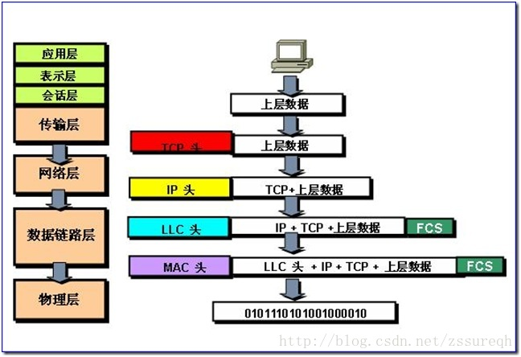

原文名称：[DICOM医学图像处理：DICOM网络传输](http://blog.csdn.net/zssureqh/article/details/41016091)

# 背景：

&nbsp;&nbsp;&nbsp;&nbsp;&nbsp;&nbsp;&nbsp;&nbsp;专栏取名为DICOM医学图像处理原因是：博主是从医学图像处理算法研究时开始接触DICOM协议的。当初认识有局限性，认为DICOM只是一个简单的文件格式约定，简而言之，我当时认为DICOM协议就是扩展名为DCM文件的格式说明。其实不然，随着对医疗行业的深入，对DICOM协议也有了更全面的认识。而今才发现DCM文件只是DICOM协议一部分中的一小节，仅仅是整个协议中的一个数据结构，而DICOM协议更多的是关于医疗行业各种服务及相关流程的约定，因此其实DICOM协议中最主要的是信息流，是对医院整体运作流程的约定。依我看来，可以将DICOM分为两大类（这里只是从DICOM相关从业者日常工作角度出发来分类的）：1）DICOM医学图像处理，即DCM文件中具体数据的处理，说图像可能有些狭隘，广义上还包括波形（心电）、视频（超声）等等；2）DICOM网络传输，主要描述信息在医院各系统之间的交互方式及传输格式。像我之前的研究就完全属于第一类“DICOM医学图像处理”，一旦解析出DICOM的文件格式其实与常规的图像处理就没有差别。如果仅此而已，可以说跟医疗就没有任何关系，与医疗行业结合紧密的是第二类“DICOM网络传输”，该部分是日常患者到医院就诊等整体流程的抽象，是DICOM标准的核心。因此此次博文就重点介绍“DICOM网络传输”中的第一环节：网络连接（Association，在OSI中叫做Connection），并结合DCMTK和fo-dicom的源码进行实例介绍。

# DICOM网络传输：

## 服务端（Server，SCP）/客户端（Client，SCU）：

&nbsp;&nbsp;&nbsp;&nbsp;&nbsp;&nbsp;&nbsp;&nbsp;DICOM采用C/S模式来描述网络传输：客户端（Client）连接到服务端（Server）然后使用服务端提供的各项服务（Services）。不同于传统网络连接中的Server和Client的，DICOM中的Server叫做Service Class Provider，Client叫做Service Class User。想要建立DICOM连接（Association，传统OSI模型中叫做Connection），客户端会向服务端发送连接请求消息，该消息主要描述客户端此次连接所期望的DICOM服务及相关设置；随后服务端会查看客户端发送过来的请求信息，确认自己是否支持客户端请求的相关服务并给出反馈信息（DICOM中叫做响应信息Response Message）。响应信息主要分为以下几类：1）如果服务端支持客户端请求的某些服务，服务端会发送确认信息（Association Acknowledge），表明此次连接完成；2）否则发送拒绝信息（Association Reject），通知客户端（SCU）连接失败。所有与连接相关的信息在DICOM协议中的ACSE（Association Control Service Element）定义。

&nbsp;&nbsp;&nbsp;&nbsp;&nbsp;&nbsp;&nbsp;&nbsp;一旦网络连接建立，客户端（SCU）和服务端（SCP）就可以进行信息交互。DICOM标准中的DIMSE（DICOM Message Service Element）将该类信息分为11类（详情可参见DICOM协议中的相关细节，也可参见我之前的博文[http://blog.csdn.net/zssureqh/article/details/39098621](http://blog.csdn.net/zssureqh/article/details/39098621 "http://blog.csdn.net/zssureqh/article/details/39098621")）。根据与连接信息（ACSE）的不同，提供的DIMSE信息类型也不同。例如传统一幅DICOM图像到服务端进行归档，使用的是C-STORE DIMSE消息；如果希望通过病人姓名和病人出生日期来查询病人的档案，需要使用DIMSE C-FIND消息。

## 请求连接：

&nbsp;&nbsp;&nbsp;&nbsp;&nbsp;&nbsp;&nbsp;&nbsp;如上所述，客户端SCU向服务端SCP发送连接请求，请求服务及相关信息。除此以外，请求消息中还包括以下信息：

*   请求端实体名称（Calling AE Title）：在DICOM服务中，用于指代客户端（SCU）的符号，如同我们的姓名一样；
*   被请求实体名称（Called AE Title）：在DICOM服务中，用于指代服务端（SCP）的符号，如同我们的姓名一样；
*   描述上下文（Presentation Contexts）：是一个服务清单（List of Services）。清单容量最多不超过128个，用于描述客户端希望从服务端获得的各项服务，每一项服务主要包括SOP Class和List of Transfer Syntaxes。

下面对上述三中信息进行更详细介绍：

&nbsp;&nbsp;&nbsp;&nbsp;&nbsp;&nbsp;&nbsp;&nbsp;AE Title：在DICOM网络中每一个DICOM系统都会被分配一个名称，即Application Entity Title，简称AETitle。AE Title用于标识DICOM网络中的唯一（Unique）DICOM系统（有点类似于互联网中的IP地址），因此在一个DICOM网络环境中，要确保每一个DICOM系统拥有唯一的名称——这个工作通常由DICOM网络管理员来完成。AE Title最长不超过16个字符，通常在实际应用过程中都采用大写字母来表示，当然也可以使用小写字母及其他ASCII码。在建立连接过程中，客户端SCU会发送自己的AE Title（即Calling AE Title）以及服务端的AE Title（即Called AE Title，当然这个只是客户端期望的，实际情况有可能并非如此）。

&nbsp;&nbsp;&nbsp;&nbsp;&nbsp;&nbsp;&nbsp;&nbsp;Presentation Contexts：DICOM协议已经有20多年的历史，从1993年DICOM标准提出以来，新的网络连接不断地被添加到DICOM协议中。例如1996年引入的MWL服务，即Modality Worklist Services（关于WML的描述可参见之前的博文）。因此大多数DICOM系统只支持DICOM标准中的部分服务，例如PACS系统往往就不会提供WML服务。不同的DICOM服务用于不同的目的，客户端（SCU）会向服务端（SCP）发送其希望从服务端获得的服务，而服务端会查看其提供的各项服务是否是客户端期望的来决定是否提供。鉴于以上原因，客户端（SCU）会向服务端发送一系列长度小于128的被称为描述上下文（Presentation Contexts）的消息列表，每一个描述上下文代表一种客户端期望的服务。客户端用DICOM标识符来标识每种服务，即SOP Class UID（Service Object Pair Class Unique Identifier），在DICOM标准的第4部分有详细介绍。在连接上下文中，被发送的SOP Class 也被叫做抽象语义Abstract Syntax（一定要与Transfer Syntaxes中的Syntaxes区分开来，之前在博文[http://blog.csdn.net/zssureqh/article/details/39213817#t12](http://blog.csdn.net/zssureqh/article/details/39213817#t12 "http://blog.csdn.net/zssureqh/article/details/39213817#t12")的知识储备中有过简单的对比介绍。在OFFIS的WIKI中对此的描述原文为In the context of association negotiation, the field where the SOP class is sent is also called "Abstract Syntax".），因此Abstract Syntax就是SOP Class UID的同义词。在传输SOP Class UID（即Abstract Syntax）的同时，会发送与该服务对应的编码格式，即Transfer Syntaxes。以乳腺检查的X光片为例，通常乳腺X光片很大，需要进行压缩。客户端在向服务端发送上下文信息时会提供给服务端一种乳腺X光片的压缩方式，例如JPEG2000，同时也会提供一种被大多数图像传输服务端接受的非压缩方式。如下图所示：

 

&nbsp;&nbsp;&nbsp;&nbsp;&nbsp;&nbsp;&nbsp;&nbsp;该客户端SCU向服务端发送了三种上下文信息（最多不超过128个），每一种上下文信息（Presentation Context）包含一种客户端期望的服务以及相关的多种传输方式，例如Presentation Context ID 1中描述了一种数字乳腺X光片存储服务，同时提供了两种编码方式Implicit VR Little Endian和JPEG 2000（无损压缩）。在客户端用奇数来标示每种上下文信息（最小编号为1，最大为255），通常从1号开始单调递增，1、3、5、……。至于上下文信息之间的顺序以及其内部编码格式的顺序可自由设定。通过上图可以看出，每种服务都必须提供Implicit VR Little Endian编码格式，因为这是DICOM协议中默认的传输编码方式。

## 接受（拒绝）连接：

        服务端SCP会至少接受一种上下文信息（Presentation Context）以及其他SCU请求的参数（例如AE Titles）。随后服务端向客户端发送连接响应消息接受该链接请求。链接消息响应有三种状态：

*   接受
*   拒绝（短暂的）
*   拒绝（永久的）

        连接响应消息会直接拷贝连接请求消息中的服务端AE Title（即Called AE Title）和客户端AE Title（即Calling AE Title）并返回。此外还会返回响应AE Title（即Respponding AE Title），该AE Title与服务端AE Title相同（这是OSI协议中要求的，但是与DICOM协议不同的是，OSI协议中并未要求两者相同）。

        当消息响应结果为接受时（即Accepted），服务端SCP会对客户端SCU请求的各个上下文信息（Presentation Context）进行确认，是接受还是拒绝，如下图所示，DICOM标准第7部分的附录D中给出了一个示意图，作为服务触发端的DICOM-Service-User，给出了5种描述上下文，ID为1、3、5、7、9；然而在SCP端只支持其中的三种（ID为1、3、9），并且对于每一种AbstractSyntax服务端只支持其中的一种TransferSyntax。  

 

        如上图所示，如果SCU请求的Presentation Context被拒绝，SCP不会进一步发送任何信息；如果接受了某个Presentation Context，SCP会选择其中的一个传输语义添加到返回信息对应的Presentation Context中以通知SCU。如果没有Presentation Context被接受，那么会发送拒绝消息，此时结果代码为Rejected。当连接建立完成后，开始准备传输数据体。  

        如果结果状态码为”Rejected（permanent）“表明服务端SCP通知客户端SCU它的请求被拒绝了，后续也会被拒绝。出现这种情况的原因通常由两种，一种是请求的AE Title并不存在，也就是说网络中并不存在该实体；另一种是服务端SCP不支持客户端SCU请求的任何服务（即SOP Class）。在拒绝情况下，SCP可有选择的返回Diagnostic状态码以通知客户端被拒绝的原因；最差的情况下，服务端SCP只返回”Calling AE Title not recognized“。在拒绝状态下，DICOM连接就终止了，SCP和SCU无法传输数据；与此同时底层的TCP连接也会关闭直到客户端SCU再一次发送连接请求。

## 释放（终止）连接：

&nbsp;&nbsp;&nbsp;&nbsp;&nbsp;&nbsp;&nbsp;&nbsp;在连接建立之后，连接双方开始进行数据交换。如果任何一方想终止连接（服务端SCP也可以），有两种方式：

*   发送连接释放消息；
*   发送连接终止消息；

&nbsp;&nbsp;&nbsp;&nbsp;&nbsp;&nbsp;&nbsp;&nbsp;第一种情形，接收到连接释放消息的一方会向释放方发送一条确认消息。随后TCP连接关闭，DICOM连接终止，这是DICOM网络连接中正常的关闭方式；第二种情况，客户端发送完放弃消息后，不等到服务端的确认就主动关闭TCP连接。这种关闭是不正常的，通常是客户单遇到意外情况后发生的，这是DICOM中唯一一种不需要服务端发送响应信息的请求信息。当然还有第三种中断方式，就是直接关闭TCP连接，这种情况往往是由于硬件错误所导致的。

## 数据交换（Date Exchange）DIMSE：

&nbsp;&nbsp;&nbsp;&nbsp;&nbsp;&nbsp;&nbsp;&nbsp;利用ACSE消息成功建立连接后，即客户端发送的请求至少有一种上下文描述的服务被服务端接受，真正的数据开始交换，例如一张或多张CT图像、worklist查询、打印请求等。如上所述，DICOM协议规定了11种DIMSE消息，每种都可以作为客户端的请求或者服务端的响应。11种DIMSE消息如下：C-CTORE、C-GET、C-MOVE、C-FIND、C-ECHO、N-EVENT-REPORT、N-GET、N-SET、N-ACTON、N-CREATE、N-DELETE。所有的消息都可以被不同的服务使用，根据Presentation Context的描述，你只需要其中的一种或多种。

### PDU-Protocol Data Units：

&nbsp;&nbsp;&nbsp;&nbsp;&nbsp;&nbsp;&nbsp;&nbsp;在DICOM系统连接中，每种DIMSE消息在传输过程中会被分割成多个片段，叫做Protocol Data Unit，简称PDU。PDU的大小也是连接建立过程中协商的。每一个PDU片段中会包含一个与Presentation Context ID相关的数字。我们可以将每一个Presentation Context看做双方交流的逻辑通道，通过在PDU中包含Presentation Context ID，接收端才知道PDU属于哪一个通道，才能将多个PDU片段进行重组。

### DIMSE Message Data：

&nbsp;&nbsp;&nbsp;&nbsp;&nbsp;&nbsp;&nbsp;&nbsp;每种DIMSE消息所传输的内容各有不同，请求消息（request）中主要包括：

*   Message ID：在连接中每个消息的唯一标示
*   Affected SOP Class UID：DIMSE消息中指定的SOP Class，即Presentation Context中指定的Abstract Syntax。
*   Affected SOP Instance UID：真正传输的实体数据标识符，例如上面例子中提到的乳腺X光片数据
*   Priority：消息的优先级，分为HIGH 、NORMAL、LOW三种，但是大多数接收端都忽略。
*   Data Set：传输的数据。

&nbsp;&nbsp;&nbsp;&nbsp;&nbsp;&nbsp;&nbsp;&nbsp;响应消息（response）内容与上述类似。首先包括一个状态信息，例如0代表成功；另外与Message ID对应的是Message ID Being Responsed To，通过拷贝并返回请求端的Message ID，使得接收端知道响应消息的目标。

# 开源库中相应的实现：

## DCMTK：

&nbsp;&nbsp;&nbsp;&nbsp;&nbsp;&nbsp;&nbsp;&nbsp;DCMTK开源库更偏重于按照层（Layer）来实现DICOM应用实体（AE）之间的连接（ACSE）及消息传输（DIMSE），主要分为DIMSE（应用层）、ACSE（属于OSI七层协议中的应用层）和DUL（Dicom Upper Layer层，该层与OSI中的TCP/IP层对接）三大部分。用户通过使用DCMTK提供的DICOM协议中规定的各层的数据结构和操作函数，按照DICOM标准中规定的流程来实现自己的DICOM服务。

&nbsp;&nbsp;&nbsp;&nbsp;&nbsp;&nbsp;&nbsp;&nbsp;在**dimse.h/dimse.cc**中给出了DICOM协议中规定的各种服务对应的结构体，以T\_DIMSE\_为前缀，例如T\_DIMSE\_C\_StoreRQ/T\_DIMSE\_C\_StoreRSP、T\_DIMSE\_FindRQ/T\_DIMSE\_FindRSP、T\_DIMSE\_CEchoRQ/T\_DIMSE\_CEchoRSP等；另外给出了各种服务对应的操作函数的声明，以DIMSE\_为前缀，例如DIMSE\_echoUser/DIMSE\_sendEchoResponse、DIMSE\_storeUser/DIMSE\_storeProvider/DIMSE\_sendStoreResponse等等，具体相应的函数定义被分别放在了独立的文件中，主要有dimecho.cc、dimfind.cc、dimget.cc、dimmove.cc、dimstore.cc。

&nbsp;&nbsp;&nbsp;&nbsp;&nbsp;&nbsp;&nbsp;&nbsp;在**assoc.h/assoc.cc**中给出了ACSE应用层的对应结构的封装，以T\_ASC\_为前缀，例如T\_ASC\_Parameters、T\_ASC\_Association、T\_ASC\_PresentationContext等等；另外给出了相应的连接建立或中断的操作函数，以ASC\_为前缀，例如ASC\_initializeNetwork、ASC\_dropNetwork、ASC\_requestAssociation、ASC\_receiveAssociation、ASC\_acknowledgeAssociation、ASC\_rejectAssociation、ASC\_releaseAssociation等等。

&nbsp;&nbsp;&nbsp;&nbsp;&nbsp;&nbsp;&nbsp;&nbsp;在**dul.h/dul.cc**中给出了Dicom Upper Layer层的相关数据结构，以DUL\_为前缀，例如DUL\_ASSOCIATESERVICEPARAMETERS、DUL\_PRESENTATIONCONTEXT、DUL\_TRANSFERSYNTAX、DUL\_PDV、DUL\_PDVLIST；另外给出了DUL层的操作函数，同样以DUL\_为前缀，例如DUL\_InitializeNetwork、DUL\_RequestAssociation、DUL\_ReleaseAssociation、DUL\_ReadPDVs、DUL\_WritePDVs、DUL\_NextPDV等等。

## fo-dicom：

&nbsp;&nbsp;&nbsp;&nbsp;&nbsp;&nbsp;&nbsp;&nbsp;fo-dicom开源库更偏重于按照DICOM消息流来封装，在实现了整体DIMSE消息流框架的基础上，给用户预留了各阶段的接口，方便用户继续自定义实现。

&nbsp;&nbsp;&nbsp;&nbsp;&nbsp;&nbsp;&nbsp;&nbsp;在**PDU.cs**中给出了ACSE应用层对应的服务对象，主要有RawPDU、PDU、A-Associate-RQ、A-Associate-AC、A-Associate-RJ、A-Release-RQ、A-Release-RP、A-Abort、PDataTF。

&nbsp;&nbsp;&nbsp;&nbsp;&nbsp;&nbsp;&nbsp;&nbsp;以**DicomMessage**为基类派生出的一系列子类，例如DicomRequest/DicomResponse、DicomCEchoRequest/DicomCEchoResponse、DicomCStoreRequest/DicomCStoreResponse等等；该部分对DICOM协议中规定的各种消息进行了响应的封装。

&nbsp;&nbsp;&nbsp;&nbsp;&nbsp;&nbsp;&nbsp;&nbsp;在**DicomService**类中给出了整个DICOM协议中规定的SCP/SCU之间交互的流程，但是对于不同的ACSE应用层的连接操作和DIMSE层的消息操作都留出了相应的接口，通过调用后续的回调函数来实现用户自己的意图。

&nbsp;&nbsp;&nbsp;&nbsp;&nbsp;&nbsp;&nbsp;&nbsp;以**IDicomServiceUser/IDicomServiceProvider、IDicomCStoreProvider、IDicomCEchoProvider**等为基础的一系列接口类，该部分给出了DicomService中一系列操作的回调函数接口，具体的实现由用户自己完成。

&nbsp;&nbsp;&nbsp;&nbsp;&nbsp;&nbsp;&nbsp;&nbsp;以**DicomClient/DicomServer**为基础的实体类，该类是用户自己搭建SCP和SCU两端的必须类，可以说DicomClient和DicomServer就是一对简易实现的DICOM服务的SCU和SCP。例如fo-dicom自带的实例中var server = new DicomServer<DicomCEchoProvider>(12345);就开启了一个端口号为12345的接收C-ECHO服务的SCP服务端；var client = new DicomClient();client.NegotiateAsyncOps();client.AddRequest(new DicomCEchoRequest());就实现了一个简易的发起C-ECHO请求的SCU客户端。

# DICOM3.0标准分析：

## PDU vs PDV：

&nbsp;&nbsp;&nbsp;&nbsp;&nbsp;&nbsp;&nbsp;&nbsp;DCMTK3.0标准中对于PDU（Protocol Data Unit）的解释和定义与上面博文中介绍的一致，但是对于PDV在标准中有两种解释分别是Protocol Data Value和Presentation Data Value，我更偏向于后者。上面博文中介绍的PDU指的是在DICOM连接建立之上传递的消息片段，英文原文是“If such a message is transferred on a DICOM connection, they are cut into pieces, so called Protocol Data Unit (PDUs).”——这里需要注意的是message，并不仅仅指我们所说的DICOM Message（参见图1），还包括了ACSE协议中使用的连接消息，例如A-ASSOCIATION-RQ、A-ASSOCIATION-RSP、A-ABORT，该类消息在DICOM3.0协议的第8部分有详细的介绍（参见图2）。

&nbsp;&nbsp;&nbsp;&nbsp;&nbsp;&nbsp;&nbsp;&nbsp;在图2中P-DATA-TF PDU结构中的Variable Field可变区域才是PDV，即Presentation Data Value。这里PDV指的是DICOM Message在具体传输过程中被分割的多个片段（该部分在DICOM3.0标准第8部分的附录E中有详细介绍，参见图3，其实就是上文中提到的DIMSE Message Data）。在fo-dicom中的PDU.cs文件中可验证，其中PDU的子类P-DATA-TF的成员中包含一个PDV的链表，即List<PDV>。

&nbsp;&nbsp;&nbsp;&nbsp;&nbsp;&nbsp;&nbsp;&nbsp;一句话总结：PDU指的是DICOM协议中的传输的各种消息（包括ACSE和DIMSE）的片段，PDV专指DICOM Message被分割后的片段，属于P-DATA-TF类PDU中的Variable Field部分。

 

 
 
   

## ACSE vs DIMSE：

&nbsp;&nbsp;&nbsp;&nbsp;&nbsp;&nbsp;&nbsp;&nbsp;ACSE是在DICOM3.0中的第8部分介绍，该部分的标题为Network Communication Support for Message Exchange，因此可以断定ACSE主要应用户连接建立阶段。 连接（Association）的建立是两个DICOM实体（AE）之间进行交互的第一步，AEs在建立的连接上进行数据编码格式、传输方式的协商。DICOM AEs利用ACSE-ASSOCIATE服务来建立连接，在ACSE-ASSOCIATE服务中主要用到的是Application Context、Presentation Context和User Information Items（在DICOM3.0标准第7部分的附录3中有详细的介绍）。ACSE服务主要有A-ASSOCIATE、A-RELEASE、A-ABORT、A-P-ABORT、P-DATA五类，对应的PDU有A-ASSOCIATE-RQ、A-ASSOCIATE-AC、A-ASSOCIATE-RJ、P-DATA-TF、A-RELEASE-RQ、A-RELEASE-RP、A-ABORT七种。

&nbsp;&nbsp;&nbsp;&nbsp;&nbsp;&nbsp;&nbsp;&nbsp;DIMSE是在DICOM3.0中的第7部分介绍，该部分的标题为Message Exchange，由此说明DIMSE是对DICOM传输消息的规定。DIMSE服务类型有C-STORE、C-GET、C-MOVE、C-FIND、C-ECHO、N-EVENT-REPORT、N-GET、N-SET、N-ACTION、N-CREATE、N-DELETE，如下图。

 

&nbsp;&nbsp;&nbsp;&nbsp;&nbsp;&nbsp;&nbsp;&nbsp;有上述对比可以看出ACSE是DIMSE的基础，DIMSE是在ACSE之上实现的。正如PDU vs PDV中提到的，DIMSE Message是在Association建立完成后，通过ACSE中的P-DATA-TF服务来传输，各种DIMSE 消息会被分割成PDVs放入到P-DATA-TF的Variable Field。如下图所示：

 

&nbsp;&nbsp;&nbsp;&nbsp;&nbsp;&nbsp;&nbsp;&nbsp;最后通过查看fo-dicom中的DicomService.cs中EndPDU和ProcessPDataTF函数可以有一个更形象的理解，在EndPDU函数内部通过读取PDU的前6个字节来识别PDU属于ACSE中的哪一种服务，例如A-ASSOCIATE-RQ、A-ASSOCIATE-AC、A-ASSOCIATE-RJ、P-DATA-TF、A-RELEASE-RQ、A-RELEASE-RP、A-ABORT；当PDU属于P-DATA-TF类型时，进入到ProcessPDataTF函数内部。通过提取P-DATA-TF PDU中的Variable Field中的PDVs来判别是哪一种DIMSE消息，主要有C-STORE-RQ/C-STORE-RSP、C-FIND-RQ/C-FIND-RSP、C-ECHO-RQ/C-ECHO-RSP、C-MOVE-RQ/C-MOVE-RSP等等。

# 参考资料：

[http://support.dcmtk.org/redmine/projects/dcmtk/wiki/DICOM\_NetworkingIntroduction#Protocol-Data-Units](http://support.dcmtk.org/redmine/projects/dcmtk/wiki/DICOM_NetworkingIntroduction#Protocol-Data-Units "http://support.dcmtk.org/redmine/projects/dcmtk/wiki/DICOM_NetworkingIntroduction#Protocol-Data-Units")，本文英文原文

[http://medical.nema.org/medical/dicom/current/output/html/part07.html](http://medical.nema.org/medical/dicom/current/output/html/part07.html "http://medical.nema.org/medical/dicom/current/output/html/part07.html")，DICOM3.0标准第7部分

[http://medical.nema.org/medical/dicom/current/output/html/part08.html](http://medical.nema.org/medical/dicom/current/output/html/part08.html "http://medical.nema.org/medical/dicom/current/output/html/part08.html")，DICOM3.0标准第8部分

[https://github.com/redmoxie/fo-dicom](https://github.com/redmoxie/fo-dicom "https://github.com/redmoxie/fo-dicom")，fo-dicom源码

[http://support.dcmtk.org/redmine/projects/dcmtk/files](http://support.dcmtk.org/redmine/projects/dcmtk/files "http://support.dcmtk.org/redmine/projects/dcmtk/files")，DCMTK源码

# 后续专栏博文介绍：

> **利用PHP Skel结合DCMTK开发WEB PACS应用**
> 
> **利用oracle直接操作DICOM数据**
> 
> **C#的异步编程模式在fo-dicom中的应用**
> 
> **VMWare三种网络连接模式的实际测试**