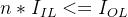
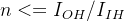

# TTL电路的拉电流、灌电流、扇出数及扇出数计算
电流、灌电流、扇入数、扇出数、扇出数在数字电路中是非常常见的名词，下面我们先给出这些概念的定义，然后从原理出发，介绍这些名词的关系及扇出数的计算方法。

灌电流：灌电流是数字电路输出端口为低电平时外部负载输入的电流，表征输入电流的能力；

拉电流：拉电流是数字电路输出端口为高电平时给外部负载提供的电流，表征输出电流的能力；

扇入数：是指门电路所能接受的输入负载的数量；

扇出数：是指门电路可以驱动的负载门的数量。

图1所示为两级TTL电路示意图，前一级为驱动门，后一级为负载门，驱动门的输出管脚接到负载门的输入管脚上。

图1  两级TTL电路示意图

当驱动门输出高电平时，电流从驱动门流向负载门，如图2中红线所示。**我们可以通俗的理解成“负载门从驱动门拉出电流”，所以称为拉电流（拉电流、灌电流都是从负载门的角度来说的）。**

图2  拉电流电流方向示意图

&nbsp;当驱动门输出低电平时，电流方向与拉电流相反，从负载门流向驱动门，如图3中红线所示。**我们可以通俗的理解成“负载门向驱动门灌进电流”，所以称为灌电流。**

图3  灌电流电流方向示意图 

对于TTL电路而言，输入输出必须满足TTL逻辑电平的阈值条件，如表1所示，在输出高电平时，若负载增多，拉电流增大，在N1上的压降就会增大，**驱动门输出的电平就不满足输出高电平的阈值，**造成后级电路识别错误。

同理，当输出低电平时，灌电流增大，在N2上的压降就会增大，**驱动门输出的电平就不满足输出低电平的阈值，**造成后级电路识别错误。

&nbsp;&nbsp;&nbsp;&nbsp;&nbsp;&nbsp;&nbsp;**所以，器件能够驱动的负载的数量是有限的，即带载能力是有限的，TTL门电路输出可以驱动负载的最大数量就是扇出数。**

表1 TTL逻辑电平

|   |   |   |
| --- | --- | --- |
|  | 输入(V) | 输出(V) |
| 高电平 | \>=2.0 | \>=2.4 |
| 低电平 | <=0.8 | <=0.4 |

**那扇出数如何计算呢？**

我们先对需要用到的符号进行定义：

对负载门：

低电平时输入引脚输出的最大电流为（下标I表示是输入引脚，L表示是低电平）；

高电平时输入引脚输入的最大电流为（下标I表示是输入引脚，H表示是高电平）；

对驱动门：

低电平时输出引脚输入的最大电流为（下标O表示是输出引脚，L表示是低电平）；

高电平时输入引脚输出的最大电流为（下标O表示是输出引脚，H表示是高电平）；

在灌电流的情况下：

电流从负载门流向驱动门，假设有n个相同的负载，每个负载输入引脚输出的电流都是

，则所有负载门流向驱动门的电流之和为，

为保证驱动门输出的是低电平，应有：

即有：

在拉电流情况下：

电流从驱动门流向负载门，假设有n个相同的负载，每个负载输入引脚输入的电流都是

，则驱动门流所有负载门的电流之和为

为保证驱动门输出的是低电平，应有：

即有：

以DM7410为例，手册上给的参数如图4所示，用上面的公式可以计算出，灌电流时n=16/1.6=10，拉电流时n=400/40=10，所以扇出数应为10**（当拉电流和灌电流计算结果不一致时，取较小的值）**。 

图4  DM7410数据手册参数