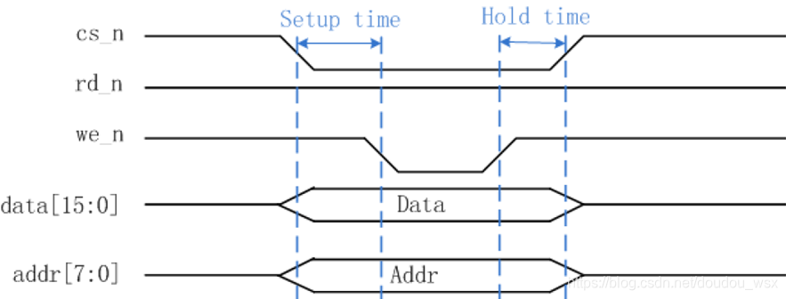
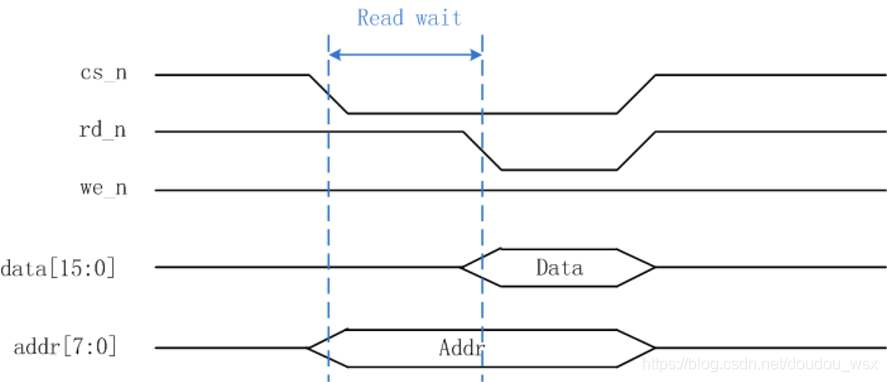
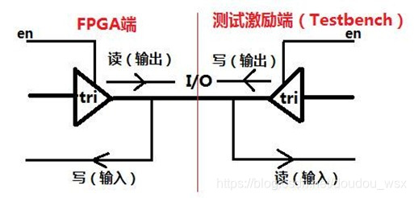
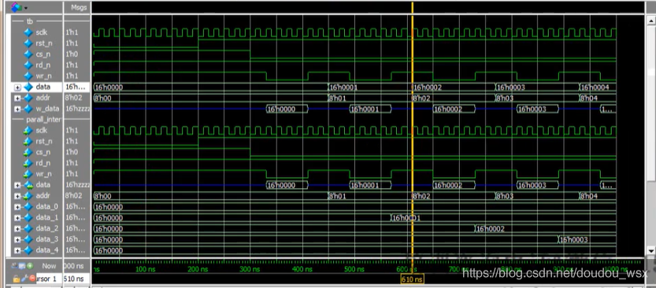

# Verilog HDL（七）异步寄存器fpga与cpu进行并口通信 （异步并口时序仿真）
**1、并口**经常用于FPGA和cpu芯片通信、配置寄存器、跨芯片数据传输等。  
**2、源同步传输：**发送端同时发送时钟和数据给接收端，接收端使用源端发送的时钟采样数据。  
**3、异步并口通信：**  
**异步并口应用：**  
\--cpu类的芯片（dsp、stm32）与FPGA的数据交互，数据速率一般在100Mbps以内，数据总线不大于16bit。  
\--非cpu类的功能芯片与FPGA通过并口进行数据交互，例如配置寄存器等。  
**并口信号说明：**  
\--chip select片选信号，简写为cs\_n，此信号低有效，当被拉低的时候，表示此器件的并口被激活。  
\--write enable写使能信号，简写为we\_n，信号低有效，当被拉低时表示此时地址总线和数据总线的地址数据是写入操作的。  
\--read enable读使能信号，简写为rd\_n，此信号低有效，当被拉低时表示此时地址总线和数据总线的地址和数据是读入操作。  
\--Addr\[7:0\]地址总线，表示读写的地址。  
\--Data\[15:0\]数据总线，此总线是双向总线，读操作时数据总线上是读取的数据，写操作时数据总线上是写入的数据。  
**写操作时序见图：**

  
\--并口不适合高速传输且占用管脚数量很多，优点是简单，逻辑简单。

\--异步并口的异步是指主机不输出时钟信号给从机用作它们之间的通讯，异步并口的并口是指主-从机之间的数据线（此例为16根）和地址线有多根（此例为8根），且主-从机之间的数据交互是并行的。

\--如上图所示，cs\_n为异步并口的片选信号，低电平有效；rd\_n为读使能信号，低电平有效；we\_n为写使能信号，低电平有效；data为数据总线，位宽为16bit；addr为地址总线，位宽为8bit。

\--如上图所示，当cs\_n为低电平时，FPGA被主机片选中，当FPGA检测到we\_n信号被拉低时，即进入到异步并口的写状态，数据通过data数据总线送入FPGA，并按照addr地址总线上的地址值将数据存放到指定存储空间上（如：RAM、FIFO等）。

**读操作时序见图：**

  
\--读等待（设置为40ns），是为了使地址数据稳定之后才赋值给端口。

\--上图为异步并口的读操作时序，当cs\_n为低电平时，FPGA被主机片选中，当FPGA检测到rd\_n信号被拉低时，即进入到异步并口的读状态，FPGA按照addr地址总线上的地址值从指定存储位置上将数据读出并送到data数据总线上，以供主机设备读走。  
**4、**往寄存器中存储数据，对寄存器寻址。  
**5、**cs\_n和wr\_n是两个握手操作的信号。  
**6、**寄存器打拍延时--延时时钟数为n，需要延时的数据为xbit，则使用移位寄存器进行延时的格式为：  
reg  \[3\*n,0\]  Data\_r;  
Data\_r <= {Data\_r\[(n-1)\*x,0\],Data};--最后三个时钟后Data\_r的高n位即为延时后的输出。  
例如：  
data\_r <= {data\_r\[31:0\],data}; //data为16bit，要打三拍，所以总的打拍寄存器为16\*3=48bit，前面的为16\*2=32bit  
addr\_r <= {addr\_r\[15:0\],addr}; //addr为8bit，要打三拍，所以总的打拍寄存器为8\*3=14bit，前面的为8\*2=16bit  
**7、当task中含有参数的时候，参数需要在task中声明**

```
task write_data(len); //需要在下面声明len
 integer i, len;
 begin
  for(i=0; i
  begin
   ...
  end
  cs_n = 1;
 end
endtask
```

**8、三态门的使用和测试：  
\--源程序模块的三态门**

```
reg    [2:0] cs_n_r, rd_n_r, wr_n_r;
inout tri  [15:0] data; //双向口数据线
assign data = (cs_n_r[2] == 1'b0 && rd_n_r[2] == 1'b0) ? rdata : 16'hzzzz;
```

**\--测试模块的三态门**

```
reg      wr_n;
tri    [15:0] w_data;
assign w_data = (wr_n == 1'b0) ? data_tb : 16'hzzzz;

parall_interf parall_interf_inst( //例化
 .sclk (sclk ),
 .rst_n (rst_n ),
 .cs_n (cs_n ),
 .rd_n (rd_n ), //读使能
 .wr_n (wr_n ), //写使能
 .addr (addr ), //地址总线  
 
 .data  (w_data )//双向口数据线--双向口w_data为输出的时候，data为输入；相反w_data为输入的时候，data为输入
);
```

**9.源文件design代码（parall\_interf.v）**

&nbsp;&nbsp;&nbsp;&nbsp;&nbsp;&nbsp;&nbsp;&nbsp;异步并口虽然没有同步时钟信号，但是也不能全用组合逻辑的方式来描述，因为时序逻辑具有更高的稳定性，能给数据采集留以充分的建立时间和保持时间，从而使得读/写操作能在数据稳定后稳定进行。而组合逻辑电路的输出是随输入信号的变化而实时变化的，若主-从机之间的信号稍不稳定，即会导致读/写操作的错误。

&nbsp;&nbsp;&nbsp;&nbsp;&nbsp;&nbsp;&nbsp;&nbsp;因此，本例依然采用时序逻辑电路为主的描述方式，将cs\_n、rd\_n、wr\_n等输入信号采到sclk系统时钟域来，然后在系统时钟sclk的控制下有序地工作。当然，像这种异步时钟域会存在亚稳态的现象，因此，为了降低亚稳态发生的概率，我们采用“打节拍”的方式稳定输入的信号，统一用sclk系统时钟给输入信号多打两拍（延迟两个时钟周期）。

```
module		parall_interf(
		input				wire				sclk,  //50Mhz
		input				wire				rst_n,
		input				wire				cs_n,
		input				wire				rd_n,//读使能
		input				wire				wr_n,//写使能
		inout				tri					[15:0]		data,  //1Mhz双向口数据线  
		input				wire				[7:0]			addr  //地址总线
	
);

//reg			[15:0]		data_buf		[7:0];//声明8个16bit的寄存器
reg			[15:0]		data_0,data_1,data_2,data_3,data_4,data_5,data_6,data_7;
reg			[2:0]			cs_n_r,rd_n_r,wr_n_r;
reg			[47:0]		data_r;
reg			[23:0]		addr_r;
reg			[15:0]		rdata;


//降低亚稳态出现的概率，把cs_n，rd_n，wr_n 单比特信号打两拍
always @(posedge	sclk or negedge rst_n)
			if(rst_n==1'b0)
					{cs_n_r,rd_n_r,wr_n_r}<=9'h1ff;
			else
					{cs_n_r,rd_n_r,wr_n_r}<={{cs_n_r[1:0],cs_n},{rd_n_r[1:0],rd_n},{wr_n_r[1:0],wr_n}};

//数据进行延时，是为了与使能信号进行同步
always @(posedge	sclk or negedge rst_n)
			if(rst_n ==1'b0)
					begin 
							data_r<=48'd0;
							addr_r<=24'd0;
					end
			else
					begin
							data_r<={data_r[31:0],data}; //第一拍：{data_r[31:0],data_1}  第二拍{data_r[15:0],data_1,data_2}
							//打三拍，总的打拍寄存器为16*3=48bit，前面为16*2=32bit
							//data_r[47:32]<=data_r[31:16];
							//data_r[31:16]<=data_r[15:0];
							//data_r[15:0]<=data;							
							addr_r<={addr_r[15:0],addr};						
					end

//异步并口的写操作模块（从外部写入FPGA内部）
always @(posedge sclk or negedge rst_n)
			if(rst_n==1'b0)
					begin
				  		data_0<=8'd0;
				  		data_1<=8'd0;
				  		data_2<=8'd0;
				  		data_3<=8'd0;
				  		data_4<=8'd0;
				  		data_5<=8'd0;
				  		data_6<=8'd0;
				  		data_7<=8'd0;
				  end
			 else if(cs_n_r[2]==1'b0 && rd_n_r[2] == 1'b1 && wr_n_r[2] ==	1'b0)
					case(addr_r[23:16])
							8'd0:data_0<=data_r[47:32];
							8'd1:data_1<=data_r[47:32];
							8'd2:data_2<=data_r[47:32];
							8'd3:data_3<=data_r[47:32];
							8'd4:data_4<=data_r[47:32];
							8'd5:data_5<=data_r[47:32];
							8'd6:data_6<=data_r[47:32];
							8'd7:data_7<=data_r[47:32];
				  default:
				  		begin
				      		data_0<=data_0; 
				      		data_1<=data_1; 
				      		data_2<=data_2; 
				      		data_3<=data_3; 
				      		data_4<=data_4; 
				      		data_5<=data_5; 
				      		data_6<=data_6; 
				      		data_7<=data_7;   
				     	end
				  endcase


//异步并口的读操作模块（包含inout端口的输出操作）。
always @(posedge sclk or negedge rst_n)
			if(rst_n == 1'b0)
					rdata <= 'd0;
			else if(cs_n_r[2]==1'b0 &&  wr_n_r[2] ==1'b1)
					case(addr_r[23:16])
							8'd0:rdata<=data_0;
							8'd1:rdata<=data_1;
							8'd2:rdata<=data_2;
							8'd3:rdata<=data_3;
							8'd4:rdata<=data_4;
							8'd5:rdata<=data_5;
							8'd6:rdata<=data_6;
							8'd7:rdata<=data_7;
					    default:rdata <= 16'd0;
				  endcase
		
//三态门--当rd_n为低的时候，将rdata赋值给data
assign data =(cs_n_r[2] ==1'b0 && rd_n_r[2]==1'b0)?rdata:16'hzzzz;

endmodule
```

**关于inout双向端口的描述与测试：**



&nbsp;&nbsp;&nbsp;&nbsp;&nbsp;&nbsp;&nbsp;&nbsp;如图所示，展示了本例所采用的测试模型，对于FPGA芯片来说，异步并口的读操作就是数据输出，写操作就是数据的输入；而对于测试激励端来说，异步并口的写操作就是数据输出，读操作就是数据的输入。

**因此，应将FPGA端的程序设计如下：**

inout tri \[15:0\] data, //双向数据总线

assign data = (cs\_n\_r\[2\]==1'b0 && wr\_n\_r\[2\]==1'b1 && rd\_n\_r\[2\]==1'b0)? read\_data: 16'hzzzz;//读操作输出数据

对于写操作输入数据，则直接将data数据总线上的数据送入给FPGA的寄存器。

**而应将测试激励端的程序设计如下：**

tri \[15:0\] data;

reg \[15:0\] data\_reg;

assign data = (wr\_n==1'b0) ? data\_reg : 16'hzzzz;//写操作输出数据

对于读操作输入数据，则直接读取data数据总线上的数据即可。

**10.仿真sim中的代码（tb\_parall\_interf.v）**

```
`timescale  1ns/1ns
module 	tb_parall_interf();

parameter		setup_time = 2;  //建立事件
parameter		hold_time	=	2;	 //保持时间
parameter		data_time = 4;   //持续时间
parameter		read_wait = 5;   //读数据等待延时

reg					sclk,rst_n;
reg					cs_n,rd_n,wr_n;   //使能 
reg		[15:0]		data_tb;//写数据
reg		[7:0]	    addr;
tri		[15:0]		w_data;//inout端的输出只能接wire变量或tri变量

always  #10 sclk = ~sclk;

//测试激励的三态门
assign  w_data = (wr_n == 1'b0)?data_tb:16'hzzzz;	

initial		
				begin
							sclk = 0;
							rst_n = 0;
							#200;
							rst_n = 1;
				end

//调用task，并进行初始化
initial	
		begin
				cs_n=1;
				rd_n=1;
				wr_n=1;
				data_tb=0;
				addr=0;
				@(posedge	rst_n);
				#100;
				write_data(8);
				#100;
				read_data(8);	
		end

//integer		i,len;
//写数据的任务，模拟cpu向fpga发送数据，task中嵌套task
task		write_data(input    [31:0]    len);
				integer		i;
				begin
						for(i=0;i<len;i=i+1)
						begin
								 //@ (posedge sclk);
								cs_n=0;
								data_tb=i[15:0];//写操作：cpu向fpga写入地址+数据
								addr=i[7:0];
								setup_dly();
								wr_n=0;
								data_dly();
								wr_n=1;
								hold_dly();								
						end
						cs_n=1; //cpu向FPGA连续写数据的时候，cs_n可以不拉高，当写完所有数据之后再将其拉高
				end
endtask

//读数据  模拟fpga读取cpu
task		read_data(len);
				integer		i;
				begin
						for(i=0;i<len;i=i+1)
						begin
								cs_n=0;					
								addr=i[7:0];
								read_dly();
								rd_n=0;
								data_dly();
								$display("read data addr is %d = %d",i,w_data);
								rd_n=1;					
						end
						cs_n=1; 
				end
endtask

parall_interf 	parall_interf_en(
		.sclk       (sclk ),  
		.rst_n      (rst_n),
		.cs_n       (cs_n ),
		.rd_n       (rd_n ), //读使能
		.wr_n       (wr_n ),//写使能
		.data       (w_data ),  //双向口数据线，双向口w_data为输出的时候，data为输入；相反。
		.addr       (addr ) //地址总线
	
);

//基本的延时任务
task		setup_dly();
		integer  i;
		begin
				for(i=0;i<setup_time;i=i+1)
				begin
						@(posedge	sclk);	
				end
		end
endtask

task		hold_dly();
		integer  i;
		begin
				for(i=0;i<hold_time;i=i+1)
				begin
						@(posedge	sclk);	
				end
		end
endtask

task		data_dly();
		integer  i;
		begin
				for(i=0;i<data_time;i=i+1)
				begin
						@(posedge		sclk);	
				end
		end
endtask

task		read_dly();
		integer  i;
		begin
				for(i=0;i<read_wait;i=i+1)
				begin
						@(posedge		sclk);	
				end
		end
endtask
endmodule
```

**11. 建仿真脚本run.do文件**

```
quit -sim
.main clear

vlib	work
vmap	work work

vlog  ./tb_parall_interf.v
vlog  ./../design/parall_interf.v

vsim	-voptargs=+acc work.tb_parall_interf

add  wave  tb_parall_interf/*

add  wave  tb_parall_interf/parall_interf_en/*


run 10us
```

**12.仿真结果**

