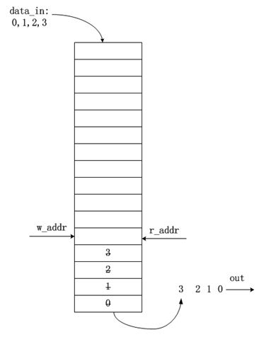
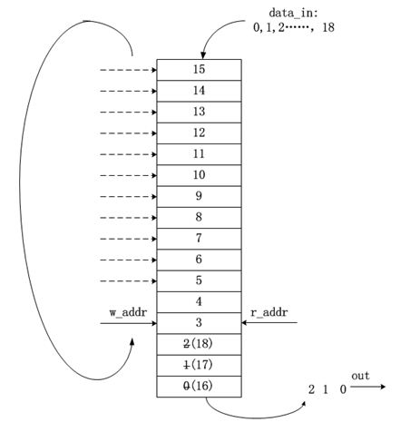
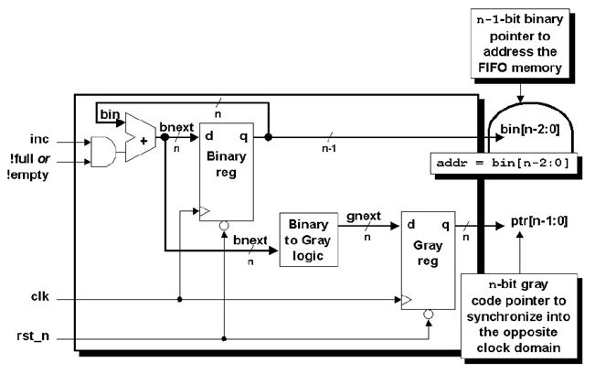
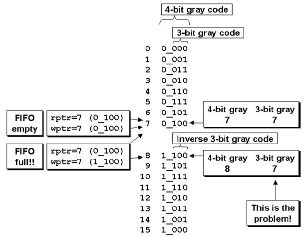
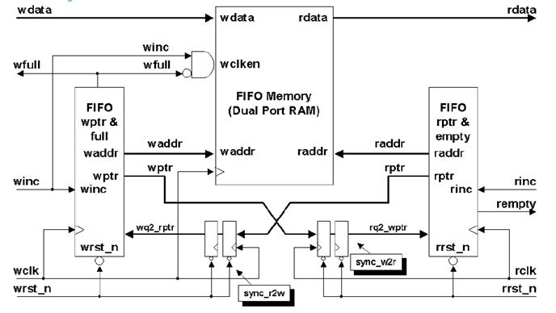
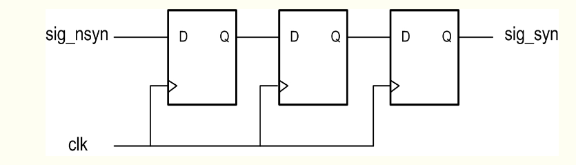
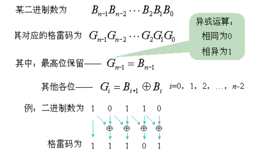
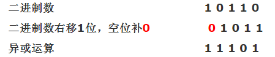
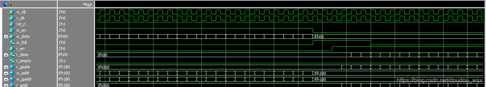
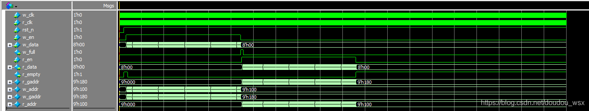

# Verilog HDL（九）异步FIFO
一、FIFO简介

　　FIFO是英文First In First Out 的缩写，是一种先进先出的数据缓存器，它与普通存储器的区别是没有外部读写地址线，这样使用起来非常简单，但缺点就是只能顺序写入数据，顺序的读出数据，其数据地址由内部读写指针自动加1完成，不能像普通存储器那样可以由地址线决定读取或写入某个指定的地址。

用途1：

　　异步FIFO读写分别采用相互异步的不同时钟。在现代集成电路芯片中，随着设计规模的不断扩大，一个系统中往往含有数个时钟，多时钟域带来的一个问题就是，如何设计异步时钟之间的接口电路。异步FIFO是这个问题的一种简便、快捷的解决方案，使用异步FIFO可以在两个不同时钟系统之间快速而方便地传输实时数据。

用途2：

　　对于不同宽度的数据接口也可以用FIFO，例如单片机位8位数据输出，而DSP可能是16位数据输入，在单片机与DSP连接时就可以使用FIFO来达到数据匹配的目的。

二、分类

　　（1）同步FIFO是指读时钟和写时钟为同一个时钟，在时钟沿来临时同时发生读写操作；

　　（2）异步FIFO是指读写时钟不一致，读写时钟是互相独立的。

三、FIFO的常见参数

（1）FIFO的宽度：即FIFO一次读写操作的数据位；  
（2）FIFO的深度：指的是FIFO可以存储多少个N位的数据（如果宽度为N）。  
（3）满标志：FIFO已满或将要满时由FIFO的状态电路送出的一个信号，以阻止FIFO的写操作继续向FIFO中写数据而造成溢出（overflow）。  
（4）空标志：FIFO已空或将要空时由FIFO的状态电路送出的一个信号，以阻止FIFO的读操作继续从FIFO中读出数据而造成无效数据的读出（underflow）。  
（5）读时钟：读操作所遵循的时钟，在每个时钟沿来临时读数据。  
（6）写时钟：写操作所遵循的时钟，在每个时钟沿来临时写数据。  
\===============================分   隔    符 ==============================

读写指针的工作原理  
　　读指针：总是指向下一个将要被写入的单元，复位时，指向第1个单元(编号为0)。

　　写指针：总是指向当前要被读出的数据，复位时，指向第1个单元(编号为0)。

FIFO的“空”/“满”检测  
　　FIFO设计的关键：产生可靠的FIFO读写指针和生成FIFO“空”/“满”状态标志。

　　当读写指针相等时，表明FIFO为空，这种情况发生在复位操作时，或者当读指针读出FIFO中最后一个字后，追赶上了写指针时，如下图所示：

&nbsp;&nbsp;&nbsp;&nbsp;&nbsp;&nbsp;&nbsp;&nbsp;&nbsp;&nbsp;　　　　　　　　　

　　当读写指针再次相等时，表明FIFO为满，这种情况发生在，当写指针转了一圈，折回来(wrapped around)又追上了读指针，如下图：

&nbsp;&nbsp;&nbsp;&nbsp;&nbsp;&nbsp;&nbsp;&nbsp;

为了区分到底是满状态还是空状态，可以采用以下方法：

&nbsp;&nbsp;&nbsp;&nbsp;方法1：在指针中添加一个额外的位(extra bit)，当写指针增加并越过最后一个FIFO地址时，就将写指针这个未用的MSB加1，其它位回零。对读指针也进行同样的操作。此时，对于深度为2n的FIFO，需要的读/写指针位宽为(n+1)位，如对于深度为8的FIFO，需要采用4bit的计数器，0000～1000、1001～1111，MSB作为折回标志位，而低3位作为地址指针。

&nbsp;&nbsp;&nbsp;&nbsp;&nbsp;如果两个指针的MSB（最高有效位）不同，说明写指针比读指针多折回了一次；如r\_addr=0000,而w\_addr = 1000，为满；  
     如果两个指针的MSB相同，则说明两个指针折回的次数相等。其余位相等，说明FIFO为空。

3.二进制FIFO指针的考虑

　　将一个二进制的计数值从一个时钟域同步到另一个时钟域的时候很容易出现问题，因为采用二进制计数器时所有位都可能同时变化，在同一个时钟沿同步多个信号的变化会产生亚稳态问题。而使用格雷码只有一位变化，因此在两个时钟域间同步多个位不会产生问题。所以需要一个二进制到gray码的转换电路，将地址值转换为相应的gray码，然后将该gray码同步到另一个时钟域进行对比，作为空满状态的检测。 

&nbsp;&nbsp;&nbsp;&nbsp;

4.使用gray码进行对比，如何判断“空”与“满”  
 　  使用gray码解决了一个问题，但同时也带来另一个问题，即在格雷码域如何判断空与满。

　　对于“空”的判断依然依据二者完全相等(包括MSB)；

　　而对于“满”的判断，如下图，由于gray码除了MSB外，具有镜像对称的特点，当读指针指向7，写指针指向8时，除了MSB，其余位皆相同，不能说它为满。因此不能单纯的只检测最高位了，在gray码上判断为满必须同时满足以下3条：

&nbsp;&nbsp;&nbsp;&nbsp;&nbsp;&nbsp;&nbsp;&nbsp;wptr和同步过来的rptr的MSB不相等，因为wptr必须比rptr多折回一次。  
        wptr与rptr的次高位不相等，如上图位置7和位置15，转化为二进制对应的是0111和1111，MSB不同说明多折回一次，111相同代表同一位置。剩下的其余位完全相等。  
      

&nbsp;&nbsp;&nbsp;&nbsp;&nbsp;&nbsp;

5.总体实现

&nbsp;&nbsp;&nbsp;&nbsp;系统的总体框图如下

&nbsp;&nbsp;&nbsp;&nbsp;&nbsp;&nbsp;&nbsp;&nbsp;

 四、同步化分析

由于是异步FIFO的设计，读写时钟不一样，在产生读空信号和写满信号时，会涉及到跨时钟域的问题，如何解决？  
　　跨时钟域的问题：由于读指针是属于读时钟域的，写指针是属于写时钟域的，而异步FIFO的读写时钟域不同，是异步的，要是将读时钟域的读指针与写时钟域的写指针不做任何处理直接比较肯定是错误的，因此我们需要进行同步处理以后进行比较。  
　　解决方法：加两级寄存器同步 + 格雷码（目的都是消除亚稳态）  
   
（1）使用异步信号进行使用的时候，好的设计都会对异步信号进行同步处理，同步一般采用多级D触发器级联处理，如下图。这种模型大部分资料都说的是第一级寄存器产生亚稳态后，第二级寄存器稳定输出概率为90%，第三极寄存器稳定输出的概率为99%，如果亚稳态跟随电路一直传递下去，那就会另自我修护能力较弱的系统直接崩溃。

。



（2）将一个二进制的计数值从一个时钟域同步到另一个时钟域的时候很容易出现问题，因为采用二进制计数器时所有位都可能同时变化，在同一个时钟沿同步多个信号的变化会产生亚稳态问题。而使用格雷码只有一位变化，因此在两个时钟域间同步多个位不会产生问题。所以需要一个二进制到gray码的转换电路，将地址值转换为相应的gray码，然后将该gray码同步到另一个时钟域进行对比，作为空满状态的检测。那么，多位二进制码如何转化为格雷码？

方法一：

&nbsp;&nbsp;&nbsp;&nbsp;&nbsp;&nbsp;&nbsp;&nbsp;&nbsp;&nbsp;&nbsp;&nbsp;&nbsp;&nbsp;&nbsp;&nbsp;&nbsp;&nbsp;&nbsp;&nbsp;&nbsp;&nbsp;&nbsp;****

方法二：



verilog代码实现就一句：assign        gaddr\_wire = (addr\_wire>>1) ^addr\_wire;

 使用gray码解决了一个问题，但同时也带来另一个问题，即在格雷码域如何判断空与满。 

这里直接给出结论：

　　判断读空时：需要读时钟域的格雷码rgray\_next和被同步到读时钟域的写指针rd2\_wp每一位完全相同；

　　判断写满时：需要写时钟域的格雷码wgray\_next和被同步到写时钟域的读指针wr2\_rp高两位不相同，其余各位完全相同；

assign full = (wr\_addr\_gray == {~(rd\_addr\_gray\_d2\[addr\_width-:2\]),rd\_addr\_gray\_d2\[addr\_width-2:0\]}) ;//高两位不同

assign empty = ( rd\_addr\_gray == wr\_addr\_gray\_d2 );

五、Verilog实现

1.源design文件夹中

（1）写模块：w\_ctrl

```
module		w_ctrl(
		input		wire						w_clk,  //写时钟
		input		wire						rst_n,	//复位
		input		wire						w_en,			//写使能
		input		wire		[8:0]		r_gaddr,	//读时钟域过来的格雷码 读地址寄存器
		output	reg							w_full,		//写满标志
		output	wire		[8:0]		w_addr,	//256深度地FIFO  写二进制地址
		output	wire		[8:0]		w_gaddr //写FIFO地址格雷码编码
);
reg		[8:0]		addr;
reg		[8:0]		gaddress;
wire	[8:0]		addr_wire;
wire	[8:0]		gaddr_wire;
reg		[8:0]		r_gaddr_d1,r_gaddr_d2;

打两拍进行时钟同步
always @(posedge w_clk or negedge rst_n)
		if(rst_n == 1'b0)
				{r_gaddr_d2,r_gaddr_d1}<=18'd0;
		else
				{r_gaddr_d2,r_gaddr_d1}<={r_gaddr_d1,r_gaddr};

//产生ram地址指针二进制
assign		addr_wire = addr + ((~w_full) & w_en);  //组合逻辑
always	@(posedge	w_clk or negedge rst_n)
		if(rst_n == 1'b0)
				addr <= 9'd0;
		else
				addr <=addr_wire;
				
assign	w_addr  = addr;

//转换格雷码地址  将二进制转化为格雷码
assign		gaddr_wire = (addr_wire>>1) ^addr_wire;

always	@(posedge	w_clk or negedge rst_n)
		if(rst_n == 1'b0)
				gaddress <= 9'd0;
		else 
				gaddress <= gaddr_wire;

assign	w_gaddr =gaddress;

//写满标志产生
always	@(posedge	w_clk or negedge rst_n)
		if(rst_n == 1'b0)
				w_full <=1'b0;
		else  if({~gaddr_wire[8:7],gaddr_wire[6:0]}==r_gaddr_d2)  //拼接
				w_full <= 1'b1;
		else
				w_full <= 1'b0;

endmodule
```

(2)读模块：r\_ctrl

```
module  r_ctrl(
		input		   wire						r_clk,
		input      wire						rst_n,
		input		   wire						r_en,
		input		   wire		[8:0]		w_gaddr,//写指针
		output	   reg						r_empty,
		output	   wire		[8:0]		r_addr, //读二进制地址
		output	   wire		[8:0]		r_gaddr //读格雷码地址
);

reg		[8:0]		addr;
reg	  [8:0]		gaddress;
wire	[8:0]		addr_wire;
wire	[8:0]		gaddr_wire;
reg		[8:0]		w_gaddr_d1,w_gaddr_d2;

//打两拍进行时钟同步
always @(posedge r_clk or negedge rst_n)
		if(rst_n == 1'b0)
				{w_gaddr_d2,w_gaddr_d1}<=18'd0;
		else
				{w_gaddr_d2,w_gaddr_d1}<={w_gaddr_d1,w_gaddr};

//二进制的读地址
always	@(posedge	r_clk or negedge	rst_n)
		if(rst_n == 1'b0)
				addr<=9'd0;
		else	
				addr<=addr_wire;

assign	r_addr  = addr;
assign	addr_wire =addr+((~r_empty)&r_en);


//转换格雷码地址  将二进制转化为格雷码
assign		gaddr_wire = (addr_wire>>1) ^addr_wire;

always	@(posedge	r_clk or negedge rst_n)
		if(rst_n == 1'b0)
				gaddress <= 9'd0;
		else 
				gaddress <= gaddr_wire;

assign	r_gaddr =gaddress;

//读空标志的产生
always	@(posedge	r_clk  or  negedge	rst_n)
			if(rst_n	==	1'b0)
					r_empty <= 1'b0;
			else if(gaddr_wire == w_gaddr_d2)
					r_empty	<= 1'b1;
			else
					r_empty <=1'b0;

endmodule
```

(3)fifomem模块

```
module	fifomem(
		input			wire			w_clk,
		input			wire			r_clk,
		input			wire			w_en, //来自于fifo的写控制模块
		input			wire			w_full,//来自于fifo的写控制模块
		input			wire		[7:0]		w_data,//来自于外部数据源
		input			wire		[8:0]		w_addr,//来自于fifo的写控制模块
		input			wire						r_empty,//来自于fifo的读控制模块
		input			wire		[8:0]		r_addr,//来自于fifo的读控制模块
		output		wire		[7:0]		r_data	//读数据从内部ram中读取	
);

wire			ram_w_en;		

assign		ram_w_en = w_en & (~w_full);

//ipcore  应该为256*8
dp_ram_512_8_swsr	dp_ram_512_8_swsr_inst (
	//写数据接口
	.wrclock ( w_clk ),
	.wren ( ram_w_en ),
	.wraddress ( w_addr[7:0] ),
	.data ( w_data ),
	//读数据接口
	.rdaddress ( r_addr[7:0] ),
	.rdclock ( r_clk ),
	.q ( r_data )
	);

endmodule
```

此文件中使用quartus创建ip核接口，

dp\_ram\_512\_8\_swsr    dp\_ram\_512\_8\_swsr\_inst (  
    //写数据接口  
    .wrclock ( w\_clk ),  
    .wren ( ram\_w\_en ),  
    .wraddress ( w\_addr\[7:0\] ),  
    .data ( w\_data ),  
    //读数据接口  
    .rdaddress ( r\_addr\[7:0\] ),  
    .rdclock ( r\_clk ),  
    .q ( r\_data )  
    );

（4）顶层模块：ex\_fifo

```
module		ex_fifo(
		input			wire			w_clk,
		input			wire			r_clk,
		input			wire			rst_n,
		input			wire			w_en,		
		input			wire	        [7:0]	   	    w_data,
		output		    wire			w_full,
		input			wire			r_en,
		output		    wire			[7:0]			r_data,
		output		    wire							r_empty
);
wire		[8:0]	     r_gaddr;
wire		[8:0]		 w_addr;
wire		[8:0]		 w_gaddr;
wire		[8:0]		 r_addr;


w_ctrl		w_ctrl_inst(
		.w_clk        (w_clk  ) ,  //写时钟
		.rst_n        (rst_n  ) ,	//复位
		.w_en         (w_en   ) ,			//写使能
		.r_gaddr      (r_gaddr) ,	//读时钟域过来的格雷码 读地址寄存器
		.w_full       (w_full ) ,		//写满标志
		.w_addr       (w_addr ) ,	//256深度地FIFO  写二进制地址
		.w_gaddr      (w_gaddr)   //写FIFO地址格雷码编码
);

fifomem		fifomem_inst(
		.w_clk				(w_clk	),
		.r_clk				(r_clk	),
		.w_en	  			(w_en	  ), 	//来自于fifo的写控制模块
		.w_full 			(w_full ),//来自于fifo的写控制模块
		.w_data 			(w_data ),//来自于外部数据源
		.w_addr 			(w_addr ),//来自于fifo的写控制模块
		.r_empty			(r_empty),//来自于fifo的读控制模块
		.r_addr 			(r_addr ),//来自于fifo的读控制模块
		.r_data				(r_data	)//读数据从内部ram中读取	
);

 r_ctrl 	r_ctrl_inst(
		.r_clk        (r_clk  ) ,
		.rst_n        (rst_n  ) ,
		.r_en         (r_en   ) ,
		.w_gaddr      (w_gaddr) ,//写指针
		.r_empty      (r_empty) ,
		.r_addr       (r_addr ) , //读二进制地址
		.r_gaddr      (r_gaddr) //读格雷码地址
);

endmodule
```

2.仿真模块（sim文件夹中）：tb\_ex\_fifo

```
`timescale		1ns/1ns

module		tb_ex_fifo;
reg						r_clk,w_clk,rst_n;
reg						w_en;
reg		[7:0]		w_data;
reg						r_en;
wire					w_full;
wire					r_empty;
wire	[7:0]		r_data;

parameter			CLK_P	 = 20;

initial		begin
		r_clk = 0;
		w_clk	= 0;
		rst_n	= 0;
		#200
		rst_n	= 1;
end

//写的初始化模块
initial		begin
		w_en = 0;
		w_data	= 0;
		#300
		write_data(256);
end

//读的初始化模块
initial		begin
		r_en  = 0;
		@(posedge		w_full)
		#40;
		read_data(256);	
end

always		#(CLK_P/2)	r_clk = ~r_clk;
always		#(CLK_P/2)	w_clk = ~w_clk;

ex_fifo  ex_fifo_inst(
		.w_clk         (w_clk  ),
		.r_clk         (r_clk  ),
		.rst_n         (rst_n  ),
		.w_en          (w_en   ),		
		.w_data        (w_data ),
		.w_full        (w_full ),
		.r_en          (r_en   ),
		.r_data        (r_data ),
		.r_empty       (r_empty)
);

task		write_data(input	[31:0]	len);
			integer		i;
			begin		
						for(i=0;i<len;i=i+1)
								begin
										@(posedge	w_clk)
										w_en  = 1'b1;
										w_data	= i;
								end
										@(posedge	w_clk);
										w_en  = 1'b0;
										w_data	= 0;
			end
endtask

task		read_data(input	[31:0]	len);
			integer		i;
			begin		
						for(i=0;i<len;i=i+1)
								begin
										@(posedge	w_clk)
										r_en  = 1'b1;
										
								end
										@(posedge	w_clk);
										r_en  = 1'b0;
										
			end
endtask


endmodule
```

3.建仿真脚本run.do文件

```
quit	-sim
.main	clear

vlib	work

vlog	./tb_ex_fifo.v
vlog	./../design/*.v
vlog	./../quartus_prj/ipcore_dir/dp_ram_512_8_swsr.v
vlog	./altera_lib/altera_mf.v

vsim	-voptargs=+acc work.tb_ex_fifo

add   wave tb_ex_fifo/ex_fifo_inst/*

run 20us
```

六、仿真结果



  
本文文字部分转载于链接：https://blog.csdn.net/alangaixiaoxiao/article/details/81432144

代码和仿真为本人所写。