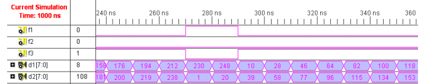

# Verilog HDL（五）组合逻辑(always和assign)与时序逻辑
#### **组合逻辑**

1.概念：从电路本质上讲，组合逻辑电路的特点是输出信号只是当前时刻输入信号的函数，与其他时刻的输入状态无关，不涉及信号跳变沿的处理。无存储电路，也没有反馈电路。

2.描述：

（1）always模块的触发事件为电平敏感信号电路 ：always模块中的信号必须定义为reg。

例：实现一个两输入比较器，输入分别为d1,d2,输出为f1,f2,f3。 

```
module compare_demo(
    d1,d2,f1,f2,f3
);

input[7:0]d1,d2;
output    f1,f2,f3;
reg    f1,f2,f3;

always @ (d1,d2)begin
    if(d1>d2)
        f1=1;
    else
        f1=0;
    
    if(d1=d2)
        f2=1;
    else
        f2=0;

    if(d1<d2)
        f3=1;
    else
        f3=0
end
endmodule

```

（2）assign语句描述的电路：利于条件“？”可以描述一些相对简单的组合逻辑电路，信号只能被定义为wire型，必须用阻塞语句。当组合逻辑比较复杂时，代码的可读性就差。

```
module compare_demo(
d1,d2,f1,f2,f3
);
input di,d2;
output f1,f2,f3;
reg f1,f2,f3;

assgin f1=(d1>d2)?1:0;
assgin f1=(d1==d2)?1:0;
assgin f1=(d1<d2)?1:0;
endmodule
```

(3)仿真

