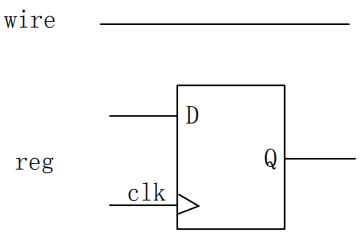
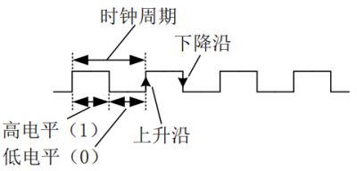
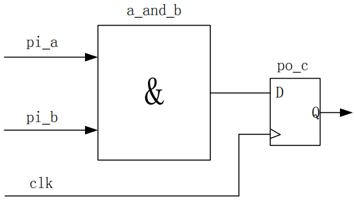
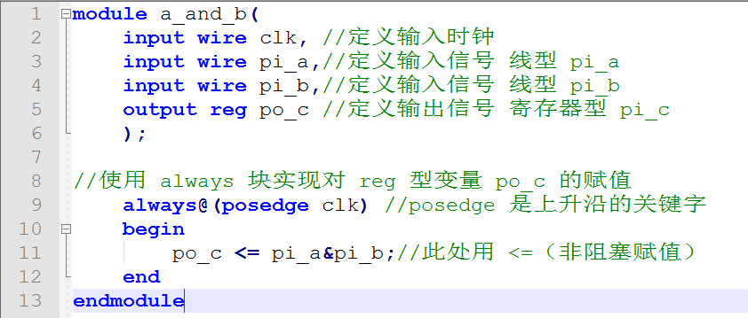
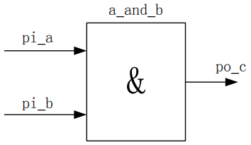
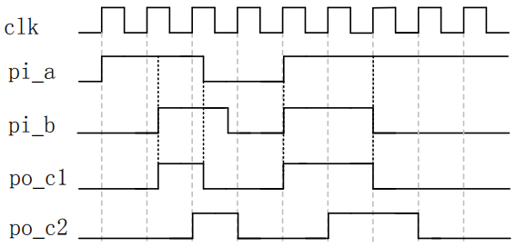
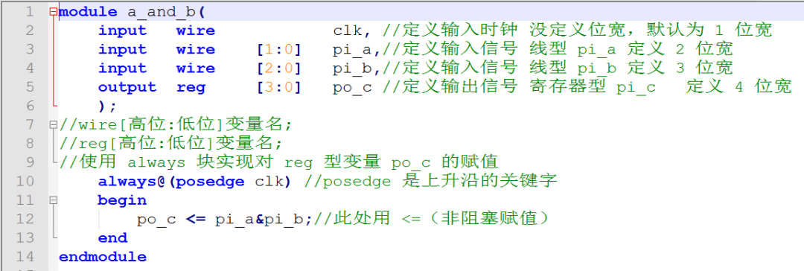

# Verilog HDL（八）变量类型（reg和wire）
Verilog HDL 语法虽然有很多，但是真正常用的却屈指可数， 我们只需要掌握了常用的语法，就可以用 Verilog HDL 语言去描述逻辑电路。之前用到两种变量类型，一种是 wire（线型），另一种是 reg（寄存器型）。在数字电路中信号只有两种形态，一种是传输，一种是存储。传输是通过连接线， 存储是用寄存器，因此也就清楚在 Verilog HDL 中常用 wire 和 reg 变量了。wire 和 reg 变量模型如图 1 所示：

图1 变量类型

由图 1 可以看出，wire 型变量在物理结构上只是一根线，在 Verilog HDL 描述时，对线型变量赋值用 assign 即可，相对比较简单。由图 1 可以看出 reg 型变量左端有一个输入端口 D，右端有一个输出端口 Q， 并且 reg 型存储数据需要在 clk（时钟）沿的控制下完成，它是由晶振产生，是我们描述数字电路时最基本的时间单元，它的周期固定，占空比一般为 50%（即高电平占整个周期的比例）。clk 的低电平用数字 0 表示，高电平用 1 表示，从低电平转变到高电平的过程叫做上升沿，从高电平转变到低电平的过程叫做下降沿，如图 2 所示。

图2 时钟周期

reg 在物理结构上相对比较麻烦，在 Verilog HDL 描述时也相对麻烦。在对reg 型变量进行赋值时，必须在 always 块内完成，可以选择用时钟上升沿，也可以选择时钟下降沿，具体用上升沿还是用下降沿可以根据需要所定。我们可以试着将第一章中的 po\_c 改为 reg 型变量，完成 pi\_a 和 pi\_b 想与之后的结果传输给 寄存器变量 po\_c，RTL 电路图如图 3 所示。

图3 RTL电路

使用 Verilog HDL 描述出图 3 给出的 RTL 电路图，具体代码示例如下所示。

图4 代码示例

代码解析 1：

①第 2 行为输入时钟端口定义，由开发板晶振提供，作为 reg 变量的控制端； 

②第 5 行由于 po\_c 在 always 中被赋值，所以必须定义为 reg 变量；

③第 9 行使用 always 块对 reg 型变量 po\_c 进行赋值，@(posedge clk)表示意思是每当遇到 clk上升沿则执行always 块内语句。下降沿的关键字是 negedge。 

④第 11 行赋值号（<=）为非阻塞赋值，Verilog HDL 语法中有两个赋值方式， 一个是非阻塞赋值（<=），另一个为阻塞赋值（=），在时序逻辑中使用非阻塞赋值，组合逻辑中使用阻塞赋值。两种赋值方式的名称由来，可以由图 4 得到答案。

（1）阻塞赋值

（2）非阻塞赋值

图 4 阻塞和非阻塞的对比

数字电路中信号需要通过信号线传输，信号线到达同一个器件一般根据线的长度决定一些延时的，假设图 4（1）中 pi\_a 到达与门所需要的时间为 5ns， pi\_b 到达与门所需要的时间为 15ns，当 pi\_a 到达与门时，pi\_b 还没有到达，由于 pi\_b 的晚到，导致 po\_c 得不到正确的结果，换句话说也就是 pi\_b 的晚到阻塞了 po\_c 的结果，因为在 Verilog HDL 中为了更好地描述这种情况，在没有时钟沿控制的组合逻辑中使用阻塞赋值。在图 4（2）中所示，pi\_a 与 pi\_b 到达与门的 延时同图 4（1）一样，但是 po\_c 的值是当时钟沿到来时，将该时刻的 d 点的值传递给 po\_c，而与 pi\_a 与 pi\_b 的延时没有关系。

通过上面的代码可以得出结论：

①wire 型变量，必须在 assign 中赋值；

②reg 型变量，必须在 always 中赋值； 

③组合逻辑使用阻塞赋值，时序逻辑用非阻塞赋值。组合逻辑是没用时钟沿控制的电路，时序逻辑是由时钟沿控制的电路。只有在满足了 Verilog HDL 的要 求时，才能完美的呈现出组合逻辑和时序逻辑的特性。在 pi\_a 和 pi\_b 输入波形相同的情况下，使用阻塞赋值的组合逻辑及使用非阻塞赋值的时序逻辑得到的波形如图 5 所示，其中 po\_c1 为组合逻辑得到的波形，po\_c2 为时序逻辑得到的波形。由图 5 可以看出，组合逻辑中当 pi\_a 和 pi\_b 变化时，po\_c1 立刻变化，时序逻辑中，po\_c2 的变化由 clk 上升沿左侧的 pi\_a 和 pi\_b 的值决定。

图 5 组合逻辑与时序逻辑波形区别 

在数字电路中，所有的数据最终都是以二进制形式呈现的，二进制数据和十进制一样，都是数据的一种形式，数据既能用二进制表示也能用十进制表示，对于同一个数据无论是表示为二进制还是十进制，大小都是相同的。十进制是由 0 到 9 组成，那么可想而知二进制是由 0 和 1 组成的， 二进制的每个 0 或者 1 叫做一位（1bit），若是想求得一个数据有多少 bit，首先需要将该数据转换成二进制数据，根据二进制有多少个数而定该数据有多少 bit。我们之前定义的 wire 型 pi\_a、pi\_b 和 reg 型 po\_c 变量，由于没定义具体的位宽，所以每一个变量只能传输或者存储 1bit 的二进制数据，即这三个变量都只能表示 0 或者 1，若是想表达超出 1 的数据，那么需要先将想要表达的数据转换成二进制数据，求得该数据有多少 bit，然后定义大于等于该 bit 数位宽的变量， 如下所示，我们改变了时序逻辑代码的变量位宽。

图6 代码示例2

代码解析 2：

①第 7、8 行为定义带位宽的 wire、reg 型变量格式，变量类型关键字后面的中括号内写上数据的最高位和最低位，其中以冒号隔开。假设定义一个八位宽的线型变量 a，可以写成 wire\[7:0\] a，也可以写成 wire\[8:1\] a，建议最低位从 0 开 始； 

②第 2行定义了时钟，虽然写出了具体的 wire 型，但是没有描述对应的位宽，这种情况默认为 1 位宽，reg 型变量同理； 

③第 3、4、5行分别定义了 2 位宽 wire 型 pi\_a、3 位宽 wire 型 pi\_b 和 4 位 宽 reg 型 po\_c，其中 2bit 的 pi\_a 最大能表示的值为 2’b11=2’d3，最小值能表示 为 2’b00=2’d0，同理可知 pi\_b 和 po\_c 表示值的范围分别为 0~7 和 0~15。

其中 2’b11 中的 2 指的是位宽，’b 表示的是进制，11 表示的是在该位宽和进制形态下 的数据，同理’d 为十进制，’h 为十六进制，同一个数据无论表示为’b、’d 或者’h， 它们前面的位宽应该一致，但是数据需要根据不同的进制改变数值。 

在 Verilog HDL 描述常数时，一般来说需要写出该数据的具体位宽和进制，如 4’b1010 表示的 4bit 的二进制数据 1010。若改为’b1010，此处没写具体的位宽， 则该数据表述为 32 位宽数据，不足 32 位宽，则在数据前面补 0.若写成 1010， 则该数据不再为二进制数据，而是默认为十进制数据，位宽为 32，即可写成 32’d1010。若位宽写成小于所需要的位宽，如 3’b1010，则该数据则等于 3’b010， 与原数不再相等。所以我们在描述常数时，需要写清楚对应的位宽和进制。

一般来说在使用 Verilog HDL 描述数字电路时，当某个常数用的比较多，我们可以将其定义成参数，即用关键字 parameter 定义，如 parameter A=3；此时在代码中再次看到 A 时，它表示的为数字 3，Verilog HDL 是区分大小写的，为 了在我们查看代码时更方便，此处建议参数定义成大写字符，这样更容易与小写的变量区分。