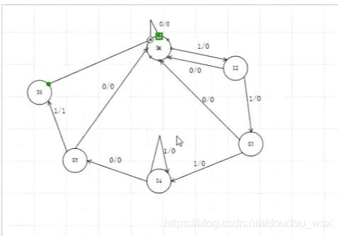
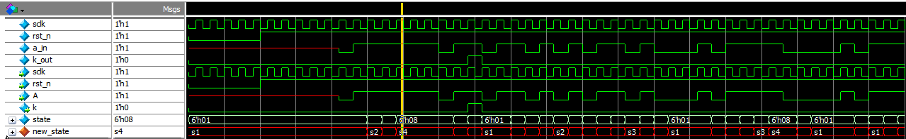

# Verilog HDL（六）状态机 检测11101序列
#### **检测11101序列，画出状态迁移图。**

**1.状态迁移图（Mealy型）  输入/输出**



**2.代码**

创建fsm11101文件

```
//两段式
module fsm11101(
	input		wire		sclk,
	input		wire		rst_n,
	input		wire		A,
	output	    reg			k
);

parameter		s1=6'b000001;
parameter		s2=6'b000010;
parameter		s3=6'b000100;
parameter		s4=6'b001000;
parameter		s5=6'b010000;
parameter		s6=6'b100000;

reg 	[5:0]		state;
always	@(posedge	sclk or negedge	rst_n)
			if(rst_n==1'b0)
					state<=s1;
			else
					case(state)
						s1:
								if(A==1'b1)
										state<=s2;
								else
										state<=s1;
						
						s2:
								if(A==1'b1)
										state<=s3;
								else
										state<=s1;
						
						s3:
								if(A==1'b1)
										state<=s4;
								else
										state<=s1;
										
						s4:
								if(A==1'b1)
										state<=s4;
								else
										state<=s5;
										
						s5:
								if(A==1'b1)
										state<=s6;
								else
										state<=s1;
						
						s6:state<=s1;
						default:state<=s1;
				endcase

always @(posedge	sclk	or	negedge	rst_n)
		if(rst_n==1'b0)
					k<=1'b0;
		else if(state==s5 && A==1'b1)
					k<=1'b1;
		else
					k<=1'b0;
					
endmodule					
```

3.testbeach

创建tb\_fsm11101文件

```
`timescale  1ns/1ns
module tb_fsm11101;
		reg		sclk,rst_n;
		reg		a_in;
		wire	k_out;

initial	begin
		sclk=0;
		rst_n=0;
		#100;
		rst_n=1;
end

initial  begin
		#200;
		rand_bit();
end
always #10 sclk<=~sclk;

fsm11101  fsm11101_inst(
		.sclk		(sclk),
		.rst_n	    (rst_n),
		.A			(a_in),
		.k			(k_out)
);

task rand_bit();
		integer i;
		begin
	  		for(i=0;i<255;i=i+1)
	  		begin
	  	  		@(posedge sclk);
	  	  		a_in<={$random} %2;    //产生0--1
	  	  end
	  end
endtask

endmodule
		
```

4.仿真（ModelsimSE-64仿真） 

 建仿真脚本run.do文件（利用脚本文件写比较方便）

```
quit -sim
.main	clear

#建库
vlib		./lib/
vlib		./lib/work_a/
vlib		./lib/design/

#映射 把base_space映射到./lib/work_a/中   base_space和design是两个逻辑库 
vmap		base_space ./lib/work_a/
vmap    design  ./lib/design/

#编译-work   把此文件夹下的tb_fsm11101.v编译到base_space逻辑库中
vlog		-work base_space		./tb_fsm11101.v
#..是向上翻一个文件夹  看到design文件夹，编译此文件夹中的所有.v文件到design这个逻辑库中
vlog		-work	design				./../design/*.v

#启动
#-t运行仿真的事件精度是ns
#-L是连接库的关键字
vsim		-t ns -voptargs=+acc	-L base_space -L design base_space.tb_fsm11101

#添加虚拟结构体
virtual type {
{01 s1}
{02 s2}
{04 s3}
{08 s4}
{10 s5}
{20 s6}
} vir_new_signal

#add wave	-divider{tb_sim}
add wave	tb_fsm11101/*

#add wave	-divider{des}
#顶层+例化的名字/*其中*号是通配符，匹配所有信号 
add wave	tb_fsm11101/fsm11101_inst/*

#创建(vir_new_signal)类型的信号，将state信号转化为new_state信号
virtual	function {(vir_new_signal)tb_fsm11101/fsm11101_inst/state} new_state
add wave	-color red   tb_fsm11101/fsm11101_inst/new_state

run 1us
```

> ### **注释：**
> 
> 这三条语句是将state信号转化为new\_state信号，在下面图中可以清晰的看到s1,s2......s6
> 
> #添加虚拟结构体  
> virtual type {  
> {01 s1}  
> {02 s2}  
> {04 s3}  
> {08 s4}  
> {10 s5}  
> {20 s6}  
> } vir\_new\_signal
> 
> #创建(vir\_new\_signal)类型的信号，将state信号转化为new\_state信号  
> virtual    function {(vir\_new\_signal)tb\_fsm11101/fsm11101\_inst/state} new\_state
> 
> add wave    -color red   tb\_fsm11101/fsm11101\_inst/new\_state  
>  

5.结果

