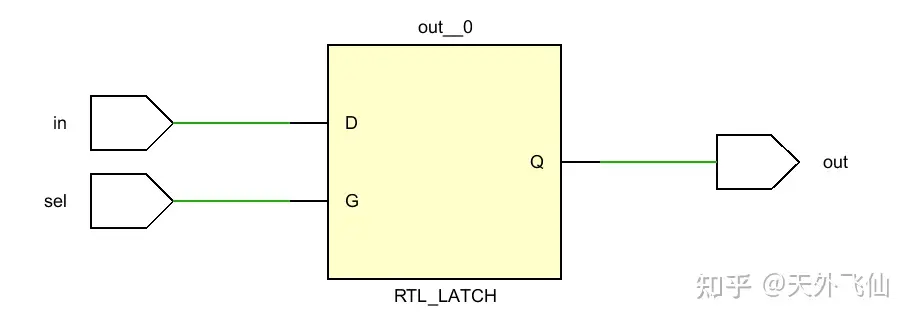

# Verilog代码-电路映射(综合)
## 导言

学习Verilog和数字电路设计也有一段时间了，在平时上课和搜索资料的时候我们经常听到、看到前辈们那语重心长的教导——*设计电路不是写软件代码，写HDL的时候我们要对对应的电路心里有数*。毫无疑问，前辈们说得对。

大部分人在学习HDL（硬件编程语言）之前都学习过C、C++、python等高级程序语言，这些高级程序语言描述能力强大，大家在编程的时候重点关注逻辑，在接触到Verilog之后也很容易沉迷到行为级模型（可以简单理解为用always块建立电路）里那和高级程序语言别无二致的if、case等语句中，如果我们就此陷入到用写C的模式来写Verilog，那就掉进了前辈们反复强调的陷阱，而这将不利于我们把握自己的电路，我们将意识不到自己可能写出了让人无法接受的超长延时路径，也可能意识不到自己可能用了过多的逻辑门来实现一个本来挺简单的功能。

有人会想EDA工具会帮我们优化电路，所以不需要理解自己的代码背后的电路。一定程度上来说，这是对的，但是对于一个有追求的工作者而言，他不会认可这个说法。首先就是如果我们不理解自己代码对应的电路，那就很可能会写出自己误以为正确但是实际上错误的代码，即硬件无法实现预期的功能，但我们自己意识不到这点，latch的无意生成就是一个很好的例子；其次如果一开始就把优化工作全部交给EDA工具，那么当它工作得不好的时候，我们也不会知道怎么去修改自己的代码；另外机器不是人，机器只能在人给出的约束之下进行优化，当它满足约束了，那么它就不会再工作了，哪怕其实电路还能更加简单；最后还有我个人认为最重要的一点，那就是如果一个人无法理解自己的工作，那他一定很难对这份工作产生兴趣。总而言之，一切都交给EDA是不会被提倡的。

经过上文的思考，我们会很顺利地问出这么一个问题——那怎么样才能把握自己的电路呢？我认为这首先需要扎实的数字电路基本功，即拥有在纸面上画出一些基本逻辑单元电路的能力；其次需要我们掌握Verilog代码和电路之间的映射关系，即明白什么样的代码对应什么样的电路。本文的目的就是要建立起一些基本逻辑单元和Verilog代码之间的映射关系。文章接下来会通过Vivado的elaborated design功能来展示一些代码-电路，好让读者能建立基本的认识。要说明的一点是Vivado在上FPGA板时所构建的电路不会和本文展示的电路一样，想了解的读者可以查阅别的资料，关键词LUT。

## 1、基本逻辑门

用Verilog对电路建模总的来说可以分成结构级、行为级两种模式，结构级建模主要通过例化门电路实现，而这个对应关系是最简单的，如果搞不清楚基本逻辑门的对应关系，那就可以关掉这篇文章了（×

本文会通过展示代码和张贴电路图的方式来让大家直观的建立起认识。

```verilog
module logic(
    output  c1,c2,c3,c4,c5,
    input   a1,a2,a3,a4,a5,
    input   b1,b2,b3,b4,b5
    );
    and     (c1,a1,b1);
    nand    (c2,a2,b2);
    or      (c3,a3,b3);
    nor     (c4,a4,b4);
    xnor    (c5,a5,b5);
endmodule
```


五个基本逻辑门

## 2、选择器

选择器通过选择信号来选择多个输入中的某一个进行输出，这是大家最常用的模块之一。

Verilog建模层次很多，在行为级建模中又可以分成连续赋值模型、RTL模型和算法级别模型。首先让我们来看一下RTL级别模型的选择器会被生成为什么样子的电路。

```verilog
module  multiplexer(
    output  reg     dataout,
    input           datain1,
    input           datain2,
    input           datain3,
    input           datain4,
    input   [1:0]   addr
);    
    //RTL模型                                 
    always@(*)begin
        case(addr)
            0:  dataout =   datain1;
            1:  dataout =   datain2;
            2:  dataout =   datain3;
            3:  dataout =   datain4;
            default: dataout = 0;
        endcase
    end
endmodule
```


RTL描述下的四路选择器

如果大家有心查看电路的话，就会在电路里看到大量这样的结构。那么它内部又是什么样的呢？接下来我通过连续赋值模型来进一步查看这个选择器电路。

```verilog
module  multiplexer(
    output          dataout,
    input           datain1,
    input           datain2,
    input           datain3,
    input           datain4,
    input   [1:0]   addr
);
    //连续赋值模型
    assign  dataout =   addr[0] ?   (addr[1]    ?   datain4 :   datain2) :
                                     (addr[1]   ?   datain3 :   datain1);
endmodule
```


连续赋值描述下的选择器

可以看到大的四路选择器被拆分成了三个二选一选择器，而最长路径是两个选择器，这一点在RTL描述中得不到体现，而在把Verilog当C代码来写的朋友眼中就更加虚无缥缈了。

让我们再深入，这一次我们用门级结构来看一下每个二选一选择器里面是什么，熟悉的数字电路的朋友们就知道了，我们现在要用真值表和布尔表达式。

```verilog
module  multiplexer_2(
    output  dataout,
    input   sel,
    input   datain1,
    input   datain2
);
    wire    sel_n;
    wire    datain1_en;
    wire    datain2_en;
    
    assign  sel_n   =   !sel;
    assign  datain1_en  =   sel &&   datain1;
    assign  datain2_en  =   sel_n   &&   datain2;
    assign  dataout     =   datain1_en  ||   datain2_en;
endmodule
```


门级结构的二路选择器

通过用门级结构建模，我们得到了逻辑门搭建的电路，而电路显示为得到结果输入最长需要通过三个逻辑门。把这个简单的二选一选择器组合起来就可以得到最开始的四路选择器。现在让我们尝试闭上眼睛，把这个基本电路代入到连续赋值模型中的三个选择器中去，一个四路选择器的样子就出现了。

这里还有一点值得提及，RTL建模的时候我们使用case语句来实现四路选择器，那如果用if-else语句呢？

```verilog
module  multiplexer(
    output  reg     dataout,
    input           datain1,
    input           datain2,
    input           datain3,
    input           datain4,
    input   [1:0]   addr
);
    always@(*)begin
        if(addr==2'b00)  dataout =   datain1;else
        if(addr==2'b01)  dataout =   datain2;else
        if(addr==2'b10)dataout  =   datain3;else
        if(addr==2'b11)dataout  =   datain4;else
                        dataout =    0;  
    end
endmodule
```


if-else建模的四路选择器

让人非常吃惊，当我们使用if-else来建模选择器时，Vivado居然用四个二选一选择器级联的方式来帮我们构建电路，这不得不说令人十分不悦，因为我们明明可以只通过两级二选一选择器延时就得到结果，但是在这里最长路径变成了四级二选一选择器。

实际上这里的if-else语句中各个分支条件都是互斥的，所以它完全可以用更加并行的方式来实现，而在具体实现的时候是否会变成case语句的那种形式，就要视EDA工具而定。

## 3、解码器

任何输入信号线数量少于输出信号线数量的单元都可以被称作解码器。本例用了一个2-4解码器，功能是将2位输入解码为4位独热码。

Verilog建模层次很多，在行为级建模中又可以分成连续赋值模型、RTL模型和算法级别模型。同样的，首先让我们来看一下RTL级别模型的解码器。

```verilog
module  decoder(
    output  reg [3:0]   dataout,
    input       [1:0]   datain
);
    always@(*)begin
        case(datain)
            2'd0:  dataout =   4'b0001;
            2'd1:  dataout =   4'b0010;
            2'd2:  dataout =   4'b0100;
            2'd3:  dataout =   4'b1000;
        endcase
    end
endmodule
```


RTL描述下的解码器

可能和一些读者想的不一样，Vivado这里在用选择器来帮我们实现解码功能，这里同样是四选一，不过要注意输入信号线是四位的，所以这里其实有四个四选一选择器。接下来是连续赋值模型。

```verilog
module decoder(
    output  [3:0]   dataout,
    input   [1:0]   datain
);
    assign  dataout =   datain[1]==1'b1   ?   (datain[0]==1'b1   ?  4'b1000 :   4'b0100)    :
                                        (datain[0]==1'b1  ?   4'b0010 :   4'b0001);
endmodule
```


连续赋值描述下的解码器

这和选择器部分的展示结果一样，四选一选择器被拆分成了三个二选一选择器。那我们是否可以用之前说的二选一电路来完成电路功能呢？这当然是可以的，但是当我们使用布尔表达式来构建电路，我们就发现事情其实没有那么复杂，简单的实现就和真值表一样。

```verilog
module decoder(
    output     dataout0,dataout1,dataout2,dataout3,
    input       datain0,datain1
);
    assign  dataout3  =   datain0   &&  datain1;
    assign  dataout2  =   ~datain0  &&  datain1;
    assign  dataout1  =   datain0   &&  ~datain1;
    assign  dataout0  =   ~datain0  &&  ~datain1;
endmodule
```


门级结构的解码器

通过这个例子我们就会发现原来不同的写法会产生不一样的电路，高层次的建模方式在用选择器实现功能，而布尔表达式则“所写即所得”。这警示了我们不可想当然的依赖EDA工具，假想如果我们用RTL来描述功能，而电路又天生就能满足约束，那EDA工具很可能就会用选择器来实现解码功能，这虽然满足约束，但是不够美。不过根据情况的不同EDA工具也可能会把RTL模型优化成结构模型，这视情况而定。

## 4、编码器

编码器是解码器的反向动作，一切输入信号多于输出信号的单元都可以称为编码器。

这里用四位独热码转化成二位二进制数的编码器为例子。首先依然上RTL模型。

```verilog
module  encoder(
    output  reg  [1:0]   dataout,
    input   [3:0]   datain
);
    always@(*)begin
        case(datain)
            4'b0001:  dataout =   2'b00;
            4'b0010:  dataout =   2'b01;
            4'b0100:  dataout =   2'b10;
            4'b1000:  dataout =   2'b11;
            default:  dataout =   2'b00;
        endcase
    end
endmodule
```


用ROM实现的编码器

Vivado竟然用ROM来实现了编码器！这很可能是绝大多数人都没有想到的。如果读者不熟悉ROM电路结构，那么可以参考别的资料。

接下来我们考虑门级结构的效果。

```verilog
module  encoder(
    output  dataout0,dataout1,
    input   datain0,datain1,datain2,datain3
);
    assign  dataout0    =   ~datain3 && ~datain2 && datain1 && ~datain0 ||
                            datain3 && ~datain2 && ~datain1 && ~datain0;
                            
    assign  dataout1    =   ~datain3 && datain2 && ~datain1 && ~datain0 ||
                            datain3 && ~datain2 && ~datain1 && ~datain0;
endmodule
```


门级结构的编码器

果不其然，所写即所得，这样的门级结构绝对是不如ROM来的美的。这个例子向我们展示了所写代码和生成电路之间微妙的关系，而这一次，是EDA工具帮我生成了自己想不到的ROM结构。

## 5、锁存器

大家在写电路的时候大部分时间都不希望出现锁存器，但没准可能需要呢？这里就像是复习数字电路一样，我们用Verilog对SR锁存器建模。

```verilog
module  SR(
    output  out,out_n,
    input   R,S,E
);
    wire    R_en,S_en;
    assign  R_en    =   R   &&  E;
    assign  S_en    =   S   &&  E;
    assign  out     =   ~(out_n   ||  R_en);
    assign  out_n   =   ~(out   ||  S_en);
endmodule
```


门级结构SR锁存器

我在这里也故意写一个锁存器，好让大家认识一下锁存器的符号表示。

```verilog
module latch(
    output  out,
    input   in,
    input   sel
);
    assign  out =   sel ?   in:out;
endmodule
```



latch锁存器

## 总结

写HDL不是写软件代码，写HDL的时候我们应该注意把握代码和电路的映射关系，本文写作的初衷就是让一些掉入陷阱的读者能够发现和意识到问题。文章不长，只是展现了几种基本的电路单元，我知道有些读者还会喜欢直接使用加号、减号和乘号，这里并不是反对这么写代码，而是要提醒大家在写这些符号的时候注意一下符号背后的电路，一定要记得，HDL不是高级程序语言，HDL编写者一定要立足于硬件电路。