# Verilog代码和FPGA硬件的映射关系(一)
&nbsp;&nbsp;&nbsp;&nbsp;&nbsp;&nbsp;&nbsp;代码和硬件之间的映射关系是一个很奇妙的过程，也展现出人类的智慧。单片机内部的硬件结构都是固定的，无法改变，我们通过代码操作着寄存器的读写，来执行各种复杂的任务。FPGA的硬件结构并不像单片机一样是固定好的，而是由更加原始的基本逻辑单元构成，我们需要用HDL语言来描述我们要实现的功能，不需要关心硬件的结构是如何构建的，我们通过使用FPGA厂商的综合器来将HDL所描述的功能代码映射到我们的FPGA基本逻辑单元上，而这个映射的过程是综合器帮我们自动完成的，我们并没有直接用语言去操作这些基本逻辑单元，这也可以理解为什么HDL叫硬件描述语言，而不是硬件语言的原因。  
　　我们使用Verilog语言来描述功能，用Altera CycloneIV系列的EP4CE10F17C8芯片来验证下面的例子，观察我们编写的Verilog代码综合后到底映射到了哪些硬件结构上。我们通过察看RTL Viewer、Technology Map Viewer(Post Mapping)、Chip Planner来得出验证分析结果。  
注：RTL Viewer：寄存器级的视图，可以看到寄存器和门电路，主要体现的是逻辑连接关系和模块间的结构关系，和具体的FPGA器件无关；  
Technology Map Viewer(Post Mapping)：将RTL所表达的结构进行优化，增加或减少一些模块，更接近于最后底层硬件映射的结果，以便于映射到具体的FPGA器件上。  
Chip Planner：只有进行布局布线后才能够看到，在版图的模型中真实的表达所使用的资源以及相对位置信息，还有模块之间的路径与连线关系都可以显示出。  
　　我们的例子是给一个输入信号，然后不进行任何逻辑运算直接输出

```c
//--------------------------------------------------	
1 module line(
2 	input  wire in,
3 	
4 	output wire out
5 );
6 
7 assign out = in;
8 
9 endmodule
//--------------------------------------------------	
```

&nbsp;&nbsp;&nbsp;&nbsp;&nbsp;&nbsp;&nbsp;&nbsp;代码编写完后点击“Start Analysis & Synthesis”图标进行分析和综合。  
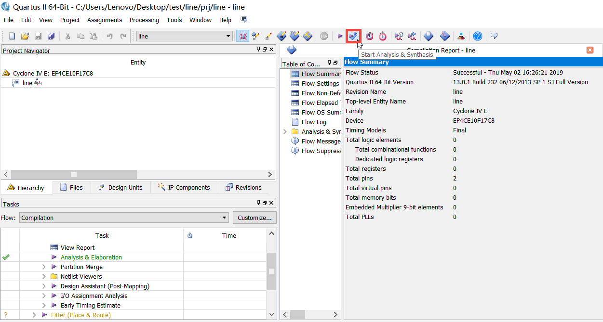  
RTL Viewer：  
　　双击“Netlist Viewers”下的“RTL Viewer”查看RTL视图。  
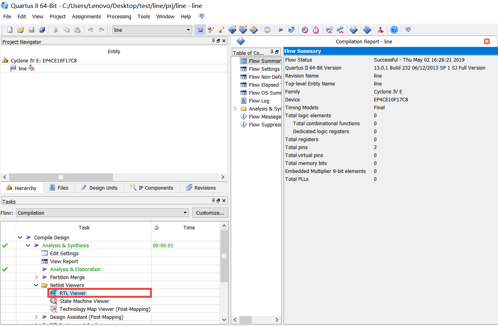  
　　因为代码就是对RTL级层次的描述，所以RTL视图只有一根连线，这和我们代码设计思想的结果是完全一致的。  
  
Technology Map Viewer(Post Mapping)：  
　　双击“Netlist Viewers”下的“Technology Map Viewer(Post Mapping)”。  
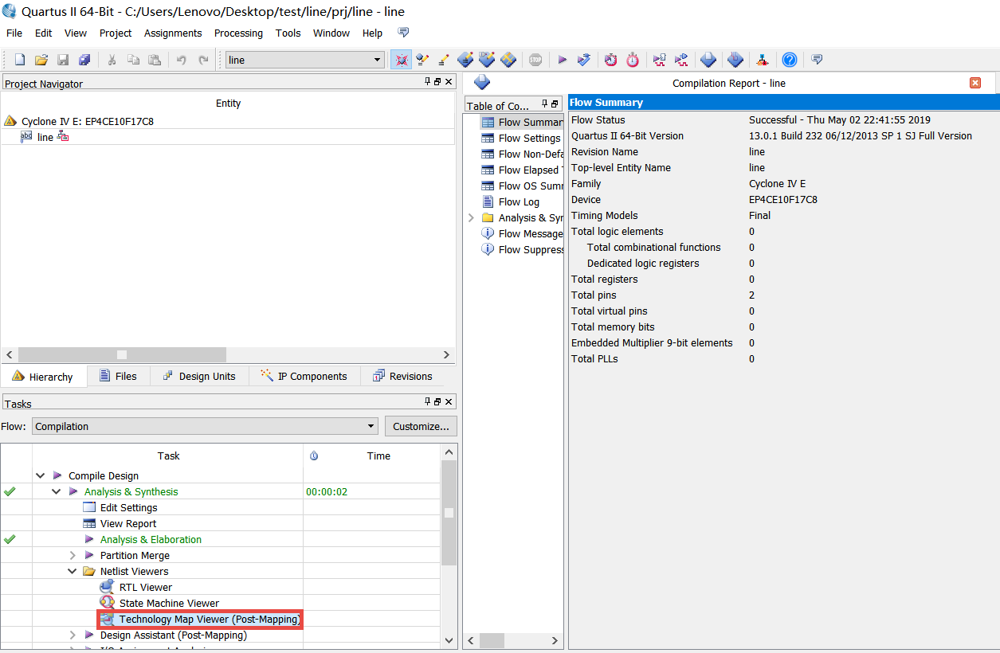  
　　我们可以看到和RTL视图不同的是输入端口和输出端口分别加上了buffer，这是我们代码中并没有的设计，是综合器优化后自动加上的。  
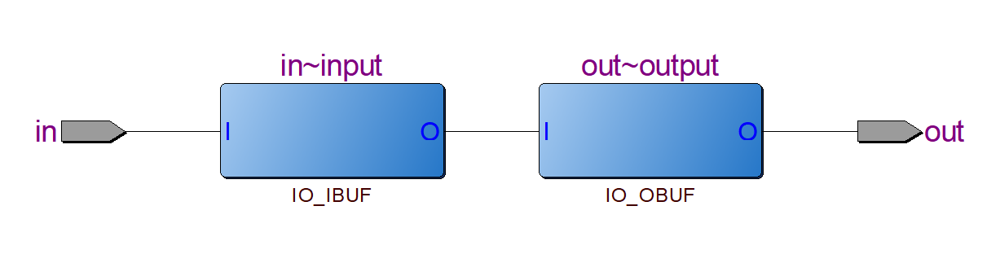  
　　双击上图中蓝色的buffer可以看到下图中三角形的缓冲器。  
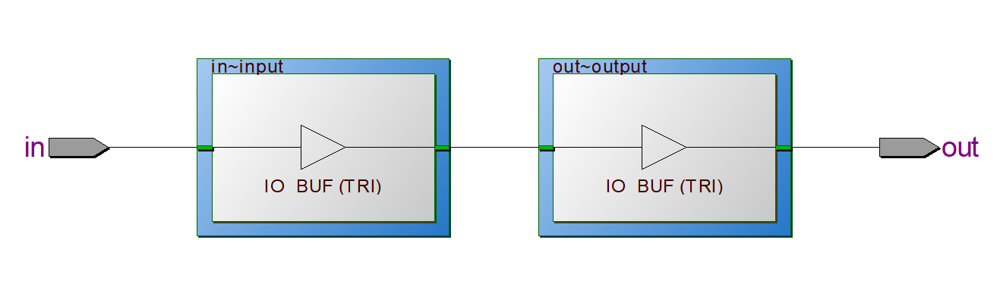  
Chip Planner：  
　　点击“Start Compilation”图标进行全编译，此过程会进行布局布线。  
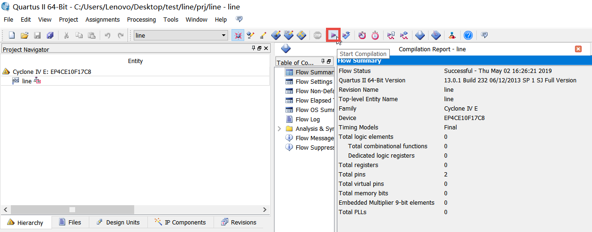  
　　点击“Chip Planner”图标打开版图模型，在“Flow Summary”报告中也可以看到全编译后的信息后加详细，其中只使用了两个管脚资源。  
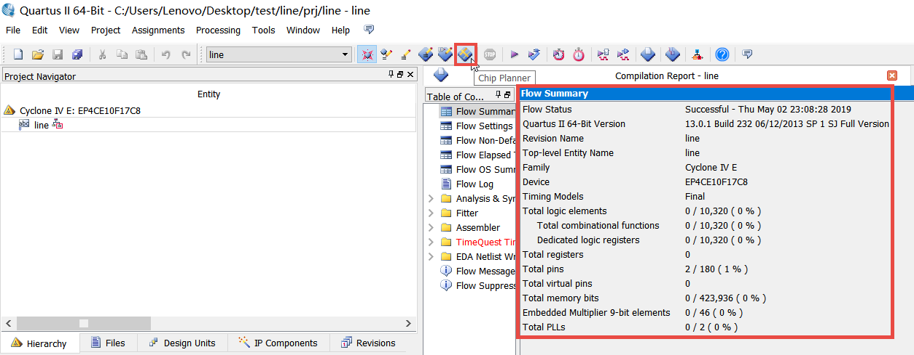  
　　Chip Planner打开后的界面如图所示，我们要找到代码最后映射到版图中的具体位置，我们可以在红色框处的“Find what”处搜索定位，如果没有找到“Find what”，按住键盘“Ctrl + F”就会自动出现。  
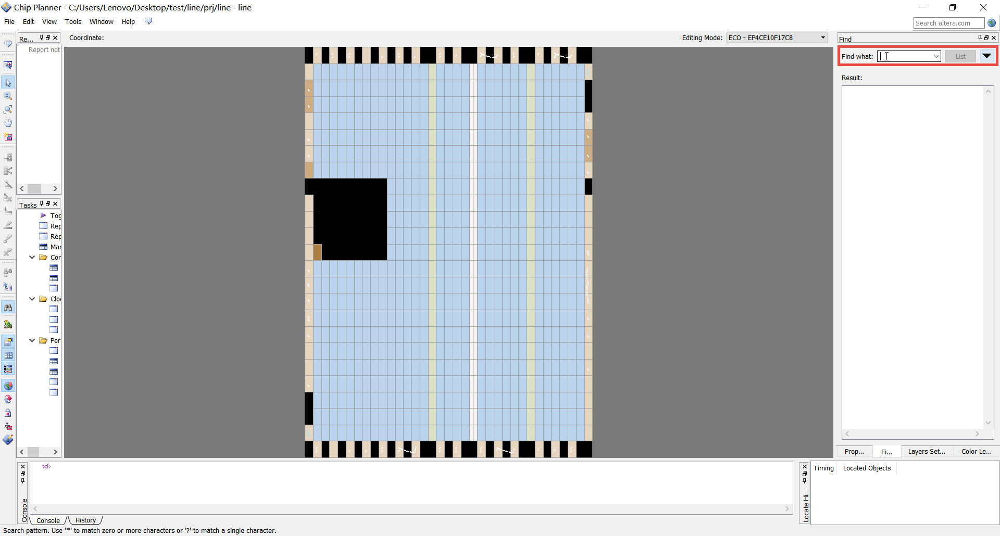  
　　在图中红色区域中的“Find what”搜索RTL代码中的信号名“in”，然后点击“List”。  
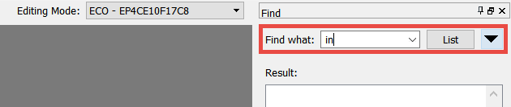  
　　继续点击“Go Next”。  
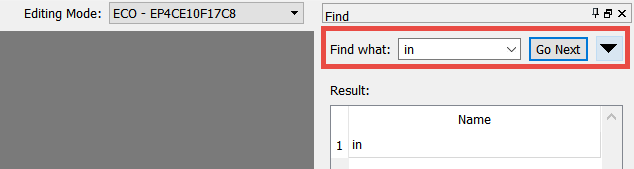  
　　红色区域中深蓝色的小矩形块就是输入信号“in”所映射到版图模型中的位置。  
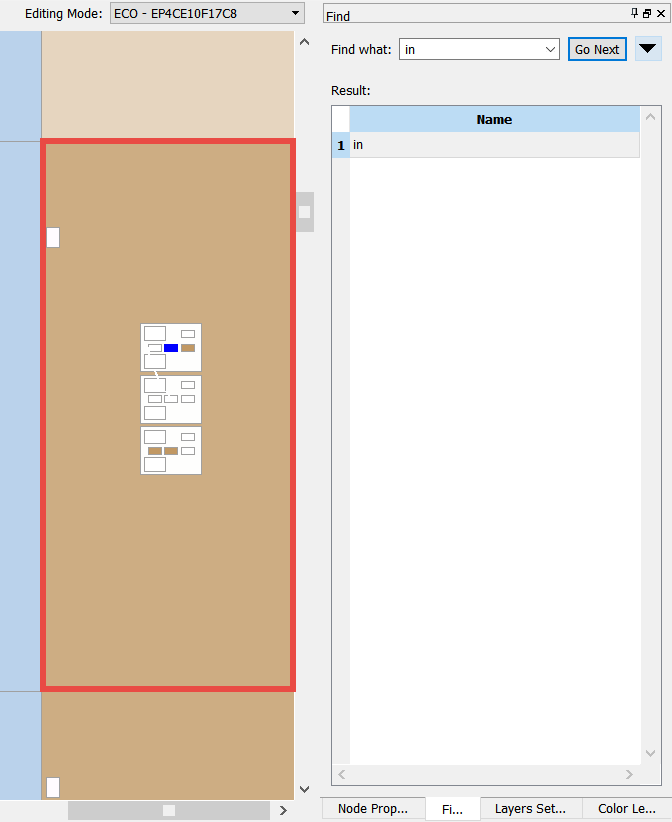  
　　在选中“in”所映射的模块的前提下点击图中左侧“Generate Fan-Out Connections”图标可以将从该位置扇出的连线显示出来，一直点击此扇出线会一致追踪下去。  
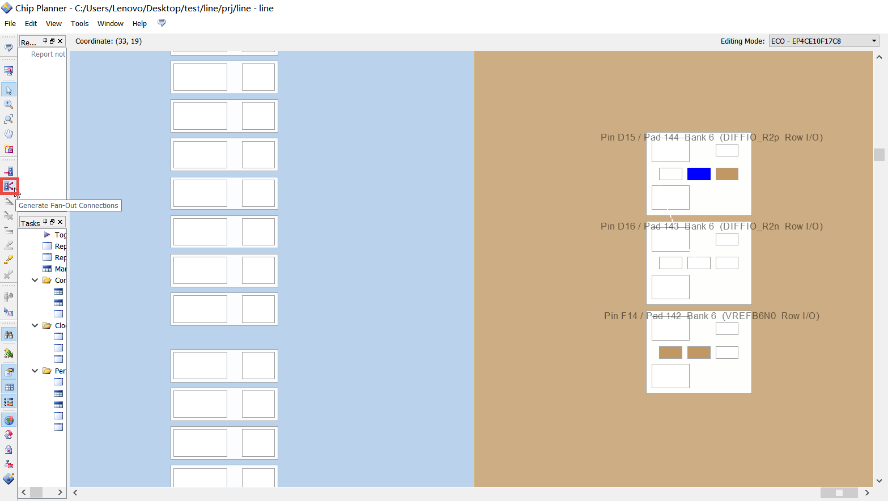  
　　我们看到连线从“in”处开始，到”out“结束，并将”in“和”out“连到一起，这也就说明了代码中的“in”和“out”之间确实是用一根导线连接的。图中的①相当于我们外部的管脚输入进来信号，经过内部连线，从管脚②输出到外部。我们分别双击①和②打开模块内部观察其映射的结构。  
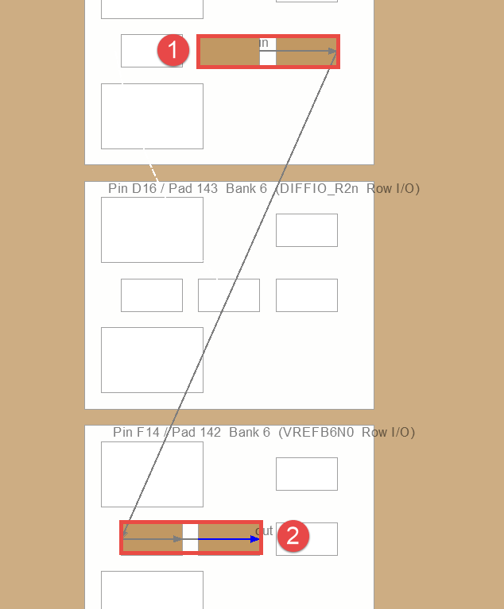  
　　我们看到了一个完整的IOE内部结构，其中蓝色显示的是真实使用到的结构，灰色的是未使用到的结构。第一个图是输入的，第二个图是输出的。  
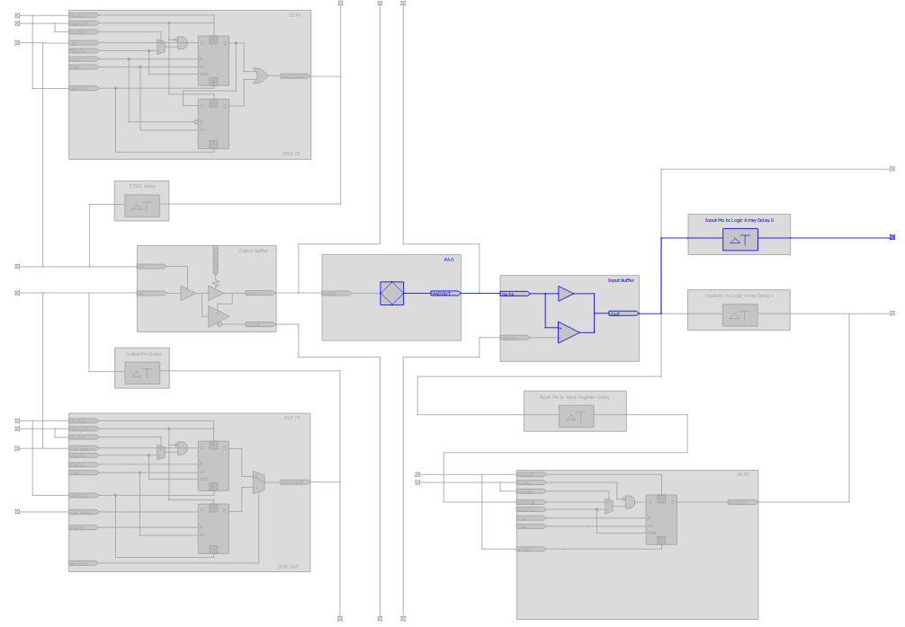  
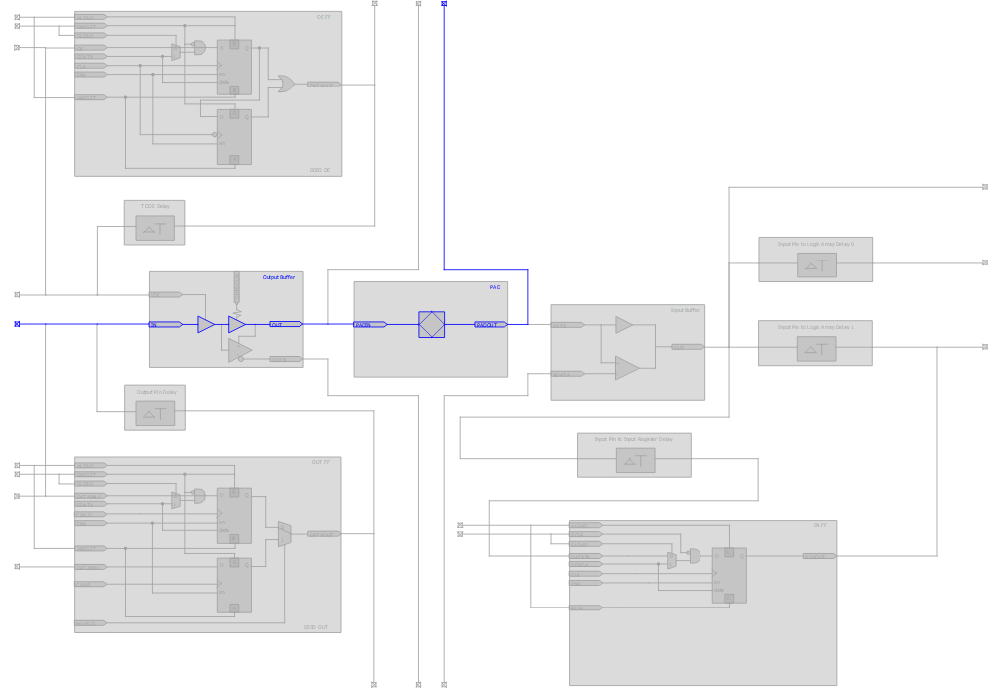  
　　我们根据信号的流向进行标号，①和⑦是PAD，为硅片的管脚，封装在芯片内部，用户看不到，PAD的输入输出往往和外部的Pin有一段连线。②和⑥分别是输入缓冲器和输出缓冲器，我们在Technology Map Viewer(Post Mapping)视图中就已经看到过，这里功能上是一样的，只是具体的实现结构不同；③是一个输入延时模块，是用来调节输入信号的相位延时(在静态时序分析中会详细讲解其使用方法)，右键点击该模块可以设置延时的时间，这是综合布局布线工具自动给我们加的(当输入信号绑定到时钟管脚上时就不会自动连接到输入延时模块上)，并不是我们在RTL代码中设计的；④⑤⑧是和外部管脚以及其他层连接的接触点，可以理解为相当于是PCB中的过孔，⑧这里用于连接到和外部信号输入的管脚Pin上，④和⑤在内部通过导线连接到一起。  
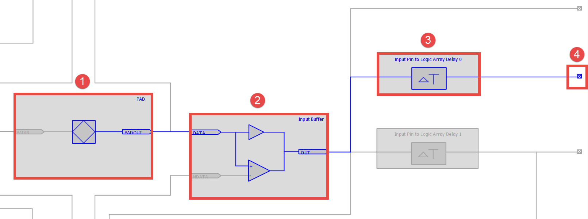  
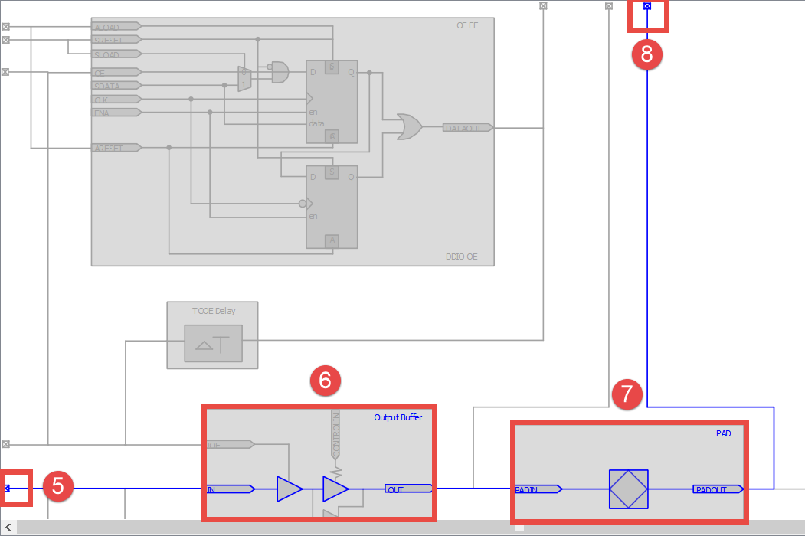  
　　上面的操作我们并没有进行管脚的绑定约束，是开发工具自动给我们分配到一个任意位置的管脚，如果约束了具体的管脚，其在Chip Planner中映射的位置还会变化，但结构基本相同。  
　　综合器在帮我们自动完成综合和布局布线的过程中会根据我们的HDL代码与实际的功能来做一些适当的优化，这些优化是为了让整个映射后的硬件更加适配具体的FPGA器件，所以有些时候我们用HDL描述的功能并不是我们所认为的会使用到那部分基本逻辑单元，而是进行了优化后的结果，这些优化包括：面积的优化、速度的优化、功耗的优化、布局不线的优化、时序的优化等。FPGA开发工具同样也给用户预留了一些可供用户优化的选项设置，但这都要在用户能够熟练掌握开发工具和内部结构的前提下才能够实现。  
　　欢迎加入FPGA技术学习交流群，本群致力于为广大FPGAer提供良好的学习交流环境，不定期提供各种本行业相关资料!QQ交流群号：450843130