# Verilog代码和FPGA硬件的映射关系(三)
&nbsp;&nbsp;&nbsp;&nbsp;&nbsp;&nbsp;&nbsp;组合逻辑和FPGA之间的映射关系我们知道了，那时序逻辑和FPGA之间又是一种怎样的映射关系呢？我们就以前面寄存器章节的例子来向大家说明，也一同把当时为什么用异步复位更节约资源的原因告诉大家。我们先来看一下同步复位D触发器的RTL代码，如下所示：  
**同步复位D触发器**

```c
//--------------------------------------------------
01 module	flip_flop(
02 	input	wire	sys_clk	,	
03 	input	wire	sys_rst_n	,	
04 	input	wire	key_in	,	
05 		
06 	output	reg		led_out 		
07 );
08 
09 //led_out:led灯输出的结果为key_in按键的输入值
10 always@(posedge sys_clk) 
11 	if(sys_rst_n == 1'b0)                     
12 		led_out <= 1'b0;
13 	else
14 		led_out <= key_in;
15  
16 endmodule
//--------------------------------------------------
```

&nbsp;&nbsp;&nbsp;&nbsp;&nbsp;&nbsp;&nbsp;代码编写完后依然需要点击“Start Analysis & Synthesis”图标进行分析和综合。然后双击“Netlist Viewers”下的“RTL Viewer”查看RTL视图。如图1所示，可以看到一个 D触发器的结构，也可以称为寄存器，还附加了一个选择器，用于同步复位的控制，和代码设计的结果是完全一致的。  
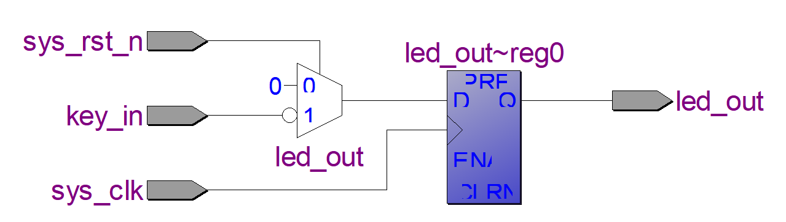

图1

&nbsp;&nbsp;&nbsp;&nbsp;&nbsp;&nbsp;&nbsp;点击“Start Compilation”图标全编译进行布局布线，完成后我们可以看到“Flow Summary”资源使用量，如图2所示，可以看到使用了LE中的一个组合逻辑资源和一个时序逻辑资源。  
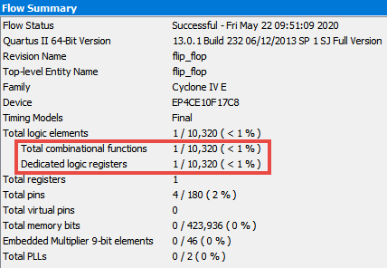

图2

&nbsp;&nbsp;&nbsp;&nbsp;&nbsp;&nbsp;&nbsp;然后打开Chip Planner视图。Chip Planner打开后的界面如图3所示，我们可以看到在版图模型中有一个块蓝色区域的颜色变深，说明该区域的资源被占用，在FPGA内部硬件结构简介中我们知道这是一个逻辑阵列块LAB，我们将该区域放大。  


图3

&nbsp;&nbsp;&nbsp;&nbsp;&nbsp;&nbsp;&nbsp;如图4所示，放大后可以看到蓝色变深的区域中有16个小块，这16个小块就是LE，其中只有一个LE的颜色发生了变化，这次不仅有蓝色，还有红色，说明该处的资源被使用了，双击这个LE即可观察其内部的结构。  
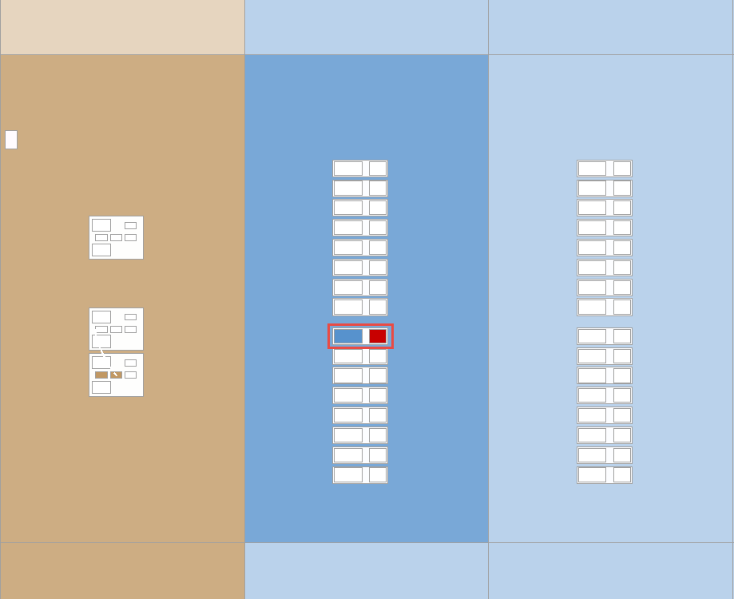

图4

&nbsp;&nbsp;&nbsp;&nbsp;&nbsp;&nbsp;&nbsp;打开LE后内部的结构如该视图中点击下面复位信号的名字后会看到在LE的内部结构图中用绿色标注路径，如5所示，其中蓝色显示的是真实使用到的结构，灰色的是未使用到的结构，我们可以看到①、②、③为三个输入，其中③为时钟的输入端，然后一个输出，和RTL代码的描述是对应的。因为我们设计的是时序逻辑，所以这次我们可以发现比组合逻辑多出来的结构主要是红色框所表示的寄存器。  
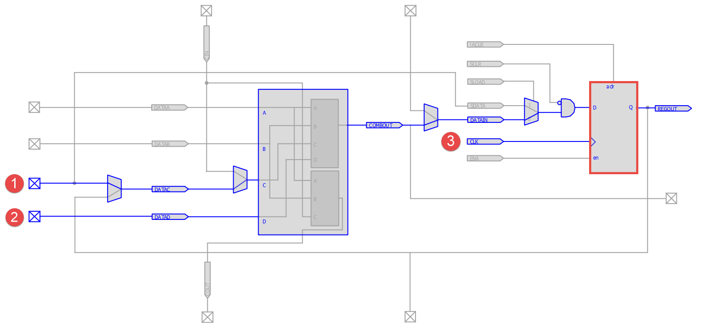

图5

&nbsp;&nbsp;&nbsp;&nbsp;&nbsp;&nbsp;&nbsp;在该视图中点击下面复位信号的名字后会看到在LE的内部结构图中用绿色标注路径，如图6所示，可以知道①为复位信号的输入端，②为key\_in信号的输入端。  
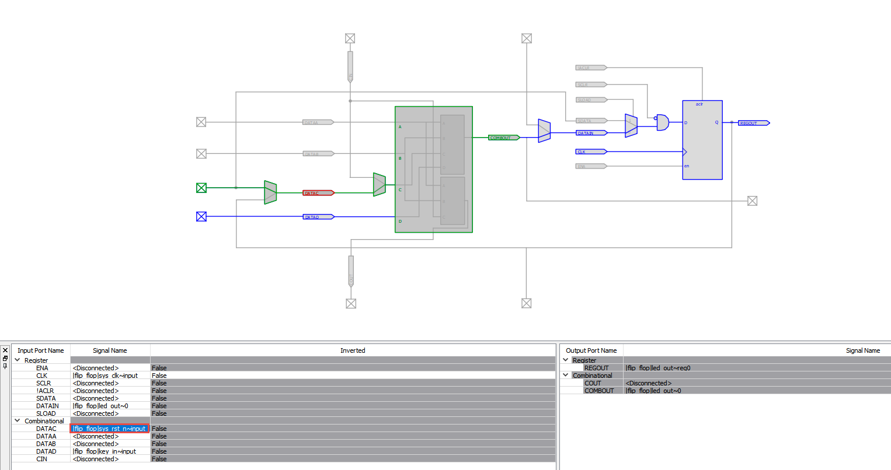

图6

&nbsp;&nbsp;&nbsp;&nbsp;&nbsp;&nbsp;&nbsp;我们再来看一下异步复位D触发器的RTL代码，如下所示：  
**异步复位D触发器**

```c
//--------------------------------------------------
01 module	flip_flop(
02 	input	wire	sys_clk	,	
03 	input	wire	sys_rst_n	,	
04 	input	wire	key_in	,	
05 		
06 	output	reg		led_out 		
07 );
08 
09 //led_out:led灯输出的结果为key_in按键的输入值
10 always@(posedge sys_clk or negedge sys_rst_n) 
11 	if(sys_rst_n == 1'b0)                    
12 		led_out <= 1'b0;
13 	else
14 		led_out <= key_in;
15  
16 endmodule
//--------------------------------------------------
```

&nbsp;&nbsp;&nbsp;&nbsp;&nbsp;&nbsp;&nbsp;代码编写完后依然需要点击“Start Analysis & Synthesis”图标进行分析和综合。然后双击“Netlist Viewers”下的“RTL Viewer”查看RTL视图。如图7所示，我们可以看到一个 D触发器的结构，和代码设计的结果是完全一致的。  
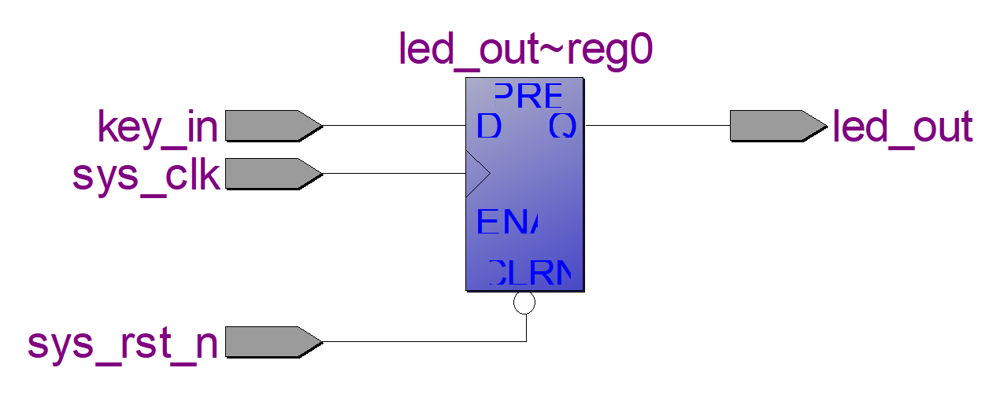

图7

&nbsp;&nbsp;&nbsp;&nbsp;&nbsp;&nbsp;&nbsp;点击“Start Compilation”图标全编译进行布局布线，完成后我们可以看到“Flow Summary”资源使用量报告，如图8所示，可以看到只使用了LE中的一个时序逻辑资源。  
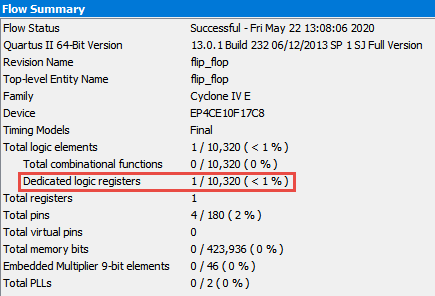

图8

&nbsp;&nbsp;&nbsp;&nbsp;&nbsp;&nbsp;&nbsp;然后打开Chip Planner视图。Chip Planner打开后的界面如图9所示，我们可以看到在版图模型中在同样的位置也有一个块蓝色区域的颜色变深，说明该区域的资源被占用，在FPGA内部硬件结构简介中我们知道这是一个逻辑阵列块LAB，我们将该区域放大。  
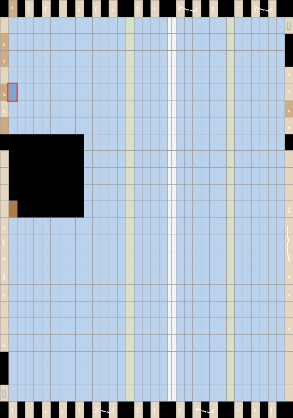

图9

&nbsp;&nbsp;&nbsp;&nbsp;&nbsp;&nbsp;&nbsp;如图10所示，放大后可以看到蓝色变深的区域中有16个小块，这16个小块就是LE，其中只有一个LE的颜色发生了变化，也有蓝色和红色，说明该处的资源被使用了，双击这个LE即可观察其内部的结构。  
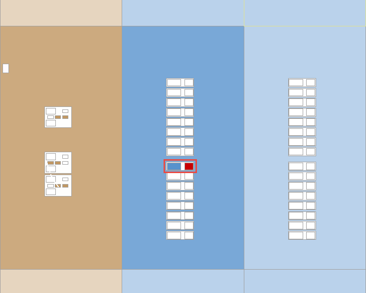

图10

&nbsp;&nbsp;&nbsp;&nbsp;&nbsp;&nbsp;&nbsp;打开LE后内部的结构如图11所示，其中蓝色显示的是真实使用到的结构，灰色的是未使用到的结构，我们可以看到①、②、③为三个输入，其中③为时钟的输入端，②仍为key\_in的输入端，而复位信号①的位置则发生了变化，直接连到了寄存器上。  
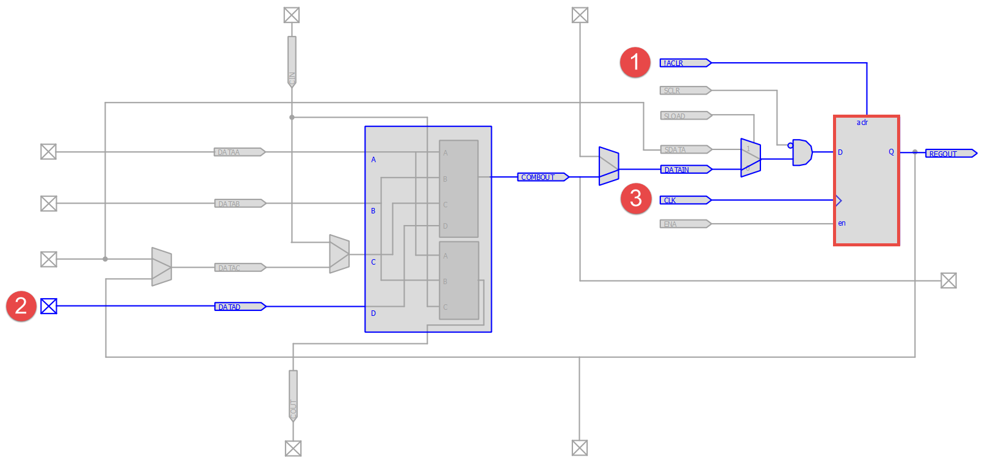

图11

&nbsp;&nbsp;&nbsp;&nbsp;&nbsp;&nbsp;&nbsp;看到这里我们不禁会有两个疑问，异步复位D触发器LE内部结构图明明显示使用了查找表，为什么却在“Flow Summary”资源使用量报告中却显示没有使用该部分资源？为什么同步复位D触发器比异步复位D触发器多使用了一部分资源呢？  
       首先来说第一个问题，虽然异步复位D触发器LE内部结构图明明显示使用了LUT，但是几乎没有任何逻辑需要使用LUT，相当于通过查找表将key\_in信号连接到寄存器的输入端，所以在“Flow Summary”资源使用量报告中显示没有使用该部分资源。  
       然后是第二个问题，如图12所示，我们将寄存器部分的视图放大来看，可以发现该寄存器本身就包含一个异步清零信号“aclr”，且该清零信号还标识为“!ACLR”，也就是低电平有效，这下我们终于明白了为什么代码中使用异步低复位了，因为这部分资源本来就有，不需要额外创造，而如果我们使用同步高复位，就会增加额外的逻辑，需要使用LUT资源，所以同步复位D触发器比异步复位D触发器多使用了一个LUT，大家可以试想一下如果我们使用的很多同步复位D触发器的时候就会占用很多不必要的LUT资源，从而造成资源的浪费，希望大家以后在编写代码的时候注意。  
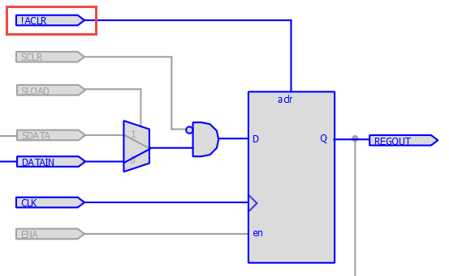

图12

&nbsp;&nbsp;&nbsp;&nbsp;&nbsp;&nbsp;&nbsp;欢迎加入FPGA技术学习交流群，本群致力于为广大FPGAer提供良好的学习交流环境，不定期提供各种本行业相关资料!QQ交流群号：450843130