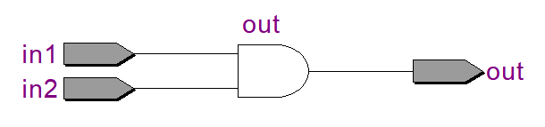
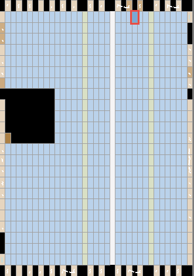
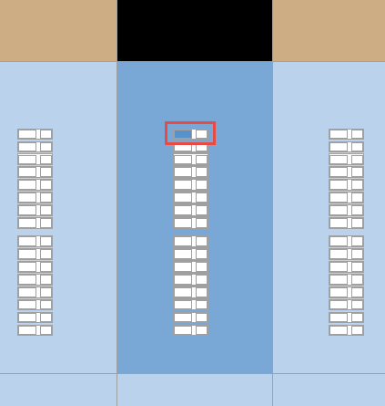
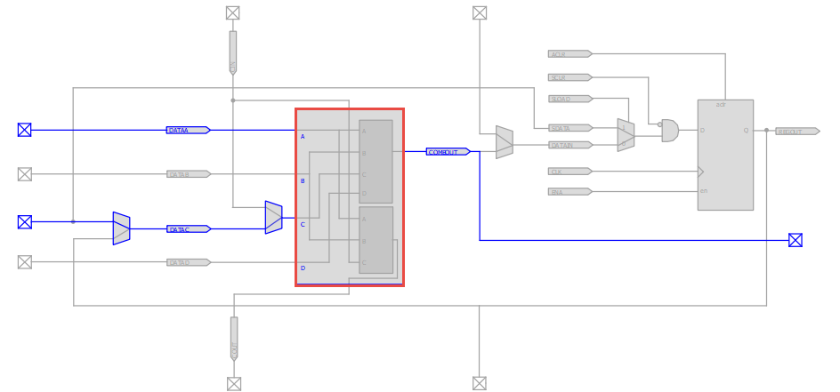
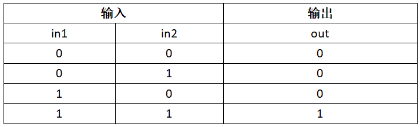
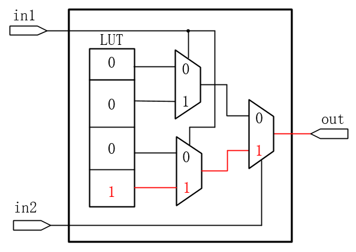

# Verilog代码和FPGA硬件的映射关系(二)
&nbsp;&nbsp;&nbsp;&nbsp;&nbsp;&nbsp;&nbsp;大家可能会有这样的疑问，我们编写的Verilog代码最终会在FPGA上以怎样的映射关系来实现功能呢？我们以一个最简单的组合逻辑与门为例来向大家说明。RTL代码如下所示：

```c
//--------------------------------------------------
01 module	and_logic(				
02 	input 	wire	in1	,	
03 	input	wire	in2	,	
04 
05 	output	wire 	out		
06 );											
07 
08 //out:输出in1与in2相与的结果
09 assign out = in1 & in2;								  
10 
11 endmodule						
//--------------------------------------------------
```

&nbsp;&nbsp;&nbsp;&nbsp;&nbsp;&nbsp;&nbsp;代码编写完后依然需要点击“Start Analysis & Synthesis”图标进行分析和综合。然后双击“Netlist Viewers”下的“RTL Viewer”查看RTL视图。我们可以看到两个输入信号经过一个与门后输出，和我们代码设计的结果是完全一致的。  


图1

&nbsp;&nbsp;&nbsp;&nbsp;&nbsp;&nbsp;&nbsp;点击“Start Compilation”图标全编译进行布局布线，然后打开Chip Planner视图。  
Chip Planner打开后的界面如图2所示，我们可以看到在版图模型中有一个块蓝色区域的颜色变深，说有该区域的资源被占用，在FPGA内部硬件结构简介中我们知道这是一个逻辑阵列块LAB，我们将该区域放大。  


图2

&nbsp;&nbsp;&nbsp;&nbsp;&nbsp;&nbsp;&nbsp;如图3所示，放大后可以看到蓝色变深的区域中有16个小块，这16个小块就是LE，其中只有一个LE的颜色变是蓝色的，说明该处的资源被使用了，双击蓝色的LE即可观察其内部的结构。  


图3

&nbsp;&nbsp;&nbsp;&nbsp;&nbsp;&nbsp;&nbsp;打开LE后内部的结构如图4所示，其中蓝色显示的是真实使用到的结构，灰色的是未使用到的结构，我们可以看到有两个输入和一个输出，与RTL代码的描述是对应的，红色框就是查找表LUT。  


图4

&nbsp;&nbsp;&nbsp;&nbsp;&nbsp;&nbsp;&nbsp;大家可能还是不理解LUT是如何实现我们的与逻辑。我们先来看一下与逻辑的真值表，如下所示：  


图5

&nbsp;&nbsp;&nbsp;&nbsp;&nbsp;&nbsp;&nbsp;根据真值表可以看出输入，两个输入对应的输出一共有4种情况，LUT需要做的工作就是能够根据输入的变化对应输出正确的值。我们可以LUT预先存储所有输出的4种情况，然后判断输入，对应输出就可以了。LUT的内部结构在Chip Planner中并没有表达出来，但是我们可以推断出来，如图5所示，为与门所对应的LUT内部结构图，其中LUT中存储的是4种输出情况，输入信号in1和in2通过多路器选择哪一个存储在LUT中的值输出。图中展示的是当in1和in2输入的值都为1时，我们可以看出存储在LUT的“1”从标注的红色路径中输出到out，LUT中存储的值会在综合工具综合时进行映射。这里我们也不难看出LUT其实所充当的角色就是存储器RAM的功能，更直白一点说LUT就是个小RAM，所以我们也可以用LUT来构成小规模的RAM用于存储数据，LUT所构成的RAM就是我们常说的Distribute RAM，简称为DRAM。  
　

图6

   
 欢迎加入FPGA技术学习交流群，本群致力于为广大FPGAer提供良好的学习交流环境，不定期提供各种本行业相关资料!QQ交流群号：450843130