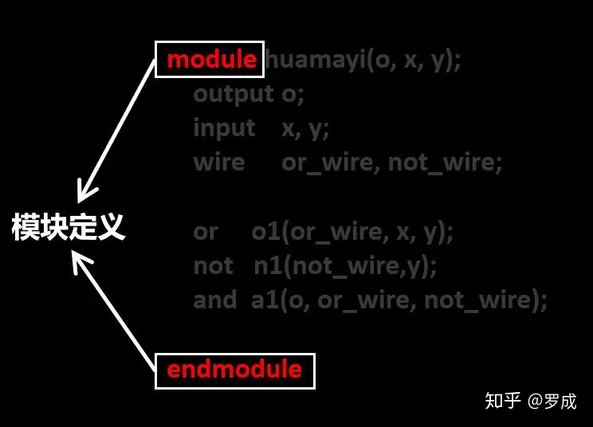
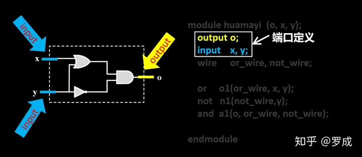

# 5分钟了解Verilog HDL语法结构

## ***1.建模思想***

Verilog HDL中一个重要的思想就是建模，“建模”顾名思义就是“建立模块”的意思，在Verilog HDL中，**模块**是具有一定功能的**电路结构组合**。

FPGA的所有设计可以只有一个模块，也可以有多个模块。
模块内部也可以模块嵌套，即顶层模块由子模块构成，子模块又由下级子模块构成。如下图所示：(对应硬件实体 ，可以大模块内部分成小模块：嵌套；可以多个模块组成一个大模块：并列)

模块的嵌套结构

在设计初期就应该做好建模的规划，也就是模块的功能划分。新手在初期设计的电路往往比较简单，不会涉及很复杂的模块划分。

真正做项目时的设计往往都是系统级的，代码动辄上万行，项目初期期做好系统规划，根据功能将系统划将系统分割成更小的子模块，并规划各模块的接口关系，这样可以多名工程师分别同时设计不同的子模块，最后进行联合调试。

建模技巧还是由对电路系统的功能和结构的熟悉程度决定的。一个好的建模设计要层次清晰，各子模块功能明确，这样不仅使自己写代码时思路清晰，而且也利于别人阅读你的代码。

有的设计师没有建模的概念，写出来的代码只有他自己能够看得懂，甚至时间长了后自己也看不懂。

无论多么复杂的系统，总能划分成多个小的功能模块。系统的设计可以按照下面三个步骤进行：

（1）把系统划分成模块；

（2）规划各模块的接口；

（3）对模块编程并连接各模块完成系统设计。

教科书中告诉我们FPGA的建模方法有**数据流建模**、**结构化建模**、**行为建模**等，在实际做设计的过程中，我们并不care到底用了什么样的建模方法。更多的是根据功能划分模块，然后代码实现各模块功能。

教科书中还告诉了我们，FPGA的设计流程有**自下而上的设计流程**和**自顶向下的设计流程，**两种方法的区别是先设计最底层子模块还是先设计顶层模块。但是在实际的设计过程中，这种概念是很模糊的，初学者不用刻意去在乎。

## ***2.模块概念***

模块（module）是verilog最基本的概念，是verilog设计中的基本单元，每个verilog设计的系统中都由若干module组成。

1、模块的实际意义是代表**硬件电路上的逻辑实体**。

2、每个模块都实现特定的功能。

3、模块之间是**并行**运行的。

4、模块是分层的，高层模块通过调用、连接低层模块的**实例**来实现复杂的功能。

5、各模块连接完成整个系统需要一个**顶层模块**（top-module）。

下面是一个我从YouTube上找到的5分钟介绍Verilog HDL的视频，我进行了翻译并添加了字幕，

视频资源加载失败

**module是层次化设计的基本构件，**下面以视频中的电路结构为例讲解一下Verilog 中module的基本语法结构：

这是一个简单的数字电路，电路功能是 o=(x+y)·（~y）

首先，是***模块声明***，我们用**module**和**endmodule**关键词来标记模块的开始和结束，在module和endmodule之间的代码都是属于本模块的

模块的定义以module关键词开始，以endmodule关键词结束

其次，是**模块名**，比如这里我们将这个模块取名为huamayi，模块名是例化模块时的声明凭证。比如我设计了一种A型号的窗户，盖房子时，在房子上放置A窗户就是例化的过程。

在一个工程中，模块名是唯一的，本模块取名为huamayi

接下来我们将描述模块的**端口列表**，我们的电路结构有三个对外端口，每个端口都需要给出一个名称，我们示例电路的对外端口分别是o,x,y

端口列表需要列出模块的所有对外端口

还需要列出所有**端口的输入输出类型**，也就是端口定义，端口定义有三种：常见的input，output，还有inout。input为输入端口，output为输出端口，inout是双向端口，既能输出也能输入，多用数据总线。示例电路中output 为o，input 为x，y：代码表示如下图

端口定义

**逻辑功能定义**，这是一个module最重要的部分，它描述了这个module的功能，在本例子中，通过例化与、或、非门来定义模块逻辑功能，Verilog中内置了14种基本门级元件，我们可以像例化其他模块一样例化与、或、非门，在例化模块时，需要为例化的模块指定一个名称，此名称在本模块内是唯一的。

在一座房子里面可以有两个相同的模块都叫窗户，但名称不会相同，比如一个叫做卧室窗户，一个叫做客厅窗户；同样的也可以在一个电路中例化一个模块多次，只要例化后的名字不一样既可以，比如可以例化两个或门分别叫o1和o2。在本例子电路中，分别例化了与、或、非门各一个（o1、n1、a1）。

例化完了与、或、非门，还应描述它们在电路中的连接关系，或门的两个输入分别连接至电路模块的输入端x和y，但是或门的输出端连接至了与门的输入，它们之间的连线是个内部信号，需要定义一个wire（线网）**信号类型**or\_wire，那么这个或门o1的连接关系应该如何表示呢。

在Verilog内置的原语中，规定了基本门元件的信号列表里输入在前，输出在后，

所以或o1的连接关系应该是or o1(or\_wire, x, y);

同理，定义wire类型信号not\_wire;

非门n1和与门a1的连接关系也确定了：

not n1(not\_wire,y);

and a1(o, or\_wire, not\_wire);

整个电路的Verilog HDL代码描述到此结束，你可以看到verilog代码与电路之间有明确的对应关系。

上面的例子是结构级建模方法，最后，我们再以一个半加器行为级建模的例子总结一下Verilog HDL模块的语法要素：

## **3.本讲语法总结**

**1.空白符：**使用空白符是为了提高可读性及代码组织。Verilog忽略空白符，除非用于分开其它的语言标记（注释和打印输出）。

**2.注释：**注释语法有两种

第一种注释为双斜杠“//”，只能注释单行

第二种注释以“/\*”开始，以“\*/”结束，可一次注释多行

**3.标识符：**标识符是*用户在描述时给Verilog对象起的名字*，比如例子中的模块名huamayi，端口名字x、y、o，以及例化的基本门元件o1、n1、a1等。*标识符必须以字母(a-z, A-Z)或( \_ )开头*，后面可以是字母、数字、( $ )或( \_ )。如下图中的红字都是用户定义的标识符。

例子电路中的标识符

**4.关键字：**verilog中定义了一些关键字，如module、output、or、wire等，verilog关键字区分大小写，所有关键字都要求小写。在代码编辑器中，所有的关键字会高亮显示

关键字举例

**5.基本门级元件：**Verilog HDL中有关门类型的关键字共有26个（14个是门级元件，12个为开关级元件）。

但是常用到的只有8个，其他的完全不用掌握。下面列出了八个基本的门类（GATETYPE关键字和它们所表示的门的类型：

*   and-与门
*   nand-与非门
*   nor-或非门
*   or -或门
*   xor -异或门
*   xnor-异或非门
*   buf -缓冲器
*   not -非门

**6.wire与reg：下期讲**

**7.操作符：下期讲**

**8.assign赋值语句：下期讲**

Q:
1.在信号类型声明图 上面有句“在Verilog内置的原语中，规定了基本门元件的信号列表里输入在前，输出在后，”应该是输出在前，输入在后吧？
2.端口列表是输入信号在前还是输出信号在前呢，前后例子不一样
A:
调用与或非门等基本元件时，必须严格按照输出在前、输入在后的原则例化，自己写的模块不用这样严格遵守，因为我们自己写的模块端口可能会很多，而且在调试、修改等过程中可能还会增减端口。

其实，归根到底这是一个模块例化的问题。后续我还会讲模块例化的两种方式。