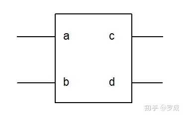

# Verilog语法之一：简单的Verilog HDL模块
## **1.简单的Verilog HDL程序介绍**

下面先介绍几个简单的Verilog HDL程序,然后从中分析Verilog HDL程序的特性。

例\[1\]:*module...endmodule*

```verilog
module adder ( count,sum,a,b,cin );
     input [2:0] a,b;
     input cin;
     output count;
     output [2:0] sum;
     assign {count,sum} = a + b + cin;
endmodule
```

这个例子通过连续赋值语句描述了一个名为adder的三位加法器可以根据两个三比特数a、b和进位（cin）计算出和（sum）和进位（count）。 从例子中可以看出整个Verilog HDL程序是嵌套在**module**和 **endmodule** 声明语句里的。

例\[2\]：*注释*

```verilog
module compare ( equal,a,b );
    output equal;  //声明输出信号equal
    input [1:0] a,b;  //声明输入信号a,b
    assign equal=（a==b）？1：0; 
    /*如果a、b 两个输入信号相等,输出为1。否则为0*/
endmodule
```

这个程序通过连续赋值语句描述了一个名为compare的比较器。对两比特数 a、b 进行比较，如a与b相等，则输出equal为高电平，否则为低电平。在这个程序中,/\*........\*/和//.........表示注释部分,注释只是为了方便程序员理解程序,对编译是不起作用的。

例\[3\]：*基本元件*

```verilog
module trist2(out,in,enable);
    output out;
    input in, enable;
    bufif1 mybuf(out,in,enable);
endmodule
```

这个程序描述了一个名为trist2的三态驱动器。程序通过调用一个在Verilog语言库中现存的三态驱动器实例元件bufif1来实现其功能。

例\[4\]：*模块调用（例化）*

```verilog
module trist1(out,in,enable);
    output out;
    input in, enable;
    mytri tri_inst(out,in,enable); 
    //调用由mytri模块定义的实例元件tri_inst
endmodule
 
module mytri(out,in,enable);
    output out;
    input in, enable;
    assign out = enable? in : 'bz;
endmodule
```

这个程序例子通过另一种方法描述了一个三态门。在这个例子中存在着两个模块。模块trist1调用由模块mytri定义的实例元件tri\_inst。模块trist1是顶层模块。模块mytri则被称为子模块。

通过上面的例子可以看到:

*   · Verilog HDL程序是由模块构成的。每个模块的内容都是嵌在**module**和**endmodule**两个语句之间。每个模块实现特定的功能。模块是可以进行**层次嵌套**的。正因为如此,才可以将大型的数字电路设计分割成不同的小模块来实现特定的功能,最后通过顶层模块调用子模块来实现整体功能。
*   · 每个模块要进行**端口定义**,并说明输入输出口,然后对模块的功能进行行为逻辑描述。
*   · Verilog HDL程序的书写格式自由,一行可以写几个语句,一个语句也可以分写多行。
*   · 除了endmodule语句外,每个语句和数据定义的最后**必须有分号**。
*   · 可以用**/\*.....\*/**和**//**.......对Verilog HDL程序的任何部分作注释。一个好的,有使用价值的源程序都应当加上必要的注释,以增强程序的可读性和可维护性。

## **2.模块的结构**

Verilog的基本设计单元是“模块”(block)。一个模块是由两部分组成的，一部分描述接口，另一部分描述逻辑功能，即定义输入是如何影响输出的。下面举例说明：

```verilog
 module block (a,b,c,d);
     input a,b;
     output c,d;
 
     assign c= a | b ;
     assign d= a & b;
 endmodule
```



请看上面的例子，程序模块下边是一个电路图的符号。在许多方面，程序模块和电路图符号是一致的，这是因为电路图符号的引脚也就是程序模块的接口。而程序模块描述了电路图符号所实现的逻辑功能。上面的Verilog设计中，模块中的第二、第三行说明接口的信号流向，第四、第五行说明了模块的逻辑功能。以上就是设计一个简单的Verilog程序模块所需的全部内容。

从上面的例子可以看出，Verilog结构完全嵌在**module**和**endmodule**声明语句之间，每个Verilog程序包括四个主要部分：**端口定义、I/O说明、内部信号声明、功能定义**。

## **3.模块的端口定义**

模块的端口声明了模块的输入输出口。其格式如下：

```verilog
module  模块名(口1，口2，口3，口4, ………);
```

## **4.模块内容**

模块的内容包括I/O说明、内部信号声明、功能定义。

***I/O说明的格式如下：***

```verilog
输入口： input 端口名1，端口名2，………,端口名i; //(共有i个输入口)
输出口： output 端口名1，端口名2，………,端口名j; //(共有j个输出口)
```

I/O说明也可以写在端口声明语句里。其格式如下：

```verilog
module module_name(input port1,input port2,…
output port1,output port2… );
```

***内部信号说明：***

在模块内用到的和与端口有关的wire 和 reg 变量的声明。

如：

```verilog
reg [width-1 : 0] R变量1，R变量2 。。。。；
wire [width-1 : 0] W变量1，W变量2 。。。。；
………..
```

***功能定义**:*

模块中最重要的部分是逻辑功能定义部分。有三种方法可在模块中产生逻辑。

1）.**用“assign”声明语句**

```verilog
如： assign a = b & c;
```

这种方法的句法很简单，只需写一个“assign”，后面再加一个方程式即可。例子中的方程式描述了一个有两个输入的与门。

2）.**用实例元件**

```verilog
如： and and_inst( q, a, b );
```

采用实例元件的方法象在电路图输入方式下，调入库元件一样。键入元件的名字和相连的引脚即可，表示在设计中用到一个跟与门（and）一样的名为and\_inst的与门，其输入端为a, b，输出为q。要求每个实例元件的名字必须是唯一的，以避免与其他调用与门（and）的实例混淆。

3）.**用“always”块**

如：

```verilog
always @(posedge clk or posedge clr)
begin
   if(clr)  q <= 0;
   else  if(en) q <= d;
end
```

**采用“assign”语句是描述组合逻辑最常用的方法之一**。**而“always”块既可用于描述组合逻辑也可描述时序逻辑**。上面的例子用“always”块生成了一个带有异步清除端的D触发器。“always”块可用很多种描述手段来表达逻辑，例如上例中就用了if...else语句来表达逻辑关系。如按一定的风格来编写“always”块，可以通过综合工具把源代码自动综合成用门级结构表示的组合或时序逻辑电路。

**注意：**

如果用Verilog模块实现一定的功能，首先应该清楚哪些是同时发生的,哪些是顺序发生的。上面三个例子分别采用了“**assign**”语句、**实例元件**和“**always**”块。这三个例子描述的逻辑功能是同时执行的。也就是说，**如果把这三项写到一个 VeriIog 模块文件中去，它们的次序不会影响逻辑实现的功能。这三项是同时执行的，也就是并发的**。

然而，在“always”模块内，逻辑是按照指定的**顺序执行**的。“always”块中的语句称为“顺序语句”，因为它们是顺序执行的。请注意，**两个或更多的“always”模块也是同时执行的，但是模块内部的语句是顺序执行的**。 看一下“always”内的语句，你就会明白它是如何实现功能的。 if..else… if必须顺序执行，否则其功能就没有任何意义。如果else语句在if语句之前执行，功能就会不符合要求！为了能实现上述描述的功能，“always”模块内部的语句将按照书写的顺序执行。