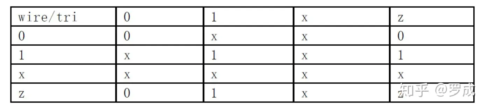
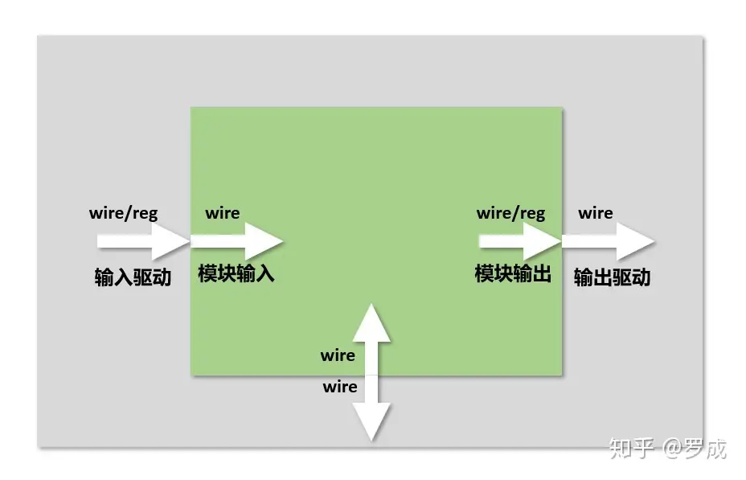

# Verilog语法之三：变量
变量即在程序运行过程中其值可以改变的量,在Verilog HDL中变量的数据类型有很多种,这里只对常用的几种进行介绍。

**网络数据类型表示结构实体(例如门)之间的物理连接。**网络类型的变量**不能储存值**，而且它必需受到驱动器(例如门或连续赋值语句，assign)的驱动。

如果没有驱动器连接到网络类型的变量上，则该变量就是高阻的，即其值为**z**。**常用的网络数据类型包括wire型和tri型**。这两种变量都是用于连接器件单元，它们具有相同的语法格式和功能。

之所以提供这两种名字来表达相同的概念是为了与模型中所使用的变量的实际情况相一致。wire型变量通常是用来表示单个门驱动或连续赋值语句驱动的网络型数据，tri型变量则用来表示多驱动器驱动的网络型数据。

如果wire型或tri型变量没有定义逻辑强度(logic strength)，在多驱动源的情况下，逻辑值会发生冲突从而产生不确定值。下表为wire型和tri型变量的真值表。



## **一． wire型**

**wire型数据常用来表示用于以assign关键字指定的组合逻辑信号**。Verilog程序模块中输入输出信号类型缺省时自动定义为wire型。wire型信号可以用作任何方程式的输入，也可以用作“assign”语句或实例元件的输出。

wire型信号的格式同reg型信号的很类似。其格式如下：

```verilog
wire [n-1:0] 数据名1,数据名2,…数据名i; //共有i条总线，每条总线内有n条线路 
```

或

```verilog
wire [n:1] 数据名1,数据名2,…数据名i; 
```

wire是wire型数据的确认符，**\[n-1:0\]和\[n:1\]代表该数据的位宽**，即该数据有几位。最后跟着的是数据的名字。如果一次定义多个数据，数据名之间用逗号隔开。声明语句的最后要用分号表示语句结束。看下面的几个例子。

```verilog
wire a; //定义了一个一位的wire型数据
wire [7:0] b; //定义了一个八位的wire型数据
wire [4:1] c, d; //定义了二个四位的wire型数据
```

## **二． reg型**

**寄存器是数据储存单元的抽象**。寄存器数据类型的关键字是reg。通过赋值语句可以改变寄存器储存的值，其作用与改变触发器储存的值相当。

Verilog HDL语言提供了功能强大的结构语句使设计者能有效地控制是否执行这些赋值语句。这些控制结构用来描述硬件触发条件，例如时钟的上升沿和多路器的选通信号。reg类型数据的缺省初始值为不定值，x。

reg型数据常用来表示用于“always”模块内的指定信号，常**代表触发器**。通常，在设计中要由“always”块通过使用行为描述语句来表达逻辑关系。**在“always”块内被赋值的每一个信号都必须定义成reg型。**

reg型数据的格式如下：

```verilog
reg [n-1:0] 数据名1,数据名2,… 数据名i;
```

或

```verilog
reg [n:1]  数据名1,数据名2,… 数据名i;
```

reg是reg型数据的确认标识符，\[n-1:0\]和\[n:1\]代表该数据的位宽，即该数据有几位（bit)。最后跟着的是数据的名字。如果一次定义多个数据，数据名之间用逗号隔开。声明语句的最后要用分号表示语句结束。看下面的几个例子：

```verilog
reg rega; //定义了一个一位的名为rega的reg型数据
reg [3:0]  regb; //定义了一个四位的名为regb的reg型数据
reg [4:1] regc, regd; //定义了两个四位的名为regc和regd的reg型数据
```

**对于reg型数据，其赋值语句的作用就象改变一组触发器的存储单元的值**。

在Verilog中有许多构造(construct)用来控制何时或是否执行这些赋值语句。这些控制构造可用来描述硬件触发器的各种具体情况，如触发条件用时钟的上升沿等，或用来描述具体判断逻辑的细节，如各种多路选择器。

**reg型数据的缺省初始值是不定值x。**reg型数据可以赋正值，也可以赋负值。但当一个reg型数据是一个表达式中的操作数时，它的值被当作是无符号值，即正值。例如：当一个四位的寄存器用作表达式中的操作数时，如果开始寄存器被赋以值-1,则在表达式中进行运算时，其值被认为是+15。

**注意：**

reg型只表示被定义的信号将用在“always”块内，理解这一点很重要。并不是说reg型信号一定是寄存器或触发器的输出。虽然reg型信号常常是寄存器或触发器的输出，但并不一定总是这样。

初学者往往会对wire和reg的用法混淆，下面是对**wire和reg用法的总结:**

***wire用法总结***

1.wire可以在Verilog中表示任意宽度的单线/总线

2.wire可以用于模块的输入和输出端口以及一些其他元素并在实际模块声明中

3.wire不能存储值（无状态），并且不能在always @块内赋值（=或<=）左侧使用。

4\. wire是assign语句左侧唯一的合法类型

5.wire只能用于组合逻辑

***reg用法总结***

1\. 类似于电线，但可以存储信息（有内存，有状态）允许连接到模块的输入端口，但不能连接到实例化的输出

2\. 在模块声明中，reg可以用作输出，但不能用作输入

3\. 在always@(......)语句块内，= 或者 <= 赋值语句的左边必须是是reg变量

在initial语句块内，= 赋值语句的左边必须是是reg变量

4\. Reg不能用于assign赋值语句的左侧

5\. 当与@（posedge clock）块一起使用时，reg可用于创建寄存器

6\. reg可用于组合逻辑和时序逻辑



***构建一个模块module时**，*

input必须是wire

output可以是wire也可以是reg

inout必须是wire

***例化模块时**，*

外部连接input端口的可以是wire也可以是reg

外部连接output端口的必须是wire

外部连接inout端口的必须是wire

## **三． memory型**

Verilog HDL通过对reg型变量建立数组来对存储器建模，可以描述RAM型存储器，ROM存储器和reg文件。数组中的每一个单元通过一个数组索引进行寻址。在Verilog语言中没有多维数组存在。 memory型数据是通过扩展reg型数据的地址范围来生成的。其格式如下：

```verilog
reg [n-1:0] 存储器名[m-1:0]；
```

在这里，reg\[n-1:0\]定义了存储器中每一个存储单元的大小，即该存储单元是一个n位的寄存器。存储器名后的\[m-1:0\]或\[m:1\]则定义了该存储器中有多少个这样的寄存器。最后用分号结束定义语句。下面举例说明：

```verilog
reg [7:0] mema[255:0];
```

这个例子定义了一个名为mema的存储器，该存储器有256个8位的存储器。该存储器的地址范围是0到255。**注意：对存储器进行地址索引的表达式必须是常数表达式。**

另外，在同一个数据类型声明语句里，可以同时定义**存储器**型数据和reg型数据。见下例：

```verilog
parameter wordsize=16, //定义二个参数。
memsize=256;
reg [wordsize-1:0] mem[memsize-1:0],writereg, readreg;
```

尽管memory型数据和reg型数据的定义格式很相似，但要注意其不同之处。如一个由n个1位寄存器构成的存储器组是不同于一个n位的寄存器的。见下例：

```verilog
reg [n-1:0] rega;  //一个n位的寄存器
reg mema [n-1:0]; //一个由n个1位寄存器构成的存储器组 
```

**一个n位的寄存器可以在一条赋值语句里进行赋值，而一个完整的存储器则不行。**见下例：

```verilog
rega =0; //合法赋值语句
mema =0; //非法赋值语句 
```

如果想对memory中的存储单元进行读写操作，必须指定该单元在存储器中的地址。下面的写法是正确的。

```verilog
mema[3]=0; //给memory中的第3个存储单元赋值为0。
```

进行寻址的地址索引可以是表达式，这样就可以对存储器中的不同单元进行操作。表达式的值可以取决于电路中其它的寄存器的值。例如可以用一个加法计数器来做RAM的地址索引。