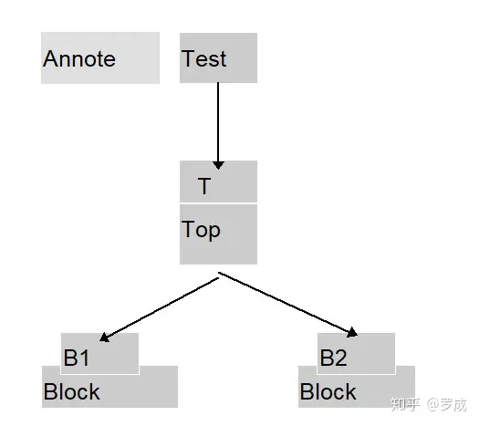

# Verilog语法之二：常量
Verilog HDL中总共有十九种数据类型,数据类型是用来表示数字电路硬件中的数据储存和传送元素的。我们先只介绍四个最基本的数据类型，它们是：

**reg型、wire型、integer型、parameter型**

其它的类型如下：

large型、medium型、scalared型、time型、small型、tri型、trio型、tri1型、triand型、trior型、trireg型、vectored型、wand型、wor型。这些数据类型除time型外都与基本逻辑单元建库有关，与系统设计没有很大的关系，我们**无需刻意去掌握**。

在一般电路设计自动化的环境下，仿真用的基本部件库是由半导体厂家和EDA工具厂家共同提供的。**系统设计工程师不必过多地关心门级和开关级的Verilog HDL语法现象。**

## **一．常量之数字**

1.**整数**:

在Verilog HDL中,整型常量即整常数有以下四种进制表示形式:

1) 二进制整数(b或B)

2) 十进制整数(d或D)

3) 十六进制整数(h或H)

4) 八进制整数(o或O)

数字表达方式有以下三种:

1) <位宽><进制><数字>这是一种全面的描述方式。

2) <进制><数字>在这种描述方式中,数字的位宽采用缺省位宽(这由具体的机器系统决定,但至少32位)。

3) <数字>在这种描述方式中,采用缺省进制十进制。

在表达式中,位宽指明了数字的精确位数。例如:一个4位二进制数的数字的位宽为4,一个4位十六进制数的数字的位宽为16(因为每单个十六进制数就要用4位二进制数来表示)。见下例:

```verilog
8'b10101100 //位宽为8的数的二进制表示, 'b表示二进制
8'ha2 //位宽为8的数的十六进制，'h表示十六进制。
```

2.**x和z值:**

在数字电路中,**x**代表不定值,**z**代表高阻值。

一个x可以用来定义十六进制数的四位二进制数的状态,八进制数的三位,二进制数的一位。

**z**的表示方式同x类似。**z**还有一种表达方式是可以写作**?**。在使用case表达式时建议使用这种写法,以提高程序的可读性。见下例:

```verilog
4'b10x0 //位宽为4的二进制数从低位数起第二位为不定值
4'b101z //位宽为4的二进制数从低位数起第一位为高阻值
12'dz //位宽为12的十进制数其值为高阻值(第一种表达方式)
12'd? //位宽为12的十进制数其值为高阻值(第二种表达方式)
8'h4x //位宽为8的十六进制数其低四位值为不定值
```

3.**负数:**

一个数字可以被定义为负数,只需在位宽表达式前加一个减号,减号必须写在数字定义表达式的最前面。注意减号不可以放在位宽和进制之间也不可以放在进制和具体的数之间。见下例:

```verilog
-8'd5 //这个表达式代表5的补数（用八位二进制数表示)
8'd-5 //非法格式
```

4.**下划线(underscore\_):**

下划线可以用来分隔开数的表达以提高程序可读性。但不可以用在位宽和进制处,只能用在具体的数字之间。见下例:

```verilog
16'b1010_1011_1111_1010  //合法格式
8'b_0011_1010  //非法格式
```

当常量不说明位数时，默认值是32位，每个字母用8位的ASCII值表示。

例：

```verilog
10＝32'd10＝32'b1010
1=32'd1=32'b1
-1=-32'd1=32'hFFFFFFFF
‘BX=32'BX=32'BXXXXXXX…X
“AB”=16'B01000001_01000010
```

## **二．常量之参数(Parameter)**

在Verilog HDL中用parameter来定义常量,即用parameter来定义一个标识符代表一个常量,称为符号常量,即标识符形式的常量,采用标识符代表一个常量可提高程序的可读性和可维护性。parameter型数据是一种常数型的数据，其说明格式如下：

```verilog
parameter 参数名1＝表达式，参数名2＝表达式, …， 参数名n＝表达式;
```

parameter是参数型数据的确认符，确认符后跟着一个用逗号分隔开的赋值语句表。在每一个赋值语句的右边必须是一个常数表达式。

也就是说，该表达式只能包含数字或先前已定义过的参数。见下列：

```verilog
parameter msb=7;  //定义参数msb为常量7
parameter e=25, f=29; //定义二个常数参数
parameter r=5.7;  //声明r为一个实型参数
parameter byte_size=8, byte_msb=byte_size-1; //用常数表达式赋值
parameter average_delay = (r+f)/2;  //用常数表达式赋值
```

参数型常数经常用于定义延迟时间和变量宽度。在模块或实例引用时可通过参数传递改变在被引用模块或实例中已定义的参数。下面将通过两个例子进一步说明在层次调用的电路中改变参数常用的一些用法。

\[例\]：在引用Decode实例时，D1，D2的Width将采用不同的值4和5，且D1的Polarity将为0。可用例子中所用的方法来改变参数，即用 #(4,0)向D1中传递 Width=4,Polarity=0; 用#(5)向D2中传递Width=5,Polarity仍为1。

```verilog
module Decode(A,F);
parameter Width=1, Polarity=1;
……………
endmodule

module Top;
wire[3:0] A4;
wire[4:0] A5;
wire[15:0] F16;
wire[31:0] F32;
Decode #(4,0) D1(A4,F16);
Decode #(5) D2(A5,F32);
endmodule
```

\[例\]：下面是一个多层次模块构成的电路，在一个模块中改变另一个模块的参数时，需要使用defparam命令

```verilog
module Test;
 wire W;
 Top T ( );
endmodule
 
module Top;
 wire W
 Block B1 ( );
 Block B2 ( );
endmodule
 
module Block;
 parameter P = 0;
endmodule
 
module Annotate;
 defparam 
 Test.T.B1.P = 2,
 Test.T.B2.P = 3;
endmodule       
```



-1=-32'd1=32'hFFFFFFFF，请问这句怎么理解           补码

“AB”=16'B01000001_01000010这句怎么解读       A和B ascii码的二进制值