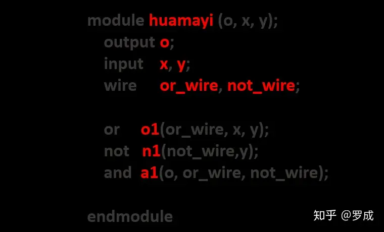
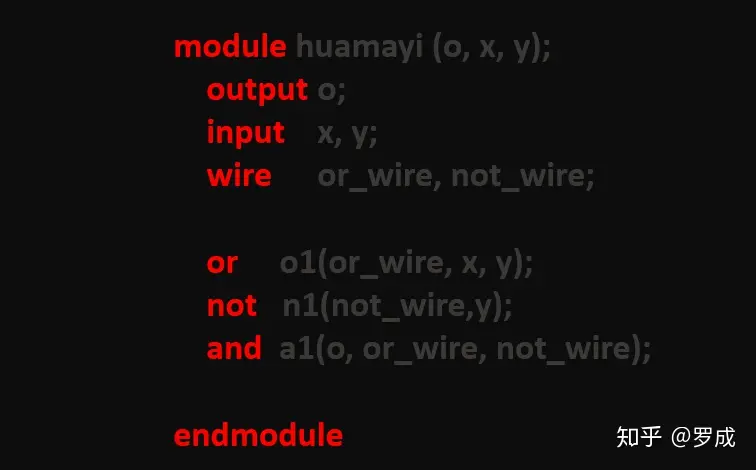

# Verilog语法之五：标识符与关键字
## 1 标识符

标识符是*用户在描述时给Verilog对象起的名字*，比如例子中的模块名huamayi，端口名字x、y、o，以及例化的基本门元件o1、n1、a1等。

***标识符必须以字母(a-z, A-Z)或( \_ )开头*，后面可以是字母、数字、( $ )或( \_ )**。如下图中的红字都是用户定义的标识符。

## 2 关键字

在Verilog HDL中，所有的关键词是事先定义好的确认符,用来组织语言结构。关键词是用小写字母定义的,因此在编写原程序时要注意关键词的书写,以避免出错。

下图中的红字就是一些关键字的例子。

**关键词无需特意无记忆**，下面是Verilog HDL中使用的关键词：

always， and， assign，deassign，begin，buf，bufif0，bufif1，case，casex，casez，cmos， default，defparam，disable，edge，else，end，endcase，endmodule，endfunction，endprimitive, endspecify, endtable， endtask， event， for， force， forever， fork， function，highz0， highz1, if，initial, inout, input，integer，join,large，macromodule，medium，module， nand，negedge，nmos，nor，not，notif0，notifl, or, output, parameter, pmos, posedge, primitive, pull0, pull1, pullup, pulldown, rcmos, reg, releses, repeat, mmos, rpmos, rtran, rtranif0,rtranif1,scalared,small，specify，specparam，strength，strong0, strong1, supply0, supply1, table, task, time, tran, tranif0, tranif1, tri, tri0, tri1, triand, trior， trireg，vectored，wait，wand，weak0，weak1，while， wire，wor, xnor， xor

**注意在编写Verilog HDL程序时,变量的定义不要与这些关键词冲突。**