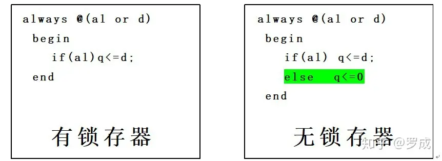

# Verilog语法之八：条件语句
## **1\. if\_else语句**

if语句是用来判定所给定的条件是否满足，根据判定的结果（真或假)决定执行给出的两种操作之一。Verilog HDL语言提供了三种形式的if语句。

**(1). if(表达式)语句**

例如：

```verilog
 if ( a > b ) 
    out1 <= int1;
```

**(2).if(表达式) 语句1**

**else 语句2**

例如：

```verilog
 if(a>b) 
     out1<=int1;
 else  
     out1<=int2;
```

**(3).if(表达式1) 语句1;**

**else if(表达式2) 语句2;**

**else if(表达式3) 语句3;**

**........**

**else if(表达式m) 语句m;**

**else 语句n;**

例如：

```verilog
if(a>b) out1<=int1;
else if(a==b) out1<=int2;
else out1<=int3;
```

**六点说明：**

(1).三种形式的if语句中在if后面都有“表达式”，一般为逻辑表达式或关系表达式。系统对表达式的值进行判断，**若为0,x,z，按“假”处理，若为1，按“真”处理**，执行指定的语句。

(2) .第二、第三种形式的if语句中，在每个else前面有一分号，整个语句结束处有一分号。

例如：


这是由于分号是Verilog HDL语句中不可缺少的部分，这个分号是if语句中的内嵌套语句所要求的。如果无此分号，则出现语法错误。但应注意，不要误认为上面是两个语句（if语句和else语句)。它们都属于同一个if语句。else子句不能作为语句单独使用，它必须是if语句的一部分，与if配对使用。

(3).在if和else后面可以包含一个内嵌的操作语句(如上例)，也可以有多个操作语句，此时用begin和end这两个关键词将几个语句包含起来成为一个复合块语句。如：

```verilog
if(a>b)
    begin
     out1<=int1;
     out2<=int2;
    end

else
    begin
     out1<=int2;
     out2<=int1;
    end
```

注意在end后不需要再加分号。因为begin\_end内是一个完整的复合语句，不需再附加分号。

(4).允许一定形式的表达式简写方式。如下面的例子：

```verilog
if(expression) 等同与 if( expression == 1 )
if(！expression) 等同与 if( expression != 1 )
```

(5).if语句的嵌套

在if语句中又包含一个或多个if语句称为if语句的嵌套。一般形式如下:

```verilog
if(expression1)
    if(expression2) 语句1 (内嵌if)
    else 语句2
else
    if(expression3) 语句3 (内嵌if)
    else 语句4
```

应当注意if与else的配对关系，else总是与它上面的最近的if配对。如果if与else的数目不一样,为了实现程序设计者的企图,可以用begin\_end块语句来确定配对关系。例如:

```verilog
if( )
    begin 
        if( ) 语句1 (内嵌if)
    end
else
    语句2
```

这时begin\_end块语句限定了内嵌if语句的范围，因此else与第一个if配对。注意begin\_end块语句在if\_else语句中的使用。因为有时begin\_end块语句的不慎使用会改变逻辑行为。见下例：

```verilog
if(index>0)
    for(scani=0;scani<index;scani=scani+1)
        if(memory[scani]>0)
            begin
                $display("...");
                memory[scani]=0;
            end
else /*WRONG*/
$display("error-indexiszero");
```

尽管程序设计者把else写在与第一个if(外层if)同一列上，希望与第一个if对应，但实际上else是与第二个if对应，因为它们相距最近。正确的写法应当是这样的：

```verilog
if(index>0)
    begin
    for(scani=0;scani<index;scani=scani+1)
        if(memory[scani]>0)
            begin
                $display("...");
                memory[scani]=0;
            end
    end
 
else /*WRONG*/
 $display("error-indexiszero");
```

(6).if\_else例子

下面的例子是取自某程序中的一部分。这部分程序用if\_else语句来检测变量index以决定三个寄存器modify\_segn中哪一个的值应当与index相加作为memory的寻址地址。并且将相加值存入寄存器index以备下次检测使用。程序的前十行定义寄存器和参数。

```verilog
 //定义寄存器和参数。
reg [31:0] instruction, segment_area[255:0];
reg [7:0] index;
reg [5:0] modify_seg1, modify_seg2, modify_seg3;
parameter
    segment1=0, inc_seg1=1,
    segment2=20, inc_seg2=2,
    segment3=64, inc_seg3=4,
    data=128;
//检测寄存器index的值
if(index<segment2)
    begin
        instruction = segment_area[index + modify_seg1];
        index = index + inc_seg1;
    end
else if(index<segment3)
    begin
        instruction = segment_area[index + modify_seg2];
        index = index + inc_seg2;
    end
else if (index<data)
    begin
       instruction = segment_area[index + modify_seg3]; 
       index = index + inc_seg3;
    end
else
instruction = segment_area[index];
```

## **2\. case语句**

case语句是一种多分支选择语句，if语句只有两个分支可供选择，而实际问题中常常需要用到多分支选择，Verilog语言提供的case语句直接处理多分支选择。它的一般形式如下:

1) **case**(表达式) <case分支项> endcase

2) **casez**(表达式) <case分支项> endcase

3) **casex**(表达式) <case分支项> endcase

case分支项的一般格式如下:

```text
分支表达式:         语句
缺省项(default项):  语句
```

**说明:**

a) case括弧内的表达式称为控制表达式，case分支项中的表达式称为分支表达式。控制表达式通常表示为控制信号的某些位，分支表达式则用这些控制信号的具体状态值来表示，因此分支表达式又可以称为常量表达式。

b) 当控制表达式的值与分支表达式的值相等时，就执行分支表达式后面的语句。如果所有的分支表达式的值都没有与控制表达式的值相匹配的，就执行default后面的语句。

c) default项可有可无，一个case语句里只准有一个default项。

下面是一个简单的使用case语句的例子。该例子中对寄存器rega译码以确定result的值。

```verilog
reg [15:0] rega;
reg [9:0] result;
case(rega)
16 'd0: result = 10 'b0111111111;
16 'd1: result = 10 'b1011111111;
16 'd2: result = 10 'b1101111111;
16 'd3: result = 10 'b1110111111;
16 'd4: result = 10 'b1111011111;
16 'd5: result = 10 'b1111101111;
16 'd6: result = 10 'b1111110111;
16 'd7: result = 10 'b1111111011;
16 'd8: result = 10 'b1111111101;
16 'd9: result = 10 'b1111111110;
default： result = 'bx;
endcase
```

d) 每一个case分项的分支表达式的值必须互不相同，否则就会出现矛盾现象(对表达式的同一个值，有多种执行方案)。

e) 执行完case分项后的语句，则跳出该case语句结构，终止case语句的执行。

f) 在用case语句表达式进行比较的过程中，只有当信号的对应位的值能明确进行比较时，比较才能成功。因此要注意详细说明case分项的分支表达式的值。

g) case语句的所有表达式的值的位宽必须相等，只有这样控制表达式和分支表达式才能进行对应位的比较。***一个经常犯的错误是用'bx, 'bz 来替代 n'bx, n'bz，这样写是不对的，因为信号x, z的缺省宽度是机器的字节宽度，通常是32位(此处 n 是case控制表达式的位宽)。***

下面将给出 **case, casez, casex** 的真值表：


***case语句与if\_else\_if语句的区别主要有两点:***

1) 与case语句中的控制表达式和多分支表达式这种比较结构相比，if\_else\_if结构中的条件表达式更为直观一些。

2) 对于那些分支表达式中存在不定值x和高阻值z位时,case语句提供了处理这种情况的手段。下面的两个例子介绍了处理x,z值位的case语句。

\[例1\]:

```verilog
case ( select[1:2] )
2 'b00: result = 0;
2 'b01: result = flaga;
2 'b0x,
2 'b0z: result = flaga? 'bx : 0;
2 'b10: result = flagb;
2 'bx0,
2 'bz0: result = flagb? 'bx : 0;
default: result = 'bx;
endcase
```

\[例2\]:

```verilog
case(sig)
1 'bz: $display("signal is floating");
1 'bx: $display("signal is unknown");
default:  $display("signal is %b", sig);
endcase
```

Verilog HDL针对电路的特性提供了case语句的其它两种形式用来处理case语句比较过程中的不必考虑的情况( don't care condition )。其中casez语句用来处理不考虑高阻值z的比较过程，casex语句则将高阻值z和不定值都视为不必关心的情况。所谓不必关心的情况，即在表达式进行比较时，不将该位的状态考虑在内。这样在case语句表达式进行比较时，就可以灵活地设置以对信号的某些位进行比较。见下面的两个例子:

\[例3\]:

```verilog
reg[7:0] ir;
casez(ir)
 8 'b1???????: instruction1(ir);
 8 'b01??????: instruction2(ir);
 8 'b00010???: instruction3(ir);
 8 'b000001??: instruction4(ir);
endcase
```

\[例4\]:

```verilog
reg[7:0] r, mask;
mask = 8'bx0x0x0x0;
casex(r^mask)
 8 'b001100xx: stat1;
 8 'b1100xx00: stat2;
 8 'b00xx0011: stat3;
 8 'bxx001100: stat4;
endcase
```

## **3.由于使用条件语句不当在设计中生成了原本没想到有的锁存器**

Verilog HDL设计中容易犯的一个通病是由于不正确使用语言，**生成了并不想要的锁存器**。下面我们给出了一个在“**always"块中不正确使用if语句**，造成这种错误的例子。



检查一下左边的"always"块，if语句保证了只有当al=1时，q才取d的值。这段程序没有写出 al = 0 时的结果, 那么当al=0时会怎么样呢？

在"always"块内，如果在给定的条件下变量没有赋值，这个变量将保持原值，也就是说会生成一个锁存器！

如果设计人员希望当 al = 0 时q的值为0，else项就必不可少了，请注意看右边的"always"块，整个Verilog程序模块综合出来后，"always"块对应的部分不会生成锁存器。

**Verilog HDL程序另一种偶然生成锁存器是在使用case语句时缺少default项的情况下发生的。**

case语句的功能是：在某个信号（本例中的sel)取不同的值时，给另一个信号（本例中的q)赋不同的值。

注意看下图左边的例子，如果sel=0,q取a值，而sel=11,q取b的值。这个例子中不清楚的是：如果sel取00和11以外的值时q将被赋予什么值？在下面左边的这个例子中，程序是用Verilog HDL写的，即默认为q保持原值，这就会自动生成锁存器。


右边的例子很明确，程序中的case语句有default项，指明了如果sel不取00或11时，编译器或仿真器应赋给q的值。程序所示情况下，q赋为0,因此不需要锁存器。

以上就是怎样来避免**偶然生成锁存器的错误。**

*   **如果用到if语句，最好写上else项。**
*   **如果用case语句，最好写上default项。**

**遵循上面两条原则，就可以避免发生这种错误，使设计者更加明确设计目标，同时也增强了Verilog程序的可读性。**