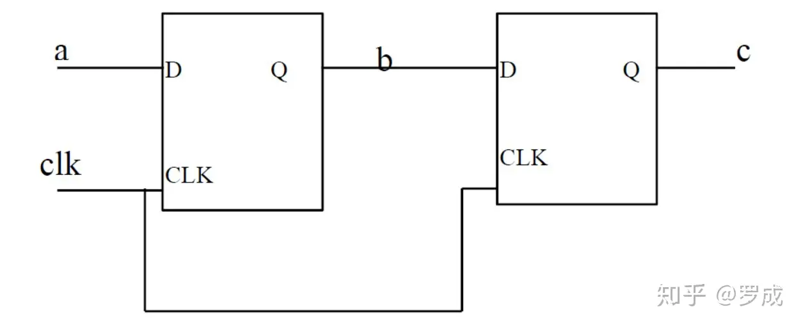
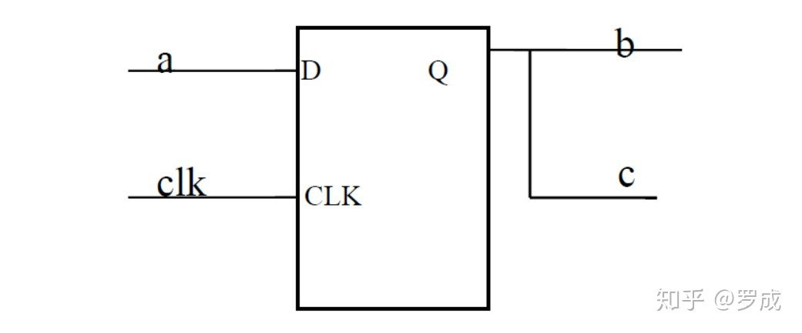
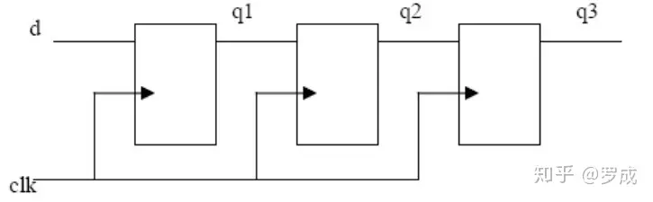

# Verilog语法之六：阻塞赋值与非阻塞赋值
## 一、初步理解阻塞赋值与非阻塞赋值

在Verilog HDL语言中，信号有两种赋值方式：

**(1).非阻塞(Non\_Blocking)赋值方式( 如 b <= a; )**

*   块结束后才完成赋值操作。
*   b的值并不是立刻就改变的。
*   这是一种比较常用的赋值方法。（特别在编写可综合模块时）

**(2).阻塞(Blocking)赋值方式( 如 b = a; )**

*   赋值语句执行完后,块才结束。
*   b的值在赋值语句执行完后立刻就改变的。
*   可能会产生意想不到的结果。

**非阻塞赋值方式和阻塞赋值方式的区别常给设计人员带来问题。问题主要是给"always"块内的reg型信号的赋值方式不易把握。**

到目前为止，前面所举的例子中的"always"模块内的reg型信号都是采用下面的这种赋值方式:

```verilog
b <= a; 
```

这种方式的赋值并不是马上执行的，也就是说"always"块内的下一条语句执行后，b并不等于a，而是保持原来的值。"always"块结束后，才进行赋值。而另一种赋值方式阻塞赋值方式，如下所示:

```verilog
 b = a;
```

这种赋值方式是马上执行的。也就是说执行下一条语句时，b已等于a。尽管这种方式看起来很直观，但是可能引起麻烦。下面举例说明:

\[例1\]:

```verilog
always @( posedge clk )
begin
    b<=a;
    c<=b;
end
```

\[例1\] 中的"always"块中用了非阻塞赋值方式，定义了两个reg型信号b和c，clk信号的上升沿到来时，b就等于a，c就等于b，这里应该用到了两个触发器。请注意：赋值是在"always"块结束后执行的，c应为原来b的值。这个"always"块实际描述的电路功能如下图所示:



\[例2\]:

```verilog
always @(posedge clk)
begin
    b=a;
    c=b;
end
```

\[例2\]中的 "always"块用了阻塞赋值方式。clk信号的上升沿到来时，将发生如下的变化：b马上取a的值，c马上取b的值(即等于a)，生成的电路图如下所示只用了一个触发器来寄存器a的值，又输出给b和c。这大概不是设计者的初衷，如果采用\[例1\]所示的非阻塞赋值方式就可以避免这种错误。



## 二、**深入理解阻塞和非阻塞赋值的不同**

1.  **在描述组合逻辑的always 块中用阻塞赋值，则综合成组合逻辑的电路结构。**
2.  **在描述时序逻辑的always 块中用非阻塞赋值，则综合成时序逻辑的电路结构。**

为什么一定要这样做呢？这是因为要使综合前仿真和综合后仿真一致的缘故。

首先了解两个定义：

**RHS** **–** 方程式右手方向的表达式或变量可分别缩写为： RHS 表达式或 RHS 变量。

**LHS –** 方程式左手方向的表达式或变量可分别缩写为： LHS 表达式或 LHS 变量。

***阻塞赋值的执行可以认为是只有一个步骤的操作：***

计算RHS 并更新LHS，此时不能允许有来自任何其他Verilog 语句的干扰。 所谓阻塞的概念是指在同一个always 块中，其后面的赋值语句从概念上（即使不设定延迟）是在前一句赋值语句结束后再开始赋值的。

***\[例1\]***用阻塞赋值的反馈振荡器(不好的例子）

```verilog
module fbosc1 (y1, y2, clk, rst);
 output y1, y2; 
 input clk, rst;
 reg y1, y2;

 always @(posedge clk or posedge rst)
 begin
     if (rst) y1 = 0; // reset
     else y1 = y2;
 end

 always @(posedge clk or posedge rst)
 begin
     if (rst) y2 = 1; // preset
     else y2 = y1;
 end
endmodule
```

例1中，如果前一个always块的复位信号先到0 时刻，则y1 和y2 都会取1，而如果后一个always 块的复位信号先到0 时刻，则y1 和y2 都会取0。这清楚地说明这个Verilog 模块是不稳定的会产生冒险和竞争的情况。

如果在一个过程块中阻塞赋值的RHS 变量正好是另一个过程块中阻塞赋值的LHS 变量，这两个过程块又用同一个时钟沿触发，如果阻塞赋值的次序安排不好，就会出现竞争。若这两个阻塞赋值操作用同一个时钟沿触发，则执行的次序是无法确定的。

  

***非阻塞赋值的操作可以看作为两个步骤的过程：***

1) 在赋值时刻开始时，计算非阻塞赋值RHS 表达式。

2) 在赋值时刻结束时，更新非阻塞赋值LHS 表达式。

***\[例2\]*** 用非阻塞赋值的反馈振荡器（正确示范）

```verilog
module fbosc2 (y1, y2, clk, rst);
 output y1, y2;
 input clk, rst;
 reg y1, y2;
 
 always @(posedge clk or posedge rst)
 begin
     if (rst) y1 <= 0; // reset
     else y1 <= y2;
 end

 always @(posedge clk or posedge rst)
 begin
     if (rst) y2 <= 1; // preset
     else y2 <= y1;
 end
endmodule
```

例2中，无论哪一个always 块的复位信号先到， 两个always 块中的非阻塞赋值都在赋值开始时刻计算RHS 表达式，而在结束时刻才更新LHS 表达式。所以这两个always 块在复位信号到来后,在always 块结束时 y1 为0 而y2为1 是确定的。从用户的角度看这两个非阻塞赋值正好是并行执行的。

非阻塞赋值操作只能用于对寄存器类型变量进行赋值，因此只能用在"initial"块和"always"块等过程块中。非阻塞赋值不允许用于连续赋值。

## **下面通过几个通过移位寄存器的例子来更好的理解阻塞赋值与非阻塞赋值**

下图表示是一个简单的移位寄存器方框图：



**\[例3\] 不正确地使用的阻塞赋值来描述移位寄存器。（方式 #1）**

```verilog
 module pipeb1 (q3, d, clk);
 output [7:0] q3;
 input [7:0] d;
 input clk;
 reg [7:0] q3, q2, q1;

 always @(posedge clk)
 begin
 q1 = d;
 q2 = q1;
 q3 = q2;
 end

endmodule
```

在上面的模块中，按顺序进行的阻塞赋值将使得在下一个时钟上升沿时刻，所有的寄存器输出值都等于输入值d。在每个时钟上升沿，输入值d 将无延时地直接输出到q3。

**\[例4\] 用阻塞赋值来描述移位寄存器也是可行的，但这种风格并不好。（方式 #2 ）**

```verilog
 module pipeb2 (q3, d, clk);
 output [7:0] q3;
 input [7:0] d;
 input clk;
 reg [7:0] q3, q2, q1;

 always @(posedge clk)
 begin
 q3 = q2;
 q2 = q1;
 q1 = d;
 end

endmodule
```

在上面的模块中，阻塞赋值的次序是经过仔细安排的，以使仿真的结果与移位寄存器相一致。虽然该模块可被综合成移位寄存器，但我们不建议使用这种风格的模块来描述时序逻辑。

**\[例5\] 不好的用阻塞赋值来描述移位时序逻辑的风格（方式 #3）**

```verilog
module pipeb3 (q3, d, clk);
 output [7:0] q3;
 input [7:0] d;
 input clk;
 reg [7:0] q3, q2, q1;

 always @(posedge clk) q1 = d;
 always @(posedge clk) q2 = q1;
 always @(posedge clk) q3 = q2;

endmodule
```

本例中，阻塞赋值分别被放在不同的always 块里。仿真时，这些块的先后顺序是随机的，因此可能会出现错误的结果。这是Verilog 中的竞争冒险。按不同的顺序执行这些块将导致不同的结果。但是， 这些代码的综合结果却是正确的流水线寄存器。也就是说，前仿真和后仿真结果可能会不一致。

**\[例6\] 不好的用阻塞赋值来描述移位时序逻辑的风格（方式 #4）**

```verilog
module pipeb4 (q3, d, clk);
 output [7:0] q3;
 input [7:0] d;
 input clk;
 reg [7:0] q3, q2, q1;

 always @(posedge clk) q2 = q1;
 always @(posedge clk) q3 = q2;
 always @(posedge clk) q1 = d;

endmodule
```

**\[例7\] 正确使用非阻塞赋值来描述时序逻辑的设计风格 （方式 #1）**

```verilog
module pipen1 (q3, d, clk);
 output [7:0] q3;
 input [7:0] d;
 input clk;
 reg [7:0] q3, q2, q1;

 always @(posedge clk) 
 begin
 q1 <= d;
 q2 <= q1;
 q3 <= q2;
 end

 endmodule
```

**\[例8\] 正确使用非阻塞赋值来描述时序逻辑的设计风格 (方式 #2）**

```verilog
 module pipen2 (q3, d, clk);
 output [7:0] q3;
 input [7:0] d;
 input clk;
 reg [7:0] q3, q2, q1;

 always @(posedge clk)
 begin
 q3 <= q2;
 q2 <= q1;
 q1 <= d;
 end
endmodule
```

**\[例9\] 正确使用非阻塞赋值来描述时序逻辑的设计风格 （方式 #3）**

```verilog
module pipen3 (q3, d, clk);
 output [7:0] q3;
 input [7:0] d;
 input clk;
 reg [7:0] q3, q2, q1;

 always @(posedge clk) q1 <= d;
 always @(posedge clk) q2 <= q1;
 always @(posedge clk) q3 <= q2;
 endmodule
```

**\[例10\] 正确使用非阻塞赋值来描述时序逻辑的设计风格 （方式 #4）**

```verilog
module pipen4 (q3, d, clk);
 output [7:0] q3;
 input [7:0] d;
 input clk;
 reg [7:0] q3, q2, q1;

 always @(posedge clk) q2 <= q1;
 always @(posedge clk) q3 <= q2;
 always @(posedge clk) q1 <= d;
 endmodule
```

**以上移位寄存器时序逻辑电路设计的例子表明：**

•4种阻塞赋值设计方式中有1种可以保证仿真正确

•4种阻塞赋值设计方式中有3种可以保证综合正确

•4种非阻塞赋值设计方式全部可以保证仿真正确

•4种非阻塞赋值设计方式全部可以保证综合正确

  

**阻塞赋值和非阻塞赋值的原则归纳如下：**

*   原则1：时序电路建模时，用非阻塞赋值。
*   原则2：锁存器电路建模时，用非阻塞赋值。
*   原则3：用always 块写组合逻辑时，采用阻塞赋值。
*   原则4：在同一个always 块中同时建立时序和组合逻辑电路时，用非阻塞赋值。
*   原则5：在同一个always 块中不要同时使用非阻塞赋值和阻塞赋值。
*   原则6：不要在多个always 块中为同一个变量赋值。

Q:
我是初学verilog的，学到非阻塞赋值时很困惑，很想知道答主在文中提到的，在块结束后更新LHS和在赋值时刻结束后更新LHS之间有什么关联与区别
A：
非阻塞赋值和阻塞对于仿真器来说执行是有顺序的，比如一个always事件触发后，先计算RHS，在按顺序进行阻塞赋值的LHS更新，最后进行非阻塞赋值的LHS更新，详细搜索verilog仿真事件队列。对于电路设计来说一般用**阻塞赋值用来组合逻辑设计**，**时序逻辑用非阻塞赋值是会综合出寄存器**
个人理解就是非阻塞赋值可以认为一组LHS的值是同时被修改的，RHS的值是上一时刻的值。阻塞赋值类似算法语言中有先后顺序的赋值，前面的赋值语句会影响后面RHS的值。