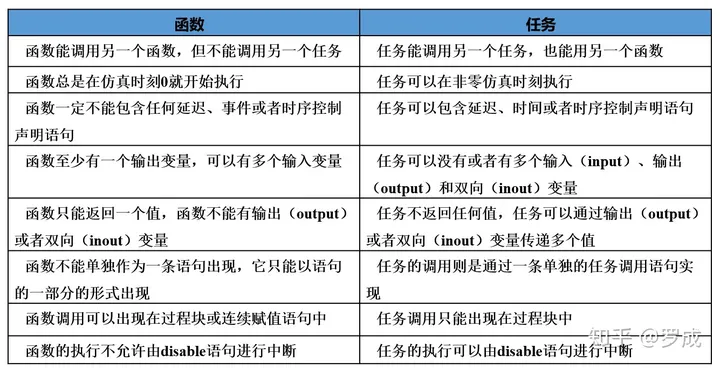

# Verilog语法之十一：任务task和函数function
task和function说明语句分别用来定义任务和函数。

利用任务和函数可以把一个很大的程序模块分解成许多较小的任务和函数便于理解和调试。

输入、输出和总线信号的值可以传入、传出任务和函数。任务和函数往往还是大的程序模块中在不同地点多次用到的相同的程序段。

学会使用task和function语句可以简化程序的结构，使程序明白易懂，是编写较大型模块的基本功。

## **一．** **task和function说明语句的不同点**

任务和函数有些不同，主要的不同有以下四点：

*   1) 函数只能与主模块共用同一个仿真时间单位，而任务可以定义自己的仿真时间单位。
*   2) 函数不能启动任务，而任务能启动其它任务和函数。
*   3) 函数至少要有一个输入变量，而任务可以没有或有多个任何类型的变量。
*   4) 函数返回一个值，而任务则不返回值。

函数的目的是通过返回一个值来响应输入信号的值。任务却能支持多种目的，能计算多个结果值，这些结果值只能通过被调用的任务的输出或总线端口送出。Verilog HDL模块使用函数时是把它当作表达式中的操作符，这个操作的结果值就是这个函数的返回值。下面让我们用例子来说明：

例如，定义一任务或函数对一个16位的字进行操作让高字节与低字节互换，把它变为另一个字(假定这个任务或函数名为: switch\_bytes)。

任务返回的新字是通过输出端口的变量，因此16位字字节互换任务的调用源码是这样的：

```verilog
 switch_bytes(old_word,new_word);
```

任务switch\_bytes把输入old\_word的字的高、低字节互换放入new\_word端口输出。

而函数返回的新字是通过函数本身的返回值，因此16位字字节互换函数的调用源码是这样的：

```verilog
 new_word = switch_bytes(old_word);
```

下面分两节分别介绍任务和函数语句的要点。

## **二． task说明语句**

如果传给任务的变量值和任务完成后接收结果的变量已定义，就可以用一条语句启动任务。任务完成以后控制就传回启动过程。如任务内部有定时控制，则启动的时间可以与控制返回的时间不同。任务可以启动其它的任务，其它任务又可以启动别的任务，可以启动的任务数是没有限制的。不管有多少任务启动，只有当所有的启动任务完成以后，控制才能返回。

**1) 任务的定义**

定义任务的语法如下：

任务:

```verilog
task <任务名>;
     <端口及数据类型声明语句>
     <语句1>
     <语句2>
     .....
     <语句n>
endtask
```

这些声明语句的语法与模块定义中的对应声明语句的语法是一致的。

2) 任务的调用及变量的传递

启动任务并传递输入输出变量的声明语句的语法如下：

任务的调用：

```verilog
<任务名>(端口1，端口2，...，端口n);
```

下面的例子说明怎样定义任务和调用任务：

任务定义：

```verilog
task my_task;
    input a, b;
    inout c;
    output d, e;
    …
    <语句> //执行任务工作相应的语句
    …
    c = foo1; //赋初始值
    d = foo2; //对任务的输出变量赋值t
    e = foo3;
endtask
```

任务调用：

```verilog
my_task(v,w,x,y,z);
```

**任务调用变量(v,w,x,y,z)和任务定义的I/O变量(a,b,c,d,e)之间是一一对应的。当任务启动时，由v,w,和x.传入的变量赋给了a,b,和c，而当任务完成后的输出又通过c,d和e赋给了x,y和z。**下面是一个具体的例子用来说明怎样在模块的设计中使用任务，使程序容易读懂：

```verilog
module traffic_lights;
    reg clock, red, amber, green;
    parameter on=1, off=0, red_tics=350,
              amber_tics=30,green_tics=200;
     //交通灯初始化
     initial red=off;
     initial amber=off;
     initial green=off;
     //交通灯控制时序
    always
    begin
        red=on; //开红灯
        light(red,red_tics); //调用等待任务
        green=on; //开绿灯
        light(green,green_tics); //等待
        amber=on; //开黄灯
        light(amber,amber_tics); //等待
    end

    //定义交通灯开启时间的任务
    task light（color,tics);
        output color;
        input[31:0] tics;
        begin
            repeat(tics) @(posedge clock);//等待tics个时钟的上升沿
            color=off;//关灯
        end
    endtask
//产生时钟脉冲的always块
    always
    begin
        #100 clock=0;
        #100 clock=1;
    end
endmodule
```

这个例子描述了一个简单的交通灯的时序控制，并且该交通灯有它自己的时钟产生器。

**任务定义时需注意以下事项：**

（1）在第一行“task”语句中不能列出端口名列表。

（2）任务中可以有延时语句、敏感事件控制语句等事件控制语句。

（3）任务可以没有或可以有一个或多个输入、输出和双向端口。

（4）任务可以没有返回值，也可以通过输出端口或双向端口返回一个或多个返回值。

（5）任务可以调用其它的任务或函数，也可以调用该任务本身。

（6）任务定义结构内不允许出现过程块（initial或always过程块）。

（7）任务定义结构内可以出现disable终止语句，这条语句的执行将中断正在执行的任务。在任务被中断后，程序流程将返回到调用任务的地方继续向下执行。

## **二．** **function说明语句**

函数定义是嵌入在关键字function和endfunction之间的，其中关键词function标志着一个函数定义结构的开端，endfunction标志着一个函数定义结构的结束。

“<函数名>”是给被定义函数取的名称。这个函数名在函数定义结构内部还代表着一个内部变量，函数调用后的返回值是通过这个函数名变量传递给调用语句的。

**函数的目的是返回一个用于表达式的值。**

*定义函数的语法:*

```verilog
function <返回值的类型或范围> (函数名);
<端口说明语句>
<变量类型说明语句>

begin
<语句>
........
end
endfunction
```

请注意<返回值的类型或范围>这一项是可选项，如缺省则返回值为一位寄存器类型数据。下面用例子说明：

```verilog
function [7:0] getbyte;
input [15:0] address;
begin
    <说明语句> //从地址字中提取低字节的程序
    getbyte = result_expression; //把结果赋予函数的返回字节
end
endfunction
```

*从函数返回的值*

函数的定义蕴含声明了与函数同名的、函数内部的寄存器。如在函数的声明语句中<返回值的类型或范围>为缺省,则这个寄存器是一位的，否则是与函数定义中<返回值的类型或范围>一致的寄存器。

函数的定义把函数返回值所赋值寄存器的名称初始化为与函数同名的内部变量。下面的例子说明了这个概念：getbyte被赋予的值就是函数的返回值。

*函数的调用*

函数的调用是通过将函数作为表达式中的操作数来实现的。

其调用格式如下：

```verilog
<函数名> (<表达式><,<表达式>>*)
```

其中函数名作为确认符。下面的例子中通过对两次调用函数getbyte的结果值进行位拼接运算来生成一个字。

```verilog
word = control? {getbyte(msbyte),getbyte(lsbyte)} : 0;
```

*函数的使用规则*

与任务相比较函数的使用有较多的约束，下面给出的是函数的使用规则：

*   1) 函数的定义不能包含有任何的时间控制语句，即任何用＃、@、或wait来标识的语句。
*   2) 函数不能启动任务。
*   3) 定义函数时至少要有一个输入参量。
*   4) 在函数的定义中必须有一条赋值语句给函数中的一个内部变量赋以函数的结果值，该内部变量具有和函数名相同的名字。

*举例说明*

下面的例子中定义了一个可进行阶乘运算的名为factorial的函数，该函数返回一个32位的寄存器类型的值，该函数可后向调用自身，并且打印出部分结果值。

例：统计输入数据中“0”的个数

```verilog
	function[3:0] out0;
	input[7:0] x;
	reg[3:0] count;
	integer i;
	begin
		count=0;
		for(i=0;i<=7;i=i+1)
			if(x[i]==1’b0)	 count=count+1;
		out0=count;
	end
	endfunction
```

在进行函数定义时需要注意以下几点：

（1）与任务一样，函数定义结构只能出现在模块中，而不能出现在过程块内。

（2）函数至少必须有一个输入端口。

（3）函数不能有任何类型的输出端口（output端口）和双向端口（inout端口）。

（4）在函数定义结构中的行为语句部分内不能出现任何类型的时间控制描述，也不允许使用disable终止语句。

（5）与任务定义一样，函数定义结构内部不能出现过程块。

（6）在一个函数内可以对其它函数进行调用，但是函数不能调用其它任务。

（7）在第一行“function”语句中不能出现端口名列表。

（8）在函数声明的时候，在Verilog HDL的内部隐含地声明了一个名为function\_identifier（函数标识符）的寄存器类型变量，函数的输出结果将通过这个寄存器类型变量被传递回来。

函数调用时要注意以下几点：

（1）函数的调用不能单独作为一条语句出现，它只能作为一个操作数出现在调用语句内。

（2）函数的调用既能出现在过程块中，也能出现在assign连续赋值语句中。

（3）函数定义中声明的所有局部寄存器都是静态的，即函数中的局部寄存器在函数的多个调用之间保持它们的值。

最后总结一下任务与函数的区别：




请问，task 在默认的情况下是不是也是静态的，其内部定义的寄存器变量也是局部静态的？在多次调用时保持不变？
verilog里，task默认是静态的，其中的变量也是静态，systemverilog可以在类型定义前加automatic
Verilog-2001具有静态和自动的任务和函数。在一个模块实例中，会为一个任务或函数的所有调用分配相同的存储空间。自动的任务和函数则为每一个实例分配唯一的、栈式存储空间。
SystemVerilog加入了在静态任务和函数中声明自动变量以及在自动任务和函数中声明静态变量的能力。

----《systemverilog 语言参考手册》