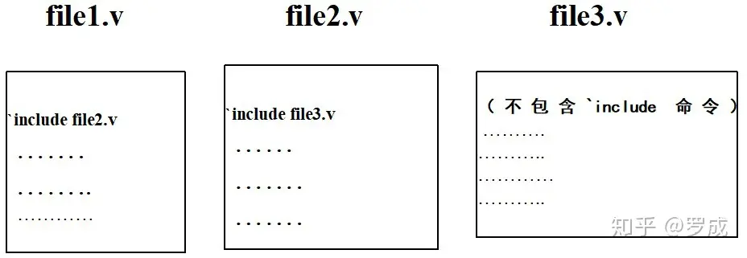

# Verilog语法之十三：编译预处理
Verilog HDL语言和C语言一样也提供了编译预处理的功能。“编译预处理”是Verilog HDL编译系统的一个组成部分。

Verilog HDL语言允许在程序中使用几种特殊的命令(它们不是一般的语句)。Verilog HDL编译系统通常先对这些特殊的命令进行“预处理”，然后将预处理的结果和源程序一起在进行通常的编译处理。

在Verilog HDL语言中，为了和一般的语句相区别，这些预处理命令以符号“ \`”开头(注意这个符号是不同于单引号“ '”的)。这些预处理命令的有效作用范围为定义命令之后到本文件结束或到其它命令定义替代该命令之处。Verilog HDL提供了以下预编译命令：

\`accelerate，\`autoexpand\_vectornets，\`celldefine，\`default\_nettype，\`define，\`else，\`endcelldefine，\`endif，\`endprotect，\`endprotected，\`expand\_vectornets，\`ifdef，\`include，\`noaccelerate,\`noexpand\_vectornets，\`noremove\_gatenames，\`noremove\_netnames，\`nounconnected\_drive，\`protect，\`protecte，\`remove\_gatenames，\`remove\_netnames，\`reset,\`timescale，\`unconnected\_drive

在这一小节里只对常用的\`define、\`include、\`timescale进行介绍，其余的请查阅参考书。

## **1.宏定义 \`define**

用一个指定的标识符(即名字)来代表一个字符串，它的一般形式为:

```verilog
 `define 标识符(宏名) 字符串(宏内容)
```

如：

```verilog
`define signal string
```

它的作用是指定用标识符signal来代替string这个字符串，在编译预处理时，把程序中在该命令以后所有的signal都替换成string。

这种方法使用户能以一个简单的名字代替一个长的字符串，也可以用一个有含义的名字来代替没有含义的数字和符号，因此把这个标识符(名字)称为“宏名”，在编译预处理时将宏名替换成字符串的过程称为“宏展开”。\`define是宏定义命令。

\[例1\]：

```verilog
`define WORDSIZE 8
module
reg[1:`WORDSIZE] data; //这相当于定义 reg[1:8] data; 
```

关于宏定义的八点说明：

1) 宏名可以用大写字母表示，也可以用小写字母表示。建议使用大写字母，以与变量名相区别。

2) \`define命令可以出现在模块定义里面，也可以出现在模块定义外面。宏名的有效范围为定义命令之后到原文件结束。通常，\`define命令写在模块定义的外面，作为程序的一部分，在此程序内有效。

**3)** **在引用已定义的宏名时，必须在宏名的前面加上符号“\`”，表示该名字是一个经过宏定义的名字。**

4) 使用宏名代替一个字符串，可以减少程序中重复书写某些字符串的工作量。而且记住一个宏名要比记住一个无规律的字符串容易，这样在读程序时能立即知道它的含义，当需要改变某一个变量时，可以只改变 \`define命令行，一改全改。如例1中，先定义WORDSIZE代表常量8，这时寄存器data是一个8位的寄存器。如果需要改变寄存器的大小，只需把该命令行改为：\`define WORDSIZE 16。这样寄存器data则变为一个16位的寄存器。由此可见使用宏定义，可以提高程序的可移植性和可读性。

5) 宏定义是用宏名代替一个字符串，也就是作简单的置换，不作语法检查。预处理时照样代入，不管含义是否正确。只有在编译已被宏展开后的源程序时才报错。

6) **宏定义不是Verilog HDL语句，不必在行末加分号。如果加了分号会连分号一起进行置换。**如：

\[例2\]：

```verilog
module test;
reg a, b, c, d, e, out;
`define expression a+b+c+d;
assign out = `expression + e;
 ...
 endmodule 
```

经过宏展开以后，该语句为：

```text
assign  out = a+b+c+d;+e;
```

显然出现语法错误。

7) 在进行宏定义时，可以引用已定义的宏名，可以层层置换。如：

\[例3\]：

```verilog
module test;
reg a, b, c;
wire out;
`define aa a + b
`define cc c + `aa
assign out = `cc;
endmodule
```

这样经过宏展开以后，assign语句为

```text
assign out = c + a + b;
```

8) 宏名和宏内容必须在同一行中进行声明。如果在宏内容中包含有注释行，注释行不会作为被置换的内容。如：

\[例4\]:

```verilog
module
 `define typ_nand nand #5 //define a nand with typical delay
 `typ_nand g121(q21,n10,n11);
 ………
 endmodule
```

经过宏展开以后，该语句为：

```text
 nand #5 g121(q21,n10,n11);
```

宏内容可以是空格，在这种情况下，宏内容被定义为空的。当引用这个宏名时，不会有内容被置换。

**注意：组成宏内容的字符串不能够被以下的语句记号分隔开的。**

*   · 注释行
*   · 数字
*   · 字符串
*   · 确认符
*   · 关键词
*   · 双目和三目字符运算符

如下面的宏定义声明和引用是非法的。

```verilog
`define first_half "start of string
$display(`first_half end of string");
```

注意在使用宏定义时要注意以下情况：

1) 对于某些 EDA软件，在编写源程序时，如使用和预处理命令名相同的宏名会发生冲突，因此建议不要使用和预处理命令名相同的宏名。

2）宏名可以是普通的标识符(变量名)。例如signal\_name 和 'signal\_name的意义是不同的。但是这样容易引起混淆，建议不要这样使用。

**2.“文件包含”处理\`include**

所谓“文件包含”处理是一个源文件可以将另外一个源文件的全部内容包含进来，即将另外的文件包含到本文件之中。Verilog HDL语言提供了\`include命令用来实现“文件包含”的操作。其一般形式为:

```text
`include “文件名”
```


上图表示“文件包含”的含意。图(a)为文件File1.v,它有一个\`include "File2.v"命令，然后还有其它的内容(以A表示)。图(b)为另一个文件File2.v,文件的内容以B表示。在编译预处理时，要对\`include命令进行“文件包含”预处理:将File2.v的全部内容复制插入到 \`include "File2.v"命令出现的地方，即File2.v 被包含到File1.v中，得到图(c)所示的结果。

在接着往下进行的编译中，将“包含”以后的File1.v作为一个源文件单位进行编译。

“文件包含”命令是很有用的，它可以节省程序设计人员的重复劳动。可以将一些常用的宏定义命令或任务(task)组成一个文件，然后用\`include命令将这些宏定义包含到自己所写的源文件中，相当于工业上的标准元件拿来使用。另外在编写Verilog HDL源文件时，一个源文件可能经常要用到另外几个源文件中的模块，遇到这种情况即可用\`include命令将所需模块的源文件包含进来。

\[例1\]：

(1)文件aaa.v

```verilog
module aaa(a,b,out);
input a, b;
output out;
wire out;
assign out = a^b;
endmodule 
```

(2)文件 bbb.v

```verilog
`include "aaa.v"
module bbb(c,d,e,out);
input c,d,e;
output out;
wire out_a;
wire out;
 aaa aaa(.a(c),.b(d),.out(out_a));
assign out=e&out_a;
endmodule
```

在上面的例子中，文件bbb.v用到了文件aaa.v中的模块aaa的实例器件，通过“文件包含”处理来调用。模块aaa实际上是作为模块bbb的子模块来被调用的。在经过编译预处理后，文件bbb.v实际相当于下面的程序文件bbb.v：

```verilog
module aaa(a,b,out);
    input a, b;
    output out;
    wire out;
    assign out = a ^ b;
endmodule
 
module bbb( c, d, e, out);
    input c, d, e;
    output out;
    wire out_a;
    wire out;
    aaa aaa(.a(c),.b(d),.out(out_a));
    assign out= e & out_a;
endmodule
```

关于“文件包含”处理的四点说明：

1) 一个\`include命令只能指定一个被包含的文件，如果要包含n个文件，要用n个\`include命令。

2) \`include命令可以出现在Verilog HDL源程序的任何地方，被包含文件名可以是相对路径名，也可以是绝对路径名。例如：'include"parts/count.v"

3) 可以将多个\`include命令写在一行，在\`include命令行，只可以出空格和注释行。例如下面的写法是合法的。

```verilog
'include "fileB" 'include "fileC" //including fileB and fileC
```

4) 如果文件1包含文件2，而文件2要用到文件3的内容，则可以在文件1用两个\`include命令分别包含文件2和文件3，而且文件3应出现在文件2之前。例如在下面的例子中，即在file1.v中定义：

```verilog
`include"file3.v"
`include"file2.v"
module test(a,b,out);
input[1:`size2] a, b;
output[1:`size2] out;
wire[1:`size2] out;
assign out= a+b;
endmodule
```

file2.v的内容为：

```verilog
`define size2 `size1+1
.
.
.
```

file3.v的内容为：

```verilog
`define size1 4
.
.
.
```

这样，file1.v和file2.v都可以用到file3.v的内容。在file2.v中不必再用 \`include "file3.v"了。

5) 在一个被包含文件中又可以包含另一个被包含文件，即文件包含是可以嵌套的。例如上面的问题也可以这样处理，见下图，



它的作用和下图的作用是相同的。


## **3.时间尺度 \`timescale**

\`**timescale命令用来说明跟在该命令后的模块的时间单位和时间精度**。使用\`timescale命令可以在同一个设计里包含采用了不同的时间单位的模块。

例如，一个设计中包含了两个模块，其中一个模块的时间延迟单位为ns，另一个模块的时间延迟单位为ps。EDA工具仍然可以对这个设计进行仿真测试。

\`timescale 命令的格式如下：

```text
`timescale<时间单位>/<时间精度>
```

在这条命令中，时间单位参量是用来定义模块中仿真时间和延迟时间的基准单位的。时间精度参量是用来声明该模块的仿真时间的精确程度的，该参量被用来对延迟时间值进行取整操作(仿真前)，因此该参量又可以被称为取整精度。

如果在同一个程序设计里，存在多个\`timescale命令，则用最小的时间精度值来决定仿真的时间单位。另外时间精度至少要和时间单位一样精确，时间精度值不能大于时间单位值。

在\`timescale命令中，用于说明时间单位和时间精度参量值的数字必须是整数，其有效数字为1、10、100，单位为秒(s)、毫秒(ms)、微秒(us)、纳秒(ns)、皮秒(ps)、毫皮秒(fs)。这几种单位的意义说明见下表。


下面举例说明\`timescale命令的用法。

\[例1\]：

```verilog
 `timescale 1ns/1ps
```

在这个命令之后，模块中所有的时间值都表示是1ns的整数倍。这是因为在\`timescale命令中，定义了时间单位是1ns。模块中的延迟时间可表达为带三位小数的实型数，因为 \`timescale命令定义时间精度为1ps.

\[例2\]：

```verilog
`timescale 10us/100ns
```

在这个例子中，\`timescale命令定义后，模块中时间值均为10us的整数倍。因为\`timesacle 命令定义的时间单位是10us。延迟时间的最小分辨度为十分之一微秒(100ns)，即延迟时间可表达为带一位小数的实型数。

例3：

```verilog
 `timescale 10ns/1ns
module test;
reg set;
parameter d=1.55;
initial
begin
#d set=0;
#d set=1;
end
endmodule
```

在这个例子中，\`timescale命令定义了模块test的时间单位为10ns、时间精度为1ns。因此在模块test中，所有的时间值应为10ns的整数倍，且以1ns为时间精度。这样经过取整操作，存在参数d中的延迟时间实际是16ns(即1.6×10ns)，这意味着在仿真时刻为16ns时寄存器set被赋值0，在仿真时刻为32ns时寄存器set被赋值1。仿真时刻值是按照以下的步骤来计算的。

1) 根据时间精度，参数d值被从1.55取整为1.6。

2) 因为时间单位是10ns，时间精度是1ns，所以延迟时间#d作为时间单位的整数倍为16ns。

3) EDA工具预定在仿真时刻为16ns的时候给寄存器set赋值0(即语句 #d set=0;执行时刻)，在仿真时刻为32ns的时候给寄存器set赋值1(即语句 #d set=1;执行时刻)，

**注意：如果在同一个设计里，多个模块中用到的时间单位不同，需要用到以下的时间结构。**

1) 用\`timescale命令来声明本模块中所用到的时间单位和时间精度。

2) 用系统任务$printtimescale来输出显示一个模块的时间单位和时间精度。

3) 用系统函数$time和$realtime及%t格式声明来输出显示EDA工具记录的时间信息。

## **4.条件编译命令\`ifdef、\`else、\`endif**

一般情况下，Verilog HDL源程序中所有的行都将参加编译。但是有时希望对其中的一部分内容只有在满足条件才进行编译，也就是对一部分内容指定编译的条件，这就是“条件编译”。有时，希望当满足条件时对一组语句进行编译，而当条件不满足是则编译另一部分。

条件编译命令有以下几种形式：

1)

```verilog
`ifdef 宏名 (标识符)
程序段1
`else
程序段2
`endif
```

它的作用是当宏名已经被定义过(用\`define命令定义)，则对程序段1进行编译，程序段2将被忽略;否则编译程序段2，程序段1被忽略。其中\`else部分可以没有，即：

2)

```verilog
`ifdef 宏名 (标识符)
程序段1
`endif
```

这里的 “宏名” 是一个Verilog HDL的标识符，“程序段”可以是Verilog HDL语句组，也可以是命令行。这些命令可以出现在源程序的任何地方。

**注意：被忽略掉不进行编译的程序段部分也要符合Verilog HDL程序的语法规则。**

通常在Verilog HDL程序中用到\`ifdef、\`else、\`endif编译命令的情况有以下几种：

*   · 选择一个模块的不同代表部分。
*   · 选择不同的时序或结构信息。
*   · 对不同的EDA工具，选择不同的激励。