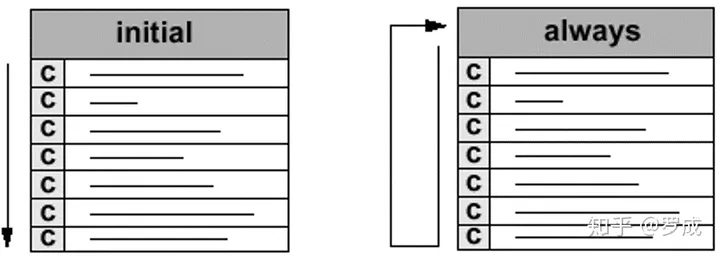
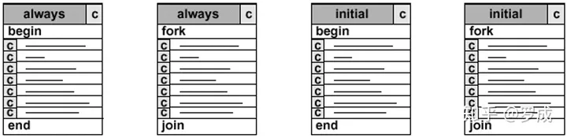

# Verilog语法之十：过程块initial和always
过程块是行为模型的基础。

**过程块有两种：**

*   *initial块，只能执行一次*
*   *always块，循环执行*



**过程块中有下列部件：**

*   *过程赋值语句：在描述过程块中的数据流*
*   *高级结构（循环，条件语句）：描述块的功能*
*   *时序控制：控制块的执行及块中的语句。*

**initial**语句与**always**语句和**begin\_end**与**fork\_join**是一种高频搭配：



## **1.initial语句**

initial语句的格式如下：

```verilog
initial
    begin
        语句1;
        语句2;
        ......
        语句n;
end
```

举例说明：

\[例1\]：

```verilog
initial
    begin
        areg=0; //初始化寄存器areg
        for(index=0;index<size;index=index+1)
            memory[index]=0; //初始化一个memory
end
```

在这个例子中用initial语句在仿真开始时对各变量进行初始化。

\[例2\]：

```verilog
initial
    begin
        inputs = 'b000000; //初始时刻为0
        #10 inputs = 'b011001; 
        #10 inputs = 'b011011; 
        #10 inputs = 'b011000; 
        #10 inputs = 'b001000; 
end
```

从这个例子中，**我们可以看到initial语句的另一用途，即用initial语句来生成激励波形作为电路的测试仿真信号。**一个模块中可以有多个initial块，它们都是并行运行的。

**initial块常用于测试文件和虚拟模块的编写，用来产生仿真测试信号和设置信号记录等仿真环境。**

## **2.always语句**

always语句在仿真过程中是不断重复执行的。

其声明格式如下：

```verilog
always <时序控制>  <语句>
```

always语句由于其不断重复执行的特性，只有和一定的时序控制结合在一起才有用。如果一个always语句没有时序控制，则这个always语句将会发成一个仿真死锁。见下例：

\[例1\]：

```verilog
always areg = ~areg;
```

这个always语句将会生成一个0延迟的无限循环跳变过程，这时**会发生仿真死锁**。如果加上时序控制，则这个always语句将变为一条非常有用的描述语句。见下例：

\[例2\]：

```verilog
always #10  areg = ~areg;
```

这个例子生成了一个周期为20 的无限延续的信号波形，常用这种方法来描述时钟信号，作为激励信号来测试所设计的电路。

\[例3\]：

```verilog
reg[7:0] counter;
reg tick;

always @(posedge areg) 
    begin
        tick = ~tick;
        counter = counter + 1;
    end
```

这个例子中,每当areg信号的上升沿出现时把tick信号反相，并且把counter增加1。这种时间控制是always语句最常用的。

always 的时间控制可以是沿触发也可以是电平触发的，可以单个信号也可以多个信号，中间需要用关键字 or 连接，如：

```verilog
 always @(posedge clock or posedge reset) //由两个沿触发的always块
 begin
 ……
 end
 always @( a or b or c ) //由多个电平触发的always块
 begin
 ……
 end
```

沿触发的always块常常描述时序逻辑，如果符合可综合风格要求可用综合工具自动转换为表示时序逻辑的寄存器组和门级逻辑，而电平触发的always块常常用来描述组合逻辑和带锁存器的组合逻辑，如果符合可综合风格要求可转换为表示组合逻辑的门级逻辑或带锁存器的组合逻辑。**一个模块中可以有多个always块，它们都是并行运行的**。

## always是一个极高频的语法，**always@（）用法总结如下**

① always*@(信号名)*

• 信号名有变化就触发事件

```verilog
例: 
always@( clock) 
a=b;
```

② always@( posedge信号名)

• 信号名有上升沿就触发事件

```verilog
例:
always@( posedge clock) 
a=b;
```

③ always@(negedge信号名)

• 信号名有下降沿就触发事件

```verilog
例:
always@( negedge clock) 
a=b;
```

④ always@(敏感事件1or敏感事件2or…)

• 敏感事件之一触发事件

• 没有其它组合触发

```verilog
例:
always@(posedge reset or posedge clear) 
reg_out=0;
```

⑤ always@(\*)

• 无敏感列表，描述组合逻辑，和assign语句是有区别的

```verilog
例:
always@(*) 
b= 1'b0;
```

assign赋值语句和always@(\*)语句。两者之间的差别有：

1.被assign赋值的信号定义为wire型，在always@(\*)结构块内的信号定义为reg型，值得注意的是，这里的reg并不是一个真正的触发器，只有敏感列表为边沿触发的写法才会综合为触发器，在仿真时才具有触发器的特性。

2.另外一个区别则是更细微的差别：举个例子,

```verilog
wire a;
reg  b;

assign a = 1'b0;

always@(*)
b= 1'b0;
```

在这种情况下，做仿真时a将会正常为0，但是b却是不定态。这是为什么？verilog规定，always@(\*)中的\*是指该always块内的所有输入信号的变化为敏感列表，也就是仿真时只有当always@(\*)块内的输入信号产生变化，该块内描述的信号才会产生变化，而像always@(\*)b = 1'b0;

姬小柏
接上文:
这种写法由于1'b0一直没有变化，所以b的信号状态一直没有改变，由于b是组合逻辑输出，所以复位时没有明确的值（不定态），而又因为always@(*)块内没有敏感信号变化，因此b的信号状态一直保持为不定态。事实上该语句的综合结果有可能跟assign一样（本人没有去尝试），但是在功能仿真时就差之千里了。