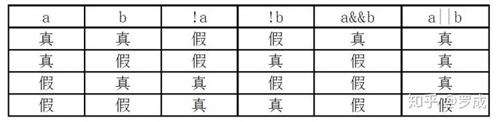

# Verilog语法之四：运算符
Verilog HDL语言的运算符范围很广，其运算符**按其功能可分为以下几类:**

1) 算术运算符(+,－,×，/,％)

2) 赋值运算符(=,<=)

3) 关系运算符(>,<,>=,<=)

4) 逻辑运算符(&&,||,!)

5) 条件运算符(?:)

6) 位运算符(~,|,^,&,^~)

7) 移位运算符(<<,>>)

8) 拼接运算符({ })

9) 其它

在Verilog HDL语言中运算符所带的操作数是不同的，**按其所带操作数的个数运算符可分为三种:**

1) 单目运算符(unary operator):可以带一个操作数,操作数放在运算符的右边。

2) 二目运算符(binary operator):可以带二个操作数,操作数放在运算符的两边。

3) 三目运算符(ternary operator):可以带三个操作,这三个操作数用三目运算符分隔开。

见下例:

```verilog
clock = ~clock;  // ~是一个单目取反运算符, clock是操作数。
c = a | b;  // 是一个二目按位或运算符, a 和 b是操作数。
r = s ? t : u; // ?: 是一个三目条件运算符, s,t,u是操作数。
```

下面对常用的几种运算符进行介绍。

## **1.算术运算符**

在Verilog HDL语言中，算术运算符又称为二进制运算符，共有下面几种：

1) + (加法运算符,或正值运算符,如 rega＋regb，＋3)

2) － (减法运算符，或负值运算符，如 rega－3,－3)

3) × (乘法运算符，如rega\*3)

4) / (除法运算符，如5/3)

5) % (模运算符，或称为求余运算符，要求％两侧均为整型数据。如7％3的值为1)

在进行整数除法运算时，结果值要略去小数部分，只取整数部分。而进行取模运算时，结果值的符号位采用模运算式里第一个操作数的符号位。见下例。

```text
模运算表达式       结果     说明
10%3               1       余数为1
11%3               2       余数为2
12%3               0       余数为0即无余数
-10%3             -1       结果取第一个操作数的符号位,所以余数为-1
11%3               2       结果取第一个操作数的符号位,所以余数为2.
```

**注意：** **在进行算术运算操作时，如果某一个操作数有不确定的值x，则整个结果也为不定值x。**

## **2.位运算符**

Verilog HDL作为一种硬件描述语言,是针对硬件电路而言的。在硬件电路中信号有四种状态值1,0,x,z.在电路中信号进行与或非时，反映在Verilog HDL中则是相应的操作数的位运算。Verilog HDL提供了以下五种位运算符：

1) ~ //取反

2) & //按位与

3) | //按位或

4) ^ //按位异或

5) ^~ //按位同或(异或非)

说明:

*   位运算符中除了~是单目运算符以外,均为二目运算符,即要求运算符两侧各有一个操作数.
*   位运算符中的二目运算符要求对两个操作数的相应位进行运算操作。

下面对各运算符分别进行介绍:

**1)** **"取反"运算符~**

~是一个单目运算符,用来对一个操作数进行按位取反运算。

其运算规则见下表:


举例说明:

```verilog
rega='b1010;//rega的初值为'b1010
rega=~rega;//rega的值进行取反运算后变为'b0101
```

**2)** **"按位与"运算符&**

按位与运算就是将两个操作数的相应位进行与运算,

其运算规则见下表:


**3)** **"按位或"运算符|**

按位或运算就是将两个操作数的相应位进行或运算。

其运算规则见下表:


**4)** **"按位异或"运算符^(也称之为XOR运算符)**

按位异或运算就是将两个操作数的相应位进行异或运算。

其运算规则见下表:


**5)** **"按位同或"运算符^~**

按位同或运算就是将两个操作数的相应位先进行异或运算再进行非运算.

其运算规则见下表:


**6)** **不同长度的数据进行位运算**

两个长度不同的数据进行位运算时,***系统会自动的将两者按右端对齐.位数少的操作数会在相应的高位用0填满,以使两个操作数按位进行操作.***

## **3** **逻辑运算符**

在Verilog HDL语言中存在三种逻辑运算符:

1) && 逻辑与

2) || 逻辑或

3) ! 逻辑非

"&&"和"||"是二目运算符,它要求有两个操作数,如(a>b)&&(b>c),(a<b)||(b<c)。

"!"是单目运算符,只要求一个操作数,如!(a>b)。

下表为逻辑运算的真值表。它表示当a和b的值为不同的组合时,各种逻辑运算所得到的值。




逻辑运算符中"&&"和"||"的优先级别低于关系运算符,"!" 高于算术运算符。见下例:

*   (a>b)&&(x>y) 可写成: a>b && x>y
*   (a==b)||(x==y) 可写成:a==b || x==y
*   (!a)||(a>b) 可写成: !a || a>b

**为了提高程序的可读性,明确表达各运算符间的优先关系,建议使用括号.**

## **4.关系运算符**

关系运算符共有以下四种：

a < b a小于b

a > b a大于b

a <= b a小于或等于b

a >= b a大于或等于b

**在进行关系运算时，如果声明的关系是假的(flase)，则返回值是0，如果声明的关系是真的(true)，则返回值是1，如果某个操作数的值不定，则关系是模糊的，返回值是不定值。**

所有的关系运算符有着相同的优先级别。关系运算符的优先级别低于算术运算符的优先级别。见下例：

```verilog
a < size-1 //这种表达方式等同于下面
a < (size-1) //这种表达方式。
size - ( 1 < a ) //这种表达方式不等同于下面
size - 1 < a //这种表达方式。
```

从上面的例子可以看出这两种不同运算符的优先级别。当表达式size－(1<a)进行运算时，关系表达式先被运算，然后返回结果值0或1被size减去。而当表达式 size－1<a 进行运算时，size先被减去1，然后再同a相比。

## **5.等式运算符**

在Verilog HDL语言中存在四种等式运算符:

1) == (等于)

2) != (不等于)

3) === (等于)

4) !== (不等于)

这四个运算符都是二目运算符,它要求有两个操作数。"=="和"!="又称为逻辑等式运算符。其结果由两个操作数的值决定。由于操作数中某些位可能是不定值x和高阻值z,结果可能为不定值x。

**而"==="和"!=="运算符则不同,它在对操作数进行比较时对某些位的不定值x和高阻值z也进行比较,两个操作数必需完全一致，其结果才是1，否则为0*。***"==="和"!=="运算符常用于case表达式的判别,所以又称为"case等式运算符"。这四个等式运算符的优先级别是相同的。下面画出＝＝与＝＝＝的真值表，帮助理解两者间的区别。


下面举一个例子说明“＝＝”和“＝＝＝”的区别。

例：

```verilog
if(A==1’bx) $display(“AisX”); (当A等于X时，这个语句不执行)
if(A===1’bx) $display(“AisX”); (当A等于X时，这个语句执行)
```

## **6.移位运算符**

在Verilog HDL中有两种移位运算符：

<< (左移位运算符) 和 >>(右移位运算符)。

其使用方法如下：

```verilog
 a >> n;//a右移n位
 a << n;//a左移n位
```

a代表要进行移位的操作数，n代表要移几位。这两种移位运算都用0来填补移出的空位。下面举例说明:

```verilog
module shift;
    reg [3:0] start, result;
    initial
    begin
        start = 1; //start在初始时刻设为值0001
        result = (start<<2);
        //移位后，start的值0100，然后赋给result。
    end
endmodule
```

从上面的例子可以看出，start在移过两位以后，用0来填补空出的位。

进行移位运算时应注意移位前后变量的位数，下面将给出一例。

例：

```verilog
4’b1001<<1 = 5’b10010; 
4’b1001<<2 = 6’b100100;
1<<6 = 32’b1000000; 
4’b1001>>1 = 4’b0100; 
4’b1001>>4 = 4’b0000; 
```

## **7.位拼接运算符(Concatation)**

在Verilog HDL语言有一个特殊的运算符：**位拼接**运算符{}。用这个运算符可以把两个或多个信号的某些位拼接起来进行运算操作。其使用方法如下：

```verilog
{信号1的某几位，信号2的某几位，..,..,信号n的某几位}
```

即把某些信号的某些位详细地列出来，中间用逗号分开，最后用大括号括起来表示一个整体信号。见下例：

```verilog
{a,b[3:0],w,3’b101}
```

也可以写成为

```verilog
{a,b[3],b[2],b[1],b[0],w,1’b1,1’b0,1’b1}
```

**在位拼接表达式中不允许存在没有指明位数的信号**。这是因为在计算拼接信号的位宽的大小时必需知道其中每个信号的位宽。

位拼接还可以用重复法来简化表达式。见下例：

```verilog
{4{w}} //这等同于{w,w,w,w}
```

位拼接还可以用嵌套的方式来表达。见下例：

```verilog
{b,{3{a,b}}} //这等同于{b,a,b,a,b,a,b}
```

用于表示重复的表达式如上例中的4和3，必须是常数表达式。

## **8.缩减运算符(reduction operator)**

**缩减运算符是单目运算符,也有与或非运算**。

其与或非运算规则类似于位运算符的与或非运算规则,但其运算过程不同。位运算是对操作数的相应位进行与或非运算,操作数是几位数则运算结果也是几位数。

而缩减运算则不同,缩减运算是对单个操作数进行或与非递推运算,最后的运算结果是一位的二进制数。

缩减运算的具体运算过程是这样的:第一步先将操作数的第一位与第二位进行或与非运算,第二步将运算结果与第三位进行或与非运算,依次类推,直至最后一位。

例如：

```verilog
reg [3:0] B;
reg C;
C = &B;
```

相当于：

```verilog
C =( (B[0]&B[1]) & B[2] ) & B[3];
```

由于缩减运算的与、或、非运算规则类似于位运算符与、或、非运算规则,这里不再详细讲述,请参照位运算符的运算规则介绍。

## **9.优先级别**

下面对各种运算符的优先级别关系作一总结。见下表:


**优先级不用记，原因：**

**1.极少在一条语句里用多个操作符，如果用了，说明你的逻辑写的不好**

**2.如果有，加括号更保险**