# 如何通俗理解FPGA与Verilog HDL
*本文首发于微信公众号“花蚂蚁”，是快速入门FPGA与Verilog第1讲*

**1.从新手到专家之路**

任何领域从**新手**到**专家**都分5个阶段：

探索期 入门期 胜任期 高手期 专家期

从入门期到胜任期再到高手期都是可以通过项目历练而达到，但是从高手器到专家期一般由人的思维而决定。

这其中最难的就是入门期的新手入门阶段，由于新手期的迷茫，特别是没有高人指点的情况下，新手的学习状态曲线呈现出波荡起伏的趋势：

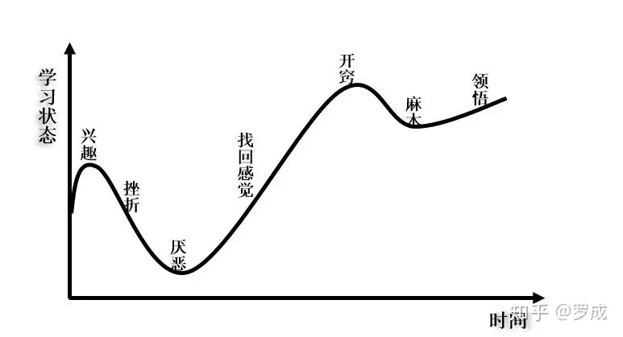

新手学习曲线

新手们凭着兴趣一腔热血扎入到FPGA和Verilog的学习中去，一个个的难点使之挫折，直至厌恶怀疑：我为什么要学这？如果还能坚持，经过了这段低谷期后，你开始慢慢找到感觉，然后逐渐开窍：不过如此嘛！此刻激情已然褪去，自满导致麻木，但是在你接触到更多的项目后你才会领悟到：我还差得远呢！此刻你已经入下一个快速提升期。

起步之后的专家之路同样是起伏的曲线：

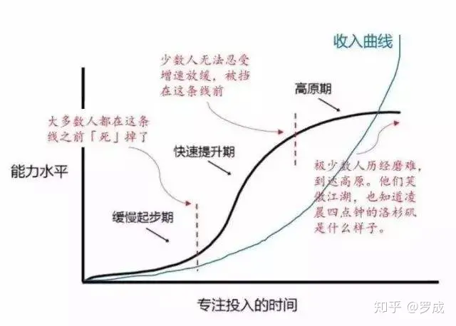

专家之路

缓慢起步期：往往对什么都有兴趣，但是都不能深入的去学习，一个个的拦路虎使我们知难而退，大多数人熬不过缓慢起步期，起步期对应的就是我们的入门阶段。

快速提升期：在这一阶段，已经克服了第一个困难，成功地发现了学习的方法，是提升最快的阶段。

高原期：只有极少数的人能够进入这个阶段，因为大多数人依赖原有的学习方法，不能建立属于自己的方法论，思维限制了他们的进步。

## **2.FPGA学习之路**

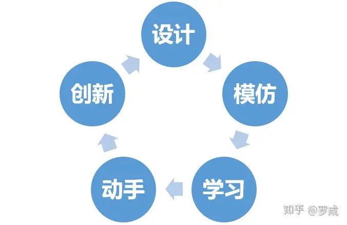

学习的迭代过程

FPGA的学习之路是一个模仿、学习、动手、创新、设计，不断迭代的过程。

初学者往往是从模仿别人的代码开始，学习语法、学习建模方法、学习代码风格等等，在学习的基础上动手修改出自己的代码，熟练后开始加入自己的创新点，可以独立的做自己的设计。

FFPGA初学者会常见现象：

1.  数字电路理论不扎实，概念不清。这个是最要命的，因为数字逻辑是FPGA的基础，就像是你要建一座房子，你可以不会用斧子、铲子等工具，但你不能不知道房子长什么样子。
2.  Verilog语法不精，Verilog HDL语法书翻了一遍又一遍，学了忘，忘了学，循环往复，直至兴趣殆尽。这个现象的根源是没有在实践中学习。Verilog HDL就是为开发FPGA而开发的一款工具而已，就像是盖房子用的斧子锤子一样，要多动手才能精通。
3.  工具软件不会用。Xilinx、Altera(已被Intel收购)等FPGA厂家都有各自的开发软件，虽然软件不同，但是开发流程都是一致的，学会一种，另外一种自然而然的也会了，因为思维指导行动，一精百通。以后我会以ISE和ModelSim为例，教大家学习Verilog和FPGA。
4.  最后一点就是用软件的思维去写Verilog代码，其实这个和第一点是一个问题。以后会在教程中给大家具体的讲解。

目前我能想到的初学者的问题就这些，如果你作为初学者还有其他问题，可以加我个人微信(GreenAnt\_Wayane)详细交流。

## **3.FPGA与ASIC？**

说到FPGA，往往离不开介绍ASIC。从字面意思上来说：

FPGA（Field－Programmable Gate Array），即现场可编程门阵列；

ASIC(ASIC,Application Specific Integrated Circuit)是用于供专门应用的集成电路芯片技术。

我的理解是FPGA是可编程的ASIC，FPGA是一个百变星君，可以孙悟空的七十二变，在FPGA内部资源允许的情况下，FPGA可以实现ASIC芯片的功能，反之，ASIC内部的逻辑都是定死的，只能实现固定的功能，ASIC远没有FPGA灵活。打个比方：如果说ASIC是一块砖，那么FPGA就是水泥，可以揉捏成任意的形状。

下面是一些FPGA芯片和ASIC芯片的实物图片：

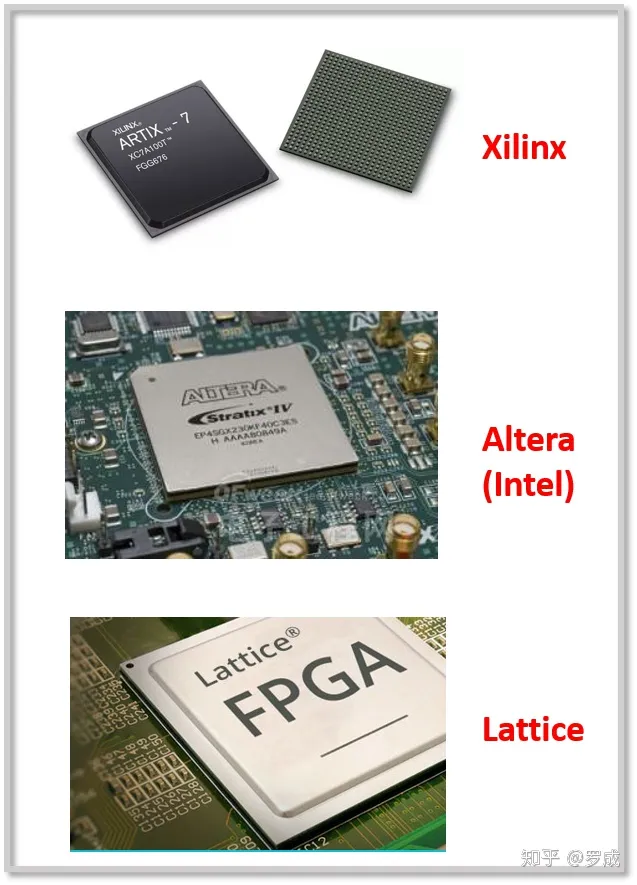

FPGA芯片，从上往下依次是Xilinx、Altera、Lattice厂家的芯片

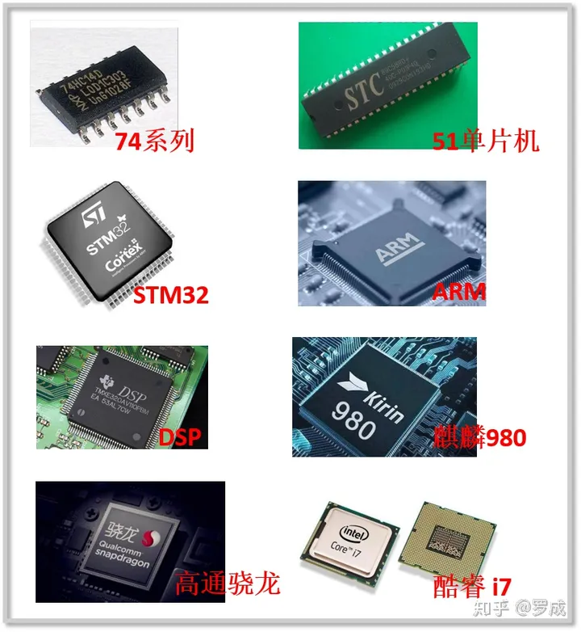

专用集成电路芯片，包括熟悉的74系列、51单片机、stm32、ARM、DSP、手机处理器（海思麒麟和高通骁龙）以及PC处理器酷睿i7

## **4.FPGA与ASIC的本质**

从FPGA和ASIC的实物图片可以看出：FPGA和ASIC也没有什么区别嘛，从外观上看都是芯片嘛！恭喜你答对了，他们都是芯片，**FPGA和ASIC的本质的都是由晶体管组成，**所以他们看着差不多**。**

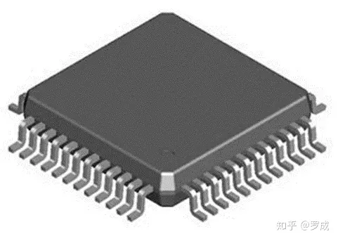

常见芯片外观

去掉芯片的保护外壳（封装），会漏出里面的的裸片（die），芯片的管脚就是从裸片上的PAD用金线连接出来的，如下图所示。

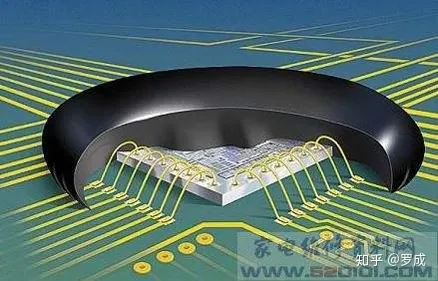

芯片封装技术

裸片是从晶圆上一片片的切下来的，晶圆的样子如下图所示，

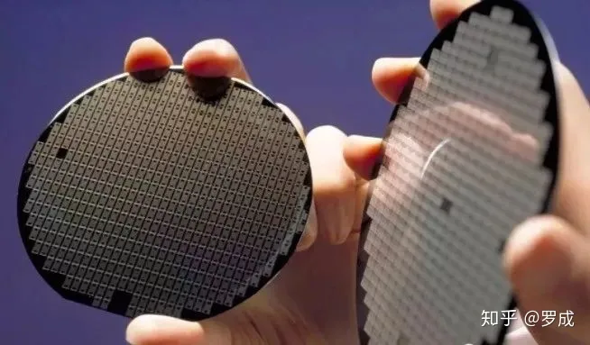

晶圆图片

晶圆是指硅半导体集成电路制作所用的硅晶片，由于其形状为圆形，故称为晶圆。在硅晶片上可加工制作成各种电路元件结构，而成为有特定电性功能的集成电路产品。上图中的晶圆，每一个长方形就是一片芯片的裸片，每一个裸片将来都可以封装成一块芯片。

芯片是如何在硅晶片生产出来的呢？这几需要集成电路的版图了，版图就好比PCB文件，只不过集成电路版图用于指导芯片的生产，PCB用于印制电路板的生产。下图就是一个芯片的版图，周围黄色的方形就是将来封装芯片时，用金线连接芯片管脚的PAD。

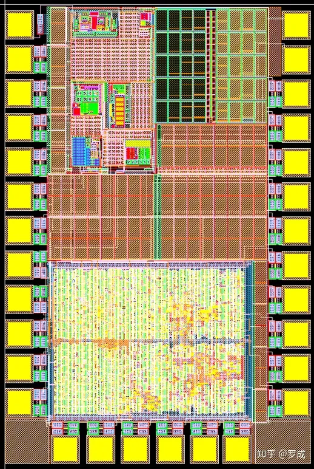

集成电路版图

像PCB一样，版图也是分层的立体结构。

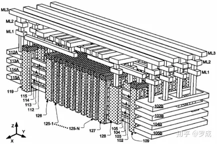

集成电路版图内部互联结构

以一个或非门为例，它的版图结构如下所示：

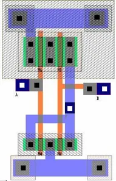

或非门版图

一个芯片的版图就是由千千万万个类似于或非门的基础电路搭建而成，门级电路又是由更基本的单元：PMOS和NMOS组成。

MOS管的剖面结构如下所示：

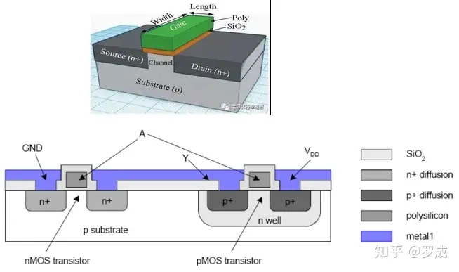

晶体管结构

**通过上面的讲解我们明白了任何的数字芯片都可以由由晶体管组成。**

## **5.为什么芯片的逻辑可以用晶体管搭建而来？**

数电中我们学过卡诺图化简逻辑表达式的方法：

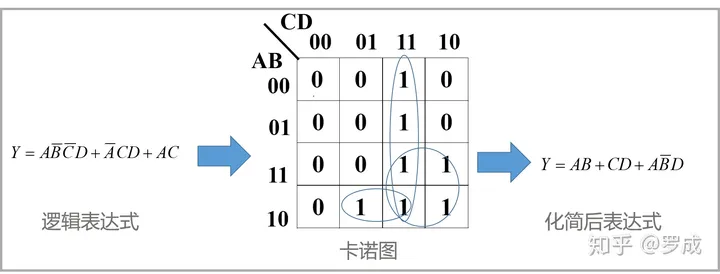

卡诺图化简过程，其实中间漏掉了写出真值表的过程

由卡诺图化简过程，可以得知，**任何的数字逻辑表达式最终都可以化简成*与或非*组合的形式。**

而**与或非**门又由基础的PMOS和NMOS（晶体管）组成，与或非门又可以搭建出任何的组合逻辑电路。

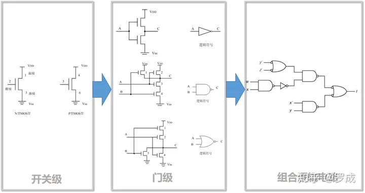

开关级——门级——组合逻辑的过程

非门、与非门、或非门由晶体管级的PMOS和NMOS组成，组成电路如上图所示。

所以，**任何的数字组合逻辑电路都可以有晶体管组成。**

## **6.FPGA的原理与结构**

**FPGA的原理**是基于SRAM的**查找表**结构。通俗的讲就是：可以将FPGA看做是一片SRAM，利用开发工具软件计算出所有的**输入组合排列**对应的**输出结果，**然后将输入组合作为SRAM的地址，该地址中存放的是与输入组合对应的输出。当输入信号变化时，到相应的地址中读取提前计算好存入的结果，然后输出。

FPGA结构组成包括以下：

1.  可编程输入输出单元(IOB)
2.  可配置逻辑块(CLB)
3.  时钟管理模块(DCM)
4.  嵌入式块RAM(BRAM)
5.  丰富的布线资源
6.  底层内嵌功能单元
7.  内嵌专用硬核

其中1-5是FPGA必须具备的，6、7一些低级的FPGA可能不具备。具体不再细讲，几乎每一本FPGA的书籍都会有详细的讲述。

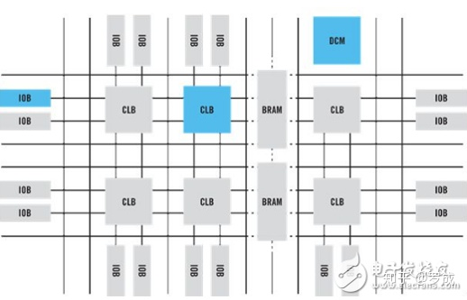

FPGA结构示意图

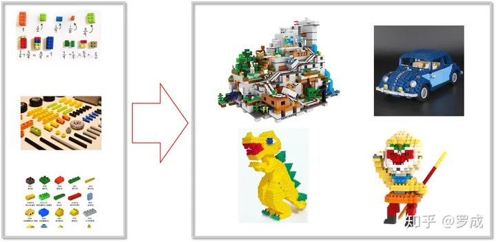

FPGA就像积木一样，只要合理运用，通过使用不同的结构进行搭配组合，可以得到你想要的。

## 7.Verilog HDL概述

如何将一堆积木零件搭建出我们想要的结构呢（将FPGA配置成我们所需要的电路）？这就需要我们的Verilog HDL登场了。

Verilog HDL是一种硬件描述语言，可以抽象的描述硬件电路。硬件描述语言同样可以用于ASIC设计和FPGA设计。

常用的硬件描述语言还有VHDL，关于VHDL和Verilog HDL，我的总结就是：VHDL语法严谨（潜台词：规矩多），适用与大型电路设计；Verilog HDL语法灵活，上手快。所以建议新手学习Verilog HDL。即使没学过VHDL，但是精通Verilog HDL也照样能够看懂VHDL，因为建模思想都是一样的，猜也能猜个八九不离十。

## **8.如何快速上手Verilog HDL?**

你必须知道的，Verilog的所有语法中：

•Verilog语法中30%的语言用于电路设计(可综合，可产生实际电路）

•70%的语言用于功能仿真，也就是测试

也就是说，你没必要掌握所有的语法。有的同学抱着本Verilog语法书从头到尾一直不拉的啃，妄想着学会说有语法后再去设计电路，殊不知他拿着80%的时间去学习着70%的可能用不到的语法。我并不是说仿真的语法不重要，我的意思是先掌握基本的简单语法，四个字：先干起来。

学习Verilog就像是盖房子，妄图掌握所有语法的人想着我一定要把地基打牢，所以花费了巨量的经历和时间磨语法，就一直在打地基。而先干起来的同学虽然房子不完整，但是轮廓已经起来了，以后修修补补，就能完工。

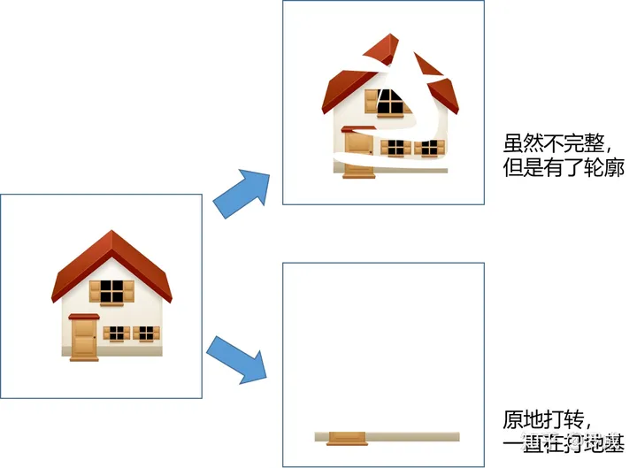

学习过程像盖房子一样，不要等着所有都完备后再开工

**总结**

在学习一门技术之前我们往往从它的编程语言入手，比如学习单片机时，我们往往从汇编或者C语言入门。所以不少开始接触FPGA的开发人员，往往是从VHDL或者Verilog开始入手学习的。但我个人认为，若能先结合《数字电路基础》系统学习各种74系列逻辑电路，深刻理解逻辑功能，对于学习HDL语言大有裨益，往往会起到事半功倍的效果。

当然，任何编程语言的学习都不是一朝一夕的事，经验技巧的积累都是在点滴中完成，FPGA设计也无例外。

我后续推出的**快速入门Verilog HDL及FPGA视频教程**的学习方式将是：

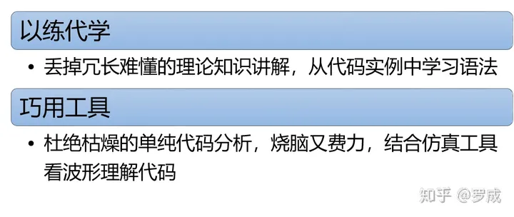

由于工作比较忙，下期教程更新前同学们可以先看书自学一下语法，下面是我搜集的一些不错的教材书籍。

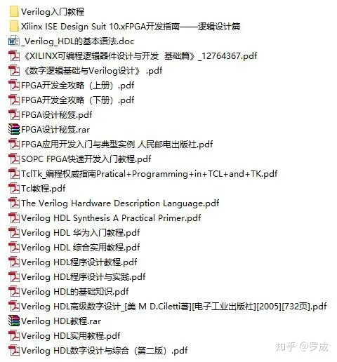

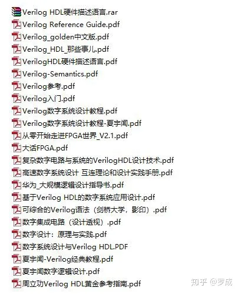

链接：[https://pan.baidu.com/s/1DiXsasDyKR7kTgBQBvAg8g](https://link.zhihu.com/?target=https%3A//pan.baidu.com/s/1DiXsasDyKR7kTgBQBvAg8g)

提取码：d0ef

若链接失效，请关注微信公众号**花蚂蚁**，后台分别回复“教材书籍”重新获取链接。

本文章首发于我的公众号（花蚂蚁），后续会在微信公众号上发布**快速入门FPGA与Verilog HDL系列视频教程**，有兴趣的同学可以关注一下。