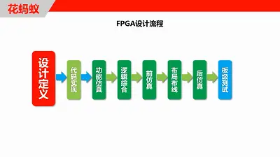
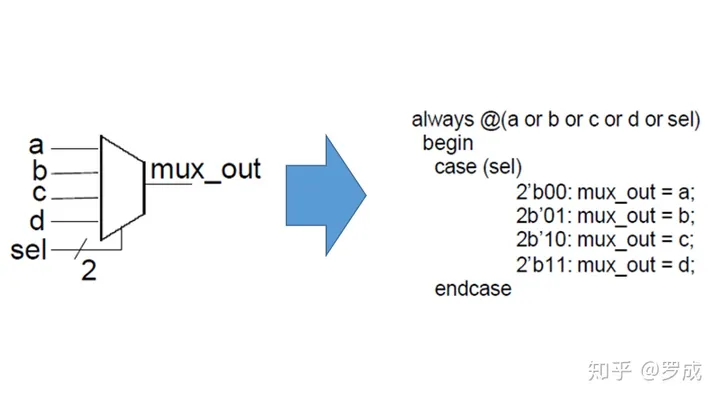
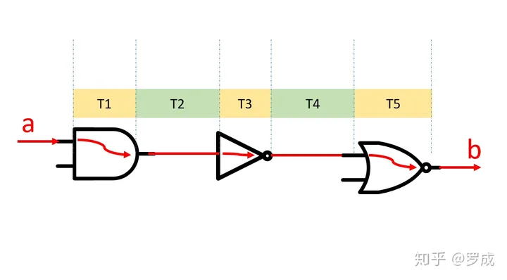
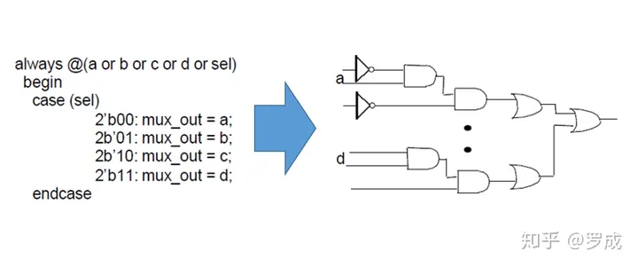
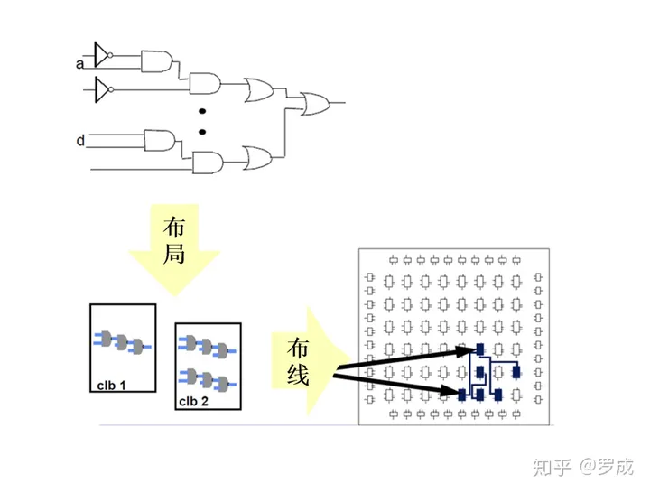
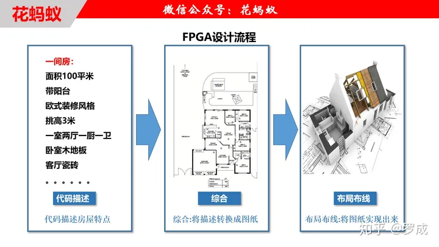
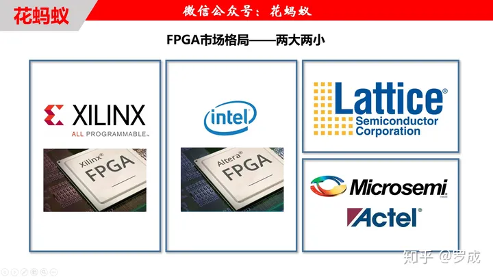
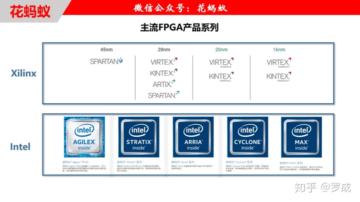
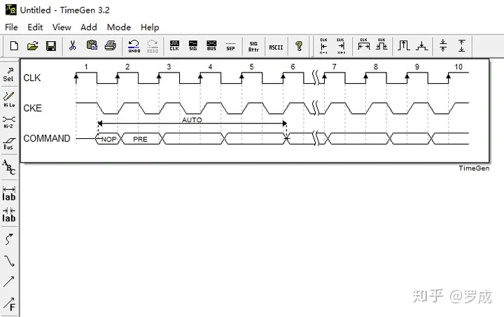

# 快速理解FPGA设计流程及工具软件
*这是快速入门FPGA与Verilog HDL系列教程的第二讲，本系列教程致力于让新手入门FPGA和Verilog HDL。本文首发于我的微信公众号“花蚂蚁”，追更教程的可以关注我的公众号，后续还会有视频教程相继推出。*

## **一、FPGA设计流程**

FPGA设计流程是利用EDA开发软件和编程工具对FPGA芯片进行开发的过程。FPGA的设计流程如上图所示：包括设计定义、代码实现、功能仿真、逻辑综合、前仿真、布局布线、后仿真和板级调试等步骤！

***1.设计定义***

设计定义阶段主要进行方案验证、系统设计和FPGA芯片选型等准备工作。根据任务要求，评估系统的指标和复杂度，对工作速度和芯片本身的资源、成本等方面进行权衡，选择合理的设计方案和合适的器件类型。

这个阶段往往会花费大量的时间，这个阶段之后一般已经完成了系统建模，功能划分，模块划分以及设计文档的撰写等工作。

***2.代码实现***

代码实现阶段是将划分好的各功能模块用硬件描述语言表达出来，常用的硬件描述语言有Verilog HDL和VHDL。以后的教程中我们主要讲解如何使用Verilog HDL进行FPGA设计。

下面是一个四选一电路的代码实现过程：

四选一电路的代码实现过程

常用的代码编辑器软件有notepad++和UltralEdit等，它们支持几乎所有主流编程语言的高亮显示、代码补全、自定义快捷键等功能，外观漂亮、功能强大，扩展性强，具有丰富的插件包，极大的提高工作效率。

***3.功能仿真***

功能仿真是在编译之前对用户所设计的电路进行逻辑功能验证，此时的仿真没有延迟信息，仅对初步的功能进行检测。这里我们补充一个延迟类型的知识点：

器件延迟和路径延迟

我们知道信号在电路中传输时会有两种延迟：器件延迟和路径延迟。

顾名思义，器件延迟是信号在经过器件传输时的延迟时间，器件延迟与器件本身特质相关；路径延迟是信号经过连接线时的延迟时间，与连线长度成正比。

上图中信号从a到b的延迟时间为T1+T2+T3+T4+T5，其中器件延迟是T1、T3、T5，路径延迟是T2、T4。在功能仿真中，这些延迟信息都为零。

***4.逻辑综合***

逻辑综合的概念是：将高级抽象层次的***语言描述***转化成较低层次的***电路结构***。

也就是说将硬件描述语言描述的电路逻辑转化成与门、或门、非门、触发器等基本逻辑单元的**互连关系**，也就是我们常说的**门级网表**。

还是以四选一电路为例，综合过程将Verilog代码翻译成了门级互连网表。

四选一电路的综合过程

综合的概念很重要，利用Verilog 做电路设计时我们总是强调可综合的概念，可综合就是我们的这段代码可以被翻译成门级电路，不可综合就是代码不能被翻译成与之对应的门级电路。

综合是创造性的转化过程，它不但能***翻译***我们的电路，还能够***优化***我们的电路，比如去除电路描述中冗余的电路结构，或者复用功能相同的电路结构。

Verilog中可综合的语法多用于电路设计，那么为什么还要有不可综合的语法呢？不可综合的语法用于仿真测试。后续的教程中会讲解可综合和不可综合的Verilog语法。

***5.前仿真***

前仿真也叫做综合后仿真，仿真时，把综合生成的标准延时文件反标注到综合仿真模型中去。

因为综合后只能体现基本的逻辑门之间的互连关系，并不是实物电路，没有连线长度信息，所以前仿真只能评估门延时带来的影响，不能估计路径延时，前仿真结果和布线后实际情况还有一定的差距，并不十分准确。

目前的综合工具较为成熟，一般的设计可以省略这一步。但如果布局布线后发现电路功能与设计意图不符，就需要回溯到前仿真来确定问题所在。

***6.布局布线***

综合后生成的门级网表只是表示了门与门之间虚拟的连接关系，并没有规定每个***门的位置***以及***连线长度***等。布局布线就是一个将门级网表中的*门的位置*以及*连线信息*确定下来的过程。

综合后生成的门级网表只是虚拟的连接关系，并没有反应到实物上去。布局布线有时也叫作实现与布局布线，布局布线将逻辑网表中的门级连接关系配置到FPGA芯片内部的固有硬件结构上。布局布线过程将每一个门实际配置到固定位置的可编程逻辑块（CLB）中，

布局布线过程

在解释布局布线之前，我们先回顾一下FPGA的结构，我们知道FPGA可重复编程的基础是拥有巨量的**可配置逻辑块（CLB）**、**丰富的布线资源**以及其他资源

①布局

布局的过程就是将门级网表中的每一个门“*安置*”到CLB中的过程，这个过程是一个映射的过程。

②布线

布线是利用FPGA中丰富的布线资源将CLB根据逻辑关系连接在一起的过程。

逻辑门的映射位置不是随意的，是FPGA设计软件经过算法计算后精心排列的一般的布局布线策略是*占用最少的CLB*并且*连线尽量短，*也就是*面积和速度最优*。

布局布线策略有两种：速度优先和面积优先，往往不能同时达到两者皆最优，所以布局布线时需要在速度最优和面积最优之间做出选择。

一般的布局布线策略是*占用最少的CLB*并且*连线尽量短，*也就是*面积和速度最优*。

布局布线策略有两种：速度优先和面积优先，往往不能同时达到两者皆最优，所以布局布线时需要在速度最优和面积最优之间做出选择。

布局布线后就可以进行**静态时序分析**了，静态时序分析的方法是在布局布线后的实际电路中寻找寄存器和寄存器之间的最长路径延迟，通过最大延迟可以得出系统最大时钟速率。静态时序分析也是EDA工具自动完成，延迟路径信息可以在生成的时序报告中分析。时序分析的概念以后的教程中也会细讲。

***7.后仿真***

后仿真也称为时序仿真，是将布局布线的延时信息反标注到设计网表中来检测有无时序违规。

经过布局布线后，门与门之间的连线长度也确定了，所以后仿真包含的延迟信息最全，也最精确，能更好的反映芯片的额实际工作情况。

现在我们可以总结一下功能仿真、前仿真和后仿真的区别了：

功能仿真：无延迟信息；

前仿真：只有门级的延迟；

后仿真：门级延迟和连线延迟；

***8.板级调试***

我们的FPGA设计不能只在电脑上跑仿真，最终还是要在电路板上应用起来的，设计的最后一步就是板级测试了，将EDA软件产生的数据文件（位数据流文件）下载到FPGA芯片中，进行实际的测试。

FPGA工程师还需要有一定的硬件知识，能够看懂电路板原理图设计和PCB是最低要求了，能够独立设计原理图是最好的了。

***打个比方。。。***

为了方便初学者门能更快的了解FPGA的设计流程，我举了一个栗子，请看下图：

FPGA的设计流程可以用盖房子的过程类比

代码实现，综合和布局布线时FPGA设计流程中的几个关键步骤，下面我们打个比方加深理解一下这几个步骤是干什么的：

**代码实现：**比如我要盖一座房子，我把房子的特点描述出来：比如面积100平米、带阳台、欧式装修风格、挑高3米、一室两厅一厨一卫、卧室木地板客厅瓷砖。。。等等要求，这个描述房屋特点的过程就好比我们用Verilog描述电路功能的过程。

**逻辑综合：**建筑师根据我们的要求画出施工图纸，施工图纸将我的需求数字化、具体化，比如这个墙有多高，门有多宽，窗户面积等等，这个过程就好比综合的过程，将房屋需求翻译成具体的数字化图纸，只不过综合是将电路功能翻译成门级网表，建筑师干的活就是综合工具软件干的活。

**布局布线：**工人拿会根据图纸（综合后网表），用砖、水泥、钢筋、木材等材料建造施工的过程就好比布局布线的过程。图纸规定了一面墙，但是没有规定具体用哪一块砖来砌墙，工人可以自主决定用哪些砖。布局布线是根据综合后的网表（施工图纸），利用FPGA芯片内部的可编程逻辑块（CLB），布线资源，时钟资源，存储资源等搭建电路的过程。

综合和布局布线的过程中会涉及到约束策略的问题，比如管脚约束、时钟约束、面积和速度优先级等。这些概念在盖房子的过程中也有对应，比如你可以跟建筑师要求阳台大小、卧室朝向、门窗高度等，采购建筑材料时，你也会控制成本和质量之间的平衡。这些都类似于综合和布局布线过程中的约束条件。

## 二、FPGA厂家、产品系列及设计软件介绍

***1.FPGA厂家***

FPGA市场格局——两大两小

近几年，全球半导体行业的关键词就是：收购、兼并、重组，FPGA领域也发生了不小的变化。

目前，全球FPGA市场高度集中，被美国四家企业垄断，呈现出“两大两小”的市场格局。“两大”是指Xilinx（赛灵思）和Intel（因特尔），“两小”是指Microsemi（美高森美）和Lattice（莱迪思），前两大企业占据近90%的市场份额。

其中Intel的FPGA业务是收购自Altera公司的，现在的Microsemi是在2010年收购Actel后合并而来的。

2015年Lattice以6亿美元收购Silicon Image公司；基于保护国家战略资产的考虑，16年底美国总统特朗普下达行政指令，宣布停止具有中资背景的私募股权基金（Canyon Bridge）收购美国FPGA芯片制造商Lattice（莱迪思）的交易，要求买卖双方完全、永久性地放弃收购。

“两小”厂家主攻的是特殊市场，比如军工、航天市场所用的反熔丝FPGA。反熔丝FPGA价格十分昂贵，只能烧录一次，抗辐照能力比较强。

初学者学习Xilinx（赛灵思）和Intel（因特尔）家的FPGA就可以，官网资料比较多，开发板相对便宜。

***2.FPGA产品系列***

主流FPGA产品系列

我们只介绍Xilinx（赛灵思）和Intel（因特尔）的FPGA产品系列，另外两家小众的FPGA就不介绍了。

上面图片中的产品系列是从两家FPGA厂家官网上找到的当前在售的产品系列。

**Xilinx：**工具工艺制程，可以分为6系（45nm）、7系（28nm）、UltraSCALE（20nm）、UltraSCALE+（16nm），按照型号系列还可以分为Spartan、Artix、Kintex、Virtex等系列，另外还有嵌入式系统开发的Zynq系列。

**Intel：**Intel目前在售的FPGA产品系列主要有MAX系列、Cyclone系列、Arria系列、Stratix系列、Agilex系列以及SoC FPGA系列产品。

初学者如何选择第一块开发板：初学者一般学生居多，口袋紧张，建议选择Xilinx Spartan6系开发板，或者Intel Cyclone IV开发板，价格应该在200左右或者200多一点。这两种器件应该肯定能够覆盖初学者的设计规模。当然，如果不差钱，可以选择更高级的开发板。

***3.设计软件***

FPGA设计软件

FPGA设计软件的使用和FPGA的设计流程是一致的，所以学会了使用其中的一种软件，再去使用另外的一款软件也能很快上手。

学习FPGA一定要学习FPGA的设计思想以及设计原理，不要纠结于单一的实验平台或者操作软件，因为你想在这个行业越走越高的话，广度和深度都是要有所了解的，初期学习的时候尤其注重动手，选择一款操作平台以及操作软件是为了让你更好的去动手做，而不是让你在这款软件或者实验平台去做文章，因为不懂原理的话，换个环境你同样是什么都不明白。

**Xilinx设计软件：**

Xilinx目前开发工具包括***ISE***和***Vivado***,  
***ISE® design suite*** 支持 Spartan®-6、 Virtex®-6、和 CoolRunner™ 器件，及其上一代器件系列。

***Vivado® Design Suite*** ，针对 Virtex-7、Kintex-7、Artix-7、和 Zynq®-7000 起的全新设计。

也就是说如果你用7系以后的器件，请用Vivado，6系及以前器件请用ISE。

ISE和Vivado都有第三方仿真平台的接口，调用最多的第三方仿真软件就是Modelsim，ISim是ISE自身集成的仿真工具，两者功能差不多。用modelsim的人比较多，然后教程也多，容易学。跑大型的工程，Modelsim快很多。所以我们在以后的教程中使用Modelsim演示。

**Intel设计软件：**

Intel的FPGA软件是Quartus，目前最新的版本已经到了19版本。

分为3个版本：

英特尔® Quartus® Prime 精简版

英特尔® Quartus® Prime 标准版

英特尔® Quartus® Prime 专业版

其中精简版是免费的，无需付费许可，而且内置了modelsim仿真软件。

## 最后、分享一些软件

之前在分享过modelsim和ISE安装破解过程，知乎上由于涉嫌侵权违规（破解侵权），所以文章被知乎删掉了。

近期又整理了一些Vivado 2018.1、ISE14.7、Quartus (Quartus Prime 18.1) Standard Edition以及modelsim的安装方法。仅供于学习交流。

下面是教程的连接，链接内也包含安装软件，可以按需下载。

FPGA软件安装方法链接：[https://pan.baidu.com/s/1GxgdbQr43HUZ-Q\_pBCuUzw](https://link.zhihu.com/?target=https%3A//pan.baidu.com/s/1GxgdbQr43HUZ-Q_pBCuUzw)

提取码：jkla

最后再给大家分享一款波形编辑软件，你还在用visio画波形时序图吗？下面这个小工具操作简单，小巧免安装，实乃写论文、写报告画图之神器。操作界面如下：

波形编辑软件，小巧免安装

Q:请问映射你体现在哪里的
映射不应该是将门级网表转换为LUT网表（逻辑电路到逻辑单元），布局是把这个逻辑单元放置到FPGA芯片上，布线将这些寄存器，lut连接起来