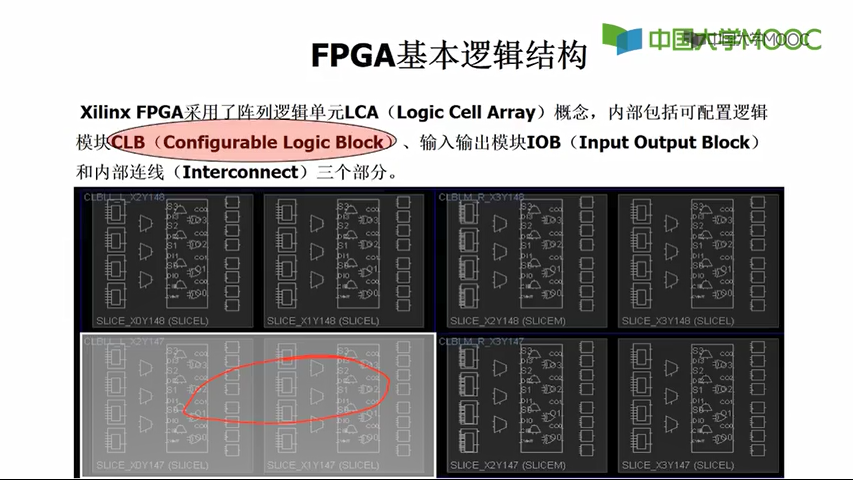
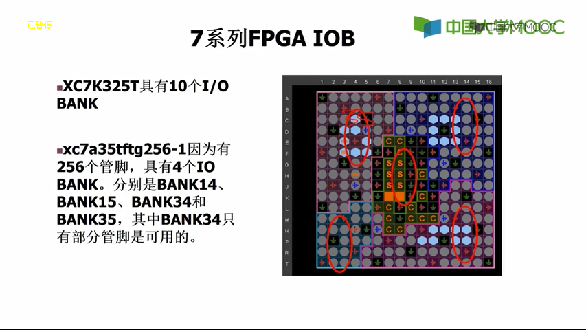
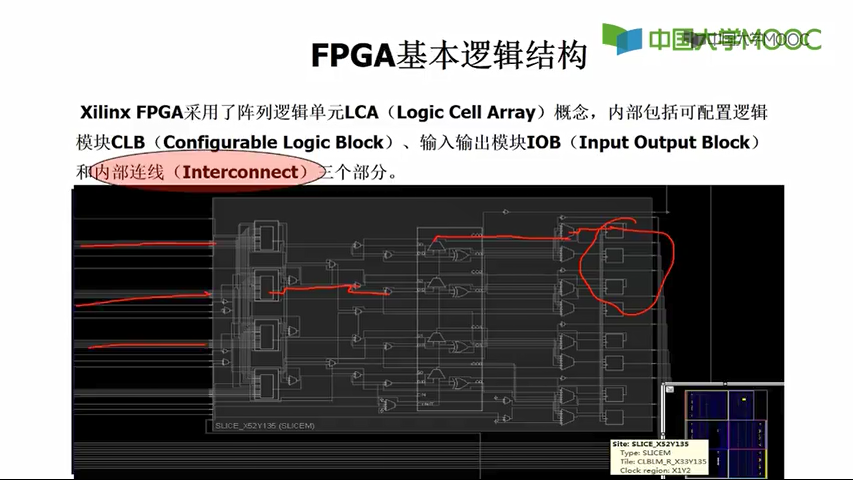

# 前言
# 第一章 FPGA的基础、基本原理、电路设计  

FPGA芯片结构：
（可编程输入输出单元IOB/可配置逻辑块CLB/数字时钟管理模块DCM/ 嵌入式块RAM（BRAM）/丰富的布线资源/ 底层内嵌功能单元/内嵌专用硬核）

Xilinx FPGA 采用了逻辑单元阵列LCA（Logic Cell Array）概念
内部包括可配置逻辑模块CLB（Configurable Logic Block）、输入输出模块IOB（Input Output Block）和内部连线（Interconnect）三个部分
## CLB 
一个CLB由两个SLICE 构成

FPGA的CLB
从上面的介绍我们可以看出，查找表是一些组合逻辑电路，主要是用RAM+MUX2来实现一定的组合逻辑功能。我们知道逻辑电路都会有延时，所以为了确保电路的工作稳定，还需要有同步单元才行。
在FPGA中，每个5输入的查找表后面有一个触发器，那么6输入的查找表有两个触发器。每四个6输入的查找表加2个触发器以及一个进位加法运算器组成一个slice，两个slice组成一个CLB单元。
slice 又分为SLICEM和SLICEL，M的意思是memory，L的意思是logic，区别是SLICEM除了做查找表用之外，还可以用作RAM，这种叫做分散式RAM单元(Distributed RAM)。除此之外，SLICEM还可以用作移位寄存器，本篇就不做展开，等以后再叙吧。SLICEL只能做查找表用。

说到这里，我们应该能读懂FPGA的手册中关于资源的描述了。从中可以看出SLICE的数量等于SLICEM+SLICEL

       Slice是Xilinx公司定义的基本逻辑单位，其内部结构如图1-4所示，一个Slice由两个4输入的函数、进位 逻辑、算术逻辑、存储逻辑和函数复用器组成。算术逻辑包括一个异或门（XORG）和一个专用与门（MULTAND），一个异或门可以使一个Slice实现 2bit全加操作，专用与门用于提高乘法器的效率；进位逻辑由专用进位信号和函数复用器（MUXC）组成，用于实现快速的算术加减法操作；4输入函数发生器用于实现4输入LUT、分布式RAM或16比特移位寄存器（Virtex-5系列芯片的Slice中的两个输入函数为6输入，可以实现6输入LUT或 64比特移位寄存器）；进位逻辑包括两条快速进位链，用于提高CLB模块的处理速度

## IOB
红色标出的是IOB

中间是其他功能的IOBANK

高效管脚，执行效率较高，速度快
宽范围管脚：电平兼容性更好

## 内部连线（Interconnect）
本图是一个Slice内部的连线情况
一红：外部连线
二红：存储器 到 多路选择器的连线
三红：
四红：触发器到锁存器

# Verilog HDL

