# verilog语法学习0：常用基础语法全梳理（下）
## 四、块语句

*   顺序块：采用begin end语句，块内的语句是按照顺序执行的，前面的语句执行完才轮到后面的语句执行，每条语句的延迟时间是相对于前一条语句的仿真时间定的。
*   并行块：采用fork join语句，块内的语句是并行执行的，每条语句的延迟时间是相对于程序进入块内的时间。并行块是不可综合的，只能用在仿真中。

```verilog
module begin_tb();
	reg [7:0] r;
	reg clk;

	initial begin:begin_tb //这里可以将块名写上
	   clk = 0;
	   #50 r = 8'h35;
	   #30 r = 8'h12;
	   #40 r = 8'h41;
	end
	always #5 clk = ~clk;
endmodule

module fork_tb();
	reg [7:0] r;
	reg clk;

	initial fork:fork_tb //这里可以将块名写上
	   clk = 0;
	   #50 r = 8'h35;
	   #30 r = 8'h12;
	   #40 r = 8'h41;
	join
	always #5 clk = ~clk;
endmodule
```

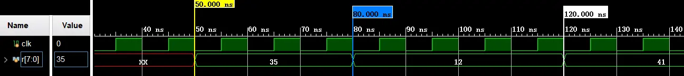

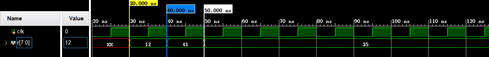

上面是begin end的仿真时序图，下面是fork join的仿真时序图。从仿真时序图中可以明显的看到，begin end是串行的时序而fork join是并行的时序。

*   生成块：采用generate endgenerate语句，这一声明语句方便参数化模块的生成。当对矢量中的多个位进行重复操作时，或者当进行多个模块的实例引用的重复操作时，或者在根据参数的定义来确定程序中是都应该包括某段verilog代码的时候，使用生成语句能够大大简化程序的编写过程。[HDLBits：Adder100i](https://link.zhihu.com/?target=https%3A//hdlbits.01xz.net/wiki/Adder100i) ，[HDLBits：Bcdadd100](https://link.zhihu.com/?target=https%3A//hdlbits.01xz.net/wiki/Bcdadd100) 。

**1、for：在generate中的应用主要是用来减少重复操作。**

```verilog
//-------------module-------------//
// 顶层模块包含N个半加器
module top(a,b,sum,cout);
	parameter N=2;
	input  [N-1:0] a, b;
	output  [N-1:0] sum, cout;

	// 声明一个暂时的循环变量
	genvar i;

	// 生成N次
	generate
		for (i = 0; i < N; i = i + 1) begin
          half_add u0(a[i], b[i], sum[i], cout[i]);
		end
	endgenerate
endmodule

// 定义一个半加器
module half_add(a, b, sum, cout);
  input a,b;
  output sum,cout;

  assign sum  = a ^ b;
  assign cout = a & b;
endmodule
//-------------testbench-------------//
`timescale 1ns / 1ns
module top_tb;
  parameter N = 2;
  reg  [N-1:0] a, b;
  wire [N-1:0] sum, cout;

  top instance1( .a(a), .b(b), .sum(sum), .cout(cout));

  initial begin
    a <= 0;
    b <= 0;

    #10 a <= 'h2;
    	b <= 'h3;
    #20 b <= 'h4;
    #10 a <= 'h5;
  end
endmodule
```

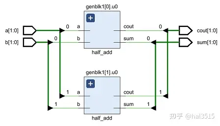

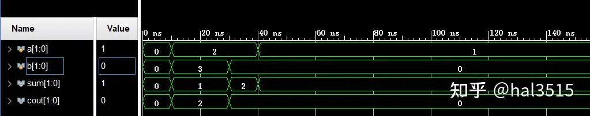

具体生成的RTL图以及仿真结果如上图所示。

**2、if：在generate中主要用来根据参数的定义来确定程序。**

```verilog
//-------------module-------------//
module top(a, b, sel, out);
  input a,b,sel;
  output out;
  parameter USE_CASE = 0;

  // 使用 generate 块选择使用 mux_case 或者 mux_assign
  generate
  	if (USE_CASE)
      mux_case m1 (.a(a), .b(b), .sel(sel), .out(out));
    else
      mux_assign m2 (.a(a), .b(b), .sel(sel), .out(out));
  endgenerate

endmodule

// Design #1: 使用assign
module mux_assign ( input a, b, sel,
                   output out);
  assign out = sel ? a : b;

  // 这个display可以在仿真时标明在用哪一个design
  initial
  	$display ("mux_assign is instantiated");
endmodule

// Design #2: 使用case
module mux_case (input a, b, sel,
                 output reg out);
  always @ (a or b or sel) begin
  	case (sel)
    	0 : out = a;
   	 	1 : out = b;
  	endcase
  end

  // 这个display可以在仿真时标明在用哪一个design
  initial
    $display ("mux_case is instantiated");
endmodule
//-------------testbench-------------//
`timescale 1ns / 1ns
module top_tb;
  reg a, b, sel;
  wire out;
  integer i;

  // 使用 USE_CASE 选择用哪个 design
  initial 
  $display("USE_CASE = %0d",0);
  top #(.USE_CASE(0)) u0 ( .a(a), .b(b), .sel(sel), .out(out));

  initial begin
  	a <= 0;
    b <= 0;
    sel <= 0;

    for (i = 0; i <= 2; i = i + 1) begin
      #10 a <= $random;
      	  b <= $random;
          sel <= $random;
      $display ("i=%0d a=0x%0h b=0x%0h sel=0x%0h out=0x%0h", i, a, b, sel, out);
    end
  end
endmodule
```

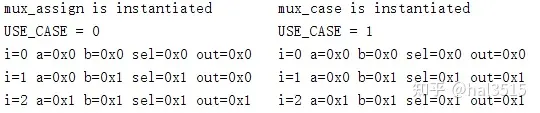

上面是仿真结果在tcl的输出，可以看到使用不同的USE\_CASE可以选取不同的design。

**3、case：在generate中主要用来根据参数的定义来确定程序。**

```verilog
//-------------module-------------//
module top (a, b, cin, sum, cout);
  input a,b,cin;
  output sum,cout;
  
  parameter ADDER_TYPE = 1;

  generate
    case(ADDER_TYPE)
      0 : ha u0 (.a(a), .b(b), .sum(sum), .cout(cout));
      1 : fa u1 (.a(a), .b(b), .cin(cin), .sum(sum), .cout(cout));
    endcase
  endgenerate
endmodule
// Design #1: 半加器
module ha (input a, b,
           output reg sum, cout);
  always @ (a or b)
  {cout, sum} = a + b;

  initial
    $display ("Half adder instantiation");
endmodule

// Design #2: 全加器
module fa (input a, b, cin,
           output reg sum, cout);
  always @ (a or b or cin)
  {cout, sum} = a + b + cin;

    initial
      $display ("Full adder instantiation");
endmodule

//-------------testbench-------------//
`timescale 1ns / 1ns
module top_tb;
  reg a, b, cin;
  wire sum, cout;

  initial 
  $display("ADDER_TYPE = %0d",0);
  top #(.ADDER_TYPE(0)) u0 (.a(a), .b(b), .cin(cin), .sum(sum), .cout(cout));

  initial begin
    a <= 0;
    b <= 0;
    cin <= 0;

    $monitor("a=0x%0h b=0x%0h cin=0x%0h cout=0%0h sum=0x%0h",
             a, b, cin, cout, sum);

    for (int i = 0; i<=2; i = i + 1) begin
	  #10 a <= $random;
	  b <= $random;
	  cin <= $random;
    end
  end
endmodule
```

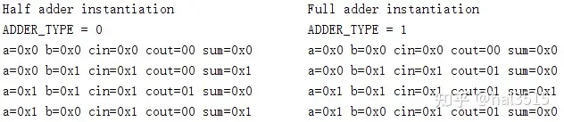

上面是仿真结果在tcl的输出，可以看到使用不同的ADDER\_TYPE可以选取不同的design。

## **五、任务**

任务要写在task endtask中，有点像matlab中函数这个概念，其中可以有input、output、inout端口作为出入口参数。注意任务中不能出现initial语句和always语句， 但任务调用语句可以在initial语句和always语句中使用（这些都是对static task来说的，automatic task略有不同，一般默认是static task）。

```verilog
module top_tb;

reg [7:0] x, y, z;

 task sum;
	input  [7:0] a, b;
	output [7:0] c;
	begin
		c = a + b;
	end
endtask


initial begin:test
    {x,y} = {8'd2,8'd3}; 
    sum (x, y, z);
    #10 {x,y} = {8'd5,8'd1};
    sum (x, y, z);
end

endmodule
```

x 和 y 是输入值，最后计算结果存储在 z 中。

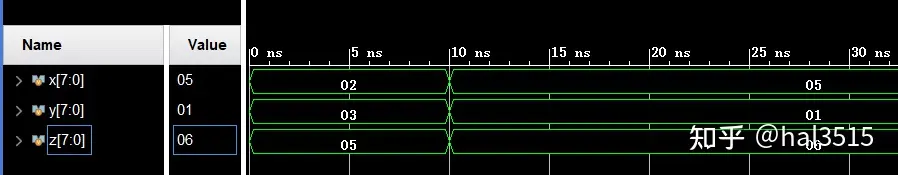

## **六、常用的系统任务**

**（1）格式化输出函数**

*   **$display**

```verilog
reg [3:0] rval;
initial begin
    rval = 3;
    $display("rval = %h hex, rval = %d decimal, rval = %b binary", rval, rval, rval);
    $display("current scope is %m"); // 输出等级层次的名字
    $display("%s", "Hello World");   
     //在%和表示输出格式的字符之间插入一个0自动调整显示输出的数据宽度  
    $display("Simulation time is %0d", $time);
end
```

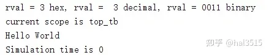

*   **$strobe**

与display不同，它可以确保所有在同一时钟沿赋值的其它语句在执行完毕之后才显示数据。

```verilog
reg [3:0] a,b;
wire [4:0] y = a + b;
// 采用display的方式输出
initial begin
    a = 3;
    b = 2;
    $display("$display: time =%0d, a= %d, b=%d, y= %d ",$time ,a, b, y);
    #10
    a = 4;
    $display("$display: time =%0d, a= %d, b=%d, y= %d ",$time,a, b, y);
    b = 5;
    $display("$display: time =%0d, a= %d, b=%d, y= %d ",$time ,a, b, y);
    #10;
end
// 采用strobe的方式输出
initial begin
    a = 3;
    b = 2;
    $strobe("$strobe: time =%0d, a= %d, b=%d, y= %d ",$time ,a, b, y);
    #10
    a = 4;
    $strobe("$strobe: time =%0d, a= %d, b=%d, y= %d ",$time,a, b, y);
    b = 5;
    $strobe("$strobe: time =%0d, a= %d, b=%d, y= %d ",$time ,a, b, y);
    #10;
end
```

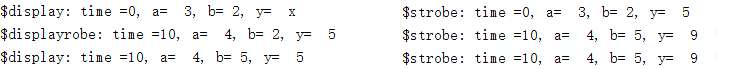

从上面演示的例子可以看出，当打印输出连续赋值语句或module例化的输出结果时，在当前的时间点内，$display无法输出当前运算结果，但 $strobe却可以显示组合逻辑结果。因此， 如果希望在当前时间点内打印连续赋值语句或module例化的输出结果推荐使用$strobe, 而其他情况下使用$display可以显示更多的细节。至于为什么会是这样，可以参考我写的另一篇文章 [verilog语法学习1：深入理解阻塞赋值与非阻塞赋值](https://zhuanlan.zhihu.com/p/424559951) 中的仿真器部分。

*   **$monitor**

一般在initial块中调用，可以不间断地对所设定的信号进行监视。一般与时间度量系统函数$time一起使用，具体的应用实例在下面时间度量系统函数给出。

**（2）时间度量系统函数**

*   **$time**

该函数可以返回一个64位整数来表示当前的仿真时刻，该时刻受时间尺度比例的影响，例如在下面的例子中，时间尺度是10ns，16ns与32ns就要变成1.6与3.2，同时因为$time的输出要是整数，因此实际的输出为2和3。

```verilog
`timescale 10ns / 1ns
module top_tb ();
 
reg set;
initial begin
	$monitor("time=%0d",$time," ","set=",set);
	#1.6 set = 0;
	#1.6 set = 1;
end
endmodule
```

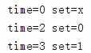

**（3）仿真暂停与退出函数**

*   **$finish**

该系统函数可以退出仿真器，返回主操作系统结束仿真过程，并且可以输出当前的仿真时刻和位置。

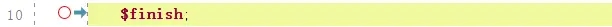

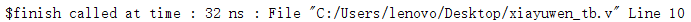

*   **$stop**

该系统函数暂停模拟并将模拟器置于交互模式。

**（4）文件读取到寄存器函数**

*   **readmemh**

```verilog
$readmemh("<数据文件名>",<存储器名>);
$readmemh("<数据文件名>",<存储器名>,<起始地址>);
$readmemh("<数据文件名>",<存储器名>,<起始地址>,<终止地址>);
```

*   <数据文件名> 是指向一个文本文件，用来保存仿真的数据。每一行代表一个十六进制的数据。
*   <存储器名> 为仿真文件中例化的存储器的名称。
*   <起始地址>，<终止地址> 指示将文本文件中的数据存储到存储器的位置段。

```verilog
`timescale 1ns / 1ps
module top_tb();   
reg clk = 0;
always clk = #10 ~clk;
reg [7:0] ram[0:127];
localparam FILE_NAME = "../../../led_sim.sim";
initial begin
    $readmemh (FILE_NAME, ram, 2, 8); //从第二个16进制数据读起，但是由于ram是8位的因此每次存入8位
end
integer i;
initial
begin
    #20;
    for(i = 0; i < 16; i = i + 1)
        $display("ram[%02d] = 0x%h ", i, ram[ i ] );
    #8000;
    $stop;
end
    
endmodule
```

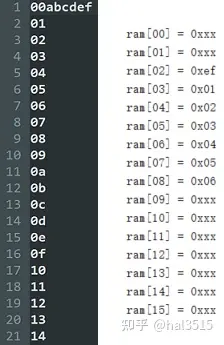

上图左边是文件中的数据，右边是仿真中的输出值，可以看到ram\[00\]，ram\[01\]，ram\[09\]-ram\[15\]的值都是0xxx（未初始化的值），真正初始化的只有ram\[02\]- ram\[08\]。

**（5）随机数生成函数**

*   **$random**

一般用法是$random%b，其中b>0，它给出了一个范围在(-b+1):(b-1)中的随机数。也可以通过位拼接操作{$random}%b，生成0:(b-1)之间的随机数。

```verilog
reg [23:0] rand;
rand = $random%60; // 生成一个范围在 [-59,59] 之间的随机数
rand = {$random}%60;// 生成一个范围在 [0,59] 之间的随机数
```

## 七、编译预处理

*   宏定义 \`define

```verilog
`define WORDSIZE 8
module
reg [`WORDSIZE-1:0] data; //相当于定义[7:0]，注意在引用时也要加`
...
endmodule
```

*   文件包含 \`include

\`include相当于将被引用的文件全部囊括进引用文件中。可以将一些常用的宏定义命令或任务（task）组成一个文件，然后用\`include命令将这些宏定义包含到自己所写的源文件中。

*   时间尺度 \`timescale

该命令的格式如下：\`timescale<时间单位>/<时间精度>，时间单位参量用来定义模块中仿真时间和延迟时间的基准单位，时间精度参量用来定义该模块仿真时间的精确程度。

```verilog
`timescale 10ns/1ns
parameter d = 1.55;
#d //时间单位为10ns,时间精度为1ns，1.55*10=15.5，再根据精度得到16，因此#d实际上是延时16ns
```

发布于 2021-10-27 09:58