# USB 协议分析之 HID 设备
## 1\. 简述

&nbsp;&nbsp;&nbsp;&nbsp;&nbsp;&nbsp;&nbsp;&nbsp;USB HID类是USB设备的一个标准设备类，包括的设备非常多。HID类设备定义它属于人机交互操作的设备，用于控制计算机操作的一些方面，如USB鼠标、USB键盘、USB游戏操纵杆等。但HID设备类不一定要有人机接口，只要符合HID类别规范的设备都是HID设备。

　　 USB HID设备的一个好处就是操作系统自带了HID类的驱动程序，而用户无需去开发驱动程序，只要使用API系统调用即可完成通信。

官方的资料下载详见：

*[http://www.usb.org/developers/hidpage](http://www.usb.org/developers/hidpage)*

其中包含最主要的两个说明：

*1\. 《Device Class Definition for human interface device (HID)》*

*2\. 《Universal Serial Bus HID Usage Tables》*

其中的 1 文档中描述了 HID 的基本组成和格式，2 文档中是对文档 1 的补充，将各种不同的 HID 设备的基本组成列举出来。

## 2\. HID 协议

在上一章介绍基本的 USB 协议的基础之上，本章针对 HID 的人机交互的类进行着重介绍。（默认有 USB 通信基本协议基础）

### 2.1 USB HID设备类的通信管道

所有的HID设备通过USB的控制管道（默认管道，即端点0）和中断管道（端点1或端点2）与主机进行通信。

　　管道　　　　　　　　要求　　　　　　说明

　　控制（端点0）　　　 必须　　　　　　传输USB描述符、类请求代码以及供查询的消息数据

　　中断输入　　　　　　必须　　　　　　传输从设备到主机的输入数据

　　中断输出　　　　　　可选　　　　　　传输从主机到设备的输出数据

注：USB主机为PC，USB设备如鼠标等。中断端点的描述中，指定了主机轮询的时间 Interval。即，主机会隔一段时间来“要”数据。

控制管道主要用于下面3个方面

*   接收/响应USB主机的控制请求以及相关的类数据
*   在USB主机查询时传输数据（如响应Get\_Report请求等）
*   接收USB主机的数据

中断管道主要用于下面两个方面

*   USB主机接收USB设备的异步传输数据
*   USB主机发送有实时性要求的数据给USB设备

从USB主机到USB设备的中断输出数据传输是可选的，当不支持中断输出数据时，USB主机通过控制管道将数据传输给USB设备。

### 2.2 与 USB HID 设备有关的描述符

HID设备的描述符除了5个USB的标准描述符（设备描述符、配置描述符、接口描述符、端点描述符、字符串描述符）外，还包括三个HID设备类特定的描述符：HID描述符、报告描述符（Report）、实体描述符（Physical）。

他们之间的层次关系如图：

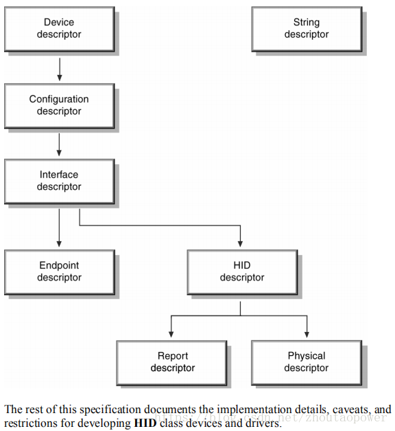

可以看到，在 Interface desc 层，就对 HID desc 有指定。

除了HID的三个特定描述符组成对HID设备的解释外，5个标准描述符中与HID设备有关的部分有：

1.  设备描述符中：*bDeviceClass, bDeviceSubClass, bDeviceProtocol*三个值必须为 0
2.  接口描述符中：*bInterfaceClass* 的值必须是 0x03, *bInterfaceSubClass* 的值为 0 或 1， 为1表示HID设备是一个启动设备（BootDevice， 一般对PC机有意义，意思是BIOS启动时能识别您使用的HID设备，且只有标准鼠标或者键盘才能称为BootDevice），为0表示HID设备是操作系统启动后才能识别使用的设备。*bInterfaceProtocol* 的取值含义如下：

|   |   |
| --- | --- |
| 设备描述符中 | 值 |
| *bDeviceClass* | 0 |
| *bDeviceSubClass* | 0 |
| *bDeviceProtocol* | 0 |

|   |   |
| --- | --- |
| 接口描述符中 | 值 |
| *bInterfaceClass*  | 0x03 |
| *bInterfaceSubClass*  | 0 — No Sub Class1 — Boot Interface SubClass2~255  Reserved |
| *bInterfaceProtocol* | 0 — NONE1 — Keyboard（键盘）2 — Mouse （鼠标）3~255  Reserved |

#### 2.2.1  HID 描述符

　　HID描述符关联于接口描述符，因而如果一个设备只有一个接口描述符，则无论它有几个端点描述符，HID设备只有一个HID描述符。HID设备描述符主要描述HID规范的版本号, HID通信所使用的额外描述符， 报表描述符的长度等。下表为HID描述符的结构。

HID 描述符
| 偏移量 | 域 | 大小（Byte） | 值 | 描述 |
| 0 | *bLength* | 1 | 数字 | 此描述符的长度，以字节为单位 |
| 1 | *bDescriptorType* | 1 | 常量 | 描述符种类（此处 0x21为HID类） |
| 2 | *bcdHID* | 2 | 数字 | HID规范版本号（BCD码），采用4个16进制的BCD格式编码 |
| 4 | *bCountryCode* | 1 | 数字 | 硬件目的国家的识别码 |
| 5 | *bNumDescriptors* | 1 | 数字 | 支持的附属描述符数目 |
| 6 | *bDescriptorType* | 1 | 常量 | HID相关描述符的类型，见下表 |
| 7 | *wDescriptorLength* | 2 | 数字 | 报告描述符的总长度 |
| 9 | *bDescriptorType* | 1 | 常量 | 用于识别描述符类型的常量，使用有一个以上描述符的设备 |
| 10 | *wDescriptorLength* | 2 | 数字 | 描述符总长度，使用在有一个以上描述符的设备  |

HID相关描述符类型定义
| 描述符类型值 | HID相关描述符类型 |
| --- | --- |
| 0x21 | HID描述符 |
| 0x22 | 报表描述符 |
| 0x23 | 实体描述符 |

在 USB 标准请求里，当使用了获取配置描述符的时候，会按照下面的顺序进行返回，即 HID 描述符也会被返回。

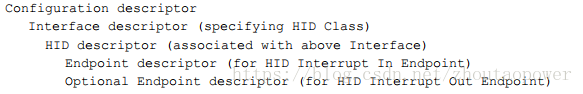

HID描述符里又包含了其附属的描述符的类型和长度（如报告描述符），然后主机再根据HID描述符的信息请求其相关的描述符。也就是说，主机通过获取描述符，就知道该设备是一个 HID 设备。

典型的，在一个请求配置描述符，并获取全部描述符的流程中，选择 “Class 0x01”：

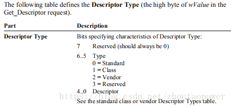

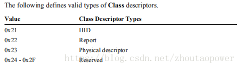

其中 Request 的 value 为上述内容。

#### 2.2.2  报告（Report）描述符

报告描述符是 USB 的所有描述里面最复杂的一个，因为他和其他的不一样，没有固定的长度和表。是一个可变而且变化比较多样的一类描述符。

报告描述符，其实就是告诉主机，通过中断端点传输的数据，哪些位或者哪些 Bytes ，代表着什么含义。这样讲，可能会比较抽象，但是看完后面的描述后，在回头看来，会觉得比较清晰。

要了解报告描述符，需要两份 USB 官方的 HID 资料：

*《Device Class Definition for human interface device (HID)》*

*《Universal Serial Bus HID Usage Tables》*

一份是说明 HID 的描述符的协议，另一个说明 HID 的报表描述符的内容定义。

报表描述符由一个一个的 Item 构成，Item 分为了两种，格式分别如下：

**1\. Short Item**

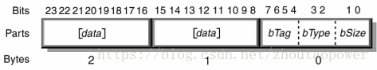

**2\. Long Item**

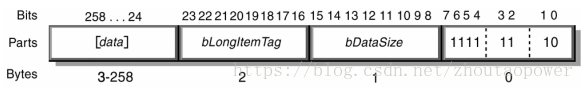

上述中，这里主要讲述 **Short Item**，用得最多的是 **Short Item**。

在 Short Item 中，起始的 1 Byte 代表了这个 Item 的用途：

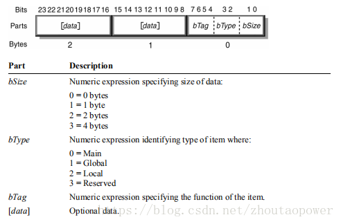

bSize  ：代表后面的数据，最大 4 bytes。

bType  ：代表了这个 Item 是什么类型的 Item，这里有三种大的类型：Main（0x00）、Global（0x01）、Local（0x02）。

bTag    ：代表在对应的 Item 下的更加细的分类。

&nbsp;&nbsp;&nbsp;&nbsp;| —— Main      分为：Input、Output、Feature、Collection、End Collection。

&nbsp;&nbsp;&nbsp;&nbsp;| —— Global    分为：Usage Page、 Logical Minimum、Logical Maximum、等等。

&nbsp;&nbsp;&nbsp;&nbsp;| —— Local     分为 ：Usage 、Usage Minimum、Usage Maximum、String 等等。

对于 ***bSize + bType + bTag*** 的 1 Byte 的组合详见下表：

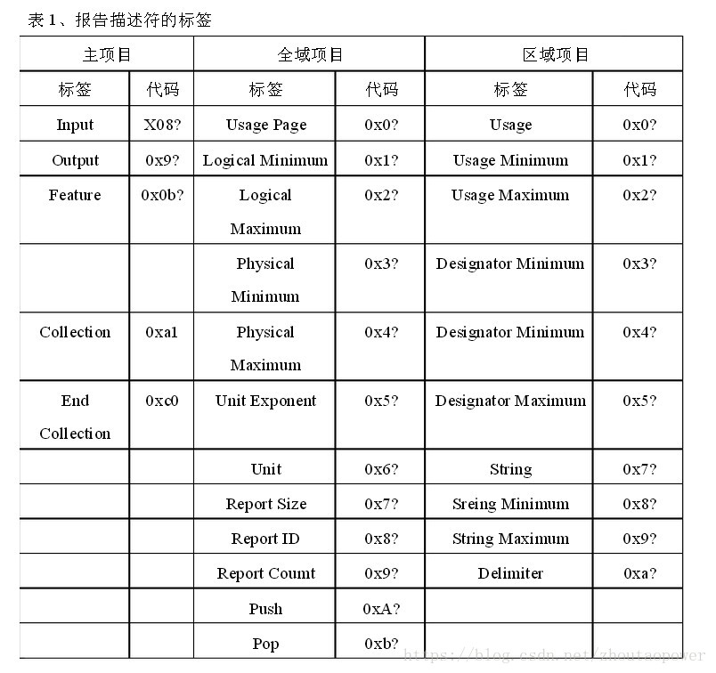

表中列出了所有的配合，其中的 “？” 代表了低 4 bits 的值，打个比方，一个 Short Item：

0x05（Prefix）, **0x01（Data）**, // USAGE\_PAGE (Generic Desktop)

其中，0x05表示前缀，0x01为数据部分。

0x05 =》**00000101** 可以分解出：***bSize*** \= 1；***bType*** \= 1（Global）；***bTag*** \= 0（Usage Page）

上述解读，来自 *《Device Class Definition for human interface device (HID)》* 文件，后面跟的那个 **0x01** 是带的 1 Byte 的数据，这个数据的具体含义，需要查找 ：*《Universal Serial Bus HID Usage Tables》* 中，可以找到，含义是：Generic Desktop。

即，根据【***bSize + bType + bTag***】的信息知道 Tag 的具体含义，在结合 Table 表和具体的 Tag，查找后面跟的数据对应的含义，这样，达到解读报告描述符的目的。

下面来分析一下几个重要的 Tag 的作用和含义。

**Main**

&nbsp;&nbsp;&nbsp;&nbsp;|—— Input ：表示设备操作输入到主机的数据模式。这个数据格式就形成一个输入报告，虽然输入报告可以用控制型管线以get report（input）来传输，但是通常用中断型输入管线来传输以确保在每一固定周期内都能将更新的输入报告传给主机。

&nbsp;&nbsp;&nbsp;&nbsp;|—— Output ： 表示由主机输出到装置操作的数据格式。这个数据格式就形成一个输出报告。输出报告通常不适用轮询的方式来传送给设备，而是由应用软件依实际需求以传令方式要求送出输出报告，所以大多用控制型管线以set report(output)指令来将报告送到设备。当然也可以选择用中断型输出管线来传送，只是通常不建议这样用。

&nbsp;&nbsp;&nbsp;&nbsp;|—— Feature ： 表示由主机送到设备的组态所需数据的数据格式。这个数据模式就形成一个特征报告。特征报告只能用控制型管线以get report(feature)和set report(feature)指令分别来取得和设定设备的特征值。

Main （**后面带的数据格式以及含义**）中产生报告数据格式的三个卷标（Input，Output，和Feature）具有共通的数据定义，这些数据：

|   |   |   |   |   |   |   |   |   |   |
| --- | --- | --- | --- | --- | --- | --- | --- | --- | --- |
| Bit | 8 | 7 | 6 | 5 | 4 | 3 | 2 | 1 | 0 |
| 0 | Bit Field | Non Volatile | No Null Position | Preferred State | Linear | No Wrap | Absolute | Array | Data |
| 1 | Buffered Bytes | Volatile | Null State | No Preferred | Non Linear | Wrap | Relative | Variable | Constant |

Data/Constant：主项目之数据为可变值（设为Data），或为固定不可变值（设为Constant)。Constant 都用于Feature 的报告，或是用于填充位(padding)，使报告长度以字节为单位。

Array/Variable：主项目之数据的每个字段可以表示几个不同的操作的其中一个被触发（设为Array），或是每个字段仅表示一个操作（设为Variable）。如果是Variable，则Report Count 的数据值等于报告数据的字段数。若是Array，则Report Count 的数据值表示可以同时被触发的最多操作数目。

Absolute/Relative：主项目的数据是以相对于固定的基准点方式提供绝对数值（设为Absolute），或是提供相对于前次报告的相对值（设为Relative）。

No Wrap/Wrap：主项目的数据值达到极值后会转为极低值，反之亦同，称作卷绕（设为Wrap）。例如一个转钮可以做360°旋转，输出值从0 至10，若设定为Wrap，则值达10 后，在同方向旋转则值变为0，反之若达到0，再转就得到10。

Linear/Nonlinear：主项目的数据与操作刻度为线性关系（设为Linear），或为非线性（设为Nonlinear）。

Preferred State/No Preferred：主项目对应的操作再不被触发时会自动恢复到初始状态（设为Preferred State），或是不会恢复原状（设为No Preferred）。例如键盘的按键和会自动置中(self-centering)的游戏杆，皆为Preferred State。

No Null Position/Null State：主项目对应的操和有一个状态，其不会送出有意义的数据，即数据将不在Logical Minimum 和Logical Maximum 之间，这种操控要标注Null State，否则为No Null Position。例如几个按键，而无键被按下的用途没有声明在Usage 之列，则可以在主项目的数据中设Null State，将无键被按下的状态排除在Logical Minimum 和Logical Maximum区间之外，进一步请参看*Universal Serial Bus HID Usage Tables* 文件的Appendix A.3 节中范例。

Non Volatile/Volatile：主项目Feature 的数据不允许被主机改变（设为Non Volatile），或是允许被主机改变（设为Volatile）。注意主项目Input 和Output，此标注设定无意义，所以bit 7 的代码必须为0。

Bit Field/Buffered Bytes：主项目的数据格式要以字节为单位，不足构成字节时自动填充成字节则设Buffered Bytes。

Collection 和 End Collection。以鼠标而言，在实体上是一个指针(pointer)，只是应用为计算机鼠标﹔而这个指针含有三个按键和二个平移轴X 和Y。所以指针的报告是由不同格式的数据所构成，因而需要用到Collection 和End Collection 将几个Input 项目集结成一组，其用途为指针，再用Collection 和End Collection 将指针括起来说明其应用为鼠标。卷标End Collection 没有跟随任何资料。但是卷标Collection 跟随一个字节的数据，例如指针的数据名为Physical，而鼠标的为Application。所有Collection的数据名称与代码如表：

|   |   |   |   |   |   |   |   |   |   |
| --- | --- | --- | --- | --- | --- | --- | --- | --- | --- |
|  | Physical | Application | Logical | Report | Named Arrary | Usage Modifier | Usage Switch | Reserved | Vendor-defined |
| 代码 | 0x00 | 0x01 | 0x02 | 0x03 | 0x04 | 0x05 | 0x06 | 0x07-0x7f | 0x80-0xff |
| 用途 | CP | CA | CL |  | Nary | US | UM |  |  |

Collection 的数据名称很难有一个准则来给定，*Universal Serial Bus HID Usage Tables文*档中将各种用途的用途种类(usage type)列出，使用者必须依据用途种类来指定Collection 的数据名称，例如鼠标，键盘和游戏杆的用途种类为CA，所以要用Collection (Application)，而指针为CP，所以用Collection (Physical)。

**Local**

Designator是要搭配实体描述符使用的，这里不对实体描述符进行介绍，所以略过这些designator标签。

标签 Usage 实际上应该称作Usage ID，它搭配 Global 的 Usage Page 卷标才形成前文所定义的用途 {usage}。

但是报告描述符允许在区域项目的 Usage 卷标直接用32位的方式来指定用途，这种方式称作扩充式用途指定法(extended usage)以示区别。例如：Usage(Generic Desktop:Mouse)，Usage Minimum(Keyboard:0)，和Usage Maximum(Keyboard:101)。很明显的，扩充式用途指定法会取代『项目状态表』中的Usage Page。还有，使用扩充式用途指定法时，数据的高16 个位为用途类页Usage Page，低16 个位则为用途识别名Usage ID。往往一个报告数据会对应到几个操作，因而会有几个用途，例如101 按键的键盘利用不同代码代表不同的键，每一个键是一个操作，有自己的用途，要将所有 Usage ID 列出不太现实，所以就需要Usage Minimum 和Usage Maximum 二个标签。以键盘为例，主项目之上只要二个区域项目：Usage Minimum (0), Usage Maximum (101)。如此一来，则无键按下(Usage ID 为0)和101 键中任一键被按下(Usage ID 为1 至101)的用途都被赋于到一个报告数据上。

卷标String Index 类似卷标Usage，而卷标String Minimum 和String Maximum 则类似标签Usage Minimum 和Usage Maximum。如果希望某个操作对应到一个字串，则用String Index 来描述该操控的报告数据，这个字符串在字符串描述符中，StringIndex (data)项目中的data 是这个字符串在字符串描述符中的位置索引。如果需要用到几个字符串，则可以使用String Minimum 来指向字符串描述符中被用到字符串的最先位置索引，和String Maximum 来指向最后位置索引。

标签Delimiter 很少用到，请参考Universal Serial Bus HID Usage Tables 文件中Appendix B 的范例详细说明。

**Global**

全局项目的卷标事实上只要Usage Page，Logical Minimum，Logical Maximum，Report Size，Report ID，Report Count 就足够了。表2 列了二个音量操作的例子（音量增减键和音量旋钮）将用来辅助说明这些卷标，不过主项目括号内的数据会在后文中再做说明。

|   |   |
| --- | --- |
| 音量减键 | 音量旋钮 |
| Usage Page(consumer) | Usage Page(Consumer) |
| Usage(Volume) | Usage(Volume) |
| Logical Minimum(-1) | Logical Minimum(0) |
| Logical Maximum(-1) | Logical Maximum(100) |
| Report Size(2) | Report Size(7) |
| Report Count(1) | Report Count(1) |
| Input(Data,Variable,Relative) | Input(Data,Variable,Absolute,No Wrap,Linear,No Relative) |

Logical Minimum 和 Logical Maximum 代表了该特报告字段的取值范围。

Report Size ：代表了用多少个 bit 来表征特性。

Report Count ： 代表有多少个这样的结构。

比如：音量增减键的例子中ReportCount (1)表示主项目Input 只产生一个字段，所以可知只有一个音量增减键﹔而Report Size (2)表示这个字段为2 位。另一个音量旋钮例子也是只有一个旋钮，所以用Report Count (1)﹔但是因为Report Size (7)，所以该旋钮的数据字段为7位，可以表示0到127之数值。再举一例，如果是鼠标的三个按键，每个按键占用一个一位的字段，则Report Size (1), Report Count (3)﹔那么这个报告长度为三个位，可以同时呈现出三个按键的状态（原状或被按下）。

注意：当要将同一种报告分成数个部分，则每一个部分要给予一个识别值，这时就需用到卷标Report ID，其数据值必须从1起算，不可使用0。没有赋予Report ID 标签的报告，主机有可能会将其Report ID 视为0，所以Report ID (0)被要求不能使用。这个标签对控制型管线才有意义，因为它可以在请求报告时指定Report ID的值。对于中断型管线，其为周期性传输报告，所以每次都会将所属报告传完，没有仅传输部分之必要，所以 Report ID 标签就无意义。

### 2.3 报告（Report）描述符的组成以及解析

### 2.3.1 报告（Report）描述符的组成

根据官方的给出的资料，报告描述符的组成结构如下：

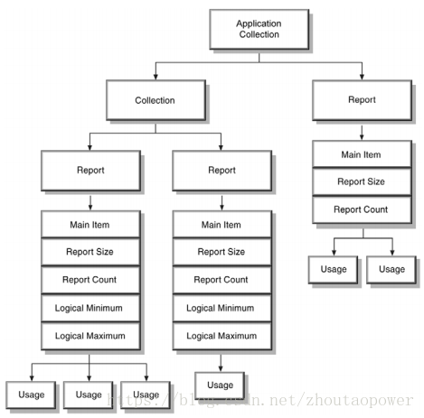

由一个 App Collection 开始，如果有多个 Report 结构，则增加 Collection 进行组合。

首先需要描述他的 Usage 然后依次描述 Logical Minimum 、Logical Maximum、Report Size 、Report Count 等等。

### 2.3.2 报告（Report）描述符的解析，解读，构建

首先，要解读，解析，构建报告描述符，则需要了解并清楚他们之间的顺序：

Main 用来描述一个主项目，其他的都是用来修饰主项目的。Main 的作用域，一直到下一个 Main为止。

Global 既然是全局的意思，可以把它理解成为一个全局变量，遇到下一个同样的全局变量的定义时刻，此定义失效，并启用下一个定义的值。

Local 理解成为本地变量，用来修饰这一次的 Main 项目的。

比如：官方的例子：  
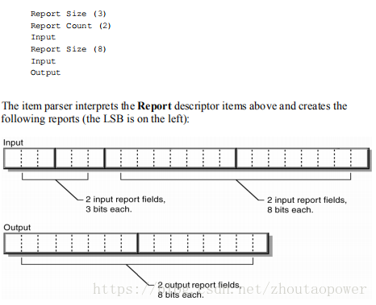

从上到下，可以看到，首先，定义了一个 Input，Size 是 3，Count 是 2，即 2 个 3 bits 的 Input；

接着 Size 修改为 8，即 数据成为了 8bits，但是数据个数还是之前的没变，定义了 含有 2 个 8 bits 的一个 Input；

接着定义了 Output，沿用了之前的含有 2 个 8 bits 的属性；

**NOTE： 在阅读 Report 的时候，都是上面的内容，来修饰下面的一个 Main。**

#### 2.3.3 报告（Report）描述符的例子

下面是一个键盘和鼠标的报告描述符：

|   |   |
| --- | --- |
| 键     盘 | 鼠      标 |
| 项  目 | 编 码 | 项   目 | 编 码 |
| Usage Page (Generic Desktop), | 0x0105 | Usage Page (Generic Desktop), | 0x0105 |
| Usage (**Keyboard**), | 0x0609 | Usage (**Mouse**), | 0x0209 |
| Collection (Application), | 0x01A1 | Collection (Application) | 0x01A1 |
| Usage Page (Keyboard), | 0x0705 | Usage (**Pointer**), | 0x0109 |
| Usage Minimum (224), | 0xE019 | Collection (Physical), | 0x00A1 |
| Usage Maximum (231), | 0xE729 | Usage Page (Buttons), | 0x0905 |
| Logical Minimum (0), | 0x0015 | Usage Minimum (1), | 0x0119 |
| Logical Maximum (1), | 0x0125 | Usage Maximum (3), | 0x0329 |
| Report Size (1), | 0x0175 | Logical Minimum (0), | 0x0015 |
| Report Count (8), | 0x0895 | Logical Maximum (1), | 0x0125 |
| Input (Data, Variable, Absolute), | 0x0281 | Report Size (1), | 0x0175 |
| Report Size (8), | 0x0875 | Report Count (3), | 0x0395 |
| Report Count (1), | 0x0195 | Input (Data, Variable, bsolute), | 0x0281 |
| Input (Constant), | 0x0181 | Report Size (5), | 0x0575 |
| Usage Minimum (0), | 0x0019 | Report Count (1), | 0x0195 |
| Usage Maximum (101), | 0x6529 | Input (Constant), | 0x0181 |
| Logical Minimum (0), | 0x0015 | Usage Page (Generic Desktop), | 0x0105 |
| Logical Maximum (101), | 0x6525 | Usage (X), | 0x3009 |
| Report Size (8), | 0x0875 | Usage (Y), | 0x3109 |
| Report Count (6), | 0x0695 | Logical Minimum (-127), | 0x8115 |
| Input (Data, Array), | 0x0081 | Logical Maximum (127), | 0x7F25 |
| Usage Page (LEDs), | 0x0805 | Report Size (8), | 0x0875 |
| Usage Minimum (1), | 0x0119 | Report Count (2), | 0x0295 |
| Usage Maximum (5), | 0x0529 | Input (Data, Variable, Relative), | 0x0681 |
| Logical Minimum (0), | 0x0015 | End Collection, | 0xC0 |
| Logical Maximum (1), | 0x0125 | End Collection | 0xC0 |
| Report Size (1), | 0x0175 |  |  |
| Report Count (5), | 0x0595 |  |  |
| Output (Data, Variable,Absolute), | 0x0291 |  |  |
| Report Size (3), | 0x0375 |  |  |
| Report Count (1), | 0x0195 |  |  |
| Output (Constant), | 0x0191 |  |  |
| End Collection | 0xC0 |  |  |

这里先简述一下鼠标的情况：

鼠标的报告描述符的输入数据格式中最低的一个字节只有最低3个位有意义，其分别对应到鼠标上的三个按钮，用途类页为Buttons。其它二个字节的用途为(Generic Desktop: X)和(Generic Desktop: X)，分别对应到鼠标X 轴和Y 轴的位移操控。这二个位移值得逻辑范围为-127 到127，即一个字节可以表示最大范围。位移的数值是相对值，所以主项目为Input (Data, Variable, Relative)。

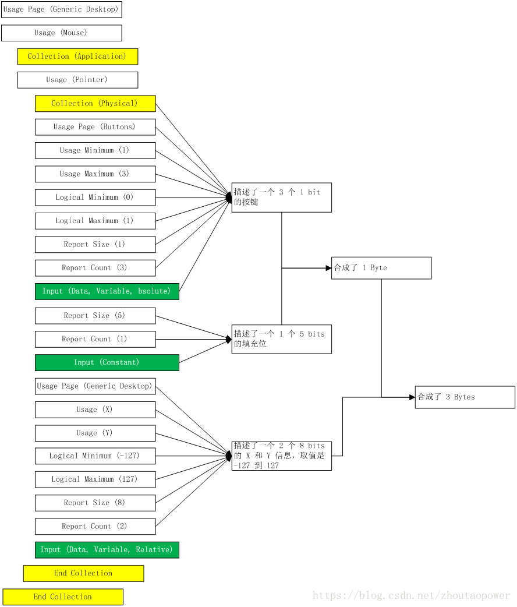

下面是官方给出的一个鼠标的报告描述符：

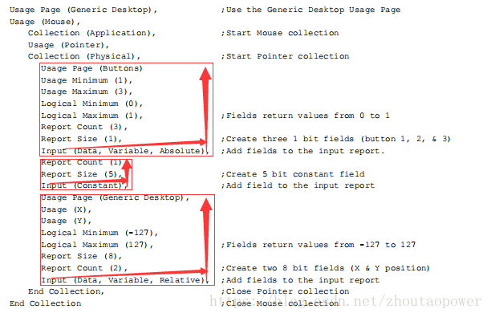

#### 2.3.4 报告（Report）和报告描述符

报告描述等于是告诉了 Host 端，将以什么样的形式进行数据传送，报告描述符赋予了数据的意义，让 HOST 能够在收到裸的数据的时候，根据报告描述符进行分解到正确的数据，并根据 Usage 来进行正确的操作。

比如：上述例子中，以 3 个 Bytes 进行上报：（没有报告ID）

如果鼠标左键按下，则返回 01 00 00（十六进制值）

如果鼠标右键按下，则返回 02 00 00

如果鼠标中键按下，则返回 04 00 00

如果三个键同时按下，则返回07 00 00。

如果鼠标往右移动则，第二字节返回正值，值越大移动速度越快。其它的类推。

### 2.4 USB Device 支持 Class Request

支持 HID ，设备除了支持基本的请求以外，还需要支持 HID 的几个特定的请求：

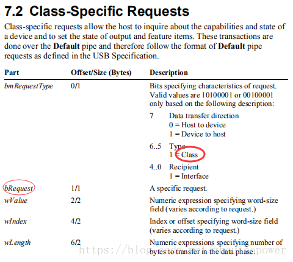

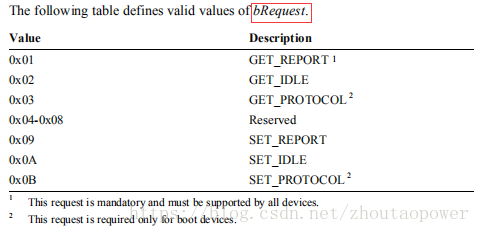

通过 get report 返回报告描述符。等等。具体参考 HID 文档。

### **工具：**

USB 协会提供了一个HID 描述符编辑工具称作HID Descriptor Tool，其执行程序为DT.exe。这个工具软件可以在USB 网站上取得。虽然称作HID 描述符工具，事实上，仅提供编撰报告描述符之用。