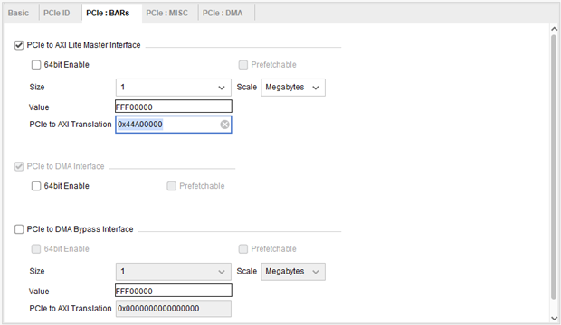

# 基于XDMA实现PCIE通信方案
软件版本：VIVADO2021.1

操作系统：WIN10 64bit

硬件平台：适用XILINX A7/K7/Z7/ZU/KU系列FPGA

登录米联客(MiLianKe)FPGA社区-[www.uisrc.com](http://www.uisrc.com/)观看免费视频课程、在线答疑解惑！

## 1概述

本方案内容作为通用的教程内容，适合XILINX各类支持PCIE通信的板卡。并且米联客在XDMA中使用了自己编写的FDMA控制IP，可以简单方便的完成数据之间的交换。

## 2系统构架

本系统中演示的关键在于我们编写了一个uixdmairq的IP。该用来配合驱动处理中断，uixdmairq提供了AXI-LITE接口，上位机通过访问user空间地址读写uixdmairq的寄存器。该IP在user\_irq\_req\_i输入的中断位，寄存中断位号，并且输出给XDMA IP ，当上位机的驱动响应中断的时候，在中断里面写uixdmairq 的寄存器，清除已经处理的中断。

另外本方案中通过AXI-BRAM来演示用户user空间的读写访问测试。

## 3XMDA概述

Xilinx 提供的DMASubsystem for PCIExpressIP是一个高性能，可配置的适用于PCIE2.0，PCIE3.0 的SG 模式 DMA，提供用户可选择的 AXI4 接口或者 AXI4-Stream接口。一般情况下配置成 AXI4 接口可以加入到系统总线互联，适用于大数据量异步传输，通常情况都会使用到 DDR，AXI4-Stream 接口适用于低延迟数据流传输。

XDMA 是SGDMA，并非Block DMA，SG 模式下，主机会把要传输的数据组成链表的形式，然后将链表首地址通过BAR 传送给XDMA，XDMA 会根据链表结构首地址依次完成链表所指定的传输任务。

AXI4、AXI4-Stream，必须选择一个，用于数据传输

AXI4-Lite Master可选，用于实现PCIE BAR地址到AXI4-lite 寄存器地址的映射，可以用于读写用户逻辑寄存器。

AXI4-Lite Slave可选，用来将XDMA 内部寄存器开放给用户逻辑，用户逻辑可以通过此接口访问 XDMA 内部寄存器，不会映射到BAR。

AXI4 Bypass接口，可选，用来实现PCIE 直通用户逻辑访问，可用于低延迟数据传输。

## 4基于XDMA的PCIE FPGA工程搭建

### 4.1XDMA IP配置

**1:添加XDMA IP核**

**2:配置XDMA IP**

双击XDMA IP进行配置

Mode：配置模式，选择 BASE配置

Lane Width：选择PCIE的通道数量，对于MA703FA为2个通道，每个开发板支持通道数量不一样，通道数量越多通信速度越快，用户需要根据硬件的实际通达数量选择正确的通道数。

Max Link Speed：选择5.0GT/s 即PCIE2.0

Reference Clock ：100MHZ，参考时钟 100M

DMA Interface Option：接口选择 AXI4 接口

AXI Data Width：128bit，即 AXI4 数据总线宽度为128bit

AXI Clock ：125M，即AXI4 接口时钟为125MHZ

DMA Interface option 设置为AXI Memory Mapped方式

PCIE ID 配置，这里选择默认的配置就可以，默认的设备类型是Simple communication controllers

PCIE BAR 配置，这里面的配置比较重要,首先使能 PCIE to AXI Lite Master Interface ，这样可以在主机一侧通过PCIE 来访问用户逻辑侧寄存器或者其他 AXI4-Lite 总线设备映射空间选择 1M，当然用户也可以根据实际需要来自定义大小。

PCIE to AXI Translation：这个设置比较重要，通常情况下，主机侧PCIE BAR 地址与用户逻辑侧地址是不一样的， 这个设置就是进行BAR 地址到AXI 地址的转换，比如主机一侧 BAR 地址为0，IP 里面转换设置为0x44A00000， 则主机访问 BAR 地址 0 转换到AXI LIte 总线地址就是0x44A00000

PCIE to DMA Interface ：选择64bit 使能

DMA Bypass 暂时不用

PCIE 中断设置

**User Interrupts**:用户中断，XDMA提供16条中断线给用户逻辑，这里面可以配置使用几条中断线。

**Legacy Interrupt**:XDMA支持Legacy中断,我们这么不选

**MSI Capabilities**:选择支持MSI中断 ,支持4个中断消息向量

注意：MSI 中断和 MSI-X 中断只能选择一个，否则会报错，如果选择了 MSI 中断，则可以选择 Legacy 中断， 如果选择了 MSI-X 中断，那么 MSI 必须取消选择，同时Legacy 也必须选择None。此 IP 对于7 系列设置有这个问题，如果使用Ultrascale 系列，则可以全部选择

**MSI-X Capabilities**:不选

**Miscellaneous**:选Extended Tag Field

**Link Status Register**:选Enable Slot Clock Configuration

配置DMA 相关内容

Number of DMA Read Channel（H2C）和Number of DMA Write Channel（C2H）通道数，对于PCIE2.0 来说最大只能选择 2，也就是 XDMA 可以提供最多两个独立的写通道和两个独立的读通道，独立的通道对于实际应用中有很大的作用，在带宽允许的前提前，一个PCIE 可以实现多种不同的传输功能，并且互不影响。这里我们选择1 Number of Request IDs for Read （Write）channel ：这个是每个通道设置允许最大的 outstanding 数量，按照默 认即可

### 4.2完成自动连线

配置完成以后，点击 Run Block Auto，可以看到之前的配置信息，如果有发现和目标配置不一样的，需要手动 修改，点击 OK，完成配置。

配置完成后，VIVADO会自动进行必要的连线

到此为止，XDMA IP 配置就完成了。为了让XDMA和上位机可以密切配和工作，我们还要继续搭建其他部分的功能模块。

### 4.3基于图形设计的XDMA工程

### 4.4添加中断测试代码
~~~ cpp
timescale 1ns / 1ps

 

/*******************************MILIANKE*******************************

*Company : MiLianKe Electronic Technology Co., Ltd.

*WebSite:https://www.milianke.com

*TechWeb:https://www.uisrc.com

*tmall-shop:https://milianke.tmall.com

*jd-shop:https://milianke.jd.com

*taobao-shop1: https://milianke.taobao.com

*Create Date: 2022/05/01

*File Name: pcie_top.v

*Description: 

*Declaration:

*The reference demo provided by Milianke is only used for learning. 

*We cannot ensure that the demo itself is free of bugs, so users 

*should be responsible for the technical problems and consequences

*caused by the use of their own products.

*Copyright: Copyright (c) MiLianKe

*All rights reserved.

*Revision: 1.0

*Signal description

*1) _i input

*2) _o output

*3) _n activ low

*4) _dg debug signal 

*5) _r delay or register

*6) _s state mechine

*********************************************************************/

 

module pcie_top

(  

//PCIE串行数据端口

  input  [1 :0]pcie_mgt_rxn,

  input  [1 :0]pcie_mgt_rxp,

  output [1 :0]pcie_mgt_txn,

  output [1 :0]pcie_mgt_txp,

//PCIE参考时钟  

  input  [0 :0]pcie_ref_clk_n,

  input  [0 :0]pcie_ref_clk_p,

  input pcie_rst_n

    );

 

wire axi_aclk;

wire user_irq_en_o;

reg  [21:0]timer_cnt;

reg  timer_r1,timer_r2;

reg [1:0]int_p;

reg [3:0]user_irq_req_i;

wire inter = !timer_r2 && timer_r1;

 

//内部计数器产生一个延迟复位

always @(posedge axi_aclk)begin

    if(user_irq_en_o == 1'b0)begin

            timer_cnt <= 22'd0;

    end

    else begin

            timer_cnt <= timer_cnt + 1'b1;

    end

end

 

always @(posedge axi_aclk)begin

    if(user_irq_en_o == 1'b0)begin

            timer_r1 <= 1'd0;

            timer_r2 <= 1'd0;

    end

    else begin

            timer_r1 <= timer_cnt[20];

            timer_r2 <= timer_r1;

    end

end

 

//产生用户中断

always @(posedge axi_aclk)begin

    if(user_irq_en_o == 1'b0)begin

            int_p[1:0]  <= 4'd0;

            user_irq_req_i <= 4'd0;

    end

    else begin

        if(inter)  int_p <= int_p + 1'b1;

        user_irq_req_i <= 4'd0;

        user_irq_req_i[int_p] <= 1'b1;  

    end

end

 

//接口例化

pcie_system pcie_system_i

(

.pcie_mgt_rxn(pcie_mgt_rxn),

.pcie_mgt_rxp(pcie_mgt_rxp),

.pcie_mgt_txn(pcie_mgt_txn),

.pcie_mgt_txp(pcie_mgt_txp),

.pcie_ref_clk_n(pcie_ref_clk_n),

.pcie_ref_clk_p(pcie_ref_clk_p),

.pcie_rst_n(pcie_rst_n),

.axi_aclk(axi_aclk),

.user_irq_en_o(user_irq_en_o),

.user_irq_req_i(user_irq_req_i)

);

         

endmodule
~~~

### 4.5地址分配

进行地址分配：

这里我们把挂在M\_AXI上的DDR(对于MA703-35T挂BRAM)地址分配从0开始(对于widnows系统必须为0), M\_AXI是需要进行DMA操作的。而M\_AXI\_LITE挂载的BRAM和uixdmairq中断控制单元是映射到用户BAR地址空间，这个地址就是前面我们XDMA IP里面设置的地址。默认情况下，需要设置uixdmairq中断控制单元的地址和XDMA里面设置的用户BAR地址空间一致。如下图0x44A0\_0000。BRAM的地址空间0x44A01\_0000。关于地址空间的具体含义，结合软件的使用会更加清晰，初学者暂且根据教程设置。

## 5硬件安装

先下载程序，调试阶段下载bit文件，然后再开电脑。这样才能正确识别和后续测试工作正常开展。

## 6硬件识别

## 7应用程序测试

### 7.1xdma\_rw.exe功能介绍

我们打开一个终端（如果双击运行会很快退出来），进入到上一节编译生成的应用程序目录找到xdma\_rw.exe，这个应用程序是操作pcie 的所有设备的，我们在终端只输入xdma\_rw.exe，可以看到提示信息，告诉用户这个程序如何使用。

**1:DEVNODE**

control代表控制通道，用于控制XDMA的寄存器，由于精力原因，对于控制通道对XDMA寄存器的设置米联客没有深入研究。

event\_\*代表中断事件，其中\*代表那中断号的中断事件

user代表用户空间，数据走AXI4-LITE接口

h2c\_\*代表host to card PC发送DMA数据到板卡，其中\*代表那个通道，一般只用通道0，数据走AXI4-FULL通道

c2h\_\*代表card to host 板卡发数据到PC，其中\*代表那个通道，一般只用通道0，数据走AXI4-FULL通道

**2:ADDR重点知识**

读写地址偏移，对于DMA通道地址都是从0开始，但是对于PS DDR内存，必须偏移至少20MB开始读写PS DDR

对于user的读写，偏移地址是axi-lite接口的IP地址，减去在XDMA IP中配置的PCIE to AXI Translation地址。对于米联客的XDMA方案由于修改了驱动中对于中断的响应，所以PCIE to AXI Translation必须和默认的uixdmairq地址一致。之后再分区其他AXI-LITE接口外设。

**3:OPTION**

a 设置内存对齐

b 打开一个二进制文件

f 读或者写文件

l 数据长度

v 更详细的输出

**4:DATA**

十进制或者十六进制数，必须用空格间隔

如：

17 34 51 68

0x11 0x22 0x33 0x44

### 7.2DMA批量数据测试

DMA传输是我们用的最多的一种，需要用到h2c或者ch2通道。

可以看到在当前目录有一个datafile4k.bin文件，那就测试一下将这个文件传输到FPGA的DDR或者(MA703FA-35T是BRAM)，然后读出来。

在终端输入指令：

xdma\_rw.exe h2c\_0 write 0x0000000 -b -f datafile4K.bin -l 4096

意思就是使用h2c\_0 设备以二进制的形式读取文件datafile4k.bin写入到BRAM内存地址0x0000000长度为4096字节。

使用命令

xdma\_rw.exe c2h\_0 read 0x0000000 -b -f datafile4K\_recv.bin -l 4096

接下来我们可以使用winhex 等软件来检查一下两个文件数据是否一直，经过检查，是一致的则说明传输功能正常。

### 7.3user通道测试

通过AXI-LITE接口写2个数据到挂在AXI-LITE接口的BRAM中

xdma\_rw.exe user write 0x10000 0x11 0x22

通过AXI-LITE接口读2个数据到挂在AXI-LITE接口的BRAM中

xdma\_rw.exe user read 0x10000 -l 2

### 7.4event中断测试

**1:XDMA中断FPGA部分代码**

首先我们要理解下XDMA的中断类型，以及控制时序：

1)、Legacy Interrupts：

对于Legacy Interrupts中断，当user\_irq\_ack 第一次为1的时候usr\_irq\_req可以清0，当user\_irq\_ack 第二次为1的时候，可以重新设置usr\_irq\_req发起中断。

在PCI总线里面INTx中断是由四条可选的中断线决定的，这种中断方式是共享式的，所有的pci设备把中断信号在一条中断线上相与，再上报给cpu，cpu收到中断以后再查询具体是哪个设备产生了中断。

在PCIE总线里面已经没有了实体的INTx物理中断线了，PCIE标准使用专门的Message事务包来实现INTx中断，这是为了兼容以前的PCI软件。INTx是共享式的，cpu相应中断后还需要查询具体中断源，效率比较低

2)、MSI Interrupts：

MSI 发出usr\_irq\_req 中断请求后，user\_irq\_ack 为1只是说明中断已经北主机接收了，但是不代表已经处理，软件或者驱动层可以去清零usr\_irq\_req。

MSI中断和MSI-X都是往配置的CPU中断寄存器里进行memory写操作，来产生中断，效率比INTx是共享式高，其中MSI最多支持32个中断向量，而MSI-X最多支持2048个中断向量。

3)、MSI-X Interrupts：

当usr\_irq\_req 中断请求后，只要user\_irq\_ack为1  就可以清零usr\_irq\_req，但是没说明扫码时候可以置1，重启下次中断。

经过以上所有中断方式测试，发目前使用Legacy和MSI已经够用，而且相对稳定，上位机驱动通过访问用户bar地址空间和米联客编写的Uixdmairq ip-core一起管理接收的中断。

Uixdmairq.v源码
~~~ cpp
*******************************MILIANKE*******************************

*Company : MiLianKe Electronic Technology Co., Ltd.

*WebSite:https://www.milianke.com

*TechWeb:https://www.uisrc.com

*tmall-shop:https://milianke.tmall.com

*jd-shop:https://milianke.jd.com

*taobao-shop1: https://milianke.taobao.com

*Create Date: 2022/05/01

*Module Name:uixdmairq

*File Name:uixdmairq.v

*Description: 

*The reference demo provided by Milianke is only used for learning. 

*We cannot ensure that the demo itself is free of bugs, so users 

*should be responsible for the technical problems and consequences

*caused by the use of their own products.

*Copyright: Copyright (c) MiLianKe

*All rights reserved.

*Revision: 1.0

*Signal description

*1) _i input

*2) _o output

*3) _n activ low

*4) _dg debug signal 

*5) _r delay or register

*6) _s state mechine

*********************************************************************/

`timescale 1ns / 1ps

 

    module uixdmairq #

    (

        parameter integer XMDA_REQ_NUM = 8

    )

    (

        // Users to add ports here

        input  wire [XMDA_REQ_NUM-1 :0] user_irq_req_i,

        //input  wire [XMDA_REQ_NUM-1 :0] xdma_irq_ack_i,

        output wire [XMDA_REQ_NUM-1 :0] xdma_irq_req_o,

        output wire user_irq_en_o,

        input wire  S_AXI_ACLK,

        input wire  S_AXI_ARESETN,

        input wire [3 : 0] S_AXI_AWADDR,

        input wire [2 : 0] S_AXI_AWPROT,

        input wire  S_AXI_AWVALID,

        output wire  S_AXI_AWREADY,

        input wire [31 : 0] S_AXI_WDATA,  

        input wire [3  : 0] S_AXI_WSTRB,

        input wire  S_AXI_WVALID,

        output wire  S_AXI_WREADY,

        output wire [1 : 0] S_AXI_BRESP,

        output wire  S_AXI_BVALID,

        input wire  S_AXI_BREADY,

        input wire [3 : 0] S_AXI_ARADDR,

        input wire [2 : 0] S_AXI_ARPROT,

        input wire  S_AXI_ARVALID,

        output wire  S_AXI_ARREADY,

        output wire [31 : 0] S_AXI_RDATA,

        output wire [1  : 0] S_AXI_RRESP,

        output wire  S_AXI_RVALID,

        input wire  S_AXI_RREADY

    );

     

 

reg  [XMDA_REQ_NUM -1 :0] user_irq_req;

reg  [XMDA_REQ_NUM -1 :0] user_irq_req_r1;

reg  [XMDA_REQ_NUM -1 :0] user_irq_req_r2;

reg  [XMDA_REQ_NUM -1 :0] user_irq_req_r3;

reg  [XMDA_REQ_NUM -1 :0] xdma_irq_ack_r1;

reg  [XMDA_REQ_NUM -1 :0] xdma_irq_ack_r2;

reg  [XMDA_REQ_NUM -1 :0] xdma_irq_ack_r3;

//reg  [XMDA_REQ_NUM -1 :0] xdma_irq_ack;

reg  [XMDA_REQ_NUM -1 :0] xdma_irq_req;

    // AXI4LITE signals

    reg [3:0]        axi_awaddr;

    reg     axi_awready;

    reg     axi_wready;

    reg [1 : 0]     axi_bresp;

    reg     axi_bvalid;

    reg [3:0]       axi_araddr;

    reg     axi_arready;

    reg [31 : 0]    axi_rdata;

    reg [1  : 0]    axi_rresp;

    reg     axi_rvalid;

 

    // Example-specific design signals

    // local parameter for addressing 32 bit / 64 bit C_S_AXI_DATA_WIDTH

    // ADDR_LSB is used for addressing 32/64 bit registers/memories

    // ADDR_LSB = 2 for 32 bits (n downto 2)

    // ADDR_LSB = 3 for 64 bits (n downto 3)

    localparam integer ADDR_LSB = 2;

    localparam integer OPT_MEM_ADDR_BITS = 1;

    //----------------------------------------------

    //-- Signals for user logic register space example

    //------------------------------------------------

    //-- Number of Slave Registers 4

    reg [31:0]  slv_reg0;

    reg [31:0]  slv_reg1;

    wire     slv_reg_rden;

    wire     slv_reg_wren;

    reg [31:0]   reg_data_out;

    integer  byte_index;

    reg  aw_en;

 

    // I/O Connections assignments

 

    assign S_AXI_AWREADY    = axi_awready;

    assign S_AXI_WREADY = axi_wready;

    assign S_AXI_BRESP  = axi_bresp;

    assign S_AXI_BVALID = axi_bvalid;

    assign S_AXI_ARREADY = axi_arready;

    assign S_AXI_RDATA  = axi_rdata;

    assign S_AXI_RRESP  = axi_rresp;

    assign S_AXI_RVALID = axi_rvalid;

    // Implement axi_awready generation

    // axi_awready is asserted for one S_AXI_ACLK clock cycle when both

    // S_AXI_AWVALID and S_AXI_WVALID are asserted. axi_awready is

    // de-asserted when reset is low.

 

    always @( posedge S_AXI_ACLK )

    begin

      if ( S_AXI_ARESETN == 1'b0 )

        begin

          axi_awready <= 1'b0;

          aw_en <= 1'b1;

        end

      else

        begin    

          if (~axi_awready && S_AXI_AWVALID && S_AXI_WVALID && aw_en)

            begin

              // slave is ready to accept write address when

              // there is a valid write address and write data

              // on the write address and data bus. This design

              // expects no outstanding transactions.

              axi_awready <= 1'b1;

              aw_en <= 1'b0;

            end

            else if (S_AXI_BREADY && axi_bvalid)

                begin

                  aw_en <= 1'b1;

                  axi_awready <= 1'b0;

                end

          else          

            begin

              axi_awready <= 1'b0;

            end

        end

    end      

 

    // Implement axi_awaddr latching

    // This process is used to latch the address when both

    // S_AXI_AWVALID and S_AXI_WVALID are valid.

 

    always @( posedge S_AXI_ACLK )

    begin

      if ( S_AXI_ARESETN == 1'b0 )

        begin

          axi_awaddr <= 0;

        end

      else

        begin    

          if (~axi_awready && S_AXI_AWVALID && S_AXI_WVALID && aw_en)

            begin

              // Write Address latching

              axi_awaddr <= S_AXI_AWADDR;

            end

        end

    end      

 

    // Implement axi_wready generation

    // axi_wready is asserted for one S_AXI_ACLK clock cycle when both

    // S_AXI_AWVALID and S_AXI_WVALID are asserted. axi_wready is

    // de-asserted when reset is low.

 

    always @( posedge S_AXI_ACLK )

    begin

      if ( S_AXI_ARESETN == 1'b0 )

        begin

          axi_wready <= 1'b0;

        end

      else

        begin    

          if (~axi_wready && S_AXI_WVALID && S_AXI_AWVALID && aw_en )

            begin

              // slave is ready to accept write data when

              // there is a valid write address and write data

              // on the write address and data bus. This design

              // expects no outstanding transactions.

              axi_wready <= 1'b1;

            end

          else

            begin

              axi_wready <= 1'b0;

            end

        end

    end      

 

assign slv_reg_wren = axi_wready && S_AXI_WVALID && axi_awready && S_AXI_AWVALID;

 

    always @( posedge S_AXI_ACLK )

    begin

      if ( S_AXI_ARESETN == 1'b0 )begin

          slv_reg0 <= 0;

      end

      else if(slv_reg_wren)begin

           if (axi_awaddr[3:2] == 2'd0)

             slv_reg0[31:0] <= S_AXI_WDATA[31:0];

           else if (axi_awaddr[3:2] == 2'd1)

             slv_reg1[31:0] <= S_AXI_WDATA[31:0];  

      end else begin

             slv_reg0 <= 0;

             slv_reg1 <= slv_reg1;

      end  

    end    

 

    // Implement write response logic generation

    // The write response and response valid signals are asserted by the slave

    // when axi_wready, S_AXI_WVALID, axi_wready and S_AXI_WVALID are asserted.  

    // This marks the acceptance of address and indicates the status of

    // write transaction.

 

    always @( posedge S_AXI_ACLK )

    begin

      if ( S_AXI_ARESETN == 1'b0 )

        begin

          axi_bvalid  <= 0;

          axi_bresp   <= 2'b0;

        end

      else

        begin    

          if (axi_awready && S_AXI_AWVALID && ~axi_bvalid && axi_wready && S_AXI_WVALID)

            begin

              // indicates a valid write response is available

              axi_bvalid <= 1'b1;

              axi_bresp  <= 2'b0; // 'OKAY' response

            end                   // work error responses in future

          else

            begin

              if (S_AXI_BREADY && axi_bvalid)

                //check if bready is asserted while bvalid is high)

                //(there is a possibility that bready is always asserted high)  

                begin

                  axi_bvalid <= 1'b0;

                end  

            end

        end

    end  

 

    // Implement axi_arready generation

    // axi_arready is asserted for one S_AXI_ACLK clock cycle when

    // S_AXI_ARVALID is asserted. axi_awready is

    // de-asserted when reset (active low) is asserted.

    // The read address is also latched when S_AXI_ARVALID is

    // asserted. axi_araddr is reset to zero on reset assertion.

 

    always @( posedge S_AXI_ACLK )

    begin

      if ( S_AXI_ARESETN == 1'b0 )

        begin

          axi_arready <= 1'b0;

          axi_araddr  <= 32'b0;

        end

      else

        begin    

          if (~axi_arready && S_AXI_ARVALID)

            begin

              // indicates that the slave has acceped the valid read address

              axi_arready <= 1'b1;

              // Read address latching

              axi_araddr  <= S_AXI_ARADDR;

            end

          else

            begin

              axi_arready <= 1'b0;

            end

        end

    end      

 

    // Implement axi_arvalid generation

    // axi_rvalid is asserted for one S_AXI_ACLK clock cycle when both

    // S_AXI_ARVALID and axi_arready are asserted. The slave registers

    // data are available on the axi_rdata bus at this instance. The

    // assertion of axi_rvalid marks the validity of read data on the

    // bus and axi_rresp indicates the status of read transaction.axi_rvalid

    // is deasserted on reset (active low). axi_rresp and axi_rdata are

    // cleared to zero on reset (active low).  

    always @( posedge S_AXI_ACLK )

    begin

      if ( S_AXI_ARESETN == 1'b0 )

        begin

          axi_rvalid <= 0;

          axi_rresp  <= 0;

        end

      else

        begin    

          if (axi_arready && S_AXI_ARVALID && ~axi_rvalid)

            begin

              // Valid read data is available at the read data bus

              axi_rvalid <= 1'b1;

              axi_rresp  <= 2'b0; // 'OKAY' response

            end  

          else if (axi_rvalid && S_AXI_RREADY)

            begin

              // Read data is accepted by the master

              axi_rvalid <= 1'b0;

            end                

        end

    end    

 

    // Implement memory mapped register select and read logic generation

    // Slave register read enable is asserted when valid address is available

    // and the slave is ready to accept the read address.

    assign slv_reg_rden = axi_arready & S_AXI_ARVALID & ~axi_rvalid;

    always @(*)

    if(axi_awaddr[3:2] == 2'd0)

            reg_data_out[31 : 0] <= slv_reg0;

    else if(axi_awaddr[3:2] == 2'd1)

            reg_data_out[31 : 0] <= slv_reg1;

    else

            reg_data_out <= reg_data_out;

             

    // Output register or memory read data

    always @( posedge S_AXI_ACLK )

    begin

      if ( S_AXI_ARESETN == 1'b0 )

        begin

          axi_rdata  <= 0;

        end

      else

        begin    

          // When there is a valid read address (S_AXI_ARVALID) with

          // acceptance of read address by the slave (axi_arready),

          // output the read dada

          if (slv_reg_rden) begin

              axi_rdata <= reg_data_out;     // register read data

            end  

        end

    end    

 

// Add user logic here

     

reg  [4 :0] i;

reg  [4 :0] j;

reg  [4 :0] k;

assign xdma_irq_req_o = xdma_irq_req;

   

assign user_irq_en_o = slv_reg1[31];

 

wire [XMDA_REQ_NUM-1:0] xdma_irq_ack = slv_reg0[XMDA_REQ_NUM-1:0];

 

always @( posedge S_AXI_ACLK ) begin

    if ( S_AXI_ARESETN == 1'b0 || user_irq_en_o == 1'b0 )begin

        user_irq_req_r1 = 0;

        user_irq_req_r2 = 0;

        user_irq_req_r3 = 0;

    end

    else begin

        user_irq_req_r1 <= user_irq_req_i;

        user_irq_req_r2 <= user_irq_req_r1;

        user_irq_req_r3 <= user_irq_req_r2;

    end

end

 

always @( posedge S_AXI_ACLK ) begin

      if ( S_AXI_ARESETN == 1'b0 || user_irq_en_o == 1'b0)begin

          j <= 5'd0;

          user_irq_req <= 0;

        end

        else begin

          for(j = 0; j <=XMDA_REQ_NUM-1; j = j +1 )

            user_irq_req[j] <= !user_irq_req_r3[j] & user_irq_req_r2[j];

        end

end

 

always @( posedge S_AXI_ACLK ) begin

      if ( S_AXI_ARESETN == 1'b0 || user_irq_en_o == 1'b0)begin

          i <= 5'd0;

          xdma_irq_req <= 0;

        end

        else begin

        for(i = 0; i <=XMDA_REQ_NUM-1; i = i +1 )begin

          if(xdma_irq_ack[i]) begin

               xdma_irq_req[i] <= 1'b0;

          end

          else if(user_irq_req[i])begin

               xdma_irq_req[i] <= 1'b1;

          end

        end

        end

end

    // User logic ends

 

    endmodule
 ~~~

为了方便测试中断，在pcie\_top.v中，增加定时产生用户中断的程序。

~~~ cpp
wire axi_aclk;

wire axi_aresetn;

wire user_irq_en_o;

reg  [21:0]timer_cnt;

 

always @(posedge axi_aclk)begin

    if(!axi_aresetn||!user_irq_en_o)begin

            timer_cnt <= 22'd0;

    end

    else begin

            timer_cnt <= timer_cnt + 1'b1;

    end

end

 

reg timer_r1,timer_r2;

wire inter = !timer_r2 && timer_r1;

 

always @(posedge axi_aclk)begin

    if(!axi_aresetn||!user_irq_en_o)begin

            timer_r1 <= 1'd0;

            timer_r2 <= 1'd0;

    end

    else begin

            timer_r1 <= timer_cnt[20];

            timer_r2 <= timer_r1;

    end

end

 

reg [1:0] int_p;

reg [3:0]user_irq_req_i;

 

always @(posedge axi_aclk)begin

    if(!axi_aresetn||!user_irq_en_o)begin

            int_p[1:0]  <= 4'd0;

            user_irq_req_i <= 4'd0;

    end

    else begin

        if(inter)  int_p <= int_p + 1'b1;

        user_irq_req_i <= 4'd0;

        user_irq_req_i[int_p] <= 1'b1;  

    end

end
~~~

**2:XDMA中断上位机部分代码**

实现中断程序的源码intr\_event.c：

~~~cpp
#include <Windows.h>

#include <assert.h>

#include <stdlib.h>

#include <stdio.h>

#include <strsafe.h>

#include <stdint.h>

#include <SetupAPI.h>

#include <INITGUID.H>

#include <WinIoCtl.h>

//#include <AtlBase.h>

#include <io.h>

#include "xdma_public.h"

 

#pragma comment(lib, "setupapi.lib")

#pragma warning(disable:4996)

BYTE   start_en;

HANDLE h_user;

DWORD  user_irq_ack[1];

char   base_path[MAX_PATH + 1] = "";

 

#define MAX_BYTES_PER_TRANSFER 0x800000

 

static int verbose_msg(const char* const fmt, ...) {

 

    int ret = 0;

    va_list args;

    if (1) {

        va_start(args, fmt);

        ret = vprintf(fmt, args);

        va_end(args);

    }

    return ret;

 

}

static BYTE* allocate_buffer(size_t size, size_t alignment) {

 

    if (size == 0) {

        size = 4;

    }

 

    if (alignment == 0) {

        SYSTEM_INFO sys_info;

        GetSystemInfo(&sys_info);

        alignment = sys_info.dwPageSize;

        //printf("alignment = %d\n",alignment);

    }

    verbose_msg("Allocating host-side buffer of size %d, aligned to %d bytes\n", size, alignment);

    return (BYTE*)_aligned_malloc(size, alignment);

 

}

 

static int get_devices(GUID guid, char* devpath, size_t len_devpath) {

 

    SP_DEVICE_INTERFACE_DATA device_interface;

    PSP_DEVICE_INTERFACE_DETAIL_DATA dev_detail;

    DWORD index;

    HDEVINFO device_info;

    wchar_t tmp[256];

    device_info = SetupDiGetClassDevs((LPGUID)&guid, NULL, NULL, DIGCF_PRESENT | DIGCF_DEVICEINTERFACE);

    if (device_info == INVALID_HANDLE_VALUE) {

        fprintf(stderr, "GetDevices INVALID_HANDLE_VALUE\n");

        exit(-1);

    }

 

    device_interface.cbSize = sizeof(SP_DEVICE_INTERFACE_DATA);

    // enumerate through devices

 

    for (index = 0; SetupDiEnumDeviceInterfaces(device_info, NULL, &guid, index, &device_interface); ++index) {

 

        // get required buffer size

        ULONG detailLength = 0;

        if (!SetupDiGetDeviceInterfaceDetail(device_info, &device_interface, NULL, 0, &detailLength, NULL) && GetLastError() != ERROR_INSUFFICIENT_BUFFER) {

            fprintf(stderr, "SetupDiGetDeviceInterfaceDetail - get length failed\n");

            break;

        }

 

        // allocate space for device interface detail

        dev_detail = (PSP_DEVICE_INTERFACE_DETAIL_DATA)HeapAlloc(GetProcessHeap(), HEAP_ZERO_MEMORY, detailLength);

        if (!dev_detail) {

            fprintf(stderr, "HeapAlloc failed\n");

            break;

        }

        dev_detail->cbSize = sizeof(SP_DEVICE_INTERFACE_DETAIL_DATA);

 

        // get device interface detail

        if (!SetupDiGetDeviceInterfaceDetail(device_info, &device_interface, dev_detail, detailLength, NULL, NULL)) {

            fprintf(stderr, "SetupDiGetDeviceInterfaceDetail - get detail failed\n");

            HeapFree(GetProcessHeap(), 0, dev_detail);

            break;

        }

 

        StringCchCopy(tmp, len_devpath, dev_detail->DevicePath);

        wcstombs(devpath, tmp, 256);

        HeapFree(GetProcessHeap(), 0, dev_detail);

    }

 

    SetupDiDestroyDeviceInfoList(device_info);

 

    return index;

}

 

HANDLE open_devices(char* device_base_path, char* device_name, DWORD accessFlags)

{

    char device_path[MAX_PATH + 1] = "";

    wchar_t device_path_w[MAX_PATH + 1];

    HANDLE h;

 

    // extend device path to include target device node (xdma_control, xdma_user etc)

    verbose_msg("Device base path: %s\n", device_base_path);

    strcpy_s(device_path, sizeof device_path, device_base_path);

    strcat_s(device_path, sizeof device_path, device_name);

    verbose_msg("Device node: %s\n", device_name);

    // open device file

    mbstowcs(device_path_w, device_path, sizeof(device_path));

    h = CreateFile(device_path_w, accessFlags, 0, NULL, OPEN_EXISTING, FILE_ATTRIBUTE_NORMAL, NULL);

    if (h == INVALID_HANDLE_VALUE)

    {

        fprintf(stderr, "Error opening device, win32 error code: %ld\n", GetLastError());

    }

 

    return h;

}

 

static int read_device(HANDLE device, long address, DWORD size, BYTE *buffer)

{

    DWORD rd_size = 0;

 

    unsigned int transfers;

    unsigned int i;

    if (INVALID_SET_FILE_POINTER == SetFilePointer(device, address, NULL, FILE_BEGIN)) {

        fprintf(stderr, "Error setting file pointer, win32 error code: %ld\n", GetLastError());

        return -3;

    }

    transfers = (unsigned int)(size / MAX_BYTES_PER_TRANSFER);

    for (i = 0; i<transfers; i++)

    {

        if (!ReadFile(device, (void *)(buffer + i*MAX_BYTES_PER_TRANSFER), (DWORD)MAX_BYTES_PER_TRANSFER, &rd_size, NULL))

        {

            return -1;

        }

        if (rd_size != MAX_BYTES_PER_TRANSFER)

        {

            return -2;

        }

    }

    if (!ReadFile(device, (void *)(buffer + i*MAX_BYTES_PER_TRANSFER), (DWORD)(size - i*MAX_BYTES_PER_TRANSFER), &rd_size, NULL))

    {

        return -1;

    }

    if (rd_size != (size - i*MAX_BYTES_PER_TRANSFER))

    {

        return -2;

    }

 

    return size;

}

 

static int write_device(HANDLE device, long address, DWORD size, BYTE *buffer)

{

    DWORD wr_size = 0;

    unsigned int transfers;

    unsigned int i;

    transfers = (unsigned int)(size / MAX_BYTES_PER_TRANSFER);

    //printf("transfers = %d\n",transfers);

    if (INVALID_SET_FILE_POINTER == SetFilePointer(device, address, NULL, FILE_BEGIN)) {

        fprintf(stderr, "Error setting file pointer, win32 error code: %ld\n", GetLastError());

        return -3;

    }

    for (i = 0; i<transfers; i++)

    {

        if (!WriteFile(device, (void *)(buffer + i*MAX_BYTES_PER_TRANSFER), MAX_BYTES_PER_TRANSFER, &wr_size, NULL))

        {

            return -1;

        }

        if (wr_size != MAX_BYTES_PER_TRANSFER)

        {

            return -2;

        }

    }

    if (!WriteFile(device, (void *)(buffer + i*MAX_BYTES_PER_TRANSFER), (DWORD)(size - i*MAX_BYTES_PER_TRANSFER), &wr_size, NULL))

    {

        return -1;

    }

    if (wr_size != (size - i*MAX_BYTES_PER_TRANSFER))

    {

        return -2;

    }

    return size;

}

 

DWORD WINAPI thread_event0(LPVOID lpParam)

{

    BYTE val0[1] = "";

    DWORD i = 0;

    BYTE statu;

    char* device_name1 = "\\event_0";

    HANDLE h_event0 = open_devices(base_path, device_name1, GENERIC_READ);

        while (1)

        {

            if (start_en) {

                read_device(h_event0, 0, 1, val0);//waite irq

                Sleep(1);

                if (val0[0] == 1)

                    printf("event_0 done!\n");

                else

                    printf("event_0 timeout!\n");

                i++;

 

            }

    }

    CloseHandle(h_event0);

    return 0;

}

 

DWORD WINAPI thread_event1(LPVOID lpParam)

{

    BYTE val0[1] = "";

    DWORD i = 0;

    BYTE statu;

    char* device_name1 = "\\event_1";

    HANDLE h_event1 = open_devices(base_path, device_name1, GENERIC_READ);

    while (1)

    {

        if (start_en) {

            read_device(h_event1, 0, 1, val0);//waite irq

            Sleep(1);

            if (val0[0] == 1)

                printf("event_1 done!\n");

            else

                printf("event_1 timeout!\n");

            i++;

 

        }

    }

    CloseHandle(h_event1);

    return 0;

}

 

DWORD WINAPI thread_event2(LPVOID lpParam)

{

    BYTE val0[1] = "";

    DWORD i = 0;

    BYTE statu;

    char* device_name1 = "\\event_2";

    HANDLE h_event2 = open_devices(base_path, device_name1, GENERIC_READ);

    while (1)

    {

        if (start_en) {

            read_device(h_event2, 0, 1, val0);//waite irq

            Sleep(1);

            if (val0[0] == 1)

                printf("event_2 done!\n");

            else

                printf("event_2 timeout!\n");

            i++;

 

        }

    }

    CloseHandle(h_event2);

    return 0;

}

 

DWORD WINAPI thread_event3(LPVOID lpParam)

{

    BYTE val0[1] = "";

    DWORD i = 0;

    BYTE statu;

    char* device_name1 = "\\event_3";

    HANDLE h_event3 = open_devices(base_path, device_name1, GENERIC_READ);

    while (1)

    {

        if (start_en) {

            read_device(h_event3, 0, 1, val0);//waite irq

            Sleep(1);

            if (val0[0] == 1)

                printf("event_3 done!\n");

            else

                printf("event_3 timeout!\n");

            i++;

 

        }

    }

    CloseHandle(h_event3);

    return 0;

}

 

int __cdecl main(int argc, char* argv[])

{

 

    HANDLE h_event0;

    HANDLE h_event1;

    HANDLE h_event2;

    HANDLE h_event3;

    HANDLE h_event4;

    HANDLE h_event5;

    HANDLE h_event6;

HANDLE h_event7;

 

    char* device_name = "\\user";

    DWORD num_devices = get_devices(GUID_DEVINTERFACE_XDMA, base_path, sizeof(base_path));

 

    verbose_msg("Devices found: %d\n", num_devices);

    if (num_devices < 1)

    {

        printf("error\n");

    }

 

    h_user = open_devices(base_path, device_name, GENERIC_READ | GENERIC_WRITE);

    if (h_user == INVALID_HANDLE_VALUE)

    {

        fprintf(stderr, "Error opening device, win32 error code: %ld\n", GetLastError());

    }

 

    h_event0 = CreateThread(NULL, 0, thread_event0, NULL, 0, NULL);

    h_event1 = CreateThread(NULL, 0, thread_event1, NULL, 0, NULL);

    h_event2 = CreateThread(NULL, 0, thread_event2, NULL, 0, NULL);

    h_event3 = CreateThread(NULL, 0, thread_event3, NULL, 0, NULL);

 

    user_irq_ack[0] = 0xffff0000;

    write_device(h_user, 0x00004, 4, (BYTE*)user_irq_ack);//start irq

    start_en = 1;

 

    printf("start\n");

    WaitForSingleObject(h_event0, INFINITE);

    WaitForSingleObject(h_event1, INFINITE);

    WaitForSingleObject(h_event2, INFINITE);

    WaitForSingleObject(h_event3, INFINITE);

 

    user_irq_ack[0] = 0x00000000;

    write_device(h_user, 0x00004, 4, (BYTE*)user_irq_ack);//stop  irq

    CloseHandle(h_user);

    CloseHandle(h_event0);

    CloseHandle(h_event1);

    CloseHandle(h_event2);

    CloseHandle(h_event3);

    return 0;

}

~~~
以下指令启动中断

user\_irq\_ack\[0\] = 0xffff0000;

write\_device(h\_user, 0x00004, 4, (BYTE\*)user\_irq\_ack);

以下指令关闭中断

user\_irq\_ack\[0\] = 0x00000000;

write\_device(h\_user, 0x00004, 4, (BYTE\*)user\_irq\_ack);

以上程序设置了4个中断事件，每个事件开启了一个线程，当中断等待的时候线程是挂起的，当中断产生后，继续执行线程。对于XDMA最大可以支持16个中断

**3:XDMA中断测试**

执行xdma\_event.exe程序

可以看到运行结果是4个中断事件，实际上XMDA最大支持16个中断事件。更多的中断时间可以更好的发挥CPU多核多线程的性能。

看FPGA抓的波形信号

好了，到此 XDMA的PCIE方案核心内容就已经讲完了。XILINX官方给的资料往往没有细化，我们米联客已经对以上驱动稍加修改，以更好的支持中断。

## 8 PCIE速度测试

### 8.1测试码表上位机程序设计

首先感谢网友贡献的测试码表控件源码，笔者修改了几个参数就可以正常使用到本次的例子中了。设计思路也很简单，在QT中开启了2个定时器，分别用于h2c和c2h通道，每过100ms定时器进行一次读操作或者写操作。在pcie\_fun.c文件中，有测试函数，完成传输测试后，把结果的值输出到myspeed测速码表控件。

以上代码中，显示速度的控件代码是myspeed.c和myspeed.h

关于PCIE通信的核心代码是pcie\_fun.c和pcie\_fun.h 详细的实现过程读者可以阅读程序源码。

### 8.2实验结果

不同的板卡，PCIE的最大带宽不一样，以实际为准。下面的是PCIEX2 2.0的测速指标。

## 9 内存读写测试

### 9.1上位机程序设计

以下代码中on\_TestDDR\_clicked是上是对AXI4接口的DDR或者BRAM测试。on\_TestBAR\_clicked是对用户的BAR空间测试。

~~~ cpp
void MainWindow::on_TestDDR_clicked()

{

    unsigned int buf1[1024];

    unsigned int buf2[1024];

    unsigned int i=0;

 

    unsigned int error_cnt =0;

 

    for(i=0;i<1024;i++)

    {

        buf1[i]=i;

    }

 

    h2c_transfer(0,1024*4,(unsigned char *)buf1);

 

    c2h_transfer(0,1024*4,(unsigned char *)buf2);

 

    for(i=0;i<1024;i++)

    {

        if(buf1[i] != buf2[i])

            error_cnt++;

    }

    if(error_cnt)

    {

        QString str  =  QString("%1 %2").arg("DDR bad data = ").arg(error_cnt);

        ui->labelDDRPASS->setText(str);

    }

    else

    {

        m_pass1++;

        QString str  =  QString("%1 %2").arg("DDR PASS Times = ").arg(m_pass1);

        ui->labelDDRPASS->setText(str);

    }

 

}

 

void MainWindow::on_TestBAR_clicked()

{

    unsigned int val;

    unsigned int i=0;

 

    unsigned int error_cnt =0;

 

    for(i=0;i<1024;i++)

    {

        user_write(0x10000+i*4,4,(unsigned char *)&i);  

    }

 

    for(i=0;i<1024;i++)

    {

        user_read(0x10000+i*4,4,(unsigned char *)&val);

        if(i!= val)

            error_cnt++;

    }

 

    if(error_cnt)

    {

        QString str  =  QString("%1 %2").arg("DDR bad data = ").arg(error_cnt);

        ui->labelBARPASS->setText(str);

    }

    else

    {

        m_pass2++;

        QString str  =  QString("%1 %2").arg("DDR PASS Times = ").arg(m_pass2);

        ui->labelBARPASS->setText(str);

    }

 

}
~~~

### 9.2实验结果

