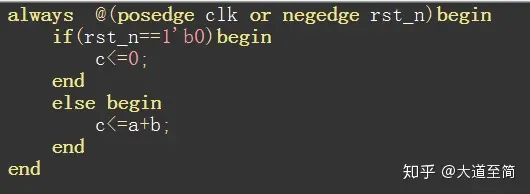
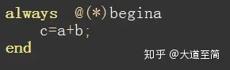
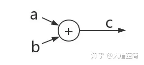
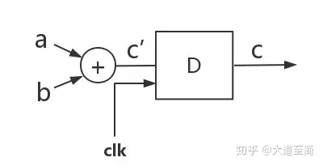
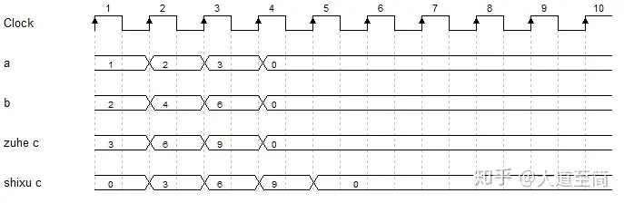
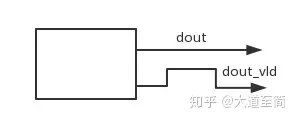
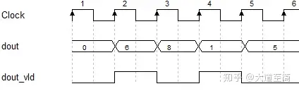
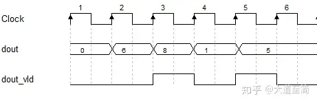

# 时序逻辑和组合逻辑的区别和使用
根据逻辑电路的不同特点，数字电路分为组合逻辑和时序逻辑，明德扬粉丝里的同学提出，无法正确区分，今天让我跟一起来学习一下两种逻辑的区别以及使用环境。

**·时序逻辑和组合逻辑的区别**

关于组合逻辑和时序逻辑的不同，我们可以从三方面来理解，分别是code（代码），电路图和波形图三方面。

从代码层面来看，时序逻辑即敏感列表里面带有时钟上升沿，如果是没有上升沿或者是带有“\*”号的代码，为组合逻辑。

电路层面，两种逻辑反映的电路也有不同，时序逻辑相当于在组合逻辑的基础上多了一个D触发器。

波形图层面，组合逻辑的波形是即刻反映变化的，与时钟无关；但是时序逻辑的波形不会立刻反映出来，只有在时钟的上升沿发生变化。

用一个简单的例子来区分学习下，如计算c=a+b。

在代码层面，时序逻辑代码表示如下，可以看到此代码有“posedge“时钟上升沿，即表示有一个D触发器，a+b的结果c是在D触发器发出指令后才进行输出的。

组合逻辑则如下所示，是不带上升沿的，有“\*”号的，直接输出a+b=c的值，不进行额外操作：

对比两种逻辑的代码表示，可以看出同样是输出c的值，不同的逻辑输出时间却不同，时序逻辑是在时钟上升沿输出，组合逻辑则直接输出。

电路图层面，组合逻辑为一个加法器连接a和b，紧接着立刻给到c，如下图所示，可以看到a+b得出的值c直接输出，没有进行任何额外操作：

时序逻辑的电路图加法器连接的a和b没有变，但是c的值在输出部分，不会直接输出，D触发器就像一扇门，信号值c‘停留在门前，当D触发器收到了时钟clk上升沿的信号，才会把门打开，输出信号c的值，如下图所示：

可以看到，组合逻辑是直接输出信号c，时序逻辑需要D触发器收到时钟上升沿信号后才会输出信号c。

在波形图层面，我们可以画出时序图来分析，如下图所示。可以看出第一个时钟时a=1，b=2，此时组合逻辑立刻得出c=3，是跟时钟没有关系的；但是时序逻辑一定要在下一个时钟的上升沿处才得出c=3的结果；

以此类推，后面的原理是一样的，当a=2，b=4时，组合逻辑马上得出c=6，时序逻辑在第3个时钟上升沿得出c=6。

综上所述，我们进行一下总结，**组合逻辑任意时刻的输出仅仅取决该时刻的输入，与时钟无关；时序逻辑先算好当前输入信号的结果，但还不影响输出，只有等到时钟上升沿的一瞬间，才把结果给了输出**。

· **时序逻辑和组合逻辑的使用**

相信大家已经可以非常清晰的区分组合逻辑和时序逻辑，下面我们就讨论一下组合逻辑和时序逻辑的使用环境。

首先我们需要保证信号的结果是正确的，只要满足目标需求，这时使用时序逻辑还是组合逻辑都是可以的（这里我们讨论的是大多数情况，但也有例外，例如模块的输出一般要求是时序逻辑）。

在实际设计中，为了便于操作，我们可以首先考虑用时序逻辑，看是否能满足设计要求。如果无法满足目标要求，需要凑时序，那么就考虑改为组合逻辑。

举个例子便于大家更好地理解，如下图所示，假设有一个模块，有两个信号dout和dout\_vld，其中dout表示数据，dout\_vld表示数据有效性。我们假设需要该模块先后输出两个数据6和1。

如下图所示，该波形输出就是正确的，只要设计能保证正确性，那不管使用组合逻辑还是时序逻辑，都是可以的。

  

但假设现在输出的结果如下图所示，输出的是8和5，不是我们目标需要的6和1，并且可以看到，dout\_vld比dout晚了一个时钟，这个时候就可以考虑设计dout\_vld的时序逻辑改为组合逻辑，将信号dout\_vld提前一拍，就可以得到正确的结果。

另一种方法，假设dout是组合逻辑设计的，就是把dout改为时序逻辑实现，将dout推迟一拍，达到信号对齐的效果。

通过上面的详细解释，相信大家都可以掌握时序逻辑和组合逻辑的原理和使用

备注：
对于一个要实现的模块，重点不在于纠结到底是组合还是时序，而是是完成功能。
对于组合和时序，能区分就好了。因为**组合能完成的事对时序来说就是晚一个时钟周期再出结果**而已。