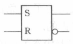

# 触发器详解
触发器是数字电路中一种重要的元件，常用于在满足一定条件时对电路产生影响。下面将介绍四种常见的触发器以及它们的特点。

1.RS触发器

RS触发器（Reset-Set Flip-Flop）是数字电子电路中的一种重要逻辑元件，用于存储和操作二进制信息。它有两个控制输入：R（Reset）和S（Set），以及两个输出：Q（输出）和~Q（反输出）。RS触发器的逻辑功能取决于控制输入的状态。以下是RS触发器的逻辑功能：

S=0，R=0： 当S和R都为0时，RS触发器的状态保持不变，即之前的状态将保持在输出上。这种状态被称为禁止状态。

S=0，R=1： 当S为0，R为1时，RS触发器被置于复位状态，即输出Q被强制为0，而~Q被置为1。

S=1，R=0： 当S为1，R为0时，RS触发器被置于设置状态，即输出Q被强制为1，而~Q被置为0。

S=1，R=1： 当S和R都为1时，RS触发器的行为是不确定的。这会导致电路进入未定义状态。

2.D触发器

D触发器也称为数据触发器，其输入端仅有一个称为数据端 D，以及时钟控制端 CLK 和输出端 Q。当时钟的边沿到来时，D 端的值被锁存入Q端，其他时刻，D端的数据可以变化，但是Q 的值被保持不变。D 触发器可用于建立寄存器、移位寄存器、计数器等电路，尤其在FPGA芯片电路设计中被大量应用！

3.JK触发器

JK触发器是一种带有“激活”和“禁止”功能的触发器，实际由RS触发器演变而来，只不过RS触发器不能两端同时为1，而JK是可以的。它由两个输入端 J 和 K、时钟控制端 CLK、以及输出端 Q 和 Q’ 组成。当 J=1 且 K=0 时，Q=1；当 J=0 且 K=1 时，Q=0；当 J=K=1 时，Q 取反；当 J=K=0 时，保留原状态。JK触发器可以实现锁存、计数器、移位寄存器等电路。

4.T触发器

T触发器也称为“翻转”触发器，只有一个输入端 T、时钟控制端 CLK 和一个输出端 Q。当 T=1 且 CLK边沿到来时，Q 取反；当 T=0 时，Q 的值不变。常用于频率分割器、计数器、随机数发生器等电路。

## **0  前言**

**有记忆功能的逻辑单元**的重要性：

保存数字电路的运算结果；

在由时钟控制的电路中，在两个时钟脉冲间隔，保持电路状态不变。

“触发器”可以存储信息：

①有0，1可以保持稳定输出

②可根据输入信号变化，改变状态

触发信号：改变触发器状态的输入信号，eg.脉冲边沿，输入信号某个电平

触发器：由时钟信号触发引起输出状态改变，同时该状态在下一次被触发前始终不会改变

锁存器：输出状态不是由时钟信号触发，或虽由时钟信号触发，但在时钟信号某电平下输出会随输入改变而改变

## **1  触发器基本逻辑类型及其状态**

按触发器输入输出逻辑关系不同分类：RS，JK，D和T触发器

描述输入输出逻辑关系：真值表或逻辑方程

描述触发器逻辑功能的真值表：触发器状态表和激励表

特征方程：描述触发器的逻辑方程

### **RS触发器****（与非门与或非门构成的）**

 存储功能依赖于两个门电路正反馈

两个输入端：置位输入S，复位输入R

“置位Set”：使触发器输出端Q输出逻辑1

“复位Reset”：使触发器输出端Q输出逻辑0

S=1,R=0时，Q=1，置位

S=0,R=1时，Q=0，复位

与非门组成的RS触发器，外部输入逻辑1有效

或非门组成的RS触发器，输入端的逻辑非符号表示，外部输入逻辑0有效

方框内，不论与非门还是或非门构成的RS触发器都是输入逻辑1有效

\- 触发器有反馈，故任何时刻t后输出不仅与t时刻输入有关，还与t时刻输出状态有关

定义

即时输入：t时刻的输入

即时状态：t时刻的输出

次态：t时刻以后的输出

\-触发器次态不仅同即时输入有关，还与即时状态有关

 SR=11是不稳定状态，触发器的次态取决于哪个输入先消失

eg.R先变0，则R变0瞬间输出Q=1，反之输出Q=0

输入信号“同时”消失，则无法确定S与R变为逻辑0的先后顺序→无法确定次态

故禁止出现SR=11

RS触发器次态逻辑表达式

$Q\_{n+1}=S+\\overline{R}Q\_{n}$ 

 （描述触发器即时输入S、R，即时状态Qn和次态Qn+1间关系）

激励表：在已知**状态变化（初态→次态）**的情况下要求找出实现该状态变化的**输入条件**

触发器+同步信号控制：让触发器按某个信号节奏转换状态

同步触发器：带接在在系统时钟信号上的同步控制信号CP的触发器

异步触发器：无同步信号的触发器

 CP=1，两与非门只受SR输入控制

SR的输入可直接传递到基本RS触发器的输入端并寄存

同步RS触发器在CP=1期间输出取决于输入S和R，输入变化→输出变化(见上方激励表)

CP=0，所有输入被封锁，基本RS触发器的SR=00，触发器输出不变

 - 基本RS触发器和同步RS触发器的区别：动作过程是否与系统同步

### **JK触发器****（时钟触发器）**

 JK触发器与RS触发器对应逻辑功能：J对应S，K对应R，但不同的是JK=11时状态翻转而SR=11禁止

JK触发器状态方程

$Q\_{n+1}=J\\overline{Q\_n}+\\overline{K}Q\_n$

JK触发器激励

【我是怎么记住上表的，或者说第四章用的上表】

0→0 ，0d

0→1，1d

上面从0开始变，所以任意项d在后面/右边/更低位，次态为0则左边为0，次态为1左边为1（和次态保持一致）

1→1，d0

1→0，d1

上面从1开始变，任意项d在前面/左边/更高位，次态为1则右边为0，次态为0右边为1（正好是次态取反）

### **D触发器****（****制作数据寄存器）**

只有一个激励输入端D，输出与激励相同（不论上一个状态如何）

 D触发器状态方程

$Q\_{n+1}=D$

 简单好用！触发脉冲后，输出保存了激励段输入信号，可用它来制作数据寄存器

### **T触发器****（翻转触发器，计数器）**

只有一个激励T

T=1 每个触发脉冲作用后触发器状态翻转

T=0 保持不变

 T触发器状态方程

$Q\_{n+1}=T\\overline{Q\_n}+\\overline{T}Q\_n$

 

 一个有意思的尝试：让T触发器激励端永远接逻辑1→在时钟脉冲作用下不断翻转（T'触发器）