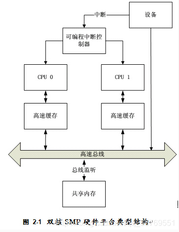
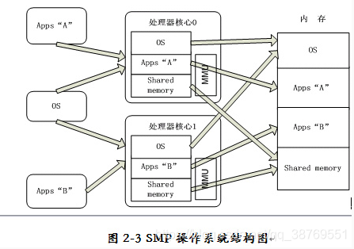
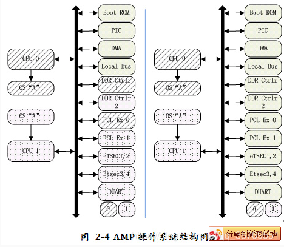

## 目前在嵌入式领域支持多核处理器芯片的操作系统体系结构有两种：

一是AMP(Asymmetric Multi-processing)模式：AMP模式的RTOS在各个CPU上均运行一个操作系统实例(这些操作实例不一定完全相同)，各个操作系统拥有自己专用的内存，相互之间通过访问受限的共享内存进行通信。AMP模式的操作系统结构需要用户参与系统资源的分配。这种类型的RTOS应用比较少，商用操作系统中仅有Wind River公司的VxWorks 提供AMP模式的配置。

二是SMP(Symmetric Multi-processing)模式：SMP模式的操作系统构架是多核处理器技术的一种变体，由一个操作系统实例控制所有处理器，所有处理器共享内存。与AMP模式中每个CPU上运行一个操作系统实例不同，SMP模式系统中所有CPU的地位相同，共同运行一个操作系统实例，所有CPU共享系统内存和外设资源。相对于AMP模式，SMP模式的操作系统具有可共享内存、较高的性能和功耗比、以及易实现负载均衡等优点，更能发挥发挥多核处理器的硬件优势。

  
