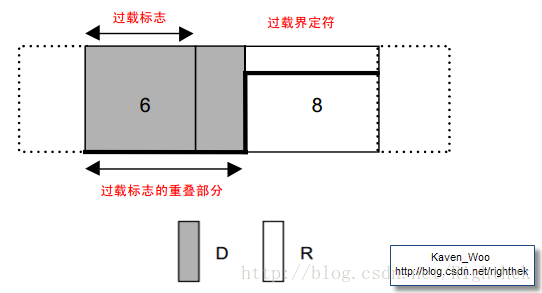
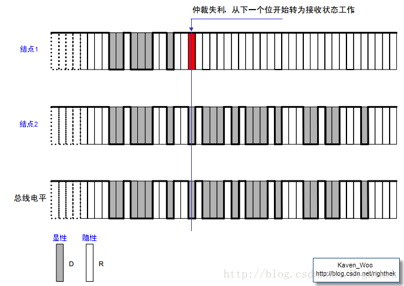
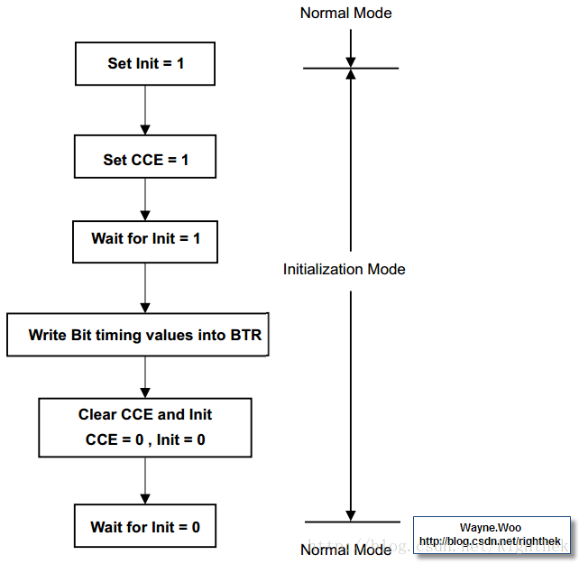

转载请注明出处：http://blog.csdn.net/Righthek 谢谢！

 CAN总线原理

由于Socket CAN涉及到CAN总线协议、套接字、Linux网络设备驱动等。因此，为了能够全面地了解Socket CAN的原理。我们需要了解以下几个方面的知识点：

（1）CAN总线协议；

（2）Socket原理；

（3）Linux网络设备驱动；

当熟悉以下三个方面的知识点后，我们再去分析基于Linux的Socket CAN的驱动。这样的话理解起来更加容易、易懂。

（4）Socket CAN的驱动；

一、CAN总线协议

由于CAN总线协议的内容太多，作为博文来说，不适宜很详细的讲解。需要深入了解的朋友们可以Google一下。以下只是作些简要的说明。

CAN是ControllerArea Network（控制器局域网）的缩写。CAN通信协议在1986年由德国电气商博世公司所开发，主要面向汽车的通信系统。现已是ISO国际标准化的串行通信协议。根据不同的距离、不同的网络，可配置不同的速度，最高速度为1MBit/s。

CAN被细分为三个层次：

（1）CAN对象层（the object layer）；

（2）CAN传输层（the transfer layer）；

（3）CAN物理层（the phyical layer）；

对象层和传输层包括所有由ISO/OSI模型定义的数据链路层的服务和功能。

对象层的作用范围包括：

（1）查找被发送的报文。

（2）确定由实际要使用的传输层接收哪一个报文。

（3）为应用层相关硬件提供接口。

传输层的作用主要：

（1）传送规则，也就是控制帧结构、执行仲裁、错误检测、出错标定、故障界定。

（2）总线上什么时候开始发送新报文及什么时候开始接收报文，均在传输层里确定。

（3）位定时的一些普通功能也可以看作是传输层的一部分。

（4）传输层的修改是受到限制的。

物理层的作用：

在不同节点之间根据所有的电气属性进行位信息的实际传输。当然，同一网络内，物理层对于所有的节点必须是相同的。尽管如此，在选择物理层方面还是很自由的。

CAN具有以下的属性：

（1）报文（Messages）：简单来说就是具有固定格式的数据包。

（2）信息路由（Information Routing）：即，报文寻找结点的方式。

（3）位速率（Bit rate）：数据位的传输速度。

（4）优先权（Priorities）：即报文发送的优先权。

（5）远程数据请求（Remote Data Request）：通过发送远程帧，需要数据的节点可以请求另一节点发送相应的数据帧。

（6）多主机（Multimaster）：总线空闲时，任何结点都可以开始传送报文。

（7）仲裁（Arbitration）：当2个及以上的单元同时开始传送报文，那么就会有总线访问冲突。仲裁是确定哪个单元的具有发送优先权。

（8）安全性（Safety）：CAN的每一个节点均采取了强有力的措施以进行错误检测、错误标定及错误自检。

（9）错误检测（Error Detection）：包括监视、循环冗余检查、位填充、报文格式检查。

（10）错误检测的执行（Performance of Error Detection）

（11）错误标定和恢复时间（Error Sinalling and Recovery Time）：任何检测到错误的结点会标志出已损坏的报文。此报文会失效并将自动地开始重新传送。如果不再出现新的错误，从检测到错误到下一报文的传送开始为止，恢复时间最多为29个位的时间。

（12）故障界定（Fault Confinement）：CAN结点能够把永久故障和短暂扰动区分开来。永久故障的结点会被关闭。

（13）连接（Connections）：CAN串行通讯链路是可以连接许多结点的总线。理论上，可连接无数多的结点。但由于实际上受延迟时间或者总线线路上电气负载的影响，连接结点的数量是有限的。

（14）单通道（Single Channel）：总线是由单一进行双向位信号传送的通道组成。

（15）总线值（Bus value）：总线可以具有两种互补的逻辑值之一：“显性”（可表示为逻辑0）或“隐性”（可表示为逻辑1）。

（16）应答（Acknowledgment）：所有的接收器检查报文的连贯性。对于连贯的报文，接收器应答；对于不连贯的报文，接收器作出标志。

（17） 睡眠模式／唤醒（Sleep Mode / Wake-up）：为了减少系统电源的功率消耗，可以将CAN器件设为睡眠模式以便停止内部活动及断开与总线驱动器的连接。CAN器件可由总线激活，或系统内部状态而被唤醒。

1、CAN总线的报文格式

CAN传输的报文，可分为五种类型：

（1）数据帧：用于发送结点向接收结点传送数据的帧。

（2）远程帧：总线结点发出远程帧，请求发送具有同一识别符的数据帧。

（3）错误帧：任何结点检测到一总线错误就发出错误帧。

（4）过载帧：过载帧用以在先行的和后续的数据帧（或远程帧）之间提供一附加的延时。

（5）帧间隔：用于将数据帧及远程帧与前面的帧分离开来的帧。

数据帧由7个不同的位场组成：

帧起始 仲裁场 控制场 数据场 CRC场 ACK场 帧结束

数据帧有标准格式和和远程格式，以下是其格式表示：

图2    数据帧格式

远程帧由6个不同的位场组成：

帧起始 仲裁场 控制场 CRC场 ACK场 帧结束

远程帧没有数据帧的数据场，以下是其格式表示：

 

图3    远程帧格式

错误帧用于在接收和发送消息时检测出错误，通知错误的帧。错误帧由错误标志和错误界定符构成。

错误标志包括主动错误标志和被动错误标志两种。

主动错误标志：6个位的显性位，处于主动错误状态的单元检测出错误时输出的错误标志。

被动错误标志：6个位的隐性位，处于被动错误状态的单元检测出错误时输出的错误标志。

错误界定符由8个位的隐性位构成。

错误帧格式如下表示：

 

图4    错误帧格式

过载帧是用于接收单元通知其尚未完成接收准备的帧。过载帧由过载标志和过载界定符构成。过载帧格式如下表示：

 

图5    过载帧格式

帧间隔是用于分隔数据帧和远程帧的帧。数据帧和远程帧可通过插入帧间隔将本帧与前面的任何帧（数据帧、远程帧、错误帧、过载帧）分开。过载帧和错误帧前不能插入帧间隔。帧间隔如下图所示：

 

图6    帧间隔格式

2、CAN总线的仲裁方式

在总线空闲态，最先开始发送消息的单元获得发送权。多个单元同时开始发送时，各发送单元从仲裁段的第一位开始进行仲裁。连续输出显性电平最多的单元可继续发送。即逐位地对比各个结点发出的报文ID。由于线与的关系，显示位“0”可以覆盖隐性位“1”，因此ID最小的节点赢得仲裁，总线上表现为该结点的报文，其他结点失去仲裁，退出发送，转为接收状态。

标准格式ID与具有相同ID的远程帧或者扩展格式的数据帧在总线上竞争时，标准格式的RTR位为显性位的具有优先权，可继续发送。

 

图7    仲裁方式

3、位填充（BitStuffing）

位填充是为了防止突发错误而设定的功能。位填充的规则如下：

（1）5位连续相同电平之后，必须填充一位反向位，即不允许有6个连续相同位；

（2）SOF之前为总线空闲状态，不需要同步，因此不需要位填充；

（3）CRC之后为固定格式，不允许填充；

（4）由CAN控制器自动实现；  
4、CAN的错误处理

CAN控制器检测错误共有以下5种：

（1）位填充错误；

在使用位填充的帧场内，结点如果检测到6个连续相同的位值，则产生位填充错误，在下一位开始时，该结点将发送一个错误帧。

（2）位错误；

在发送期间，结点检测到总线的位值与自身发送的位值不一致时，则产生位错误，在下一位开始时，该结点将发送一个错误帧。

（3）CRC错误；

接收结点计算的CRC码与数据帧本身自带的CRC码不一致，接收结点将丢弃该帧，并在ACK界定符之后发送一个错误帧。

（4）应答错误；

发送结点在ACK Slot位会发送隐性位，同时监听总线是否为显性位，如果是显性位，则表明至少一个节点正确收到该帧；如果是隐性位，将产生ACK错误，发送结点发送一个错误帧。

（5）格式错误；

发送结节在（CRC界定符、ACK界定符、帧结束EOF）固定格式的位置检测到显性位时，将发生格式错误，并发送一个错误帧。

5、CAN总线同步

CAN总线的通信方式为NRZ方式。各个位的开关或者结尾都没有附加同步信号。发送结点以与位时序同步的方式开始发送数据。另外，接收结点根据总线上电平的变化进行同步并进行接收工作。

但是，发送结点和接收结点存在的时钟频率误差及传输路径上的（电缆、驱动器等）相位延迟会引进同步偏差。因此接收结点需要通过同步的方式调整时序进行接收。

同步的作用是尽量使本地位时序与总结信号的位时序一致（本地同步段与总结信号边沿同步）。只有接收结点需要同步；同步只会发生在隐性到显性电平的跳沿。

同步的方式为硬件同步和再同步。

以上是CAN总线协议的一些简要总结，不足之处，请指出，谢谢！下一篇文章将开始Socket原理的讲解。  
  

Socket原理及应用

为了能够对Socket CAN的深入理解，我们需要了解Socket的机制。

Socket的中文翻译为“插座”，在计算机世界里称为套接字。Socket最初是作为网络上不同主机之间进程的通信接口，后来应用越来越广，在同一主机上的不同进程之间通信也可以用Socket。简单来说，当网络上不同主机之间的两个进程（A、B）采用Socket进行通信时，那么它们之间需要建立一个通信端点，即创建Socket，创建Socket时就分配端口号和网络地址。当进程A向进程B发送数据时，那么进程A必须要知道进程B的网络地址及端口号。

Socket采用C/S模型进行设计的，即Client/Server，面向客户端—服务器模型。

每一个Socket都用一个半相关描述：

{协议，本地地址，本地端口}

一个完整的Socket则用一个相关描述:

{协议，本地地址，本地端口，远程地址，远程端口}

一、Socket的类型

Socket有三种类型：

1、字节流套接字（SOCK\_STREAM）

字节流的套接字可以提供可靠的数据传输、面向连接的通讯流。数据按何种顺序发送，就按何种顺序接收。例如，当我们按顺序发送A-B-C，那么在数据到达接收端时，它的顺序也是A-B-C。字节流套接字采用的是TCP（Transmission Control Protocol）协议。保证了数据传输的可靠性。

2、数据报套接字（SOCK\_DGRAM）

数据报套接字定义了一种无连接的服务。所谓无连接服务，简单来说，即在发送数据时，无需在收发两端建立类似TCP那样的握手连接，在发送时，将数据打包，然后加上远程IP地址，即可把该数据包发送出去。

数据通过相互独立的报文进行传输。并且是无序的、不可靠的传输。  

3、原始套接字（SOCK\_ROW）

原始套接字是我们需要关心的，因为我们的Socket CAN采用的即是原始套接字。该接口允许对较底层协议进行操作，如IP、ICMP等。原始套接字常用于检验新的协议实现或访问现有服务中配置的新设备。

套接字的工作流程如下：

先启动服务器，通过调用socket()函数建立一个套接字，然后调用bind()函数将该套接字和本地网络地址联系在一起，再调用listen()函数使套接字做好侦听的准备，并规定它的请求队列的长度，之后就调用accept()函数来接收连接。客户端在建立套接字之后就可调用 connect()和服务器建立连接。连接一旦建立，客户端和服务器之间就可以通过调用recv()/recvfrom()函数和send()/sendto函数来进行发收数据。最后，待数据传送结束后，双方调用close()函数关闭套接字。

下面我们来写两个简单的基于Socket的CAN应用程序，但是我们采用的是SOCK\_ROW，因此在套接字工作流程上有区别于SOCK\_STREAM和SOCK\_DGRAM。由于Socket采用C/S模型进行设计的，所以我们的这两个程序也分别为Server和Client。

首先是server端的程序，我们需要写一个服务器的程序，该程序接收来自客户端发来的数据，代码如下：
~~~cpp
int can_recv()

{

   int sock_fd;

   unsigned long nbytes, len;

   struct sockaddr_can addr;

   struct ifreq ifr;

   /*为了能够接收CAN报文，我们需要定义一个CAN数据格式的结构体变量*/

   struct can_frame frame;

   struct can_frame *ptr_frame;

   /*建立套接字，设置为原始套接字，原始CAN协议 */

   sock_fd = socket(PF_CAN,SOCK_RAW,CAN_RAW);

   /*以下是对CAN接口进行初始化，如设置CAN接口名，即当我们用ifconfig命令时显示的名字 */

   strcpy(ifr.ifr_name,"can0");

   ioctl(sock_fd, SIOCGIFINDEX, &ifr);

   printf("can0 can_ifindex = %x\n",ifr.ifr_ifindex);

   /*设置CAN协议 */

  addr.can_family = AF_CAN;

  addr.can_ifindex = 0;

  /*将刚生成的套接字与网络地址进行绑定*/

  bind(sock_fd, (struct sockaddr*)&addr, sizeof(addr));

  /*开始接收数据*/

  nbytes = recvfrom(sock_fd, &frame, sizeof(struct can_frame), 0, (struct sockaddr *)&addr, &len);

        

  /*get interface name of the received CAN frame*/

  ifr.ifr_ifindex = addr.can_ifindex;

  ioctl(sock_fd, SIOCGIFNAME, &ifr);

  printf("Received a CAN frame from interface %s\n",ifr.ifr_name);

  /*将接收到的CAN数据打印出来，其中ID为标识符，DLC为CAN的字节数，DATA为1帧报文的字节数*/
  printf("CAN frame:\n ID = %x\n DLC = %x\n DATA = %s\n",frame.can_id,frame.can_dlc,frame.data);

  ptr_frame = &frame;

  return 0;

}

~~~

接下来是CAN的发送程序，即客户端，代码如下：

~~~cpp 

int can_send()
{

      int sock_fd;

      unsigned long nbytes;

      struct sockaddr_can addr;

      struct ifreq ifr;

      struct can_frame frame;

     /*建立套接字，设置为原始套接字，原始CAN协议 */

     sock_fd = socket(PF_CAN,SOCK_RAW,CAN_RAW);

     /*以下是对CAN接口进行初始化，如设置CAN接口名，即当我们用ifconfig命令时显示的名字 */

    strcpy((char *)(ifr.ifr_name), "can0");

    ioctl(sock_fd, SIOCGIFINDEX, &ifr);

    printf("can0 can_ifindex = %x\n", ifr.ifr_ifindex);

    addr.can_family = AF_CAN;

    addr.can_ifindex = ifr.ifr_ifindex;

    /*将刚生成的套接字与CAN套接字地址进行绑定*/

     bind(sock_fd, (struct sockaddr*)&addr, sizeof(addr));

     /*设置CAN帧的ID号，可区分为标准帧和扩展帧的ID号*/

     frame.can_id = 0x1122;

     strcpy((char *)frame.data,"hello");

     frame.can_dlc = strlen(frame.data);

     printf("Send a CAN frame from interface %s\n", ifr.ifr_name);

     /*开始发送数据*/

     nbytes = sendto(sock_fd, &frame, sizeof(struct can_frame), 0, (struct sockaddr*)&addr, sizeof(addr));

     return 0;

}

~~~

上面两个程序看完后，大家可能会有疑问，为什么这两个程序没有listen()和accept()函数呢？其实这两个程序是独立的运行的，并不像字节流套接字（SOCK_STREAM）和数据报套接字（SOCK_DGRAM），需要先运行服务器进行侦听。SOCK_STREAM和SOCK_DGRAM的两个server和client程序是通过网络相互收发数据。而CAN的socket的server和client程序收发数据的对象是CAN总线。server从CAN总线上接收数据，client将数据发到CAN总线上，当CAN总线上有数据时，server才能接收数据，当CAN总线空闲时，client才能将数据发送出去。

 

以上是对套接字的简单理解，并附上socket CAN的简单上层应用代码，如有不足之处，敬请谅解！

 

SOCKET CAN发送数据流程

转载请注明出处：http://blog.csdn.net/Righthek 谢谢！

   对于本文，我们将从用户层使用Socket CAN进行数据发送时，数据从用户空间到底层驱动的整个通信流程，用户层使用Socket CAN可参考上一篇文章《对Socket CAN的理解（2）——【Socket的原理及使用】》。

   当我们在用户层通过socket进行CAN数据的发送时，需要进行以下操作：

   （1） 创建一个套接字socket，采用AF_CAN协议；
   （2）将创建的套接字返回描述符sockfd，绑定到本地的地址；
   （3）通过sendto系统调用函数进行发送；

sendto的函数声明如下：

~~~cpp 
int sendto(int sockfd, const void *msg, intlen,unsigned intflags, const struct sockaddr *to, int tolen);
~~~
主要参数说明如下：

sockfd:通过socket函数生成的套接字描述符；

msg:该指针指向需要发送数据的缓冲区；

len:是发送数据的长度；

to:目标主机的IP地址及端口号信息；

 

   sendto的系统调用会发送一帧数据报到指定的地址，在CAN协议调用之前把该地址移到内核空间和检查用户空间数据域是否可读。

在net/socket.c源文件中，sendto函数的系统调用如下代码：
~~~cpp 
SYSCALL_DEFINE6(sendto, int, fd, void __user *, buff, size_t, len, unsigned, flags, structsockaddr __user *, addr, int, addr_len)

{

structsocket *sock;

structsockaddr_storage address;

interr;

structmsghdr msg;

structiovec iov;

intfput_needed;

if(len > INT_MAX)

          len= INT_MAX;

sock= sockfd_lookup_light(fd, &err, &fput_needed);

if(!sock)

          gotoout;

iov.iov_base= buff;

iov.iov_len= len;

msg.msg_name= NULL;

msg.msg_iov= &iov;

msg.msg_iovlen= 1;

msg.msg_control= NULL;

msg.msg_controllen= 0;

msg.msg_namelen= 0;

/*把用户空间的地址移动到内核空间中*/

if(addr) {

          err= move_addr_to_kernel(addr, addr_len,(struct sockaddr *)&address);

          if(err < 0)

                   gotoout_put;

          msg.msg_name= (struct sockaddr *)&address;

          msg.msg_namelen= addr_len;

}

if(sock->file->f_flags & O_NONBLOCK)

          flags|= MSG_DONTWAIT;

msg.msg_flags= flags;

err= sock_sendmsg(sock, &msg, len);

}

~~~

在sendto的系统调用（sys_sendto）里，会调用到sock_sendmsg()函数，该函数代码如下：
~~~cpp 
int sock_sendmsg(struct socket *sock, struct msghdr *msg, size_t size)

{

structkiocb iocb;

structsock_iocb siocb;

intret;

init_sync_kiocb(&iocb,NULL);

iocb.private= &siocb;

ret= __sock_sendmsg(&iocb, sock, msg, size);

if(-EIOCBQUEUED == ret)

          ret= wait_on_sync_kiocb(&iocb);

returnret;

}
~~~
接下来调用__sock_sendmsg()函数。
~~~cpp 
static inline int __sock_sendmsg(struct kiocb *iocb,struct socket *sock, struct msghdr *msg, size_t size)

{

interr = security_socket_sendmsg(sock, msg, size);

returnerr ?: __sock_sendmsg_nosec(iocb, sock, msg, size);

}
~~~
再往下一步就是__sock_sendmsg_nosec函数。在__sock_sendmsg_nosec()函数中会返回一个sendmsg函数指针。
~~~cpp 
static inline int __sock_sendmsg_nosec(struct kiocb*iocb, struct socket *sock, struct msghdr *msg, size_t size)

{

structsock_iocb *si = kiocb_to_siocb(iocb);

sock_update_classid(sock->sk);

si->sock= sock;

si->scm= NULL;

si->msg= msg;

si->size= size;

returnsock->ops->sendmsg(iocb, sock,msg, size);

}
~~~
在/net/can/raw.c源文件中，将raw_sendmsg函数地址赋给sendmsg函数指针，即在函数__sock_sendmsg_nosec()中return sock->ops->sendmsg(iocb,sock, msg, size)，返回的函数指针将指向raw_sendmsg()函数。
~~~cpp 
static const struct proto_ops raw_ops = {

.family        = PF_CAN,

.release       = raw_release,

.bind          = raw_bind,

.connect       = sock_no_connect,

.socketpair    = sock_no_socketpair,

.accept        = sock_no_accept,

.getname       = raw_getname,

.poll          = datagram_poll,

.ioctl         = can_ioctl,    /* use can_ioctl() from af_can.c */

.listen        = sock_no_listen,

.shutdown      = sock_no_shutdown,

.setsockopt    = raw_setsockopt,

.getsockopt    = raw_getsockopt,

.sendmsg       = raw_sendmsg,

.recvmsg       = raw_recvmsg,

.mmap          = sock_no_mmap,

.sendpage      = sock_no_sendpage,

};

 

static int raw_sendmsg(struct kiocb *iocb, struct socket *sock, struct msghdr *msg, size_tsize)

{

structsock *sk = sock->sk;

structraw_sock *ro = raw_sk(sk);

structsk_buff *skb;

structnet_device *dev;

intifindex;

interr;

if(msg->msg_name) {

          structsockaddr_can *addr =

                   (structsockaddr_can *)msg->msg_name;

          if(msg->msg_namelen < sizeof(*addr))

                   return-EINVAL;

          if(addr->can_family != AF_CAN)

                   return-EINVAL;

          ifindex= addr->can_ifindex;

}else

          ifindex= ro->ifindex;

if(size != sizeof(struct can_frame))

          return-EINVAL;

dev= dev_get_by_index(&init_net, ifindex);

if(!dev)

          return-ENXIO;

skb= sock_alloc_send_skb(sk, size, msg->msg_flags & MSG_DONTWAIT,

                              &err);

if(!skb)

          gotoput_dev;

err= memcpy_fromiovec(skb_put(skb, size), msg->msg_iov, size);

if(err < 0)

          gotofree_skb;

err= sock_tx_timestamp(sk, &skb_shinfo(skb)->tx_flags);

if(err < 0)

          gotofree_skb;

/*to be able to check the received tx sock reference in raw_rcv() */

skb_shinfo(skb)->tx_flags|= SKBTX_DRV_NEEDS_SK_REF;

skb->dev= dev;

skb->sk  = sk;

err= can_send(skb,ro->loopback);

dev_put(dev);

if(err)

          gotosend_failed;

returnsize;

}

~~~
在net/can/af\_can.c源文件中，can\_send函数负责CAN协议层的数据传输，即传输一帧CAN报文（可选本地回环）。参数skb指针指向套接字缓冲区和在数据段的CAN帧。loop参数是在本地CAN套接字上为监听者提供回环。
~~~cpp

int can_send(struct sk_buff *skb, int loop)

{

structsk_buff *newskb = NULL;

structcan_frame *cf = (struct can_frame *)skb->data;

interr;

if(skb->len != sizeof(struct can_frame) || cf->can_dlc > 8) {

          kfree_skb(skb);

          return-EINVAL;

}

if(skb->dev->type != ARPHRD_CAN) {

          kfree_skb(skb);

          return-EPERM;

}

if(!(skb->dev->flags & IFF_UP)) {

          kfree_skb(skb);

          return-ENETDOWN;

}

skb->protocol= htons(ETH_P_CAN);

skb_reset_network_header(skb);

skb_reset_transport_header(skb);

if(loop) {

          /*local loopback of sent CAN frames */

          /*indication for the CAN driver: do loopback */

          skb->pkt_type= PACKET_LOOPBACK;

          if(!(skb->dev->flags & IFF_ECHO)) {

                   /*

                    * If the interface is not capable to doloopback

                    * itself, we do it here.

                    */

                   newskb= skb_clone(skb, GFP_ATOMIC);

                   if(!newskb) {

                            kfree_skb(skb);

                            return-ENOMEM;

                   }

                   newskb->sk= skb->sk;

                   newskb->ip_summed= CHECKSUM_UNNECESSARY;

                   newskb->pkt_type= PACKET_BROADCAST;

          }

}else {

          /*indication for the CAN driver: no loopback required */

          skb->pkt_type= PACKET_HOST;

}

/*send to netdevice */

err= dev_queue_xmit(skb);

if(err > 0)

          err= net_xmit_errno(err);

if(err) {

          kfree_skb(newskb);

          returnerr;

}

if(newskb)

          netif_rx_ni(newskb);

/*update statistics */

can_stats.tx_frames++;

can_stats.tx_frames_delta++;

return0;

}

int dev_queue_xmit(struct sk_buff *skb)

{

structnet_device *dev = skb->dev;

structnetdev_queue *txq;

structQdisc *q;

intrc = -ENOMEM;

 

/*Disable soft irqs for various locks below. Also

 * stops preemption for RCU.

 */

rcu_read_lock_bh();

 

txq= dev_pick_tx(dev, skb);

q= rcu_dereference_bh(txq->qdisc);

 

#ifdef CONFIG_NET_CLS_ACT

skb->tc_verd= SET_TC_AT(skb->tc_verd, AT_EGRESS);

#endif

trace_net_dev_queue(skb);

if(q->enqueue) {

          rc= __dev_xmit_skb(skb, q, dev, txq);

          gotoout;

}

if(dev->flags & IFF_UP) {

          intcpu = smp_processor_id(); /* ok because BHs are off */

 

          if(txq->xmit_lock_owner != cpu) {

 

                   if(__this_cpu_read(xmit_recursion) > RECURSION_LIMIT)

                            gotorecursion_alert;

 

                   HARD_TX_LOCK(dev,txq, cpu);

 

                   if(!netif_tx_queue_stopped(txq)) {

                            __this_cpu_inc(xmit_recursion);

                            rc= dev_hard_start_xmit(skb, dev, txq);

                            __this_cpu_dec(xmit_recursion);

                            if(dev_xmit_complete(rc)) {

                                      HARD_TX_UNLOCK(dev,txq);

                                      gotoout;

                            }

                   }

                   HARD_TX_UNLOCK(dev,txq);

                   if(net_ratelimit())

                            printk(KERN_CRIT"Virtual device %s asks to "

                                   "queue packet!\n", dev->name);

          }else {

                   /*Recursion is detected! It is possible,

                    * unfortunately

                    */

recursion_alert:

                   if(net_ratelimit())

                            printk(KERN_CRIT"Dead loop on virtual device "

                                   "%s, fix it urgently!\n",dev->name);

          }

}

 

rc= -ENETDOWN;

rcu_read_unlock_bh();

 

kfree_skb(skb);

returnrc;

out:

rcu_read_unlock_bh();

returnrc;

}

int dev_hard_start_xmit(struct sk_buff *skb, struct net_device *dev, structnetdev_queue *txq)

{

conststruct net_device_ops *ops = dev->netdev_ops;

intrc = NETDEV_TX_OK;

unsignedint skb_len;

if(likely(!skb->next)) {

          u32features;

          /*

           * If device doesn't need skb->dst, releaseit right now while

           * its hot in this cpu cache

           */

          if(dev->priv_flags & IFF_XMIT_DST_RELEASE)

                   skb_dst_drop(skb);

          if(!list_empty(&ptype_all))

                   dev_queue_xmit_nit(skb,dev);

          skb_orphan_try(skb);

          features= netif_skb_features(skb);

 

          if(vlan_tx_tag_present(skb) &&

              !(features & NETIF_F_HW_VLAN_TX)) {

                   skb = __vlan_put_tag(skb,vlan_tx_tag_get(skb));

                   if(unlikely(!skb))

                            gotoout;

                   skb->vlan_tci= 0;

          }

          if(netif_needs_gso(skb, features)) {

                   if(unlikely(dev_gso_segment(skb, features)))

                            gotoout_kfree_skb;

                   if(skb->next)

                            gotogso;

          }else {

                   if(skb_needs_linearize(skb, features) &&

                       __skb_linearize(skb))

                            gotoout_kfree_skb;

                   /*If packet is not checksummed and device does not

                    * support checksumming for this protocol,complete

                    * checksumming here.

                    */

                   if(skb->ip_summed == CHECKSUM_PARTIAL) {

                            skb_set_transport_header(skb,

                                      skb_checksum_start_offset(skb));

                            if(!(features & NETIF_F_ALL_CSUM) &&

                                 skb_checksum_help(skb))

                                      gotoout_kfree_skb;

                   }

          }

          skb_len= skb->len;

          rc= ops->ndo_start_xmit(skb, dev);

          trace_net_dev_xmit(skb,rc, dev, skb_len);

          if(rc == NETDEV_TX_OK)

                   txq_trans_update(txq);

          returnrc;

}

}

~~~
以下开始进行到CAN的底层驱动代码了，由于CAN驱动是编译进内核中，所以在系统启动时会注册CAN驱动，注册CAN驱动过程中会初始化d\_can\_netdev\_ops结构体变量。在这个过程中，d\_can\_netdev\_ops结构体变量定义了3个函数指针，其中(\*ndo\_start\_xmit)函数指针指向d\_can\_start\_xmit函数的入口地址。
~~~cpp
static const struct net_device_ops d_can_netdev_ops = {

.ndo_open= d_can_open,

.ndo_stop= d_can_close,

.ndo_start_xmit =d_can_start_xmit,

};

 

static netdev_tx_t d_can_start_xmit(struct sk_buff*skb, structnet_device *dev)

{

u32msg_obj_no;

structd_can_priv *priv = netdev_priv(dev);

structcan_frame *frame = (struct can_frame *)skb->data;

if(can_dropped_invalid_skb(dev, skb))

          returnNETDEV_TX_OK;

msg_obj_no= get_tx_next_msg_obj(priv);

/*prepare message object for transmission */

d_can_write_msg_object(dev,D_CAN_IF_TX_NUM, frame, msg_obj_no);

can_put_echo_skb(skb,dev, msg_obj_no - D_CAN_MSG_OBJ_TX_FIRST);

/*

 * we have to stop the queue in case of a wraparound or

 * if the next TX message object is still inuse

 */

priv->tx_next++;

if(d_can_is_next_tx_obj_busy(priv, get_tx_next_msg_obj(priv)) ||

          ((priv->tx_next& D_CAN_NEXT_MSG_OBJ_MASK) == 0))

          netif_stop_queue(dev);

returnNETDEV_TX_OK;

}

~~~
在d\_can\_start\_xmit()函数中，会调用d\_can\_write\_msg\_object()函数准备消息报文进行传输。
~~~cpp
static void d_can_write_msg_object(struct net_device *dev, intiface, struct can_frame *frame, int objno)

{

inti;

unsignedint id;

u32dataA = 0;

u32dataB = 0;

u32flags = 0;

structd_can_priv *priv = netdev_priv(dev);

 

if(!(frame->can_id & CAN_RTR_FLAG))

          flags|= D_CAN_IF_ARB_DIR_XMIT;

 

if(frame->can_id & CAN_EFF_FLAG) {

          id= frame->can_id & CAN_EFF_MASK;

          flags|= D_CAN_IF_ARB_MSGXTD;

}else

          id= ((frame->can_id & CAN_SFF_MASK) << 18);

 

flags|= D_CAN_IF_ARB_MSGVAL;

d_can_write(priv,D_CAN_IFARB(iface), IFX_WRITE_IDR(id) | flags);

 

for(i = 0; i < frame->can_dlc; i++) {

          if(frame->can_dlc <= 4)

                   dataA|= (frame->data[i] << (8 * i));

          else{

                   if(i < 4)

                            dataA|= (frame->data[i] << (8 * i));

                   else

                            dataB|= (frame->data[i] << (8 * (i - 4)));

          }

}

 

/*DATA write to Message object registers DATAA and DATAB */

if(frame->can_dlc <= 4)

          d_can_write(priv,D_CAN_IFDATA(iface), dataA);

else{

          d_can_write(priv,D_CAN_IFDATB(iface), dataB);

          d_can_write(priv,D_CAN_IFDATA(iface), dataA);

}

 

/*enable TX interrupt for this message object */

d_can_write(priv,D_CAN_IFMCTL(iface),

                   D_CAN_IF_MCTL_TXIE| D_CAN_IF_MCTL_EOB |

                   D_CAN_IF_MCTL_TXRQST| D_CAN_IF_MCTL_NEWDAT |

                   frame->can_dlc);

 

/*Put message data into message RAM */

d_can_object_put(dev,iface, objno, D_CAN_IF_CMD_ALL);

}
~~~
以上即是作者对Socket CAN进行数据发送的理解。接下来，我们将分析Socket CAN的数据接收！  
  

  现在我们来分析一下CAN总线的接收数据流程，对于网络设备，数据接收大体上采用中断+NAPI机制进行数据的接收。同样，我们现在的CAN模块也是采用同样的方式进行数据的接收。由于我们只针对CAN总线接收数据这条主线进行分析。因些，会忽略一些针对CAN协议的设置及初始化等相关代码。

在初始化CAN设备时，我们需要给CAN设备分配NAPI功能。我们通过netif\_napi\_add()函数将CAN设备添加到NAPI机制列表中。源码如下：
~~~cpp
struct net_device *alloc_d_can_dev(intnum_objs)

{

structnet_device *dev;

structd_can_priv *priv;

dev= alloc_candev(sizeof(struct d_can_priv), num_objs/2);

if(!dev)

          returnNULL;

priv= netdev_priv(dev);

netif_napi_add(dev, &priv->napi,d_can_poll, num_objs/2);

priv->dev= dev;

priv->can.bittiming_const= &d_can_bittiming_const;

priv->can.do_set_mode= d_can_set_mode;

priv->can.do_get_berr_counter= d_can_get_berr_counter;

priv->can.ctrlmode_supported= (CAN_CTRLMODE_LOOPBACK |

                                      CAN_CTRLMODE_LISTENONLY|

                                      CAN_CTRLMODE_BERR_REPORTING|

                                      CAN_CTRLMODE_3_SAMPLES);

returndev;

}
~~~

以上将CAN设备添加到NAPI机制列表中后，那么如何去调用它呢？（关于NAPI机制，请查看文章《曾经的足迹——对CAN驱动中的NAPI机制的理解》）接下来就是中断做的事情了。在中断处理函数d\_can\_isr中，我们通过napi\_schedule()函数调度已经在NAPI机制列表中的d\_can\_poll()函数。该函数会通过轮询的方式接收数据。而根据NAPI机制，当中断产生后，会调度轮询机制同时关闭所有的中断。流程如下图：  

~~~cpp
static irqreturn_t d_can_isr(intirq, void *dev_id)

{

structnet_device *dev = (struct net_device *)dev_id;

structd_can_priv *priv = netdev_priv(dev);

priv->irqstatus= d_can_read(priv, D_CAN_INT);

if(!priv->irqstatus)

          returnIRQ_NONE;

/*disable all interrupts and schedule the NAPI */

d_can_interrupts(priv,DISABLE_ALL_INTERRUPTS);

napi_schedule(&priv->napi);

returnIRQ_HANDLED;

}
~~~
当中断产生时，会调用以下函数d\_can\_poll()，该函数即采用轮询的方式进行数据的接收。由于CAN总线状态中断具有最高优先权，在接收数据之前，需要对CAN总线的状态进行判断。而对于CAN总线错误状态有三种：

（1）      主动错误；

（2）      被动错误；

（3）      总线关闭；

~~~cpp
static int d_can_poll(structnapi_struct *napi, int quota)

{

intlec_type = 0;

intwork_done = 0;

structnet_device *dev = napi->dev;

structd_can_priv *priv = netdev_priv(dev);

if(!priv->irqstatus)

          gotoend;

/*status events have the highest priority */

if(priv->irqstatus == STATUS_INTERRUPT) {

          priv->current_status= d_can_read(priv, D_CAN_ES);

          /*handle Tx/Rx events */

          if(priv->current_status & D_CAN_ES_TXOK)

                   d_can_write(priv,D_CAN_ES,

                                      priv->current_status& ~D_CAN_ES_TXOK);

          if(priv->current_status & D_CAN_ES_RXOK)

                   d_can_write(priv,D_CAN_ES,

                                      priv->current_status& ~D_CAN_ES_RXOK);

          /*handle state changes */

          if((priv->current_status & D_CAN_ES_EWARN) &&

                            (!(priv->last_status& D_CAN_ES_EWARN))) {

                   netdev_dbg(dev,"entered error warning state\n");

                   work_done+= d_can_handle_state_change(dev,

                                               D_CAN_ERROR_WARNING);

          }

          if((priv->current_status & D_CAN_ES_EPASS) &&

                            (!(priv->last_status& D_CAN_ES_EPASS))) {

                   netdev_dbg(dev,"entered error passive state\n");

                   work_done+= d_can_handle_state_change(dev,

                                               D_CAN_ERROR_PASSIVE);

          }

          if((priv->current_status & D_CAN_ES_BOFF) &&

                            (!(priv->last_status& D_CAN_ES_BOFF))) {

                   netdev_dbg(dev,"entered bus off state\n");

                   work_done +=d_can_handle_state_change(dev,

                                               D_CAN_BUS_OFF);

          }

          /*handle bus recovery events */

          if((!(priv->current_status & D_CAN_ES_BOFF)) &&

                            (priv->last_status& D_CAN_ES_BOFF)) {

                   netdev_dbg(dev,"left bus off state\n");

                   priv->can.state= CAN_STATE_ERROR_ACTIVE;

          }

          if((!(priv->current_status & D_CAN_ES_EPASS)) &&

                            (priv->last_status& D_CAN_ES_EPASS)) {

                   netdev_dbg(dev,"left error passive state\n");

                   priv->can.state= CAN_STATE_ERROR_ACTIVE;

          }

          priv->last_status= priv->current_status;

          /*handle lec errors on the bus */

          lec_type= d_can_has_handle_berr(priv);

          if(lec_type)

                   work_done+= d_can_handle_bus_err(dev, lec_type);

}else if ((priv->irqstatus >= D_CAN_MSG_OBJ_RX_FIRST) &&

                   (priv->irqstatus<= D_CAN_MSG_OBJ_RX_LAST)) {

          /*handle events corresponding to receive message objects */

          work_done+= d_can_do_rx_poll(dev, (quota - work_done));

}else if ((priv->irqstatus >= D_CAN_MSG_OBJ_TX_FIRST) &&

                   (priv->irqstatus<= D_CAN_MSG_OBJ_TX_LAST)) {

          /*handle events corresponding to transmit message objects */

          d_can_do_tx(dev);

}

end:

if(work_done < quota) {

          napi_complete(napi);

          /*enable all IRQs */

          d_can_interrupts(priv,ENABLE_ALL_INTERRUPTS);

}

returnwork_done;

}
~~~

当总线状态数据状态正常时，进行数据的接收。
~~~cpp
static int d_can_do_rx_poll(structnet_device *dev, int quota)

{

structd_can_priv *priv = netdev_priv(dev);

unsignedint msg_obj, mctrl_reg_val;

u32num_rx_pkts = 0;

u32intpnd_x_reg_val;

u32intpnd_reg_val;

for(msg_obj = D_CAN_MSG_OBJ_RX_FIRST; msg_obj <= D_CAN_MSG_OBJ_RX_LAST

                            &&quota > 0; msg_obj++) {

          intpnd_x_reg_val= D_CAN_GET_XREG_NUM(priv, D_CAN_INTPND_X);

          intpnd_reg_val= d_can_read(priv,

                                      D_CAN_INTPND(intpnd_x_reg_val));

          /*

           * as interrupt pending register's bit n-1corresponds to

           * message object n, we need to handle the sameproperly.

           */

          if(intpnd_reg_val & (1 << (msg_obj - 1))) {

                   d_can_object_get(dev,D_CAN_IF_RX_NUM, msg_obj,

                                      D_CAN_IF_CMD_ALL&

                                      ~D_CAN_IF_CMD_TXRQST);

                   mctrl_reg_val= d_can_read(priv,

                                      D_CAN_IFMCTL(D_CAN_IF_RX_NUM));

                   if(!(mctrl_reg_val & D_CAN_IF_MCTL_NEWDAT))

                            continue;

                   /*read the data from the message object */

                   d_can_read_msg_object(dev, D_CAN_IF_RX_NUM,

                                               mctrl_reg_val);

                   if(mctrl_reg_val & D_CAN_IF_MCTL_EOB)

                            d_can_setup_receive_object(dev,D_CAN_IF_RX_NUM,

                                      D_CAN_MSG_OBJ_RX_LAST,0, 0,

                                      D_CAN_IF_MCTL_RXIE| D_CAN_IF_MCTL_UMASK

                                      |D_CAN_IF_MCTL_EOB);

                   if(mctrl_reg_val & D_CAN_IF_MCTL_MSGLST) {

                            d_can_handle_lost_msg_obj(dev,D_CAN_IF_RX_NUM,

                                      msg_obj);

                            num_rx_pkts++;

                            quota--;

                            continue;

                   }

                   if(msg_obj < D_CAN_MSG_OBJ_RX_LOW_LAST)

                            d_can_mark_rx_msg_obj(dev,D_CAN_IF_RX_NUM,

                                               mctrl_reg_val,msg_obj);

                   else if (msg_obj >D_CAN_MSG_OBJ_RX_LOW_LAST)

                            /*activate this msg obj */

                            d_can_activate_rx_msg_obj(dev,D_CAN_IF_RX_NUM,

                                               mctrl_reg_val,msg_obj);

                   elseif (msg_obj == D_CAN_MSG_OBJ_RX_LOW_LAST)

                            /*activate all lower message objects */

                            d_can_activate_all_lower_rx_msg_objs(dev,

                                               D_CAN_IF_RX_NUM,mctrl_reg_val);

                   num_rx_pkts++;

                   quota--;

          }

}

returnnum_rx_pkts;

}
~~~
以下函数是从CAN模块的接收寄存器中接收数据。
~~~c
static int d_can_read_msg_object(structnet_device *dev, int iface, int ctrl)

{

inti;

u32dataA = 0;

u32dataB = 0;

unsignedint arb_val;

unsignedint mctl_val;

structd_can_priv *priv = netdev_priv(dev);

structnet_device_stats *stats = &dev->stats;

structsk_buff *skb;

structcan_frame *frame;

skb= alloc_can_skb(dev, &frame);

if(!skb) {

          stats->rx_dropped++;

          return-ENOMEM;

}

frame->can_dlc= get_can_dlc(ctrl & 0x0F);

arb_val= d_can_read(priv, D_CAN_IFARB(iface));

mctl_val= d_can_read(priv, D_CAN_IFMCTL(iface));

if(arb_val & D_CAN_IF_ARB_MSGXTD)

          frame->can_id= (arb_val & CAN_EFF_MASK) | CAN_EFF_FLAG;

else

          frame->can_id= (arb_val >> 18) & CAN_SFF_MASK;

if(mctl_val & D_CAN_IF_MCTL_RMTEN)

          frame->can_id|= CAN_RTR_FLAG;

else{

          dataA= d_can_read(priv, D_CAN_IFDATA(iface));

          dataB= d_can_read(priv, D_CAN_IFDATB(iface));

          for(i = 0; i < frame->can_dlc; i++) {

                   /*Writing MO higher 4 data bytes to skb */

                   if(frame->can_dlc <= 4)

                            frame->data[i]= dataA >> (8 * i);

                   else{

                            if(i < 4)

                                      frame->data[i]= dataA >> (8 * i);

                            else

                                     frame->data[i] = dataB >> (8 *(i-4));

                   }

          }

}

netif_receive_skb(skb);

stats->rx_packets++;

stats->rx_bytes+= frame->can_dlc;

return0;

}
~~~

以上是对底层CAN接收数据的分析，并没有涉及到用户空间的调用。  
  

  
SOCKET CAN控制器的初始化过程  
  

对于一般的CAN模块，进行初始化时，最关键的是以下两步：

1、  配置CAN的位时序；

2、  配置CAN的消息报文；

下面，我们来详细分析上面提到的关键两步。

一、初始化步骤：

1、  第一步，进入初始化模式，在CAN控制寄存器中，将Init位置1；

2、  第二步，在CAN控制寄存器中，将CCE位置1；

3、  第三步，等待Init位置1，此步聚为了确保已经进入初始化模式；

4、  第四步，将位时序的值写入到位时序寄存器（BTR）中；

5、  第五步，将CCE和Init位置为0；

6、  第六步，等待清除Init位，此步聚为了确保已经退出初始化模式；

解释完CAN的初始化步骤后，我们来看看代码实现：

我们先初始化一个CAN的位时序常量。

~~~c
        /* CAN Bittiming constants as per D_CAN specs */

        static structcan_bittiming_const d_can_bittiming_const = {

        .name = D_CAN_DRV_NAME,

        .tseg1_min = 1,                 /* Time segment 1 = prop_seg + phase_seg1 */

        .tseg1_max = 16,

        .tseg2_min = 1,                 /* Time segment 2 = phase_seg2 */

        .tseg2_max = 8,

        .sjw_max = 4,

        .brp_min = 1,

        .brp_max = 1024,    /* 6-bit BRP field + 4-bit BRPE field*/

        .brp_inc = 1,

        };
~~~

在打开CAN设置时，进行初始化。初始化完成之后，恢复正常模式，使能收发I/O控制引脚，最后配置消息报文。代码如下：
~~~c
        static void d_can_init(structnet_device *dev)

        {

        struct d_can_priv *priv =netdev_priv(dev);

        u32 cnt;

 

        netdev_dbg(dev, "resetting d_can...\n");

        d_can_set_bit(priv, D_CAN_CTL,D_CAN_CTL_SWR);

 

        /* Enterinitialization mode by setting the Init bit */

        d_can_set_bit(priv, D_CAN_CTL,D_CAN_CTL_INIT);

 

        /* enableautomatic retransmission */

        d_can_set_bit(priv, D_CAN_CTL,D_CAN_CTL_ENABLE_AR);

 

        /* Set theConfigure Change Enable ( CCE) bit */

        d_can_set_bit(priv, D_CAN_CTL,D_CAN_CTL_CCE);

 

        /* Wait forthe Init bit to get set */

        cnt = D_CAN_WAIT_COUNT;

        while (!d_can_get_bit(priv, D_CAN_CTL,D_CAN_CTL_INIT) && cnt != 0) {

                  --cnt;

                  udelay(10);

        }

 

        /* setbittiming params */

        d_can_set_bittiming(dev);

 

        d_can_clear_bit(priv, D_CAN_CTL,D_CAN_CTL_INIT | D_CAN_CTL_CCE);

 

        /* Wait for the Init bit to get clear*/

        cnt = D_CAN_WAIT_COUNT;

        while (d_can_get_bit(priv, D_CAN_CTL,D_CAN_CTL_INIT) && cnt != 0) {

                  --cnt;

                  udelay(10);

        }

 

        if (priv->can.ctrlmode &(CAN_CTRLMODE_LOOPBACK |

                                    CAN_CTRLMODE_LISTENONLY))

                  d_can_test_mode(dev);

        else

                  /* normal mode*/

                  d_can_write(priv, D_CAN_CTL,D_CAN_CTL_EIE | D_CAN_CTL_IE1 |

                                                                D_CAN_CTL_IE0);

 

        /* Enable TXand RX I/O Control pins */

        d_can_write(priv, D_CAN_TIOC,D_CAN_TIOC_FUNC);

        d_can_write(priv, D_CAN_RIOC, D_CAN_RIOC_FUNC);

 

        /* configuremessage objects */

        d_can_configure_msg_objects(dev);

 

        /* set a LECvalue so that we can check for updates later */

        d_can_write(priv, D_CAN_ES,LEC_UNUSED);

        }
~~~

执行完第一、第二步之后，设置位时序的参数，代码如下：
~~~c
        static intd_can_set_bittiming(struct net_device *dev)

        {

        struct d_can_priv *priv =netdev_priv(dev);

        const struct can_bittiming *bt =&priv->can.bittiming;

        u32 can_btc;

 

        can_btc = ((bt->phase_seg2 - 1)& 0x7) << D_CAN_BTR_TSEG2_SHIFT;

        can_btc |= ((bt->phase_seg1 +bt->prop_seg - 1)

                           & 0xF) <<D_CAN_BTR_TSEG1_SHIFT;

 

        can_btc |= ((bt->sjw - 1) & 0x3)<< D_CAN_BTR_SJW_SHIFT;

 

        /* Ten bitscontains the BRP, 6 bits for BRP and upper 4 bits for brpe*/

        can_btc |= ((bt->brp - 1) &0x3F) << D_CAN_BTR_BRP_SHIFT;

        can_btc |= ((((bt->brp - 1) >>6) & 0xF) << D_CAN_BTR_BRPE_SHIFT);

 

        d_can_write(priv, D_CAN_BTR, can_btc);

 

        netdev_info(dev, "setting CAN BT =%#x\n", can_btc);

 

        return 0;

        }

 ~~~

以上内容并不是Linux CAN的驱动初始化过程，只是属于其中的一部分。更具体地说，是针对CAN控制器的初始化过程。