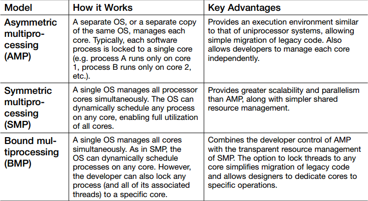

原文链接：[https://www.cnblogs.com/zamely/p/4334979.html](https://www.cnblogs.com/zamely/p/4334979.html)

# **0.缩写**
SMP：对称架构，同架构的多核芯跑同一个OS。比如4个A53跑同一个linux系统。

AMP：异构系统，多核跑多个OS，比如一个核跑RTOS，另外一个核跑linux

HMP：混合架构，不同架构的多核只跑一个OS，比如2个A72核＋2个A53的核，但是跑的是一个linux系统。一个os统领所有不同架构的核（考验该os的能力的时候到了）

多核处理器也称片上多核处理器（Chip Multi-Processor，CMP）。

# **1.多核处理器的流行**

多核出现前，商业化处理器都致力于单核处理器的发展，其性能已经发挥到极致，仅仅提高单核芯片的速度会产生过多热量且无法带来相应性能改善，但CPU性能需求大于CPU发展速度。尽管增加流水线提高频率，但缓存增加和漏电流控制不力造成功率大幅增加，性能反而不如之前低频率的CPU。功率增加，散热问题也严重了，风冷已经不能解决问题了。

那么新技术必须出现-多核处理器。早在1996年就有第一款多核CPU原型Hydra。2001年IBM推出第一个商用多核处理器POWER4,2005年Intal和AMD多核处理器大规模应用。

多核处理器越来越流行，无论在服务器、桌面、上网本、平板、手机还是医疗设备、国防、航天等方面。

我们来了解一下基础知识。

# **2.多核处理器分类-同构、异构**

从硬件的角度来看，多核设计分为两类。如果所有的核心或CPU具有相同的构架，那么定义为同构多核（homogeneous）；如果架构不同，那么称为异构（heterogeneous）多核。

从应用来看，同构多核处理器中大多数由通用处理器核构成，每个核可以独立运行，类似单核处理器。而异构多核处理器往往同时继承了通用处理器、DSP、FPGA、媒体处理器、网络处理器等。每个内核针对不同的需求设定的，从而提高应用的计算性能或实时性能。

目前的异构多处理器有：TI的达芬奇平台DM6000系列（ARM9+DSP）、Xilinx的Zynq7000系列（双核Cortex-A9+FPGA）、Cell处理器（1个64位POWERPC+8个32位协处理器）等等。

同构多处理器就比较多了，Exynos4412，freescale i.mx6 dual和quad系列、TI的OMAP4460等，Intel的Core Duo、Core2 Duo等。

# **3. 多核处理器运行模式-SMP、AMP、BMP**

从软件的角度来看，多核处理器的运行模式有三种：

**SMP-对称多处理**，symmetric multi-processing。

**AMP-非对称多处理**，asymmetric multi-processing

**BMP-边界多处理**（翻译不确定），bound multi-processing

以下是三种模式的特点和优点：

 

简单的解释一下：

AMP-多个核心相对独立的运行不同的任务，每个核心可能运行不同的操作系统或裸机程序，或者不同版本的操作系统。但是有一个主要核心，用来控制整个系统以及其它从核心。具有主从模式。举个例子，比如一个主要核心控制用户界面UI，从核心控制数据采集以及输出。还有POS机，一个负责UI，一个负责交易。也就是两者负责不同的任务。每个核心有自己的内存空间（同时会有共享的内存空间），另外两者之间还有一定的通信机制。从硬件上来说，这种多处理模式可能是同构的，也可能是异构的，但大多情况是异构多处理器。如MCU+DSP，MCU+FPGA等。同构的当然也有。比如Xilinx就提供了案例，Sun公司的Solari4.1.3系统也支持AMP模式（从主从角度来看，而不是多个操作系统）。Mars Board也可以运行AMP模式。

SMP-对称多处理，这个是目前用的最多的，一个OS同等的管理各个内核，为各个内核分配工作负载。目前，大多数的系统都支持SMP模式，如Linux，Vxworks，windows。这种模式就是简单提高运行性能。比如PC机上双核、四核运行windows，linux等。所有的核心共享内存。另外，这种模式的通常都是同构多核处理器，因为异构的结构不同，实现比较复杂。

BMP-边界多处理，和SMP类似，也是一个OS管理所有内核，但是不同的是，BMP中，开发者可以指定将某个任务仅在某个指定内核上执行。

# **4.多核处理器相关术语**

AP-Application Processor，应用处理器

BP-Baseband Processor，基带处理器

以上在手机中出现的比较多，有的会将两者集成到一个硅片中。

GPU-图像处理单元，Graphic Processor Unit，有的PC芯片会将CPU和GPU集成起来。

Soc-System On Chip，片上系统。这个定义多种，一般一个芯片上有多个内核都可以这样说吧，这个我也不确定。有的说Xilinx Zynq7000的是Soc（CortexA9+FPGA0，有的说Exynos4412也是Soc（四核Cortex A9）。

***

#  **5.手机的AP、BP和CP**

**AP**：Application Processor  ，应用处理器 ，CPU + GPU 

**BP**：Baseband Processor，基带处理器

**CP**: CP的概念容易发生混淆，其主要有以下三方面的含义

1.  CP：Cellular Processor = Cellular Modem = Baseband Modem ，蜂窝调制解调器，即此时和BP含义相同
2.  CP:：CoProcessor，协处理器，协处理器的概念本身范围较宽泛，在手机中应用中，其一般指【基带芯片加协处理器】 或者是【多媒体加速器】。CP包括与网络进行通信所需的所有数字组件。CP通常由一个基于ARM的处理器和一个DSP组成。它具有自己的操作系统，并通过HS（高速）串行连接与运行Android，iOS和WindowsPhone等操作系统的AP单元进行通信。其可以处理虚拟现实，增强现实，图像处理，HIFI，HDR，传感器等。           参考链接：[协处理器--百度百科](https://baike.baidu.com/item/%E5%8D%8F%E5%A4%84%E7%90%86%E5%99%A8/7361259?fr=aladdin)
3.  CP：英文单词couple的缩写，网络用语，处CP意思是指有恋爱关系的同人配对。（乱入了，开个玩笑）

***

**为什么会有AP、BP之分？**

FCC（美国联邦通信委员会）认证要求将AP和BP分开，因为射频控制相关的功能（信号调制、编码、射频位移等）都是高度的时间相关的，最好能将这些函数放在一个CPU核上运行，并在这个CPU核上运行一个实时的操作系统，这样AP核上操作系统和驱动的bug就不会导致设备发送灾难性的数据到移动网络中；并且一旦BP被设计和认证好，不管你采用的操作系统和应用软件怎么变化，它都可以正确的执行通讯功能，手机的设计者也可以更加自由的设计用户界面和应用软件；同时，AP侧睡眠唤醒，BP侧实时处理数据，也能有效降低功耗。

AP上面运行了我们通常的操作系统和应用软件，如Android、Windows  phone 7这些。而我们通常所说的双核啊、四核啊这些就是指的其AP核的多少了吧。

BP主要的作用是发送和接受各种数据，即和通信息息相关，BP中的DSP实现了协议的算法，对数据进行编解码，BP中的CPU则负责协调控制与基站和AP的通信。BP中的电源管理模块对手机的待机时间有很大的影响，因为大多数时间BP的cpu都应该处于idle状态，每隔一段时间才打开查看paging channel上是否有呼叫进入。另外，SIM模块也是直接和BP相连接的，对SIM卡的操作也是通过BP进行的。

有些芯片制造商，有能力将AP和BP集成在一个芯片上，AP与BP通过总线通信。而有些则是，AP是AP，BP是BP。

手机开发商，会将开发的手机软件包分为AP和BP两部分，运行在Application Processor(AP)的软件包称为AP包，包括操作系统、用户界面和应用程序等；与Baseband Processor(BP)相关的软件包称为BP包， 包括baseband modem的通信控制软件等。 相应地，所谓的刷新手机AP和BP文件即是将这两个软件包更新到手机上。为方便刷机，也有将AP，BP文件和flex文件(手机的参数配置文件)作在一起的一体包。
