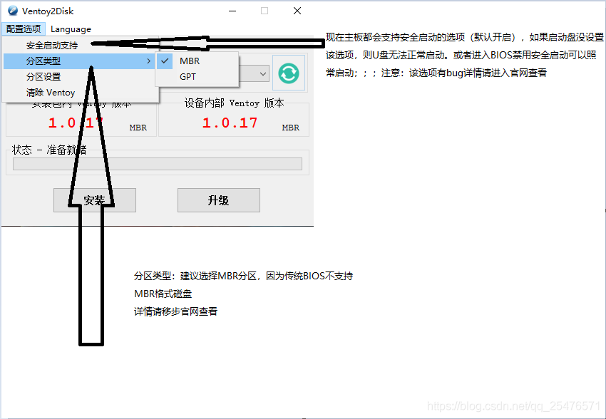

U盘做启动盘我相信大家再熟悉不过了，但是一般情况下，一个U盘只能存在一个启动镜像。如果想要安装其它系统的话，需要重新制作启动盘，所以该文章主要完美解决**“多系统引导启动盘怎样制作”**以及其他相关问题。

## 前文续绍

### 之前经验不足的翻车现场

*   尝试过很多软件比如：\[ EasyBCD，WinSetupFromUSB，YUMI，Ventoy等等 \]，其中最好用的还是Ventoy，其他软件要么不支持UEFI启动，要么多系统引导文件会冲突，要么第二分区不支持NTFS或exFAT文件格式，引导界面不是很完善，不支持某个ISO镜像引导等等问题。
*   所以鄙人今天以**过来者**或者**小白**的身份来写本文，望本文能给你带来某些捷径，少走弯路。

### 该文章主要解决哪些问题

*   如何解决一个U盘存在多个启动镜像问题
*   U盘存在多个启动镜像，如何完美引导Bios和UEFI启动
*   如何完整保留镜像在启动盘里，方面以后好复制给他人用
*   如何在完美引导的情况下，将U盘的某个普通分区，正常使用并拷入4G以上的文件
*   最重要的是，如何简单制作，这是小白所关心的问题
*   现在生产的电脑基本上都是UEFI启动，所以本文主要介绍UEFI启动，一般情况下UEFI能启动的话，BIOS基本没问题；但是BIOS能启动的话，UEFI不一定启动不了

### 准备环境

*   Win10平台
*   所需软件：Ventoy【若需要这些软件，可以私信我】
*   一块U盘【没有大小限制，但尽量大些】
*   按照需求准备相关镜像【比如Linux，Windows，WinPE】

## 正文方案

### 软件Ventoy2Disk

  
官网：[Ventoy官网链接](https://www.ventoy.net/cn/index.html)程序可下载，或者私信鄙人

### 制作教程

*   1、解压官网下载的软件包，并解压到你所能记住的位置（位置目录不建议含有中文字符）

*   2、双击打开解压缩后的Ventoy2Disk应用程序
*   3、界面介绍

*   4、配置选项介绍

*   5、插入U盘，开始制作即可，制作成功它会提示
*   6、安装成功

*   7、这时候，u盘会被分为两个分区
    *   第一个分区是我的电脑显示的分区，可作为普通分区来使用，可以将ISO镜像文件放到该分区
        *   用该U盘引导的时候，程序会自动检测该分区的ISO镜像文件，并作为选择项供你选择启动。注意：目录名和文件名不要含有中文字符；不要将ISO镜像文件放置在很深的目录中
        *   该分区可随意更改文件系统格式，可为NTFS\\exFAT\\FAT32，建议exFAT格式
    *   第二分区是U盘的启动分区，格式FAT32，一般情况下，在我的电脑不显示，如果显示，也尽量不要更改内置文件，防止报错
*   8、到此，启动盘就制作成功
*   9、电脑完全，关机，开机，进入启动项（不懂启动项或不懂进入方式，建议百度），选择U盘启动

*   10、进入正常的界面是这样的，程序会把第一分区所有的ISO镜像文件显示在这里，可以选择后，按回车引导启动  
    

## 后续补充

*   Linux怎样制作教程、安全启动、高度自定义化，请移步[Ventoy官网](https://www.ventoy.net/cn/index.html)

### 谈些废话

*   首先感谢高级的同学阅读到本篇文章，鄙人小白，学识甚浅，望文章招待不周的部分，大佬给予提示，鄙人会虚心接受。
*   同时我会以“非专业性”写这篇文章，使更多的小白学到简单易懂的知识。
*   如果喜欢该文章，先提前谢谢您的手有余香（点赞啦）

### 该文章还有哪些孪生兄弟

*   [《“评价” 多款，多系统引导启动盘制作软件的优缺点》（本篇）](https://blog.csdn.net/qq_25476571/article/details/107716695)，评价目前鄙人所能见到的多系统制作软件，并分析其优缺点
*   [《多系统引导启动盘“完美解决”方案——Ventoy工具》](https://blog.csdn.net/qq_25476571/article/details/107632716)，主要、介绍Ventoy的使用方法，
*   都是鄙人写的欧

目前鄙人就发现这几款多系统引导启动盘制作工具，如果还有其他的，感谢在评论区留言，我会更进一步的学习。